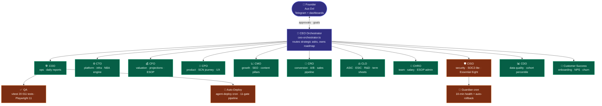

# BlockID.au — Team Structure (C-Level AI Agents)

> Doc rev: 4.0 | Platform build: **v3.3.2** (2026-08-07)
> Roster source of truth: `web/content/team-roster.json` (11 active agents)

BlockID.au runs as an **autonomous multi-agent organization**. Each C-Level agent owns one domain, runs a daily research/build/report cron, and reports to the CEO orchestrator. Founder (Aus Dvl) reviews via Telegram + dashboards.

---

## Org Chart

---

## C-Level Roster

| Role | Domain | Key files / tools | Reports to |
|------|--------|-------------------|-----------|
| **CEO** | Strategy + orchestration of all C-Level agents | `lib/agents/ceo-orchestrator.ts`, `.claude/goals/30day-validation-mvp.md` | Founder |
| **COO** | Operations + daily reporting template enforcement | `api/cron/clevel-daily-reports`, `dashboard/admin/30day` | CEO |
| **CTO** | Platform, infra, next-best-action engine | `lib/agents/cto-next-best-action.ts`, `lib/agents/cto-cost-modeling.ts` | CEO |
| **CFO** | Valuation engine, financial projections, ESOP scoring | `lib/agents/cfo-valuation.ts`, `lib/agents/cfo-projection-norms.ts`, `lib/agents/cfo-esop-scoring.ts`, `lib/agents/deep-valuation.ts` (v2.3), `lib/agents/scn-action-plan.ts` (v2.4) | CEO |
| **CMO** | Marketing benchmarks, content pillars, SEO insights | `lib/agents/cmo-market-research.ts`, content pillar tracker | CEO |
| **CPO** | Product/customer journey, SCN context detection | `lib/scn-detect.ts`, dashboards | CEO |
| **CDO** | Data quality, cohort benchmarks, percentile model | `lib/agents/cdo-data-quality.ts`, `lib/agents/cohort-percentile.ts` (v2.5) | CEO |
| **CISO** | Security posture, Essential Eight scanner | `lib/agents/ciso-security.ts`, daily security brief | CEO |
| **CLO** | Compliance (ASIC, ESS, ESIC, R&D Tax Incentive) | `lib/agents/clo-compliance.ts`, `lib/compliance-checker.ts`, term sheet AI | CEO |
| **CRO** | Conversion, A/B testing, sales pipeline | `lib/agents/cro-conversion.ts`, sales pipeline + NPS widget | CEO |
| **CHRO** | Team benchmarks, salary data, ESOP | `lib/agents/chro-team.ts`, `/dashboard/team` (v2.4) | CEO |
| **CSO** | Pricing strategy, A/B test infra | `lib/pricing-data.ts`, `platform-config.ts` | CEO |
| **R&D** | Tooling, experiments, evidence vault, AI providers | `lib/rnd-input.ts`, evidence-vault, AI client config | CEO |
| **IR** | Investor relations, accelerator deadlines | `/dashboard/accelerator` (v2.4), data room readiness | CEO |
| **QA** | Daily healthcheck, unit tests | `api/cron/agent-healthcheck`, vitest suite (109 tests) | COO |
| **Guardian** | Production monitor + auto-fix + Telegram alerts | `api/cron/agent-guardian` (10-min cron, 2h fail window) | CISO |

---

## v2.6 — Recently Shipped Modules + Owner

| Module | Path | Owner | Version |
|---|---|---|---|
| Maturity detector (established-company guard) | `lib/agents/maturity-detector.ts` | CDO + CFO | v2.5 |
| Real cohort percentile (svi_index_snapshots) | `lib/agents/cohort-percentile.ts` | CDO | v2.5 |
| SCN action plan generator (5-layer + 30/60/90) | `lib/agents/scn-action-plan.ts` | CFO + CPO | v2.4 |
| Deep valuation (4-lens triangulation) | `lib/agents/deep-valuation.ts` | CFO | v2.3 |
| Project name extractor | `lib/project-name-extractor.ts` | CPO | v2.3 |
| Admin drill-down detail pages | `app/dashboard/admin/detail/[metric]/page.tsx` | COO | v2.6 |
| SVI explainer card (radar + per-dim guide) | `components/dashboard/svi-explainer-card.tsx` | CPO + CFO | v2.6 |

---

## Reporting Cadence

| Cron | Endpoint | Frequency | Purpose |
|------|----------|-----------|---------|
| Daily C-Level briefs | `api/cron/clevel-daily-reports` | every 24h | Each C-Level posts an EOD report to `content/reports/<role>-daily-YYYY-MM-DD.md` |
| Guardian healthcheck | `api/cron/agent-guardian` | every 10 min | Resource + cron-fail watcher with 2h rolling window |
| Healthcheck | `api/cron/agent-healthcheck` | every 1h | TypeScript/lint/test/SSL/disk gates |
| Blockchain sync | `api/cron/blockchain-sync` | every 15 min | Skips log if no pending transaction (noop:true) |
| Auto-deploy | `api/cron/agent-deploy` | off-peak 12/14/16/18 UTC | Picks up shipped commits, runs `deploy-live.sh` (10 gates) |

---

## Founder Workflow

1. **Telegram chat** for strategic input → orchestrator routes to relevant C-Level
2. **Dashboards** at blockid.au/dashboard/admin for live KPI + drill-downs (v2.6)
3. **Roadmap + Architecture** docs auto-updated on each minor version bump
4. **Pricing config** in `platform-config.ts` — single source of truth, hot-swap via `/admin/config` (no redeploy)
