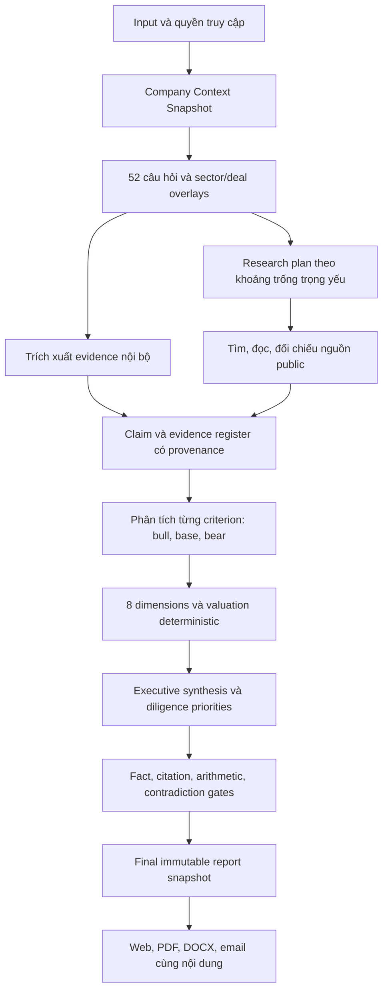

# BlockID.au — SOURCE OF TRUTH: G30 Investor Report Quality & Sale Readiness

**Revision:** G30 / 1.9 — 22/09/2026. **Owner quyết định:** Do Van Long.

**Trạng thái:** `PROPOSED — AWAITING FOUNDER REVIEW`. **Implementation:** `NOT STARTED`.

**Phạm vi đã được giao:** nghiên cứu, đối chiếu source/plan, hợp nhất yêu cầu và viết kế hoạch; **chưa code, chưa migration, chưa deploy, chưa chạy AI tính phí, chưa gửi khách hàng**.

**Phạm vi site được founder xác nhận:** toàn bộ yêu cầu, góp ý, phát hiện review và đề xuất điều chỉnh trong cuộc trao đổi này áp dụng cho **website `blockid.au` và tất cả trang con/routes thuộc site `blockid.au`**. Bao gồm trang công khai, trang sau đăng nhập, mọi persona/workspace, dashboard, report/detail/share, pricing/billing/checkout entry, admin, docs/help/legal, utility và các trạng thái giao diện. Không giới hạn ở homepage hoặc các trang đã được kiểm tra mẫu. Backend/API, dữ liệu lưu trữ, report exports/email và tích hợp Stripe được review/điều chỉnh trong phạm vi phục vụ chính các luồng của site này. Stripe hosted checkout/portal là bề mặt tích hợp bên ngoài cần đồng bộ mapping, nội dung và hành trình; không thuộc quyền redesign giao diện tùy ý như trang con BlockID. Các domain/sản phẩm/repository riêng, gồm `startupvalueindex.com`, không tự động thuộc scope. **Xác nhận phạm vi này chỉ cập nhật plan, không cho phép bắt đầu code hoặc deploy.**

Đây là **kế hoạch chuẩn duy nhất cho đợt nâng cấp tiếp theo của BlockID.au**. Các tài liệu G1–G29 là lịch sử, bằng chứng hoặc đặc tả thành phần; không tạo hàng đợi triển khai độc lập nếu mâu thuẫn với bản này. Các quyết định mới trong G30 là đề xuất chờ duyệt, không phải mô tả tính năng đã có. Việc viết tài liệu không thay đổi cron/runtime hoặc tự cho phép một session khác bắt đầu triển khai. Chỉ chuyển sang `APPROVED` khi founder đồng ý rõ ràng; im lặng không phải phê duyệt.

**Bản lịch sử nguyên vẹn:** [SOT trước G30](../archive/source-of-truth-pre-g30-2026-09-22.md).

**Review đầu vào:** [source/output/design review ngày 22/09](../reviews/2026-09-22-source-output-design-review.md).

**Baseline local:** HEAD `bb0fb53af`, package `3.27.2`, ReportV2 schema `2.0`, pipeline `pipeline-v2.1-s-r3`. Source local, release metadata và live là các snapshot riêng; chưa xác nhận chúng cùng deployed SHA. Baseline phải đóng băng lại khi bắt đầu triển khai.

## 1. Quyết định sản phẩm và goal

### 1.1 Goal duy nhất

Biến Trusted Business Report thành **báo cáo nghiên cứu và thẩm định sơ bộ có giá trị cho investor**, phân tích đúng startup đang xét, trả lời bộ câu hỏi theo tiêu chí, kiểm chứng các nhận định trọng yếu, trình bày nhiều góc nhìn và định giá có cơ sở; kết quả nhất quán trên web, PDF, DOCX và email, được giao đáng tin cậy qua luồng bán hàng hiện có.

Investor cần trả lời được trong khoảng 3 phút:

1. Startup bán gì, cho ai, vấn đề có thật và khách hàng có lý do trả tiền không?
2. Vì sao đáng xem tiếp, vì sao có thể không đầu tư, điều gì có thể làm thay đổi nhận định?
3. Chúng ta biết chắc điều gì; đâu là founder-stated, giả định, thiếu hoặc mâu thuẫn?
4. Giá trị doanh nghiệp được ước lượng theo cách nào, phạm vi hợp lý đến đâu, nhạy nhất với biến nào?
5. Hỏi gì, kiểm tra gì và yêu cầu bằng chứng gì trước bước tiếp theo?

**Đầy đủ** nghĩa là mọi câu hỏi trọng yếu có câu trả lời hoặc trạng thái thiếu/chưa thể xác minh với hành động tiếp theo. Không bắt buộc bịa ra con số hoặc nhận định chỉ để lấp đủ chương.

### 1.2 Khách hàng và phạm vi bán đầu tiên

- **Investor là khách hàng chính**, theo yêu cầu mới nhất; thay ưu tiên programs-first/angels-secondary trong G21. Giữ khả năng cohort cho accelerator, không xóa tính năng đã bán.
- ICP đề xuất để founder review: angel groups/syndicates và quỹ pre-seed–seed tại Australia. Trọng tâm kỹ thuật ban đầu: B2B SaaS/phần mềm; sector khác phải có lens, nguồn và bộ kiểm chứng trước khi quảng cáo cùng độ sâu.
- Founder là chủ sở hữu/người cung cấp dữ liệu, được nhận giải thích và checklist cải thiện. Advisor/accelerator là khách hàng thứ cấp.
- Sản phẩm bán là chất lượng hồ sơ đánh giá và quy trình làm việc; không bán lời hứa AI dự đoán thắng/thua hoặc một con số “đúng tuyệt đối”.
- Tên công khai giữ **Trusted Business Report — by BlockID**; SVI là phương pháp/chỉ số bên trong; Investor Dossier là hồ sơ/workspace chứa báo cáo, không phải một bộ kết luận khác.
- Không mở lại paid pilot/coupon đã bỏ ở G25. Customer validation dùng demo hoặc khách hàng đầu tiên trên SKU hiện hành, không tạo gói pilot mới.

### 1.3 Thứ tự ưu tiên bất biến

1. **P0 sản phẩm:** factual correctness, nguồn, xử lý thiếu/mâu thuẫn, kết luận nhất quán, không biến giả định thành dữ kiện.
2. **P1 sản phẩm:** độ sâu riêng cho startup, research, 13 criteria/52 câu hỏi + các câu hỏi diligence còn thiếu, định giá và investor implications.
3. **P1 vận hành:** khả năng hoàn thành/giao báo cáo, snapshot/cache/version, chi phí có kiểm soát.
4. **P2:** UI theo lớp thông tin, so sánh, xuất báo cáo và trải nghiệm investor.
5. **P2 thương mại:** chứng minh giá trị với buyer thật, packaging/pricing phù hợp chi phí, sale gates.
6. Sau đó mới tới mở rộng Index/API, thêm sector hoặc automation phụ. **Wording trang chủ/hero và redesign toàn bộ trang theo một Unicorn template chuyên nghiệp nằm trong G30**, đi cùng M3 và phải nghiệm thu trước khi tuyên bố hoàn tất redesign; không bị đẩy ra ngoài scope marketing.

P0/P1 ở đây là ưu tiên của chương trình, không thay đổi severity của các phát hiện trong review.

## 2. Hiện trạng: giữ gì, sửa gì, chưa được chứng minh gì

| Hạng mục | Bằng chứng trong source/tài liệu | Đánh giá và quyết định G30 |
|---|---|---|
| Quy mô | 382 page routes, 682 API routes, 5.297 file `web/src` ở lượt review | Đủ rộng; không cần xây thêm hệ thống song song để bán báo cáo |
| Báo cáo | `lib/report-v2/schema.ts`, `components/tbr/v2/report.tsx` | Giữ ReportV2 làm nền; UI v3 và schema v2 là hai version khác nhau, không đổi tên chỉ để marketing |
| Free path mới | `lib/analyses/first-analysis/report-v2-job.ts` | G28 đã dùng cùng orchestrator cho hai full reports miễn phí; **giữ**, không hiểu nhầm đây vẫn là PDF cũ |
| Guest paid cũ | `lib/guest-analysis/runner.ts`, Stripe webhook/reconcile | Vẫn có đường chạy legacy và lỗi extraction/delivery; inventory traffic trước khi hợp nhất, giữ tương thích đơn cũ |
| Criteria | `lib/evaluation-criteria.ts`: 13 criteria × 4 guiding questions | Có 52 câu hỏi nhưng chưa có answer/evidence/research status bắt buộc cho từng question ID |
| Dimension | `report-pipeline/dimension-owners.ts`: 8 dimension, 12 growth phases | Giữ taxonomy; tách dimension trình bày khỏi criterion/question dữ liệu, tránh trùng tính điểm |
| Research | `adk/agents/market-research.ts`, `gather.ts:520` | Nhánh market hiện là hai lời gọi model theo general knowledge, không có search/fetch trong nhánh đó; vẫn có connector/website audit khác. Cần research có tài liệu nguồn thực sự |
| Citations | `auto-cite.ts`, `claim-gate.ts`, `report-v2/grounding.ts` | Đã tái hiện trùng số sai metric và model quote tự chứng minh; thay cơ chế kiểm chứng, không chỉ sửa prompt |
| Executive | `investment-view.ts`, structured executive + thesis | G27 cố ý giữ analyst verdict khác rubric; G30 thay bằng một kết luận chính, các giả thuyết phụ có nhãn điều kiện |
| Valuation | `agents/cfo-valuation.ts`, `valuation-chapter.ts` | Có nhiều methods và assumptions table; vẫn có CAC floor 500, GM default 72 và derived metric hiện như fact. Cần provenance ở cấp từng input/output |
| Score/context | `run-report-pipeline.ts` | Deck mới có thể dùng scoring cũ; stream/cache giữ projection trước gates; phải sửa trước khi dùng làm cơ sở investor memo |
| UI | G26 light template, report v3, hai Button implementations | Giữ light/navy; hợp nhất component, copy, trạng thái dữ liệu và disclosure; không redesign palette từ đầu |
| Reliability | G28 timeout/strikes/background budget; G29 open | Giữ mới nhất; capacity + diagnostics + live completion là phụ thuộc thực tế của quality, không chỉ ops phụ |
| Test | Typecheck đạt; 81 file/2.491 test trọng tâm đạt ở review | Bảo vệ contract nhưng chưa chứng minh độ đúng của nhận định; cần golden cases và đánh giá độc lập |
| Buyer validation | `docs/research/evaluator-interviews-2026-09.md` có rollup 0/10 | Có instrument, chưa có bằng chứng phỏng vấn hoàn tất trong file này; không coi task “shipped” là customer validation đã xong |
| Sale readiness | `docs/ops/ready-to-sale.md` thừa nhận real free run chưa kiểm chứng, KPI 0.85 chưa đạt live mới, provider outage | Chưa đủ bằng chứng để gọi mọi advertised path sale-ready; xác nhận lại bằng gates §13 |
| Generated status | `project-state.json`, `implementing-plan.md`, `architecture.md` có version/task cũ | Chỉ là telemetry/history; không được ghi đè kế hoạch này hoặc tự đóng task bằng commit subject |

### 2.1 Đầu ra thật cần dùng làm regression case

Showcase snapshot `136a49f5`, đọc 22/09 khoảng 01:37 UTC, hiển thị generated 21/09:

- SVI index 135 / composite 87, nhiều dimension 100 nhưng evidence confidence 0 và verdict D.
- Có cả “Insufficient evidence” và “Analyst synthesis · Back with conditions”.
- Summary nói margin gần 100%; bảng ghi 72%, CAC A$500, Rule of 40 44; risk nói CAC chưa xác minh.

G28 release notes nói đã sửa band-D summary; quan sát live cho thấy **phải kiểm tra toàn bộ structured summary/reasons/verdict và snapshot cụ thể**, không đóng lại bằng tên commit. Cần phân biệt source đã sửa, report lưu trước sửa và renderer vẫn phát lại nội dung cũ. Không khẳng định mọi report đều lỗi hoặc mọi số trong snapshot đều là default khi chưa đọc input được phép.

### 2.2 Các lỗi review được đưa vào backlog, không mất dấu

| Review | Work item G30 |
|---|---|
| 0a fallback unit economics | V01–V03 |
| 0b recommendation/structured summary conflict | A03, Q02, U01 |
| 1 citation/quote/grounded false positive | E03, A02, Q01 |
| 2 stream vs final report mismatch | F02–F03 |
| 3 deck mới dùng context cũ | F01 |
| 4 cache thiếu context/quality | F03 |
| 5 guest extraction/PDF/delivery | F04, O03 |
| 6 heuristic gắn nhãn Lighthouse | E02, A01 |
| 7 hai Button | U03 |
| 8 design docs xung đột | P01, U03 |

## 3. Hợp nhất plan: luật ưu tiên và quyết định thay thế

Thứ tự: **yêu cầu founder hiện tại → G30 được duyệt → source/runtime có bằng chứng → đặc tả thành phần tương thích → tài liệu lịch sử**. Source cho biết đã có gì, không tự chứng minh đã đúng. Quyết định mới hơn chỉ thay phần thực sự mâu thuẫn; các entitlement, consent và hành vi tốt đã có phải được giữ.

| Plan/contract | Giữ | Thay thế/điều chỉnh trong G30 |
|---|---|---|
| G13/ReportV2 | Một document, 8 dimensions, ownership, gather/score/report | Thêm question/claim/source graph và immutable finalized artifact; các entry path cùng contract |
| G19 | Ledger, pending ≠ zero, valuation methods, synthesis | Không dùng mục tiêu ≤1.300 từ cho toàn bộ report; chỉ cap executive. “Ít pending” không là KPI vì dễ thưởng cho bịa dữ liệu |
| G20 | Feature inventory, entitlement/purchase E2E, hide unfinished | HTTP 200/green UI không đủ sale-ready; thêm content/value/reliability gates |
| G21 | Evidence governance, corrections, benchmark-N, org isolation, cohort | Investor là primary buyer; programs-first bị thay. Bỏ lại paid pilot là trái G25 |
| G22 | Retention/export, validation ledger, regression | Manual counter cần bằng chứng nguồn; generated status không là authority |
| G23–G24 | Audit logs, readable citations, demo exclusion | `groundedShare ≥0.85` chỉ là chỉ số tương thích, không phải release gate chất lượng; unknown citation phải lộ lỗi, không im lặng biến mất |
| G25 | Hai full reports miễn phí/email, review trước Pay, bỏ pilot/coupon | Không đổi quota/giá trong đợt lập plan. Capacity cho production đánh giá theo chất lượng/chi phí, không mặc định free chain luôn đủ |
| G26 | Light surfaces, navy action, cyan-muted `#0e7490`, accessible primitives | Hợp nhất Button; supersede MASTER dark/teal. G27 ghi cyan `#0891B2` không thắng token contrast mới hơn |
| G27 | Dashboard, investment view, valuation, 8 chapters, risk/plan, EN/VI, PDF/DOCX | Báo cáo nhiều lớp; một final recommendation; không gán xác suất risk từ thiếu evidence; không xếp ưu tiên chỉ bằng SVI lift |
| G28 | Same full report free path, stage timeout/strikes, background budget, print/band demo | Audit nội dung cuối và thêm golden tests; không giảm điều kiện fact-check để đạt KPI |
| G29 A/B | Dead-rung pruning, capacity alerts, degraded diagnostics | Hấp thụ vào O01–O02, cần sớm để chạy quality eval thật |
| G29 C | Real free run, persona copy, mobile fixed controls | Hấp thụ O03/U03/S01. CSP phải chẩn đoán script/tác động; không allowlist chỉ để test xanh |
| G29 D | Index movers đúng dấu, new không phải -99%, sample label | O04, sau report blockers; không kéo dài critical path nếu ẩn bề mặt chưa đạt |
| G1–G18/roadmaps cũ | Những capability đã dùng và history | Không mở lại blockchain, marketplace, reseller expansions, ES/JA, extra agents trong critical path này |

G19–G28 vẫn giữ trạng thái **historically shipped**. G29 residuals đã được chuyển thành work items trong plan; không giả vờ chúng đã xong. Việc bắt đầu thực hiện G30 còn chờ duyệt.

## 4. Nghiên cứu bên ngoài và cách áp dụng

Nguồn được mở/kiểm tra ngày 22/09/2026. Đây là nền tham khảo cho thiết kế, không phải tuyên bố BlockID được chứng nhận hoặc thay thế analyst/valuer.

| Nguồn gốc | Điều áp dụng cho sản phẩm | Giới hạn |
|---|---|---|
| [CFA Institute — Equity Valuation: Applications and Processes, 2026](https://www.cfainstitute.org/insights/professional-learning/refresher-readings/2026/equity-valuation-applications-and-processes) | Phân biệt facts/opinions, assumptions rõ; analysis/forecast/valuation/recommendation nhất quán; đủ thông tin để người đọc phản biện | Học cấu trúc research, không sao chép stock price target cho startup thiếu dữ liệu |
| [IPEV Guidelines — December 2025](https://www.privateequityvaluation.com/Portals/0/Documents/Guidelines/2025%20IPEV%20Valuation%20Guidelines.pdf) | Chọn kỹ thuật phù hợp, calibration theo giao dịch có liên quan, so sánh đúng đặc tính, ngày định giá và judgement; AI không thay professional judgement | Bản 2025 thay bản 2022, áp dụng kỳ báo cáo bắt đầu từ 01/04/2026. Là fair-value guidance, không biến report screening thành formal valuation |
| [Bessemer — Shopify investment memo](https://www.bvp.com/memos/shopify) | Deal context, thesis, kinh tế mô hình, cơ hội tăng trưởng và rủi ro cụ thể cùng một lập luận | Memo lịch sử để học cách phân tích; không lấy số lịch sử làm benchmark 2026 |
| [Angel Capital Association — Due Diligence Playbook](https://www.angelcapitalassociation.org/data/Documents/Members%20Only/BestPractices/E3e%20-%20Due%20Diligence%20Checklists%20and%20Reports/Due_Diligence_Playbook_Generic_with_Appendices.pdf) | Research/review và deal memo cần customer/reference checks, contracts, financials, cap table và IP | Playbook lịch sử, checklist phải thích nghi AU và stage |
| [Cut Through Venture — State of Australian Startup Funding 2025](https://www.cutthrough.com/insights/state-of-australian-startup-funding-2025) | Cập nhật bối cảnh nguồn vốn AU; mỗi statistic phải đọc đúng bảng, mẫu và thời kỳ | Không suy valuation từ funding amount; không giả định report có median cho mọi sector/stage |
| [ASIC — RG 244](https://www.asic.gov.au/regulatory-resources/find-a-document/regulatory-guides/rg-244-giving-information-general-advice-and-scaled-advice) | Tách factual information, general advice, personal advice khi chọn lời kết luận và scope bán | Label/disclaimer không tự giải quyết phân loại dịch vụ; wording/scope cụ thể cần reviewer phù hợp trước public sale |

**Suy luận thiết kế của G30:** lợi thế bán hàng là analyst workflow có evidence và reviewability, không phải số lượng agent/chapter. External research phải chứng minh liên quan đến startup và tác động lên investment case, không trở thành phần “industry overview” chung chung.

## 5. Hợp đồng đầu vào: biết startup nào trước khi phân tích

Mỗi run đóng băng một **Company Context Snapshot**:

- Tên pháp lý/brand/domain, country/jurisdiction, ABN nếu có; không ghép công ty trùng tên chỉ vì search result.
- Mô hình kinh doanh, sector/subsector, buyer/user, geography, product maturity, revenue model, vòng gọi vốn; company stage không suy chỉ từ lịch sử funding hoặc độ dài deck.
- Input gốc, danh sách tài liệu/phiên bản, file hash, extracted pages/cells/sections, extraction warnings, ngày ghi nhận và thời kỳ số liệu.
- Founder answers theo question ID; tài liệu nào là mới, thay thế bản nào, quyền truy cập thuộc founder/evaluator/org nào.
- Investor lens tùy chọn: sector/stage/geography/check-size/mandate. Fit với mandate là lớp riêng, không sửa facts hoặc SVI toàn cục của startup.
- Ask/raise/currency/basis, current cash/debt/convertibles khi có; không suy dữ kiện không được nêu.

**Extraction gates:** OCR khi cần, đo trang đọc được/không được, giữ bảng và đơn vị; không cắt âm thầm 8.000 ký tự. Dùng chunk theo cấu trúc + retrieval trong toàn bộ tài liệu. Nếu extraction không đủ, trả `needs_input` có trang/vấn đề cần sửa. Website unreachable không được coi URL là business description đủ dùng.

**Privacy của research:** query public không chứa nội dung bí mật của deck, email khách hàng, token hoặc tên chưa công bố; lấy thuật ngữ sản phẩm/sector được phép. Private evidence chỉ đi tới provider được phê duyệt trong processing contract. Không tự liên hệ founder, reference hoặc customer; report sinh request/checklist để người có quyền thực hiện.

## 6. Criteria và câu hỏi: 13 tiêu chí, 52 câu hỏi, 8 chiều tổng hợp

### 6.1 Một bảng hỏi có version, không thêm bộ câu hỏi cạnh tranh

Giữ 13 keys trong `evaluation-criteria.ts`; gán stable ID `criterion_key.q1..q4` cho 52 guiding questions theo thứ tự hiện tại. Câu hỏi thay nội dung phải có rubric version/mapping lịch sử. Các câu hỏi bổ sung dùng `criterion_key.x...`; không xóa dữ liệu cũ và không bắt founder nhập lại câu đã được đọc từ deck.

Mỗi question phải có: question ID/text/version, applicability + lý do, founder answer, extracted answer, research answer, claim IDs, sources, status, conflict, analyst implication, follow-up request và reviewer state. Trạng thái: `answered`, `partially_answered`, `missing`, `conflicting`, `not_applicable`. “Đã trả lời” khác “đã xác minh”.

### 6.2 Coverage matrix bắt buộc

Q1–Q4 dưới đây là bản diễn giải tiếng Việt của câu hỏi source, không phải đổi schema trong turn này.

| Criterion → primary dimension | Q1–Q4 hiện có | Research/đối chiếu cần làm | Kết luận investor cần nhận |
|---|---|---|---|
| `idea` → MPC | Vấn đề gì? Khác giải pháp hiện có? Insight/lợi thế? Đã validate với khách hàng? | Đối chiếu pain, workflow, alternatives/status quo, demand; customer proof phải từ evidence được phép | Vấn đề đáng giải quyết không, cấp thiết đến đâu, insight có được kiểm chứng? |
| `market` → MPC | TAM? SAM? Vì sao lúc này? Đối thủ chính? | Bottom-up ICP × spend; địa lý/timeframe; direct/indirect competitors, pricing, substitutes, tailwind/headwind | Thị trường tiếp cận thực tế, competition và điều kiện để chiếm thị phần |
| `founder_profile` → FTV | Kinh nghiệm liên quan? Đã làm chung? Domain expertise? Startup/exit trước? | Public profile đúng người, hồ sơ/nguồn cho claim; reference là pending nếu chưa làm | Founder-market fit, khả năng thực thi, key-person risk; không suy năng lực từ danh tiếng hay yếu tố nhạy cảm |
| `code_git` → PTD | Repo? Tech stack? Automated tests? Contributors? | Repo được cấp quyền, kiến trúc, vận hành, phụ thuộc vendor/model, IP/license; test presence ≠ coverage/quality | Maturity, khả năng mở rộng, technology risk, moat thực; non-software có lens thay thế |
| `website` → PTD | URL? Mobile app? Traffic? Conversion? | Website/product thực, pricing/app store; traffic từ nguồn đo; conversion đúng numerator/denominator/window | Product reality, distribution signal; website đẹp không chứng minh traction |
| `team` → FTV | Bao nhiêu người? Vai trò đã có? Vai trò thiếu? Hiring 12 tháng? | Full-time/contractor, capacity, cost/runway, key gaps; xác minh từ roster/evidence | Team có thể thực hiện milestone với nguồn lực hiện tại không? |
| `customer_size` → TRE | Active users/customers? Growth? Engagement? Retention? | Tách signup/session/active/paying/logo; cohort retention/churn, concentration, customer references khi được phép | Chất lượng traction, repeatability, risk do phụ thuộc khách hàng, dấu hiệu PMF có giới hạn |
| `gtm_strategy` → MPC | Channels? Pricing? CAC? Scale acquisition? | Competitor pricing, sales cycle, pipeline stages, channel experiments; CAC và payback có đủ cost/cohort | Khả năng bán lặp lại, cost of growth, sales bottleneck và economics |
| `documents` → IRI | Deck? Financial model? One-pager/business plan? Legal docs? | Consistency giữa deck/model/contracts; ngày/version/signature; phân biệt existence với adequacy | Material discrepancies, information quality và danh sách diligence trước IC |
| `dataroom` → IRI | Có data room? Tài liệu nào? Phân loại? Cập nhật khi nào? | Coverage theo stage, quyền truy cập, freshness, missing signed records | Investor cần thêm gì trước quyết định; nhiều file không tự làm điểm tốt |
| `team_structure` → FTV | Org chart? Advisory board? Trách nhiệm? Board cadence? | Quyền quyết định, shareholder/option/vesting, cap table fully diluted, conflicts/related party | Governance, control, alignment, dilution; đưa phân tích sang CGH mà không tính trùng |
| `roadmap` → SVM | Milestones 3–6 tháng? Vision 12 tháng? Prioritisation? Dependencies? | Competitor pace, technical/regulatory dependencies, milestone cost, lịch sử deliver | Feasibility, use-of-funds, catalyst/de-risking và moat theo thời gian |
| `revenue` → TRE | MRR/ARR? Growth? LTV/CAC/margins? Profitability? | Transaction/accounting evidence, refunds/tax/currency, recurring vs one-off, cost/burn/runway | Revenue quality, unit economics, financing need và input định giá có kiểm chứng |

### 6.3 Các câu hỏi bổ sung bắt buộc theo applicability

Không có criterion primary CGH/LCO trong 13 keys hiện tại; câu hỏi bổ sung phải lấp khoảng trống diligence, không thêm hai chương tự chấm từ generic prose.

| Nhóm/namespace | Câu hỏi bổ sung | Dimension dùng |
|---|---|---|
| `team_structure.x_equity` | Ai sở hữu bao nhiêu trên fully diluted basis? Options/SAFE/notes? Vesting? Quyền kiểm soát và approvals? | CGH |
| `documents.x_legal` | Entity/IP thuộc ai? IP assignment đã ký? Hợp đồng trọng yếu/license/regulatory requirements? Tranh chấp/material liabilities được disclose? | LCO, CGH |
| `revenue.x_cash` | Cash, debt, burn, runway và thời kỳ? Revenue recognition? Customer concentration? Financial source reconciliation? | TRE, IRI |
| `roadmap.x_raise` | Raise bao nhiêu, instrument/terms nào, dùng vào milestones nào, vốn đủ tới đâu? Kịch bản down-round/dilution? | IRI, SVM |
| `idea.x_moat` | Vì sao khách hàng chọn và tiếp tục dùng? Switching cost/data rights/network effects có evidence gì? Đối thủ phản ứng ra sao? | SVM, MPC |
| `market.x_sector` | Quy định, seasonality, reimbursement/procurement, hardware lead times, capex hoặc sector-specific drivers có áp dụng không? | MPC, LCO, PTD |

Hiển thị đầu tiên **5–10 follow-up quan trọng nhất**, theo khả năng thay đổi kết luận và thiếu evidence; toàn bộ checklist vẫn mở được. Không bắt người dùng điền 52 ô trước khi nhận giá trị ban đầu.

### 6.4 Một phân tích criterion có giá trị phải chứa gì

Mỗi criterion mở rộng có cùng anatomy:

1. **Assessment:** nhận định riêng cho startup, mức độ chắc chắn và giới hạn.
2. **Câu hỏi/đáp án:** Q1–Q4 + extras áp dụng, có status và source cho từng câu.
3. **Điều đã biết:** facts và founder-stated tách rõ, time window/currency/entity.
4. **Research bên ngoài:** nguồn đã đọc, liên hệ với startup, đồng thuận và phản chứng.
5. **Strengths và bear case:** vì sao tốt, điều gì có thể làm nhận định sai, điều kiện cần kiểm tra.
6. **Investor implication:** ảnh hưởng đến go/no-go-next-step, valuation assumption, deal structure hoặc diligence.
7. **Evidence gaps & next request:** tài liệu/câu trả lời chính xác, người cung cấp, mức materiality, deadline nếu biết.
8. **Score explanation:** signals/weights và confidence khi applicable; generic benchmark không được giả thành evidence startup.

Nhiều dimension có thể tham chiếu một criterion; question/evidence lưu một lần, có cross-link, không lặp cả đoạn hoặc cộng trọng số hai lần. Criterion weights hiện tổng 100 và dimension weights là lớp khác: giữ formula hiện hành tới khi A01 hiệu chỉnh/migration được duyệt, không cộng hai lớp tùy tiện.

### 6.5 Ví dụ chất lượng đầu ra mong muốn — dữ liệu giả để minh họa

**Case giả:** một B2B SaaS cho phòng khám AU. Founder khai “MRR A$12.000”; bảng billing cùng kỳ cho A$9.000 recurring subscriptions và A$3.000 setup fees. Chưa có acquisition spend, gross-margin costs hoặc cap table. Đây không phải dữ liệu một khách hàng thật.

**Criterion `revenue`:**

- **Assessment:** đã có dòng recurring revenue trong kỳ được cung cấp, nhưng claim MRR cần chỉnh định nghĩa. A$3.000 setup không được annualise như subscription. Chưa đủ dữ liệu kết luận customer economics bền vững.
- **Q1 MRR/ARR:** nếu billing scope được reconcile đầy đủ, MRR A$9.000; annualised run-rate A$108.000, ghi rõ đây không phải trailing-12-month recognised revenue. Source là billing table/cell và kỳ, không phải lời model.
- **Q2 Growth:** missing nếu chưa có kỳ trước tương đương; không suy từ số khách tổng.
- **Q3 Economics:** CAC/GM/LTV chưa tính được vì thiếu spend/COGS/cohort retention. Không điền CAC 500, GM72 hoặc LTV24 tháng mặc định.
- **Q4 Profitability:** cần cash, burn, recurring/nonrecurring cost và kế hoạch; không đồng nhất gross margin với EBITDA margin.
- **Bull case:** subscription base tạo nền cho doanh thu lặp lại; chỉ mạnh hơn khi retention/collections được chứng minh.
- **Bear case:** setup fees đang làm headline recurring revenue cao hơn thực tế; thiếu cohort và cost data khiến giá trị mỗi khách chưa xác định.
- **Investor implication:** revenue-multiple model phải dùng đúng recurring base sau reconciliation; chưa nên trả premium dựa trên unit economics. Muốn đưa khoảng định giá phải có comparable phù hợp, không tự gán multiple từ ví dụ này.
- **Follow-up:** billing export 6–12 tháng, refunds/cancellations, cohort retention, acquisition spend theo kênh và costs cùng kỳ.

**Research `market` của cùng case:** xác định đúng practice type/buyer và geography; đọc nguồn số lượng cơ sở phù hợp, competitor pricing và khả năng tích hợp workflow. Kết luận phải nối tới sales cycle, switching friction và attainable market của startup này. Không dùng tổng healthcare spend làm TAM phần mềm, không lấy doanh thu/khách hàng của đối thủ thành dữ kiện startup.

Ví dụ này là chuẩn về cách lập luận và xử lý thiếu thông tin; không phải một template để chép số sang report khác.

## 7. Research theo startup: từ câu hỏi tới nguồn và nhận định

### 7.1 Pipeline đề xuất



Đây là thiết kế kiến trúc đề xuất; không phải sơ đồ mô tả toàn bộ source đã triển khai.

### 7.2 Research task contract

Mỗi task chứa: criterion/question IDs, hypothesis cần kiểm tra, company context, query plan, allowed sources, ngày cutoff, budget, result/counter-evidence, status (`found`, `not_found`, `blocked`, `stale`, `conflicting`), source IDs và implication. Log “đã tìm nhưng chưa thấy” phải có query/time/source scope, không suy “không tồn tại”.

Các workstream:

- **Market/customer:** ICP, buyer budget/workflow, bottom-up sizing, adoption barriers, macro/sector drivers.
- **Competition:** direct, indirect, status quo; pricing/features/distribution; đối chiếu company claims với chính sản phẩm/tài liệu đối thủ. Target 3–5 alternatives khi đủ nguồn, không chế tên để đủ số.
- **Team/entity:** đúng người/pháp nhân, career claims, filings có liên quan; dữ liệu public chỉ chứng minh điều nguồn thật sự nói.
- **Product/technology:** live product, repo được cấp quyền, independent references và constraints. Không cần repo để đánh giá startup không phải phần mềm.
- **Financial/valuation:** comparable transactions có amount/type/date/instrument rõ, metrics tương đồng, FX/date, stage; filing/company release/nguồn nghiên cứu có methodology.
- **Legal/sector:** official regulator/register; xác định câu hỏi cần specialist, không tự kết luận tuân thủ từ có trang privacy.

### 7.3 Source policy

- Ưu tiên hồ sơ gốc, connector nội bộ được phép, regulator/statistics, company filing/product/pricing; secondary reporting dùng corroboration. Company website đáng tin về giá niêm yết của chính họ, không độc lập chứng minh họ “market leader”.
- Không coi search snippet, AI summary hoặc đoạn model sinh là evidence gốc. Phải fetch/read nguồn; không truy cập được thì ghi rõ.
- Chỉ lưu excerpt cần thiết + URL/file locator/hash, không sao chép toàn bộ tài liệu bị hạn chế. Có retrieval timestamp, publication/observation date, original publisher, source family, permission và redaction.
- Độc lập nguồn dựa trên nguồn gốc: hai bài dẫn lại một press release không tính thành hai confirmations.
- Claim trọng yếu có thể dùng một authoritative source; otherwise tìm corroboration độc lập khi khả thi. Không hạ chuẩn hoặc bịa nguồn để đạt quota.
- Freshness theo metric: revenue/cash tới kỳ tài chính liên quan; pricing/competitor trạng thái gần ngày chạy; legal reference bản có hiệu lực tại cutoff; comps theo window có giải thích. Dùng cấu hình theo loại claim, không một TTL duy nhất.
- Mốc **30 ngày cho competitor pricing, 90 ngày cho commercial facts, 12 tháng cho market benchmark** là default đề xuất để thử nghiệm, không là sự bảo đảm phù hợp mọi ngành. Item quá hạn có nhãn và ảnh hưởng eligibility/confidence.
- Reference không được kéo số ở các ngày/entity/currency khác vào một claim. “Nguồn mới hơn” không tự thắng nguồn đúng kỳ đo cũ hơn.

### 7.4 Budget và phân tầng độ sâu

Một research plan có call/time/spend ceiling; ưu tiên câu hỏi có khả năng thay đổi assessment/valuation. Tái dùng public research cùng sector/time scope, nhưng không cache chéo private evidence. Retry có giới hạn; hết budget trả partial scope và missing requests, không silently đổi thành general knowledge mà vẫn gọi “researched”.

**Không buộc làm xong research sâu trong 60 giây.** Intake cho preview đã gắn provisional; full report chạy background, có progress và thông báo khi finalized. SLA chỉ công bố sau khi đo P50/P95 trên corpus; đề xuất vận hành ban đầu ở §13.

### 7.5 Chủ động nghiên cứu từ deck, không chỉ tóm tắt hiện trạng

**Yêu cầu founder:** chất lượng report bao gồm khả năng AI Agent BlockID mở rộng nghiên cứu các yếu tố liên quan từ thông tin deck, kiểm tra giả thuyết và tìm bằng chứng phản biện để đưa ra nhận định khách quan nhất có thể. Không chỉ diễn giải lời founder. “Khách quan” là dựa nguồn, xem cả evidence ủng hộ/phản bác và công bố hạn chế; không phải cam kết AI biết mọi thông tin hoặc luôn đúng.

**Research loop cho mỗi question/criterion:**

1. Trích business context: problem, buyer/user, geography, sector, stage, business model, workflow, product claims, traction và constraints; đánh dấu câu nào chỉ do founder nói.
2. Chuyển claim thành research hypotheses và câu hỏi kiểm chứng. Research không chỉ chạy khi deck thiếu dữ liệu: claim quan trọng đã có trong deck vẫn cần đối chiếu và tìm phản chứng.
3. Tìm source theo hypothesis, resolve đúng entity/time/market; đọc nguồn thật và ghi research attempts. So sánh với dữ liệu nội bộ được phép, không dùng public estimates thay financial actuals.
4. Tổng hợp: deck nói gì → nghiên cứu thấy gì → tương đồng/khác biệt/xung đột → mức support → tác động tới startup và quyết định investor → câu hỏi còn thiếu.
5. Audit claims và reconcile với các criteria/valuation liên quan. Không tăng score chỉ vì đã mua research hoặc vì số trang/nhiều nguồn hơn; evidence mới có thể làm nhận định tốt hơn, xấu đi hoặc không đổi.

**Standard report phải có research baseline** cho các yếu tố external trọng yếu trong scope đã công bố, nhất là idea/competition/market. Deep research mua thêm mở rộng breadth, scenario hoặc câu hỏi riêng; không biến standard report thành bản tóm tắt deck thuần túy. R03/S02 phải xác định ngân sách baseline đủ cho lời hứa này và đề xuất pricing nếu economics không đạt, không tự giảm verification hoặc đổi giá.

### 7.6 Ví dụ bắt buộc: “Đã có ai làm ý tưởng này chưa?”

**Target:** tìm và phân tích **3–5 đối thủ/giải pháp tương tự có nguồn đủ tin cậy** cho startup; phân biệt direct competitors, adjacent/indirect alternatives và status quo (manual/in-house). Phải có lý do chọn; không ép đủ 5 tên hoặc gọi mọi giải pháp cùng ngành là đối thủ trực tiếp. Nếu chỉ xác minh được 1–2, công bố phạm vi tìm kiếm và khoảng trống; “chưa tìm thấy” không đồng nghĩa “chưa từng tồn tại”. Không kết luận patent novelty/freedom-to-operate chỉ từ web research.

**Trình tự:** tạo queries từ customer problem + workflow + product category + geography, thêm từ đồng nghĩa/use cases; tìm candidate pool; đọc website/product/pricing/docs và nguồn độc lập liên quan; chọn 3–5 alternatives có overlap thực; phân tích đối chiếu startup từ deck với claims được support. Startup mới cũng phải so với cách khách hàng đang giải quyết vấn đề, không chỉ startup được funding gần đây.

**Comparison matrix cần có:** tên/URL, lý do tương đồng, direct/indirect/status quo, ICP/buyer, geography, solution/workflow, capabilities liên quan, pricing và kỳ tiền tệ nếu public, distribution, integrations/switching cost, traction chỉ khi có nguồn, source/date, điểm chưa biết. Cột riêng cho startup ghi rõ founder-stated và confirmed; “không thấy feature trên website đối thủ” không đủ kết luận đối thủ không có feature đó.

**Assessment đầu ra:** novelty ở mức nào; differentiation nào được chứng minh/chỉ là claim; segment còn underserved; competitor response/substitution risks; điều kiện có thể tạo moat; evidence cần để kiểm chứng willingness-to-pay và switching. Không xem “đã có đối thủ” tự động là ý tưởng tệ; không xem “ít đối thủ” tự động là cơ hội tốt. Nối nhận định tới idea, market, GTM, roadmap, moat và valuation assumptions bằng references thay vì lặp cùng analysis và tính phí nhiều lần.

**Baseline:** danh sách 3–5 alternatives nếu đủ nguồn + ma trận gọn + implications trọng yếu trong report standard. **Deep research theo credits:** ma trận chi tiết riêng doanh nghiệp, feature/workflow/pricing breakdown, positioning theo ICP, go-to-market alternatives, counter-evidence và validation experiments. Giá không phụ thuộc kết luận tích cực hay số competitor AI cố tạo đủ.

### 7.7 Research và deep-dive cho toàn bộ 13 criteria

Mỗi hàng bên dưới áp dụng cho các question IDs của criterion và overlays liên quan. Research dùng thông tin deck làm điểm xuất phát; dữ liệu nội bộ không thể xác minh công khai phải thành evidence request, không đoán để lấp đầy.

| Criterion | Chủ động nghiên cứu trong scope standard | Chi tiết doanh nghiệp có thể đặt thêm bằng credits |
|---|---|---|
| idea | Problem/solution alternatives, 3–5 competitors theo §7.6, novelty/differentiation claims | Positioning, competing workflows, counter-thesis và validation experiments theo ICP |
| market | Relevant segment, customer/buyer, demand signals, bottom-up sizing assumptions | Phân khúc/geography cụ thể, TAM/SAM/SOM workbook, adoption/barrier scenarios |
| founder_profile | Đối chiếu public professional/entity facts được phép; gaps ảnh hưởng execution | Founder–market fit theo kinh nghiệm cụ thể, execution dependencies, interview/reference questions; không tự liên hệ người tham chiếu |
| code_git | Repo được cấp quyền, public stack/dependencies và constraints phù hợp stage | Architecture/product feasibility, maintainability/scalability và technical diligence; thiếu repo phải giới hạn kết luận, không tự claim security audit |
| website | Product claims, live positioning/conversion journey và measurements có provenance | UX/conversion/positioning gaps riêng site startup, comparison và ưu tiên kiểm chứng; heuristic có nhãn |
| team | Vai trò/capabilities đã cung cấp và public corroboration | Execution coverage, hiring dependencies và scenarios với cash/runway; không suy nhân sự từ dữ liệu nhạy cảm không liên quan |
| customer_size | Tách users/customers/paying accounts, compare adoption context nếu nguồn phù hợp | Cohort/retention/concentration analysis từ dữ liệu được cấp; customer interviews là đề xuất, không tự thực hiện |
| gtm_strategy | Channels, buyer journey, competitor distribution, friction | ICP/channel prioritisation, funnel scenarios/CAC assumptions, experiment plan gắn sales cycle và budget |
| documents | Coverage, dates, internal consistency và decision-critical gaps | Cross-document claim reconciliation, investor memo appendix và targeted diligence checklist |
| dataroom | Inventory/completeness/access và missing investor evidence | Document-by-document diligence, lineage/conflicts và evidence request pack theo deal |
| team_structure | Decision rights/ownership/responsibilities từ records được cung cấp | Key-person/governance/operating-model scenarios và questions cần specialist |
| roadmap | Feasibility so với market/technical dependencies và nguồn lực | Milestone/cost/resource sensitivities, sequencing và measurable de-risking experiments |
| revenue | Actual vs forecast, model/pricing context và calculations đủ input | Revenue/cohort/unit-economics scenarios, comparables và valuation sensitivities; thiếu actual vẫn phải not-estimable |

Deep-dive legal/governance/valuation overlays dùng cùng cơ chế scope/source/credits nhưng không mặc nhiên trở thành legal opinion hoặc audited valuation. Mọi phần deep research có cấu trúc: câu hỏi cụ thể → input/context → sources/research performed → findings/bull/bear → calculations/scenarios → startup implications → limits/follow-up → version/cutoff. Không bán thêm độ dài hoặc đoạn generic thay cho nghiên cứu có ích.

## 8. Truth contract: claim, evidence, confidence và quality

### 8.1 Provenance ở cấp nhận định

Khái niệm cần có trong schema kế tiếp (tên bảng/type chốt lúc thiết kế kỹ thuật, chưa tạo trong turn này):

| Đối tượng | Field tối thiểu |
|---|---|
| `SourceRecord` | source ID, project/org visibility, URL/file/page/cell/span, publisher, hash/version, publication/observed/retrieved times, source class, permission |
| `ClaimRecord` | claim ID, entity, metric/value/unit/currency, period, scope, qualifiers, criterion/question IDs, source refs, status, contradiction group |
| `ResearchFinding` | question/hypothesis, supporting/refuting claims, method, limitations, implication, research completeness |
| `CriterionAssessment` | answers, judgment, pros/cons, alternatives, next checks, input claim IDs, reviewer state |
| `ValuationInput` | metric/value/unit/date, actual/derived/assumed/missing, source IDs/formula, applicability và sensitivity |
| `ReportSnapshot` | report ID, input/evidence fingerprint, as-of, methodology/schema/prompt/model/research versions, quality gate results, immutable final payload |

### 8.2 Các trục dữ liệu phải tách nhau

- **Claim support:** `founder_stated`, `source_supported`, `reviewer_verified`, `derived`, `assumption`, `unsupported`, `conflicting`.
- **Availability/freshness:** present/missing/stale/blocked/not-applicable.
- **Source type:** self declaration/public document/upload/connector/transaction/reviewer.
- **Business assessment:** strengths/risks/maturity/value; không bị đánh đồng với số file tải lên.
- **Research completion:** câu hỏi đã investigate được bao nhiêu, khác evidence confidence.

Không gọi confidence là xác suất đúng hoặc xác suất startup thành công. Nếu tiếp tục hiển thị phần trăm từ evidence ladder hiện có, phải ghi đó là chỉ số nội bộ có formula/version và giải thích denominator; coverage theo question, source support và business verification hiển thị riêng. Không tự tạo phần trăm từ cảm nhận của model.

Giữ mapping từ claim states/evidence ladder cũ theo `score-governance.md`, migrate có version. `reviewer_verified` chỉ có khi người có trách nhiệm thật sự kiểm tra với audit trail; model không tự nâng lên mức này. Connector chỉ hỗ trợ những metric nó thật sự có, không tăng độ tin cậy mọi câu khác trong report.

### 8.3 Citation verification

Chuỗi bắt buộc: **ID tồn tại → excerpt có thật → claim nói đúng nội dung → entity/metric/unit/period khớp → quyền truy cập hợp lệ → hiển thị qualifier**. Matching con số hoặc citation count không đủ. Quote model viết không vào nguồn kiểm chứng trước khi đối chiếu source.

Verifier độc lập với writer; rule engine kiểm số/đơn vị/phép tính, verifier kiểm entailment và phản chứng. Bất đồng hoặc mức không chắc cao chuyển reviewer/needs-evidence, không “vote đa số agent”. Claim quan trọng trong dashboard/executive/valuation phải qua cùng gates như appendix. Assumptions không được tính là verified chỉ vì có nhãn “ước tính”.

### 8.4 Kết luận đa chiều nhưng không mâu thuẫn

- Một final **assessment status**: `insufficient_evidence`, `material_concerns`, `conditional_next_step`, `supports_further_diligence` — wording đề xuất cho bước screening, không trực tiếp “buy/invest now”. Có thể giữ A–D alias trong compatibility layer nhưng nhãn mới cần legal/product review.
- Mỗi criterion có bull case, bear case, các điều kiện làm thay đổi nhận định; tổng hợp ưu tiên 3–5 yếu tố quyết định. Không làm mọi risk đều “high”.
- Investor mandate-fit, business quality, evidence sufficiency và valuation confidence là bốn góc khác nhau. Fit xấu với quỹ A không chứng minh startup kém.
- Risk có **impact**, **likelihood** (chỉ khi có cơ sở, nếu không `unknown`), **evidence confidence**, **mitigation**, **residual risk**, **trigger**. Thiếu evidence không tự thành xác suất thất bại cao.
- Điểm SVI 135 không hiển thị cạnh “/100”; composite 0–100 chỉ trình bày khi có assessed coverage và explanation. Không để average cao che thiếu CGH/LCO quan trọng.
- Prioritise follow-up theo materiality × decision sensitivity × evidence gap × effort; expected SVI lift chỉ là thông tin phụ, không là mục tiêu tối ưu của investor report và không được cộng thành “sẽ tăng định giá”.

## 9. Valuation: phạm vi đúng, phương pháp phù hợp, có thể phản biện

### 9.1 Output valuation bắt buộc

1. **Basis/date/currency:** operating enterprise value hay equity value; pre-money hay post-money; loại instrument/share rights; measurement date.
2. **Input table:** actual/founder-stated/derived/assumed/missing; đơn vị/kỳ đo/source. Không dùng zero thay missing.
3. **Method eligibility:** methods chạy/không chạy và lý do; không buộc mọi startup có 7 methods.
4. **Method outputs:** low/base/high, assumptions, sensitivity, relevance; có thể chỉ có scenario range khi evidence yếu.
5. **Reconciliation:** phương pháp chính và cross-check, weights có lý do khi dùng; không lấy trung bình các method cùng dựa một stage anchor rồi gọi đồng thuận độc lập.
6. **Ask/terms cross-check:** ask founder không đi vào base valuation để tự chứng minh “aligned”. Hiển thị chênh lệch và các điều kiện/terms cần biết.
7. **What changes the range:** 3–5 biến quan trọng, điểm dữ liệu nào thu hẹp uncertainty, risk nào làm giảm giá trị.
8. **Investor economics:** ownership/dilution/use-of-funds/runway khi có đủ terms; scenario, không guaranteed return hoặc success probability.

### 9.2 Chọn phương pháp theo dữ liệu

| Trường hợp | Phương pháp chính/cross-check đề xuất | Không làm |
|---|---|---|
| Idea/pre-revenue | Milestones/Berkus hoặc scorecard có regional reference đủ nguồn, recent financing nếu phù hợp; scenario ngưỡng vốn/milestone | DCF từ revenue tưởng tượng, stage baseline thành fair value chắc chắn |
| Revenue sớm | Revenue-quality analysis + comparable revenue multiples khi metrics tương thích; milestone/transaction cross-check | ARR = one-off sales ×12; lấy GMV làm net revenue; SaaS multiple cho mọi ngành |
| Revenue trưởng thành | Revenue/earnings comparables, DCF khi forecast/cashflow/cost-of-capital có cơ sở; sensitivity | DCF chỉ là revenue × multiple nhưng mang tên DCF |
| Recent round | Calibration theo instrument/rights/date/company change | Funding amount = valuation, round price cũ = giá hiện tại |
| SAFE/note/preferred | Scenario conversion và dilution có terms rõ; flag specialist nếu terms phức tạp | SAFE cap = equity value, post-money = pre-money + raise trong mọi capital structure |
| Không đủ input | `not_estimable` hoặc illustrative scenarios tách riêng, requests để mở phương pháp | Bịa mid valuation để card không trống |

### 9.3 Rules tính toán và benchmark

- Bỏ default CAC/GM giả thành actual; CAC xác minh A$100 giữ A$100. Gross margin, contribution margin, EBITDA/cash margin là khác nhau.
- LTV cần định nghĩa contribution/gross margin, retention/churn cohort/window; runway cần cash + burn đúng kỳ. Nếu denominator không hợp lệ/thiếu, không tạo ratio giả.
- Enterprise-to-equity bridge hiển thị cash/debt và claim adjustments; raise mới không cộng vào pre-money. FX có source/date.
- Bull/base/bear dựa trên driver scenarios; không chỉ nhân arbitrary ±% quanh mid. Probability chỉ có khi có cơ sở và được review.
- Comparable log chứa accepted/rejected + lý do, stage/sector/geography/date, transaction type, metric basis, n, range, outliers. Headline fundraise không đủ làm comparable valuation.
- Giữ benchmark publication rules hiện có: n<10 không percentile; 10–29 indicative; 30–99 basic; ≥100 segmented **chỉ khi từng comparison group đủ điều kiện**, không lấy tổng dataset thay subgroup n. Đây là quy tắc sản phẩm hiện hành, không chứng minh đại diện thống kê.
- Static stage anchor là reference đã ghi nguồn/version, không gọi observed peer cohort. Rank calibration N=49 không chứng minh valuation accuracy hoặc khả năng dự đoán thành công.
- Chưa tự thay weights/formula SVI trong đợt này. Nếu A01 chứng minh saturation/keyword bias, tạo version methodology với backtest, migration và side-by-side history; ưu tiên sửa nội dung/coverage ngay mà không âm thầm đổi điểm cũ.

## 10. Báo cáo investor: sâu khi cần, nhanh khi đọc lần đầu

### 10.1 Ba lớp thông tin của cùng một document

| Lớp | Nội dung mặc định | Cách đọc |
|---|---|---|
| **L1 — Decision brief** | Identity/as-of/scope; business & customer; assessment + conviction basis; 3 reasons/3 material risks; valuation range hoặc not-estimable; top diligence requests | 1–2 trang PDF hoặc một màn hình dài có cấu trúc; khoảng 600–900 từ là editorial target, không cắt qualifiers |
| **L2 — Investment analysis** | Business model, market/competition, traction/revenue, team/product/governance, valuation/terms, bull/base/bear, 90-day de-risking | 8 dimension chapters, mỗi chapter 150–300 từ tổng hợp mặc định; không bắt số từ khi insufficient |
| **L3 — Criterion & evidence detail** | 13 criteria, 52 answer records + overlays; sources/research; score ledger; assumptions/formulas; conflict & audit log | Expand theo criterion hoặc click nguồn; deep links và search; không buộc đọc toàn bộ trước L1 |

PDF/DOCX cung cấp **Brief** và **Full with appendix** từ cùng snapshot; email ngắn có key decision, scope/limits và secure link. Không tự sinh lại narrative cho export. Chi tiết bị collapse trên web vẫn nằm trong full export khi được entitled.

**Cập nhật theo yêu cầu founder:** có thể bán **độ sâu nghiên cứu bổ sung theo từng criterion/question bằng BlockID credits** (§7.5–7.7, §14.4). Correctness, nguồn của claim đã công bố và material caveats phải đạt cùng truth rules ở mọi tier. “Xem chi tiết đã có” khác “Yêu cầu nghiên cứu chuyên sâu mới”: không tính credit chỉ để mở citation/giải thích đã thuộc report đã mua. Hai full report grants và entitlement đã bán giữ scope đã cam kết; deep research mới là scope bổ sung có giá công khai, không bí mật rút nội dung khỏi báo cáo standard.

### 10.2 Anatomy màn hình

- Header: company/legal identity, stage, jurisdiction, data cutoff, report version, review state và investor lens nếu có.
- Hàng tóm tắt: **assessment status**, **evidence coverage/confidence**, **valuation basis/range**, **next diligence step**. SVI ở vai trò supporting metric có explanation.
- Bên dưới: thesis + bear case; “what would change our view”; contradictions chưa giải quyết đặt gần kết luận, không chỉ appendix.
- TOC tới 8 dimensions/13 criteria; hiển thị câu hỏi đã answered/missing/conflicting. Expanded state có thể share bằng anchor, không share private evidence quá quyền.
- Click citation mở nguồn/excerpt/page/time và claim supported; nguồn không được phép xem hiển thị hạn chế đúng, không leak tài liệu.
- So sánh report versions: thay đổi facts, sources, assumptions, score, judgment; phân biệt business progressed với methodology changed.
- Call-to-action investor: request evidence, add diligence note, compare, export brief, share theo quyền. Founder: supply evidence/correct fact; không ép investor đi qua 12-phase founder journey.

### 10.3 Design system duy nhất

Giữ G26: white/soft-grey, navy action, cyan-muted `#0e7490`, semantic status + icon/text; Inter body, mono cho số liệu. Display font hiện có chỉ dùng trong scope đã định, không thêm font.

Một Button/Field/Card/Table/Badge/Modal; size và focus/loading/error nhất quán. Wrapper cũ chuyển tiếp có deprecation, không thêm third implementation. Container có variant rõ marketing/workspace/report; typography 16px body, 14px secondary, tối thiểu 12px caption; numeric columns căn phải, units rõ.

Verify 375/768/1440px, keyboard, reduced motion, contrast, table overflow có kiểm soát, print page breaks/heading-with-content; fixed cookie/feedback UI chung một vùng để không đè primary action. Chiều sâu report giải quyết bằng progressive disclosure, không bằng font nhỏ hơn.

### 10.4 Yêu cầu mới đã hợp nhất: toàn bộ trang, một Unicorn template chuyên nghiệp

**Yêu cầu founder ngày 22/09/2026:** bổ sung wording trang chủ, hero message và redesign **all pages** theo **một template Unicorn thống nhất, chuyên nghiệp**. Đây là scope bắt buộc của kế hoạch; yêu cầu đưa vào plan **không phải quyền bắt đầu code**. “Unicorn” dùng chuẩn light template hiện có trong [unicorn-template.md](../design/unicorn-template.md) làm nền; nâng chất lượng bố cục, nội dung và interaction theo G30, không tạo thêm một theme cạnh tranh.

Một hệ thống design dùng chung tokens, typography, spacing, iconography, surfaces, trạng thái và component API. Các layout marketing, workspace, report và admin có cấu trúc phù hợp nhiệm vụ trong cùng hệ thống; không ép bảng phân tích vào bố cục landing page. Phong cách: sáng, rõ, nhiều khoảng thở có chủ đích, navy cho hành động chính, cyan-muted làm accent, phân cấp nội dung mạnh, số liệu dễ đọc, hiệu ứng tiết chế. Report và bằng chứng là nội dung chủ đạo của visual; không dùng điểm số hoặc chứng thực giả để trang trông thuyết phục hơn.

**Phạm vi kiểm kê và redesign:** mọi trang con thuộc `blockid.au`, kể cả route ít traffic, không có trong navigation, route động, trang có quyền truy cập và các trang chưa nằm trong mẫu review. Checklist phải xuất phát từ toàn bộ route inventory của site; không chỉ từ URL đã quan sát. Backend/API phụ trợ được kiểm theo các luồng tương ứng, không tính là trang UI cần redesign.

| Nhóm trang/surface | Nội dung cần đồng bộ |
|---|---|
| Trang chủ và marketing | Hero, value proposition, product, solutions cho từng persona, pricing, samples/demo/showcase, methodology, about/contact và các landing pages đang phục vụ |
| Acquisition và tài khoản | Sign-in/sign-up, onboarding, upload/analyze, progress, kết quả đầu tiên, paywall/checkout, billing/subscription, account/settings |
| Investor/founder workspace | Dashboard, startup/project/dossier, portfolio/cohort, compare, evidence/data room, request/correction flows và các công cụ đang hoạt động |
| Báo cáo | Brief, dimensions, từng criterion, evidence drawer, valuation, share/public view và các trạng thái thiếu/conflict/degraded; đồng bộ print/PDF/DOCX và email trong giới hạn định dạng |
| Evaluator/admin/operations | Danh sách, detail, tables, filters, forms, dialogs, permissions, review và trạng thái xử lý; giữ đúng nhiệm vụ và quyền truy cập |
| Nội dung và utility | Docs/help, legal, Index và public tools trong repo BlockID, search, 404/error, loading/empty/unauthorized, cookie/feedback overlays |

U04 phải lập inventory từ **source routes và navigation thực tế**, không lấy số lượng lịch sử làm checklist hoàn tất. Mỗi route/template có URL hoặc route pattern, persona, shell, component/copy debt, trạng thái, owner và bằng chứng review. Dynamic routes kiểm theo template + các biến thể dữ liệu/quyền quan trọng; route ẩn hoặc ít traffic vẫn phải được ghi nhận. Route cần giữ, gộp, redirect hoặc retire phải có quyết định rõ và kiểm tra links/SEO/quyền; không tự xóa tính năng. Không đóng “all pages” khi còn route chưa xử lý hoặc exception chưa được founder chấp nhận. Repo startupvalueindex.com riêng vẫn theo §15.

### 10.5 Homepage wording và hero message — bản đề xuất để review

Trang chủ phải giúp investor hiểu: BlockID phục vụ ai, giúp đánh giá điều gì, kết quả có gì và bước tiếp theo là gì. Không dẫn đầu bằng công nghệ nội bộ, số agent, một điểm số đơn lẻ hoặc lời hứa tốc độ chưa đo. Copy sau là **draft cho năng lực G30 sau nghiệm thu**, chưa phải nội dung được phép publish ngay.

| Thành phần | English draft | Bản Việt tương ứng |
|---|---|---|
| Eyebrow | Business research for investors | Nghiên cứu doanh nghiệp dành cho nhà đầu tư |
| Hero H1 | Know the business before you invest. | Hiểu rõ doanh nghiệp trước khi đầu tư. |
| Supporting copy | Turn business documents or a website into a clear investment research report. Understand the business, compare competitors, and see the risks and questions that matter. | Từ tài liệu doanh nghiệp hoặc website, nhận báo cáo nghiên cứu đầu tư rõ ràng. Hiểu doanh nghiệp, so sánh đối thủ và thấy những rủi ro, câu hỏi quan trọng. |
| Primary CTA | Analyse a business | Phân tích doanh nghiệp |
| Secondary CTA | View a sample report | Xem báo cáo mẫu |
| Supporting line | Clear findings. Visible sources. Explicit gaps. | Nhận định rõ ràng. Nguồn minh bạch. Khoảng trống thông tin được chỉ rõ. |

CTA chính là **submit trong khung nhập/upload hiện có**, chuyển payload tới `/analyze`; không thay form bằng nút link khiến mất input. CTA mẫu tới sample canonical được chốt trong inventory, không tạo URL giả. Contract hero mới nhất ở §10.8–10.9; thay thông điệp program/cohort-first trong implementation cũ. Một primary CTA trong mỗi vùng quyết định; hero mobile phải thấy rõ message và hành động, không bị intro, cookie hoặc visual chiếm hết. EN/VI phải tương đương ý nghĩa, terminology và entitlement, không dịch máy cứng từng chữ.

**Thứ tự nội dung homepage đề xuất:** hero + preview report có nhãn thật/mẫu → investor nhận được gì (business thesis, material risks, valuation basis, diligence questions) → một ví dụ đi từ nhận định đến criterion và source → cách hoạt động (cung cấp dữ liệu → research/phân tích → review và kiểm chứng tiếp) → phạm vi research và cách xử lý unknown/conflict → phương pháp/đơn vị vận hành/quyền dữ liệu → FAQ và CTA cuối. Pricing dẫn tới trang giá để giữ quy tắc homepage hiện tại; không tự thêm khuyến mại hay thay quota.

Preview dùng report được phép công khai và đã kiểm tra; nếu synthetic phải ghi rõ. Valuation có thể hiển thị “insufficient evidence” thay vì một range trang trí. Không đưa logo khách hàng, số investor, accuracy, thời gian tiết kiệm hoặc SLA vào proof band khi chưa có chứng cứ và quyền sử dụng.

Wording audit mở rộng tới navigation, footer, page titles/subtitles, feature cards, labels, helper/error/loading text, pricing inclusions, sample labels, SEO title/description và share metadata. Chuẩn tên gọi duy nhất cho Trusted Business Report, Investor Dossier, criterion, evidence và assessment; CTA “Score a startup” cũ được đối chiếu để chuyển về hành động phân tích ở các entry phù hợp. Copy cho founder/admin vẫn đúng vai trò, không biến mọi màn hình thành quảng cáo investor.

### 10.6 Design/copy deliverables và acceptance

- Một route inventory; một bảng copy EN/VI có page/slot, current→proposed, lý do, nguồn cho claim và trạng thái review; một bộ annotated designs đại diện các page families cùng states quan trọng. Tất cả trỏ về G30, không thành plan độc lập.
- Review homepage/hero, report và core journey trước; sau đó rollout toàn bộ page families bằng shared primitives. Design/copy có thể chuẩn bị từ M0 sau approval, nhưng claim public và report visual chỉ chốt theo output đã đạt truth gates.
- Kiểm tra 375/768/1440px, zoom, keyboard/focus, contrast, reduced motion, labels, error recovery và long EN/VI content. Không body overflow; bảng rộng có scroll cục bộ và hướng dẫn; sticky overlays không che CTA/nội dung.
- Mọi route có trạng thái nghiệm thu và mọi template có visual evidence; kiểm navigation/deep links, permissions, empty/loading/error/success, không chỉ screenshots của happy path. Shared template không làm mất chức năng hiện hữu.
- Homepage message comprehension: ít nhất 4/5 investor reviewers diễn đạt đúng audience, deliverable và next action sau lần đọc đầu; ghi câu trả lời và hiểu nhầm, không coi mục tiêu là kết quả đã đạt.
- Điều kiện hoàn tất: không còn theme/primitives cạnh tranh trên các routes trong scope, terminology/CTA/price/entitlement không mâu thuẫn; mọi public promise có proof hoặc wording giới hạn đúng. Nếu còn trang chưa migrate, báo coverage thực tế và không tuyên bố redesign hoàn tất.

### 10.7 Dashboard và report library: mới nhất, đúng ngữ cảnh, dễ sử dụng

**Scope bổ sung của founder:** review dữ liệu lưu trữ, report, dashboard/latest update và bố cục thân thiện; chỉ phân tích và merge vào plan. Mục tiêu: investor tìm được báo cáo đúng startup, biết dữ liệu mới đến đâu, thấy điểm cần xử lý và tiếp tục công việc mà không phải hiểu cấu trúc hệ thống.

**Bố cục đề xuất trong cùng Unicorn template:**

1. Header ngắn: workspace/portfolio hoặc startup đang chọn, search và primary CTA “Analyse a startup”; bộ chọn startup luôn rõ, giữ ngữ cảnh khi chuyển tab.
2. “Needs your attention”: các evidence requests, material changes, conflicts, failed jobs cần hành động; mỗi item có lý do, thời điểm và next step. Sắp theo mức ảnh hưởng, không theo lợi ích tăng điểm SVI.
3. “Latest reports”: danh sách/bảng chính gồm startup, report status, assessment, evidence coverage, valuation state, data cutoff, finalized time và Open report. Desktop hiển thị cột trọng yếu; mobile cards cùng ý nghĩa, chi tiết mở theo nhu cầu.
4. “What changed”: thay đổi dữ liệu/nhận định giữa hai version đủ điều kiện so sánh; mỗi thay đổi dẫn về criterion/source. Tách hoạt động mới (upload/comment) khỏi kết quả phân tích mới.
5. Quota/billing và mandate ở vùng phụ dễ tìm; không chiếm ưu tiên của báo cáo. Founder có vùng supply evidence/correct facts; admin có diagnostics riêng, không đẩy thông tin vận hành lên màn hình investor.

**Contract “latest update”:**

| Nhãn | Ý nghĩa và quy tắc |
|---|---|
| Data as of | Cutoff của dữ liệu được dùng trong snapshot; không thay bằng thời gian mở trang |
| Source checked | Thời điểm fetch/kiểm tra nguồn gần nhất; không đồng nghĩa đã xác minh claim |
| Report finalised | Thời điểm bản final vượt audit và lưu bền vững; dùng chọn latest valid final trong cùng scope |
| Last activity | Upload, note, share hoặc thay đổi workflow; không tự làm report mới hơn |
| Refresh status | Idle/queued/running/failed/completed; report cũ vẫn xem được với nhãn rõ khi bản mới chưa hoàn tất |
| Version/methodology | Version nội dung và phương pháp; score change do methodology tách khỏi business change |

Dùng timestamp có timezone và absolute date khi mở chi tiết; relative time chỉ là lớp hiển thị. Nếu unknown thì ghi unknown, không gán ngày hiện tại hoặc epoch như ngày thật. “Latest” phải cùng organization/project/startup, quyền xem, report type và locale phù hợp; xử lý tie bằng thứ tự deterministic. Không chọn theo tên bảng hoặc ngày tạo draft. Portfolio-level latest phải ghi startup tương ứng. Refresh không tự thay report đang đọc, không tự tính phí: thông báo có version mới và nêu quota/cost trước hành động nếu có.

**Report library:** search startup/title; filter status/date/report type/project; sort theo finalized time mặc định; pagination/cursor; version history; Open, Compare, Export, Share theo entitlement và quyền. Archived khác deleted, expired share link khác mất report; một report xuất nhiều format chỉ là một report với nhiều artifacts. Không để report mua ở guest/free flow biến mất sau claim/login. Deep link phải mở đúng snapshot và giữ filter/back context.

**States cần thiết kế riêng:** tài khoản thật chưa có dữ liệu, tìm kiếm không kết quả, không đủ quyền, dữ liệu đang tải, một nguồn tạm lỗi, report đang tạo, report thất bại có retry, report legacy chưa kiểm chứng, data stale, share hết hạn, quota hết. Khi đọc dữ liệu lỗi, hiển thị “Không tải được báo cáo — thử lại”, không trả lời như “Bạn chưa tạo báo cáo nào”. Sample/demo tách rõ khỏi dữ liệu thật và counts/portfolio KPIs.

**Usability acceptance đề xuất:** ít nhất 4/5 investor reviewers hoàn thành không cần hướng dẫn các tác vụ: tìm latest final của một startup, nhận ra data cutoff và missing evidence, mở nguồn của một nhận định, so sánh version, export/share đúng quyền và tìm usage/billing. Ghi thời gian, nhầm lẫn và completion từng task; không chỉ hỏi trang có đẹp không. U07 sở hữu acceptance này; S01 thu bằng chứng cùng cohort để tránh lặp phỏng vấn. Ngưỡng là mục tiêu review, chưa phải kết quả đo.

### 10.8 Hero investor-first: dễ hiểu, hấp dẫn và giữ nguyên khung intake

**Yêu cầu founder:** dùng ngôn ngữ đơn giản cho investor ladder, tránh từ “program” khó hiểu ở hero; homepage hấp dẫn đúng buyer, **vẫn giữ khung search nhập dữ liệu/upload file như hiện tại**. Đây là bổ sung kế hoạch implementation, chưa code. §10.5 là copy draft đồng bộ với mục này; không có hai hero mặc định cạnh tranh. “Hấp dẫn nhất” phải được kiểm chứng qua người dùng/conversion, không tự tuyên bố từ một bản thiết kế.

**Nghiên cứu và hiện trạng:** [homepage live](https://blockid.au/) đọc ngày 22/09/2026 còn positioning programs, CTA “Start a cohort”, secondary “Score my startup”, khung URL/deck/idea. [hero-section.tsx](../../web/src/components/marketing/hero-section.tsx) dùng shared PageHero và SmartIntake; [smart-intake.tsx](../../web/src/components/analyze/smart-intake.tsx) có URL/text/file detection; [pending-intake.ts](../../web/src/lib/analyze/pending-intake.ts) chuyển payload tới analyze. Đây là source/live observations riêng, chưa xác nhận cùng SHA. Hướng thiết kế áp dụng nguyên tắc giải thích rõ sản phẩm, minh họa đầu ra và hành động dễ nhận ra từ [NN/g homepage principles](https://www.nngroup.com/articles/homepage-design-principles/), cùng chuẩn Unicorn/UI-UX hiện có; đây là cơ sở thiết kế, không chứng minh conversion của BlockID.

**Audience và cách nói:** investor cá nhân/angel → nhóm nhà đầu tư/syndicate → quỹ đầu tư/VC là thứ tự ưu tiên nội dung. Advisor và đội hỗ trợ startup vẫn có entry riêng, founder vẫn cung cấp dữ liệu; không bắt chọn persona trước khi thử nhập. “Investor ladder” là thuật ngữ nội bộ, không đưa nguyên cụm lên headline. Hero không cần liệt kê mọi persona; eyebrow “Business research for investors” định hướng, các use cases phía dưới nói rõ từng nhóm.

| Tránh ở hero/CTA chính | Cách diễn đạt đơn giản đề xuất |
|---|---|
| Programs / Start a cohort | Investors / Analyse a startup; trang riêng dùng “Accelerators” hoặc “Startup support teams” theo đúng nội dung |
| Evaluator dossier / assessment infrastructure | Startup report / research report |
| Evidence provenance / conviction rubric | Sources behind the findings / what we know and what is missing |
| Agent orchestration / DeepInfra / model routing | Mô tả công việc: research the startup, compare competitors, explain the risks |
| SVI như headline value duy nhất | Business, competitors, risks and valuation assumptions; chỉ số giải thích trong report |

Không find-and-replace từ “program” trên toàn site: funding programs thực sự là chương trình tài trợ và tên plan `Program`/legacy SKU cần B01/U05 review riêng, không rename ID/Stripe Product hay làm sai nội dung nghiệp vụ. Nav “For Programs” được đánh giá chuyển thành “For Accelerators” ở link tương ứng; Investors đứng trước, không tạo broken links.

**Hero layout đề xuất (wireframe nội dung, chưa UI code):**

```text
Logo                    Product · For Investors · Sample report · Pricing · Sign in
                         Business research for investors
                    Know the business before you invest.
             Turn business documents or a website into a clear investment research report.
              Understand the business, compare competitors, and see the risks
                              and questions that matter.

                  [ Add a business to analyse — visible label ]
                  [ Paste a website or describe the business  ]
                  [ Upload a pitch deck     Analyse a business ]
                  [ Selected file · actual format · remove    ]  when selected
                        View a sample report →
                   Business · Competitors · Risks · Valuation

             Small labelled report preview / what the report helps answer
```

Bố cục centered theo Unicorn light/navy, content max-width template; form đủ rộng ở desktop và full-width với padding ở mobile. Headline 1–2 dòng desktop, ưu tiên ≤3 dòng mobile theo ngôn ngữ; font scale phù hợp thay vì rút nhỏ form/body. Giữ animated search frame nhận diện hiện tại nhưng giảm intensity, không tăng vòng chuyển động/glow; reduced-motion tĩnh, không ảnh hưởng focus. Một navy primary submit trong form; không đặt hai CTA “Start cohort/Score” phía trên đẩy input xuống. Link report mẫu phụ, không cạnh tranh bằng một primary button thứ hai. Không hero video/carousel/parallax chặn nhập hoặc làm layout shift.

Visual chứng minh đầu ra là report preview gọn có nhãn Sample, hiển thị nhận định + source chip + missing evidence, không một valuation/score đẹp thiếu cơ sở. Đặt sau form, không bắt investor cuộn qua mockup mới upload được. Trên desktop có thể nhìn phần đầu preview ở viewport đầu; trên mobile ưu tiên headline, form và submit, preview nằm tiếp theo. Không dùng claim “best AI”, “find the next unicorn”, guaranteed return hoặc fake customer logos.

**Copy các thành phần form (EN/VI, cần locale review trước publish):**

| Slot | English | Tiếng Việt |
|---|---|---|
| Visible label | Add a business to analyse | Thêm doanh nghiệp cần phân tích |
| Fixed placeholder | Paste a website or describe the business | Dán website hoặc mô tả doanh nghiệp |
| Upload action | Upload a pitch deck | Tải hồ sơ giới thiệu |
| Submit action | Analyse a business | Phân tích doanh nghiệp |
| Too little input | Describe what the business does and who it serves. | Mô tả doanh nghiệp làm gì và phục vụ ai. |
| Ready file | File ready: {name} · {format} · {size} | Đã chọn: {name} · {format} · {size} |
| Secondary link | View a sample report | Xem báo cáo mẫu |
| Outcome hint | Business · Competitors · Risks · Valuation | Kinh doanh · Đối thủ · Rủi ro · Định giá |

Fixed placeholder + label thay placeholder xoay gây khó đọc; format/size guidance lấy từ backend limits thực. Source classifier hiện có nhánh chip luôn ghi PDF dù chấp nhận DOCX/PPTX và placeholder gợi ý 50+words trong khi threshold ngắn hơn: U03/U05 sửa labels theo actual file và chỉ dẫn nhất quán. “Valuation” là phân tích có assumptions/eligibility, không hứa mọi input đều sinh range; preview/FAQ giải thích khi thiếu dữ liệu. Không hiện “free/no signup/private forever” nếu G25/B01/T01 chưa chứng minh đúng từng path.

**Bảo toàn chức năng khung search/intake:**

- Giữ URL paste, free text, file picker, drag/drop, file remove/replace, format/size/error feedback và variant detection; khung này khởi tạo analysis, không giả là public startup directory search. Không đổi acceptance format chỉ theo client regex: kiểm server parser thực sự hỗ trợ.
- Chọn file/nhập liệu không tự chạy paid research. Submit giữ payload đầy đủ tới `/analyze`; bước thiếu input/login/quota/review-before-pay giữ ngữ cảnh, không yêu cầu gõ lại vô cớ. Không thêm email/role/credit top-up form vào hero trước khi người dùng hiểu output; downstream entitlement vẫn giữ đúng.
- Module handoff hiện chỉ short-lived; file mất khi hard reload/auth roundtrip phải có state honest và recovery. T01/U03 đánh giá short-lived scoped draft/upload reference nếu cần resume bền vững, có expiry/cleanup; chưa mặc định bổ sung storage mới. Không tuyên bố file tự sống qua mọi navigation khi source chưa hỗ trợ.
- Source hiện cho free-text/URL vào query `q`: review tránh đưa business description/private URL/file names vào URL, referrer, analytics hay error logs trong handoff mới. Analytics chỉ ghi input type/step/error category/variant, không nội dung deck hoặc text; public-link compatibility cần migration rõ.
- Press Enter và click submit không tạo hai jobs; multiline entry/IME composition không submit nhầm. Focus/tab order, upload keyboard, screen-reader status và mobile file picker; form phải usable khi cookie panel mở. Chỉ clear input khi user reset hoặc handoff thành công.

**Homepage nối tiếp hero để thuyết phục đúng buyer:**

1. “What you will learn”: doanh nghiệp hoạt động ra sao; ai cạnh tranh; rủi ro nào cần kiểm chứng; định giá dựa giả định gì. Mỗi benefit link tới đúng section sample.
2. “See the research behind the report”: ví dụ 3–5 competitors khi đủ nguồn, findings và unknowns; source details mở theo nhu cầu. Không chỉ hình score gauge.
3. “From deck to a clearer decision”: add input → research/report → review evidence and next questions, dùng ngôn ngữ plain thay pipeline jargon.
4. Use cases: angel đọc một startup, nhóm đầu tư review cùng report, quỹ so sánh và theo dõi updates; không hứa automated investment decision.
5. Scope/privacy/methodology + FAQ, pricing link, final CTA đưa focus về intake hoặc cùng analysis flow. Credits/deep research mô tả rõ ở section sản phẩm/pricing; không biến hero thành bảng upsell. Các comparison marketing cũ phải U05 kiểm facts, không blanket claims về sản phẩm đối thủ.

**Đề xuất test copy:** mặc định draft “Know the business before you invest.”; challenger và protocol mới nhất theo §10.9, giữ nguyên form/subcopy khi test headline. Chốt một bản sau review, không rotate headline theo animation. Existing `?hero=` arms và analytics cần version/deprecate để traffic cũ không bị trộn kết quả; không auto-run A/B hoặc publish trong phase plan.

**Acceptance/đo:** ≥4/5 investor reviewers sau lần nhìn ngắn diễn đạt đúng buyer, output và cách bắt đầu; tìm/upload/paste/submit được không trợ giúp, phân biệt analysis với directory search; form/CTA accessible ở375/768/1440px, zoom và cookie-open; file/text handoff đúng và no duplicate job. Theo dõi valid intake→analysis start→final report opened, upload abandonment/errors và sample→intake; không tối ưu CTA clicks bỏ qua report completion/quality. A/B uplift chỉ kết luận khi có đủ sample/observation window đã xác định, traffic thấp dùng qualitative review, không gọi 5 reviewers là statistical proof conversion.

**Merge implementation:** U04 annotated hero/homepage designs và route mapping; U05 plain-language/EN-VI/SEO/nav/variant copy; U03/U06 shared form/template/accessibility/rollout; F01/T01 bảo toàn ingestion/draft scope; S01 task comprehension; B01 bảo toàn entitlements. Thêm các checks trên vào U03/U05/U06/S01 closure packets và gate Design/copy coverage, không mở queue mới. Tất cả vẫn NOT STARTED, không sửa component/router/copy runtime trong lượt này.

### 10.9 Làm giá trị hữu hình: thông điệp mạnh, benefit riêng và proof trực quan

**Yêu cầu mới nhất:** người đọc hiểu ngay giá trị BlockID mang lại và thấy benefit của mình; tăng sức hấp dẫn bằng nội dung cụ thể và minh họa trực quan. Bản này cập nhật draft §10.5/10.8 trong cùng plan, không thêm hero mặc định khác và không publish. Investor vẫn là primary; founder/advisor/accelerator có lợi ích rõ ở phần tiếp nối, không làm hero mất tập trung bằng cách gọi tên mọi đối tượng.

**Phân tích thông điệp:** draft trước nói “opportunity/risks” dễ đọc nhưng áp dụng được cho nhiều sản phẩm, chưa nói rõ tình huống đầu tư startup hoặc kết quả người dùng nhận. Hướng mới gồm **quyết định người dùng cần làm → output cụ thể → benefit → bằng chứng → hành động**. Nguyên tắc NN/g về value proposition, ngôn ngữ người dùng và ví dụ nội dung hỗ trợ hướng này ([nghiên cứu homepage](https://www.nngroup.com/articles/homepage-design-principles/)); lựa chọn câu chữ dưới đây là đề xuất của BlockID cần buyer test, không phải headline đã được nghiên cứu chứng minh thắng.

**Message chuẩn đề xuất để review:**

- Eyebrow: **Business research for investors** / Nghiên cứu doanh nghiệp dành cho nhà đầu tư.
- H1: **Know the business before you invest.** / **Hiểu rõ doanh nghiệp trước khi đầu tư.**
- Sub: **Turn business documents or a website into a clear investment research report. Understand the business, compare competitors, and see the risks and questions that matter.**
- Tiếng Việt: **Từ tài liệu doanh nghiệp hoặc website, nhận báo cáo nghiên cứu đầu tư rõ ràng. Hiểu doanh nghiệp, so sánh đối thủ và thấy những rủi ro, câu hỏi quan trọng.**
- Intake giữ URL/text/file và CTA **Analyse a business / Phân tích doanh nghiệp**. Hint vẫn cho biết có thể mô tả doanh nghiệp; subline không phải danh sách exhaustive input formats.
- Supporting benefit line: **Understand the business. Challenge the claims. Know what to ask next.** / **Hiểu doanh nghiệp. Kiểm chứng thông tin. Biết cần hỏi gì tiếp theo.** Dùng dưới form hoặc đầu section tiếp theo tùy viewport, không nhét mọi câu vào hero.

“Know” là lời mời tìm hiểu trước quyết định, không hứa toàn bộ facts được xác minh hoặc không còn rủi ro. Hero đi cùng report mẫu thể hiện unknowns; không đổi thành “Invest with certainty”, “Never miss a winner” hoặc bảo đảm lợi nhuận. Câu “tiết kiệm thời gian” là benefit cần S01 đo trước khi thêm con số/claim mạnh lên trang.

**Ba benefit chính hiển thị bằng nội dung có thể nhìn thấy:**

| Benefit heading EN / VI | Người dùng nhận được gì | Proof trong preview/sample |
|---|---|---|
| Understand the business / Hiểu doanh nghiệp | Business model, khách hàng, traction và điều gì khiến startup đáng xem tiếp | Một business summary ngắn, phân biệt reported vs supported; link tới criterion phù hợp |
| Test the opportunity / Kiểm chứng cơ hội | Đối chiếu competitors, thị trường và khác biệt của startup | Comparison table 3–5 alternatives khi đủ nguồn, một khác biệt quan trọng và link nguồn |
| Know what to ask next / Biết cần hỏi gì tiếp theo | Rủi ro trọng yếu, cơ sở định giá và thông tin cần yêu cầu trước quyết định | Một material risk, valuation basis/unknown và 2–3 diligence questions gắn evidence |

**Visual story cùng một startup mẫu:** bên dưới khung intake là một report preview có tên startup/as-of/Sample label. Hiển thị “What the deck says” → “What the research found” → “What this means for you” qua ba cột desktop hoặc ba hàng mobile. Đây là hành trình lập luận trên cùng case, không so hai startup khác nhau để tạo ấn tượng cải thiện. Ví dụ **minh họa giả định, không dữ liệu khách hàng**: deck nói “không có đối thủ trực tiếp”; research panel minh họa các giải pháp tương tự; takeaway yêu cầu chứng minh khác biệt với buyer cụ thể. Khi publish dùng một case có sources thật được phép công khai hoặc giữ nhãn illustrative và không dựng citation giả. Không ghi số đối thủ tìm được nếu chưa thực hiện research cho case đó.

Preview có bốn mảnh đọc được: business summary, competitor comparison, material risk và next question; valuation ở dòng có basis hoặc “More financial data needed”. Citation mở excerpt/context; CTA phụ “See the full sample report”. Hiển thị ngay một phần giá trị, không blur toàn bộ report hoặc dùng khóa trả phí khiến người dùng phải mua để biết sản phẩm làm gì. Toàn bộ headline/form/sample nằm trong cùng light Unicorn layout; navy/cyan dùng phân cấp, không báo “đầu tư tốt” bằng màu xanh. Không thêm dashboard số liệu trang trí, vòng score giả, biểu đồ tăng trưởng không nguồn hoặc stock photo nhà đầu tư để thay proof.

**Mỗi người đọc thấy benefit riêng ở section “Built for the way you assess startups”:**

| Nhóm | Benefit câu ngắn cho homepage/solution page | Hành động/đầu ra phù hợp |
|---|---|---|
| Angel / investor cá nhân | Understand the business before your next founder meeting. / Hiểu doanh nghiệp trước buổi gặp founder. | Xem brief, rủi ro và câu hỏi nên hỏi |
| Nhóm nhà đầu tư / syndicate | Bring the same facts and questions to the discussion. / Cùng thảo luận trên một bộ thông tin và câu hỏi rõ ràng. | Share có quyền, evidence review và notes |
| Quỹ / VC | Compare startups and see what changed. / So sánh startup và nhận ra điều đã thay đổi. | Scoped portfolio/library, report versions và comparable context; không so score khác methodology như cùng chuẩn |
| Founder | See what investors need to understand—and what evidence is missing. / Biết investor cần hiểu gì và bằng chứng nào còn thiếu. | Bổ sung dữ liệu, correction và readiness checklist; không hứa chắc gọi vốn |
| Advisor / đội hỗ trợ startup | Turn feedback into specific next steps. / Biến nhận xét thành những việc cần làm cụ thể. | Criterion gaps và evidence requests phù hợp từng doanh nghiệp |

Benefit cards là nội dung theo vai trò, không bắt persona selection để upload. Link từng card tới existing route được U04 xác minh. Hero marketing và authenticated page headers dùng cùng vocabulary nhưng hướng tác vụ; không lặp sales slogan lên mọi admin/form.

**Hierarchy homepage cuối cùng:** (1) purpose + investor outcome, (2) form input, (3) proof preview trên cùng case, (4) ba benefit có detail links, (5) role-specific value, (6) how-it-works ngắn, (7) scope/trust/methodology/FAQ, (8) CTA quay lại intake. Nếu preview đã chứa đủ ba benefits thì gộp block để tránh nói lại. Chi tiết deep research/credits/top-up để trong phần scope/pricing và tại criterion, không che báo cáo nền tảng hoặc làm homepage giống cửa hàng credits.

**Review messaging trước implementation:** U05 tạo claim→capability→sample evidence→benefit matrix; loại câu ai cũng dùng được nhưng không có proof. U04 vẽ desktop/mobile annotated layout bằng nội dung thật hoặc labelled illustrative; U03/U06 bảo toàn form mechanics. S01 test comprehension, không hỏi dẫn dắt “câu này có hấp dẫn không”: sau lần nhìn khoảng5giây, hỏi BlockID làm gì/cho ai/nhận được gì; sau đọc khoảng30giây, hỏi benefit với công việc của bạn và bước tiếp theo. Mục tiêu đề xuất ≥4/5 investors trả lời đúng buyer/output và ít nhất2 benefits, không hiểu thành guaranteed investment returns hoặc directory search. Review bổ sung với founder/advisor để kiểm câu chữ; ghi n riêng từng nhóm, không gộp thành chứng minh mọi người đều hiểu.

**Test candidates giới hạn:** A = “Know the business before you invest.” (draft chính), B = “Turn a pitch deck into a clearer investment view.” (nhấn output). Bản “See the opportunity…” cũ chỉ giữ trong history, không tiếp tục là default ở §10.5/10.8. Giữ form/visual/subcopy cố định khi kiểm headline; nếu kiểm cả bundle thì ghi rõ không thể quy uplift riêng cho headline. Chọn bản theo comprehension + qualified intake + report-open/completion và chất lượng, không theo click-through đơn lẻ; không công bố best-converting khi chưa đủ bằng chứng. Các experiment/production copy chỉ chạy sau approval, không trong lượt viết plan.

**Merge và acceptance:** mở rộng U04/U05/U06/S01 hiện có, giữ40 work items. Gate gồm message consistency EN/VI/SEO/nav, benefit-proof traceability, primary intake không bị đẩy mất, mobile/keyboard/readability và persona comprehension. Nếu lời hứa mới vượt capability đã verified, sửa wording hoặc hoàn thành dependency trước publish; không bịa proof để giữ slogan. D15 bao gồm lần tinh chỉnh này; mọi code/design runtime/Stripe/database vẫn chưa triển khai.

### 10.10 Business-first wording và phạm vi doanh nghiệp theo giai đoạn

**Yêu cầu founder:** dùng **business / doanh nghiệp** hoặc từ tương đương làm cách gọi bao quát, thay vì mặc định mọi đối tượng là startup. Bao gồm doanh nghiệp mới/startup, doanh nghiệp đang tăng trưởng/gọi vốn Series A/B và doanh nghiệp đang hoạt động muốn được đánh giá. Investor vẫn là khách hàng chính; chủ doanh nghiệp và advisor cũng phải nhận ra lợi ích của mình. Đây là mở rộng phạm vi sản phẩm trong plan, chưa chứng minh mọi loại doanh nghiệp đã được hỗ trợ và chưa cho code.

**Copy draft thống nhất:** eyebrow **Business research for investors**; hero **Know the business before you invest.** / **Hiểu rõ doanh nghiệp trước khi đầu tư.** Subcopy: **Turn business documents or a website into a clear investment research report. Understand the business, compare competitors, and see the risks and questions that matter.** CTA **Analyse a business / Phân tích doanh nghiệp**. Label **Add a business to analyse / Thêm doanh nghiệp cần phân tích**. Giữ input URL/text/file, upload tài liệu với formats thực được hỗ trợ; hướng dẫn “pitch deck, company overview or business documents” chỉ mô tả nội dung, không tự mở thêm định dạng file chưa có parser.

**Supporting audience line đề xuất:** “For early-stage, growing and established businesses.” / “Dành cho doanh nghiệp mới, đang tăng trưởng và đã hoạt động ổn định.” Chỉ publish theo capability matrix được nghiệm thu; nếu từng nhóm còn giới hạn, nêu rõ phạm vi ở product/how-it-works và intake, không quảng cáo full coverage rồi áp startup rubric cho tất cả. Chủ doanh nghiệp có benefit **Understand your business strengths, risks and next steps** / **Hiểu điểm mạnh, rủi ro và bước tiếp theo của doanh nghiệp**, đặt ở role card/solution page; không bắt họ phải có ý định gọi vốn mới được dùng.

| Context | Thuật ngữ áp dụng |
|---|---|
| Hero, nav, CTA, dashboard/library, generic labels, help/SEO | Business / company / doanh nghiệp theo câu; ưu tiên một từ nhất quán trong cùng flow |
| Persona cards | Investors, business owners, advisors; giữ angel/VC khi đúng đối tượng; founder là một nhóm business owners |
| Stage-specific analysis | Startup, pre-seed, seed, Series A/B khi có dữ liệu và đúng ngữ cảnh; funding round không tự đồng nghĩa operational maturity |
| Product/methodology names và historical identifiers | Giữ Trusted Business Report, Startup Value Index/SVI, routes/IDs/schema/Stripe keys hiện có cho compatibility; đổi public explanation qua review, không rename hàng loạt |
| Research/competition/valuation | Peer set và phương pháp theo business model, scale, sector, jurisdiction, data maturity; không gọi mọi doanh nghiệp là SaaS/startup |

**Scope cập nhật so với §1.2:** AU pre-seed–seed software/SaaS vẫn là launch cohort đề xuất trước đây, **không còn là giới hạn đối tượng dài hạn của sản phẩm**. Mở rộng business coverage là requirement mới; P01/A01/V02/Q01 phải lập readiness matrix theo giai đoạn và loại doanh nghiệp. Không tự tuyên bố Series A/B hoặc established business sale-ready chỉ nhờ thay chữ. D02 được cập nhật thành đề xuất thứ tự validation, không phủ định phạm vi rộng founder đã yêu cầu.

**Implementation tích hợp cho business coverage:**

- **F01/E01/R03:** intake xác định business type, operating history, revenue scale, funding stage nếu có, geography và purpose (investment review/business assessment). Cho phép unknown/not raising; không ép doanh nghiệp lâu năm vào seed phase vì chưa gọi vốn. Tách funding stage và operating maturity; hỏi bổ sung có chọn lọc khi cần.
- **A01/A02/R04:** giữ 13 criteria/52 question identities để truy vết, thêm applicability/lens và câu hỏi bổ sung theo stage. Với business đã hoạt động, founder profile/roadmap/code_git phải giải thích theo management capability/strategy/product relevance; không phạt doanh nghiệp không có Git repo hoặc không gọi vốn. Review concentration, profitability, cashflow, debt, governance và competitive durability khi material.
- **V02/V03:** pre-revenue dùng phương pháp đủ điều kiện; growth/Series A/B kiểm revenue quality, retention, burn, funding terms; established business đánh giá normalized earnings/cashflow/debt/working capital và phương pháp phù hợp khi đủ dữ liệu. Không dùng startup stage anchors cho mọi business, không lấy Series label làm định giá.
- **Q01/Q02:** bổ sung corpus cho pre-revenue, growth/Series A/B, profitable mature business, non-tech/service business và insufficient-data cases; reviewer phù hợp sector. Giữ tối thiểu40 development +20 holdout nhưng tăng nếu cần phủ từng scope bán; ghi số case/subgroup, không lấy tổng n làm bằng chứng đủ tất cả nhóm.
- **U04/U05/U06/U07:** terminology inventory toàn blockid.au, business labels và role benefits đồng bộ homepage→intake→dashboard→report→export; cập nhật §10.8/10.9 draft qua scope này. Không đổi routes/IDs hoặc rebrand SVI chỉ bằng find-and-replace.
- **B01/S02/S03:** pricing/inclusions ghi rõ business scope và research limitations; stage/sector không được quảng cáo cùng độ sâu trước gates. Chốt thứ tự rollout từng nhóm trong decision packet, chưa đổi giá/Stripe.

**Acceptance:** người thuộc startup, Series A/B và doanh nghiệp hoạt động nhận ra mình thuộc audience; intake không áp sai stage, questions/methods phù hợp business; sample có business đa giai đoạn đã được review; wording không giới hạn toàn site thành startup nhưng vẫn nói rõ scope khả dụng. Hero và all-page design giữ cùng Unicorn template, không tạo site/product mới. Merge vào work items hiện có, giữ40 items; chưa code/publish.

## 11. Kiến trúc triển khai và bảo toàn dữ liệu

### 11.1 Chuyển dần, không rewrite toàn ứng dụng

Mở rộng ReportV2 có version/compatibility envelope, validator và adapter rõ. Nếu schema change phá compatibility, dùng successor schema có migration thay vì giữ literal `2.0` cho payload không tương thích. Schema version, methodology version, prompt version, provider/model version và UI presentation version tách nhau.

Pipeline đề xuất: normalize input → extraction quality → question plan → research/evidence → criterion assessment → score/valuation deterministic → executive → **audit tất cả field sẽ render** → final snapshot → persist → derive surfaces → delivery.

- SSE chỉ là provisional progress. Final event phải mang report ID/version hoặc final payload sau gates; client thay projection preview.
- Mọi legacy dim_results/cache/email derivation lấy từ final snapshot, không từ event trước gates.
- Key cache gồm full input hash, evidence/source snapshot, user/org/project scope, research cutoff/TTL, locale, tier/scope, schema/methodology/prompt versions. Không dùng 8K prefix làm danh tính input.
- Deck mới rebuild context/signals theo run; không ghép raw text mới với analysis cũ mà không provenance.
- Report snapshot immutable; correction tạo revision mới, giữ report cũ với timestamp và correction notice. Không silently rewrite valuation đã gửi để che lỗi.
- Stored historical report không thể tự trở thành verified khi đổi renderer. Dùng `legacy_unverified`/compatibility badge nếu thiếu traceability; regeneration có quyền/chi phí riêng.

### 11.2 Job và delivery contract

`queued → extracting → researching → analysing → validating → finalized | needs_input | failed`; delivery riêng `pdf_pending/ready/failed`, `email_pending/accepted/bounced/failed`, page access riêng. `partial` là scope/quality của nội dung, không đồng nghĩa infrastructure failed.

Idempotent job claim + lease, bounded retry, cancel/resume, không charge lại vì provider retry. `delivered` phải có định nghĩa theo artifact/channel; email provider accepted không được công bố là recipient đã đọc/nhận inbox. Nếu PDF hỏng nhưng web dùng được, hiển thị rõ và retry PDF thay vì gọi generation lại.

Paid order fail không consume quota/charge final report ngoài policy đã công bố; nếu payment thu trước, phải có retry/refund/credit path audit được. Review/Pay step G25 giữ nguyên. Legacy guest order tiếp tục resolve/download được trong migration.

### 11.3 Provider và chi phí

G29 dead-model pruning, provider-level unfunded, circuit breaker, strike ledger, deadline stage, degraded diagnostics được giữ. Mỗi run log success/failure và cost; failed runs không biến mất khỏi mẫu completion/quality.

**Founder quyết định provider: DeepInfra là primary cho AI inference của blockid.au; các provider/model miễn phí khác chỉ là fallback đủ điều kiện.** Trong DeepInfra, chọn writer/verifier theo corpus và tổng chi phí trên report đạt chuẩn, không theo model name mới nhất. Fallback ngoài DeepInfra chỉ dùng endpoint inference miễn phí đã xác minh chất lượng/quota, không tự chuyển sang paid provider hoặc CLI subscription rồi gọi là free. Primary phải đủ capacity cho volume đã bán; free fallback bổ sung resilience, không là capacity cam kết. Nếu không có free fallback đủ chuẩn/quyền/quota, queue hoặc trả trạng thái gián đoạn đúng thay vì hạ quality gates. Thay yêu cầu mơ hồ “funded fallback” trước đây bằng funded DeepInfra primary + qualified free fallback; model khác cùng DeepInfra không phải fault domain độc lập.

Trước triển khai research live: founder duyệt ngân sách research/eval và capacity, nguồn dữ liệu/search service, scope privacy. Plan không chi tiền hay cài provider. Existing CLI/subscription fallback không tự nằm trong free fallback allowlist mới; inventory và disable khỏi routing G30 sau approval nếu không đáp ứng zero inference cost, terms và quality. Chưa thay runtime ở lượt lập plan này.

### 11.3.1 DeepInfra-first: mục tiêu tối ưu và shortlist benchmark

**Mục tiêu theo thứ tự:** đạt factual/citation/analysis gates §13 → tối đa số report/deep-dive hoàn tất hữu ích trong ngân sách → giảm cost/accepted-report và P95 latency. Không thể bảo đảm đồng thời “rẻ nhất tuyệt đối” và “thông minh nhất tuyệt đối”; chọn điểm cân bằng có bằng chứng trên workload BlockID. Paid/free report và credit deep-dive đều dùng cùng truth standard; deep scope khác lượng research, không khác quyền nhận thông tin đúng.

**Thông tin public kiểm tra 22/09/2026, chưa gọi inference hoặc kiểm tra quota/balance account.** Giá dưới đây là **USD/1M tokens**, không phải AUD, giá report hay phí BlockID credit. Model names/giá/promotion phải revalidate lúc P01/O01 freeze. Đây là ứng viên, **chưa được công nhận đạt chất lượng BlockID**.

| DeepInfra model | Input / output / cached input quan sát | Vai trò đề xuất để benchmark |
|---|---|---|
| `deepseek-ai/DeepSeek-V4-Flash-0731` | $0.06 / $0.18 / $0.015 | Ứng viên primary tiết kiệm cho structured extraction, research synthesis và criterion draft; dùng final synthesis chỉ nếu vượt gates ([model page](https://deepinfra.com/deepseek-ai/DeepSeek-V4-Flash-0731)) |
| `zai-org/GLM-5.3-Flash` | $0.075 / $0.25 / $0.015 tại promotion 50%; trang cũng ghi $0.15 / $0.50 / $0.03 | Challenger khác family cho verification/reasoning và visual extraction; mô hình economics dùng cả giá hết promotion ([model page](https://deepinfra.com/zai-org/GLM-5.3-Flash)) |
| `deepseek-ai/DeepSeek-V4.1-Flash` | $0.14 / $0.42 / $0.004 quan sát trên catalogue | Challenger mới cho synthesis/complex research khi gain chất lượng hoặc cached workload bù chi phí; không tự thay model cũ vì mới hơn ([model page](https://deepinfra.com/deepseek-ai/DeepSeek-V4.1-Flash)) |

O01 có thể thêm tối đa một ứng viên mạnh hơn trên DeepInfra vào evaluation cho case khó khi nhóm trên không đạt, có budget cap; không mặc định chạy premium model cho mọi chương. Registry source đã có DeepInfra/provider probes và tests (`lib/ai/provider-status.ts`, `lib/ai/last-report.test.ts`); phải trace dispatcher/config/callers thực tế trước sửa. Test chứa tên model không chứng minh model live khỏe. Không dựng router thứ hai cạnh registry hiện có.

**Role routing:**

- Extraction/query planning/classification: model rẻ nhất đã pass từng task, schema validation và evidence locators; OCR/vision chỉ dùng model endpoint hỗ trợ khi text extractor không đủ, kiểm completeness.
- Criterion analysis/competitor matrix: balanced DeepInfra model dựa corpus; research tools fetch/read sources bên ngoài riêng. LLM inference không tự cung cấp search hoặc nguồn thật.
- Executive/valuation interpretation/material contradiction: model mạnh hơn chỉ khi challenge trigger được định nghĩa (conflicting evidence, unsupported material claim, complex scenario). Phép tính, permissions, currency và score formulas deterministic ngoài LLM.
- Verification: source/ID/excerpt/math checks trước, semantic verifier tiếp theo. Khác model family hữu ích để kiểm thử bias nhưng không chứng minh độc lập hay thay analyst review. Không cho writer tự tạo quote rồi “verify” từ quote đó.
- Không 1 call cho mỗi agent/question theo mặc định: gom questions liên quan có shared context nhưng output vẫn giữ 52 IDs/claim-level provenance. Chỉ regenerate criterion bị ảnh hưởng và reconcile dependent summary/valuation.

### 11.3.2 Tận dụng DeepInfra benefits có đo lường

| Khả năng | Cách áp dụng trong G30 | Guard/đo hiệu quả |
|---|---|---|
| Prompt caching | Stable schema/instructions trước, relevant evidence theo thứ tự ổn định; cache key scope user/org/project/document version khi dùng private context | Đo actual cached tokens/hit rate; không cache chéo private evidence; không bỏ identity/permissions để tăng cache. Caching giảm chi phí nhưng không xác minh facts ([docs](https://docs.deepinfra.com/chat/prompt-caching)) |
| Structured output/tool calling | Schema chặt cho claim/question/result để giảm malformed retries; tools có allowlist/argument validation | Capability test từng model và endpoint; structured JSON không tự đúng nội dung |
| Standard vs Flex/Priority | Standard là default customer path; Flex chỉ cho offline eval/enrichment hoặc job chấp nhận chờ; Priority chỉ theo exception budget khi đo có lợi | Docs ghi Flex giảm20% nhưng có thể chờ tới10phút; không phù hợp mặc định với ceiling report10phút. Check returned tier, không giả mọi model hỗ trợ ([docs](https://docs.deepinfra.com/chat/overview)) |
| Batch | Offline corpus eval, public-source enrichment không gấp; chỉ batch dependency-independent jobs và giữ task IDs | Docs hiện ghi giảm20%, tách rate limits realtime; không mặc định50% hoặc cộng chồng Flex/cache discounts. So delivered time/cost trước dùng ([docs](https://docs.deepinfra.com/batch/introduction)) |
| Retrieval/embeddings/reranking | Chỉ cân nhắc khi corpus đo được giảm input/cost và tăng evidence recall; fetch/extract một lần, reuse scoped source snapshot | Không nhét toàn deck vào mọi agent chỉ vì context dài; không truncate mất material evidence; embedding version/cache migration rõ |
| Context/output/reasoning budget | Relevant chunks có source locators, bounded outputs theo section, reasoning budget per capability | Giữ qualifiers và full evidence appendix; theo dõi truncation/repair rates, không cắt analysis để đạt token KPI |
| Concurrent requests | Global + per-model admission control, fair queues theo tenant, reserve capacity cho verification/finalization; tránh fan-out 52 tác vụ một lúc | Public docs ghi default200 concurrent/model, không phải quota đã xác minh của BlockID hoặc200 reports; có thể429 cả dưới limit khi busy ([docs](https://docs.deepinfra.com/account/rate-limits)) |
| Data handling/cache retention | Kiểm provider/model data policy trước gửi private deck, chỉ enable extended cache khi policy và economics phù hợp | Badge zero retention không đồng nghĩa mọi feature/cache setting cùng contract; không upload private corpus cho free trial để thử tùy tiện |

**Cost model:** `(uncached_input×input_rate + cached_input×cache_rate + billable_output×output_rate)/1e6`, cộng reasoning/tool/vision/cache-write nếu provider tính riêng, search/extraction/export/retry/support. Không double count reasoning nếu đã nằm trong output usage. Reconcile usage actual với invoice; cost USD tách BlockID prices/credits AUD, conversion có rate/date. `Cost per accepted report = tổng cost cả success+failed+retries / số report đạt gates`; đo riêng standard/deep-dive/long deck/EN/VI, P50/P95 và total monthly forecast. Không suy số report/ngày từ giá token hoặc context window.

Tối ưu cold/warm cache, short/long deck và baseline/deep separately; không chạy nhiều model để “vote” mọi claim nếu deterministic/source check đã đủ. Có per-job/per-day/per-month spend caps + alerts và projected completion cost trước admit. Customer credits là giá sản phẩm; provider retries không tự charge thêm hoặc báo giá lại giữa job đã xác nhận.

### 11.3.3 Free fallback: quality first, quota-aware và zero paid spillover

**Admission rule bắt buộc:** free inference endpoint được xác nhận tại account hiện dùng + commercial/data terms phù hợp + task-specific quality gates đạt + context/tool/JSON phù hợp + còn effective quota. Model “open weights”, khoản trial credit, CLI subscription hoặc free tier đã hết quota không đồng nghĩa API luôn free. Không xoay tài khoản/API keys để vượt giới hạn; quotas dùng chung org/provider phải được gộp.

**Candidate pool để audit, chưa phải allowlist chạy production:**

| Candidate provider | Việc cần xác minh trước chọn model |
|---|---|
| Groq free tier | Lấy model IDs đang available/free từ account và [supported models](https://console.groq.com/docs/models), đo JSON/reasoning/EN-VI/context. [Rate-limit docs](https://console.groq.com/docs/rate-limits) phân biệt RPM/RPD/TPM/TPD và org-wide limits; không lấy Developer limits làm free quota |
| OpenRouter free endpoints | Pin exact free model/provider có chất lượng, tránh random router đổi model chưa evaluated; enforce zero-price/no paid fallback. [Limits docs](https://openrouter.ai/docs/api_reference/limits) có account daily counter qua key info; parser public không hiển thị đầy đủ số quota ở lượt review, nên không hardcode quota hoặc dựa blog cũ. Không tự top-up để tăng free allowance |
| Cerebras free access nếu account đủ điều kiện | Đọc actual model access/quota và [rate limits](https://inference-docs.cerebras.ai/support/rate-limits); chỉ admit khi free thật và corpus đạt. Existing 402/unfunded → loại tạm thời, không retry model khác cùng provider để né account limit |
| Provider miễn phí khác đã có connector | Chỉ vào shortlist nếu official/account evidence chứng minh quality-capability-quota và data policy tốt hơn/độc lập hơn; preview/experimental hoặc quota không rõ không đứng trước candidates đã đo |

Không đóng đinh tên model free “tốt nhất/quota lớn nhất” khi chưa có account evidence. **O01 phải bàn giao exact model-ID allowlist** gồm task eligibility, zero-price proof/date, observed RPM/RPD/TPM/TPD/concurrency/context limits, remaining/reset, measured success/quality/latency và privacy scope. Không có các trường này thì candidate chưa được enable. Cùng model ở nhiều provider phải eval serving/config riêng; cùng underlying upstream không tính thành hai independent fallbacks.

**Ranking lúc dispatch:** filter hard gates trước → ưu tiên free candidate có measured quality phù hợp tốt nhất, effective capacity lớn và completion probability cao trong deadline → tie-break latency/context-fit. Không gộp quality và quota bằng score cho phép model sai facts thắng nhờ nhiều quota. `Effective capacity` tính bottleneck requests lẫn tokens/time window và calls-per-report thực, không chỉ RPD quảng cáo. Rate-limit remaining unknown dùng conservative throttle, không coi vô hạn.

**Routing:** DeepInfra primary role-model → một bounded retry hoặc qualified alternative trên DeepInfra khi lỗi model-specific → tối đa2 free candidates đủ điều kiện cho task → queue/resume hoặc explicit failed state. Provider-wide402/auth lỗi thì circuit mở, bỏ qua mọi model cùng provider;429 dùng Retry-After/quota reset và deadline;413/context oversize xử lý chunk/appropriate endpoint, không retry nguyên payload;5xx/timeout bounded backoff; malformed/quality fail có tối đa một repair/elevated check trong budget rồi block. Không parallel race nhiều paid calls cho mọi request, không toàn bộ free models thành retry storm.

Nếu DeepInfra unavailable và free models chỉ đủ extraction thì chỉ hoàn tất extraction, giữ critical synthesis queued; không publish final bằng model chưa pass. Không silently route sang paid OpenRouter/Groq/Cerebras hoặc Anthropic CLI để đạt completion. Restore DeepInfra qua health probe/canary có giới hạn, không retry hàng loạt vào provider vừa hồi phục.

### 11.3.4 Implementation và gate cho provider strategy

Bổ sung vào **O01/O02/Q01/Q02/S02 hiện có**, không tạo plan/provider registry song song:

1. P01/O01 trace mọi AI callers (standard/free/guest/deep research/exports/admin/cron), current ordering và bypass; inventory env names/config không in secrets. Mark non-DeepInfra paid fallbacks không thuộc routing policy mới.
2. O01 freeze official catalogue/prices/capabilities và account limits, evaluate shortlist DeepInfra + eligible free models trên Q01 corpus bằng cùng inputs/source/tasks; có negative citation/valuation cases và EN/VI.
3. Chốt champion/challenger theo **quality floor trước cost**, role map/tiers/token budgets/allowlist/quota policy; compare current baseline. Model version mới chỉ qua evaluation và canary, không auto-promote vì mới hơn hoặc free.
4. Sau approval implementation, sửa router/registry hiện có, global admission/circuit/retry và per-role capabilities; O02 log actual provider/model/tier/usage/cache/latency/outcome/quality/cost/fallback reason/quota resets. Không log secrets/private content vào public dashboard.
5. Q02/O03 outage/402/429/context/timeout/quality failure/load tests; check no paid spillover, correct queued state, same final truth gates và no duplicate credit spend ở B03.
6. S02 tính USD invoice→AUD margin theo cold cache/promotion expiry/fallback outage/high input/paid deep mix; chọn budget envelope với forecast load. **Provider đã được chọn, ngân sách tiền cụ thể vẫn chưa được cấp bởi yêu cầu chỉ lập plan.**
7. Canary theo workload/tenant được phép; rollback về last-known-good DeepInfra role model hoặc qualified free fallback, không quay lại unqualified/paid-other chain. O01 verified khi có exact-ID allowlist, eval/cost/capacity evidence và routing parity; S03 cần gate này trước sale.

**Acceptance bổ sung:** 100% critical AI calls đi qua approved routing policy; primary DeepInfra; fallback ngoài DeepInfra zero inference spend; tất cả final models đạt gates; no unlimited retry/overdraft; budget/quality/exhausted states visible; capacity forecast dựa measured calls/tokens/duration; cost/accepted-report thấp hơn baseline ở quality không giảm hoặc tradeoff được quyết định rõ. Chưa chạy eval/account audit thì ghi candidate/unverified, không gọi “đã tối ưu nhất”.

### 11.4 Source review bổ sung: pricing, persistence và dashboard

Đối chiếu read-only ngày 22/09/2026 tại local HEAD `d1ba4a614` (baseline review cũ giữ riêng ở đầu file). Đây là phát hiện về nhánh code đã đọc, **chưa phải audit Stripe live hoặc database production**, không xác nhận mọi trang hiện gặp lỗi.

| Quan sát có nguồn | Ý nghĩa/rủi ro cần đưa vào kế hoạch |
|---|---|
| [plans-db.ts](../../web/src/lib/plans-db.ts) ưu tiên bảng `plans`, cache 60 giây, fallback generated từ CSV; Price ID có thể đến từ DB hoặc env | Cần đối chiếu precedence/runtime/DB/generated/client fallback; CSV đúng chưa chứng minh checkout đúng |
| [stripe-map.ts](../../web/src/lib/pricing/stripe-map.ts) kết hợp subscription, credit packs, one-off SKUs và catalogue; [stripe-pricing-audit.ts](../../web/src/lib/stripe-pricing-audit.ts) có roster khác và giữ legacy | Audit coverage phải lấy union các SKU thực bán, gồm annual/add-ons; kiểm khác biệt, không kết luận audit hiện tại phủ hết |
| [v3-skus.ts](../../web/src/lib/pricing/v3-skus.ts) đặt Trusted Business Report 300 cents dù stable ID còn `5aud`; guest description còn “instant email delivery” | Không suy giá từ ID hoặc tự rename lịch sử; audit copy về delivery, valuation và hạn 90 ngày so với entitlement/storage policy thật |
| [landing-data.ts](../../web/src/lib/dashboard/landing-data.ts) `loadStanding` ưu tiên `svi_analyses`; chỉ fallback `analyses` khi thiếu bản cũ; `loadRecentReports` đọc `svi_analyses` | Có nguy cơ bản intake mới không thành latest/report-list ở nhánh này. Cần fixture có cả old/new path, không suy mọi persona đều bị |
| [dashboard-bridge.ts](../../web/src/lib/analyses/dashboard-bridge.ts) latest intake lọc user, không nhận project, rebuild signals; lỗi count trả 0 | Review project scoping tại mọi caller và tránh tái tính report lịch sử bằng method mới; error không nên trở thành empty/zero |
| [reports/history route](../../web/src/app/api/reports/history/route.ts) đọc investor packs và assembled reports, mỗi nhóm giới hạn 20 | Đây là một history API, chưa đại diện toàn bộ report stores; cần unified library, pagination/dedup và mapping identity |
| [storage.ts](../../web/src/lib/report-v2/storage.ts) write ReportV2 best-effort, trả false khi thất bại; read lỗi trả null và hỗ trợ adapter | Kiểm caller có xử lý persistence failure; không gắn READY/finalized khi artifact canonical chưa lưu/read-back được; chưa khẳng định migration production thiếu |
| [evaluator-hub-page.tsx](../../web/src/components/investor/evaluator-hub-page.tsx) đã có investor/advisor/accelerator landing riêng | Giữ persona routing đang có; review cả evaluator loader/UI, không áp founder dashboard làm baseline cho investor |

### 11.5 Dữ liệu lưu trữ và report lifecycle — inventory trước migration

T01 tạo **data lineage matrix**: entity/table/bucket → writer → reader → authoritative field → owner/org/project → permissions → version/timestamps → retention → backup/restore → UI dùng dữ liệu. Các nhóm phải kiểm kê:

- Startup/project identity, memberships, intake/guest claim và user/email mapping; tránh gộp startup chỉ vì cùng tên/domain/email.
- Original uploads, extracted text/tables/OCR, source snapshots/URLs, evidence/claims/questions, connectors, research logs; hash và provenance nối về đúng report.
- `analyses`, `svi_analyses`, `svi_snapshots`, `assembled_reports`, `evaluation_reports`, `guest_analyses`, `svi_deck_cache` và các store khác tìm được qua writers/readers. Không mặc định các ID cùng namespace hoặc bảng nào cũng là canonical.
- Report orders, Stripe references, subscriptions, grants/credits/quota, refunds và delivery attempts; nối được payment→entitlement→job→report→artifact mà không nhân bản quyền/charges.
- PDF/DOCX, investor packs, share links, notes/decisions, portfolio/watchlist và audit events; report snapshot bền vững tách khỏi URL truy cập có hạn và cache tái tạo được.

**Kế hoạch kiểm dữ liệu:** khảo sát schema/migration thực tế khi có quyền read-only; profile counts/nulls/duplicates/orphans/dangling files/size/old versions theo scope, không xuất raw deck hoặc dữ liệu cá nhân vào docs. Kiểm sample có kiểm soát cho owner/member/investor shared-view, nhiều startup một user, guest claim và subscription hết hạn. Mỗi issue có evidence, affected records, impact, remediation đề xuất và rollback; chưa sửa production trong giai đoạn plan.

**Contract lưu trữ đề xuất:** canonical final report là immutable snapshot có stable ID, input/source lineage, methodology/schema versions, audit state và finalized timestamp. Persist + kiểm read-back trước READY; job thất bại không che mất bản final cũ. Những store khác là projections hoặc legacy có mapping rõ; migration/backfill phải preserve IDs/links/entitlements, có dry-run counts và rollback, không silent overwrite. F02/F03 chịu final contract/cache; T02 chịu reconcile các stores, lịch sử và artifacts để tránh hai implementation cạnh tranh.

**Retention và quyền truy cập:** phân biệt report validity/data freshness, quyền truy cập đã bán, share-link expiry, raw-source retention và backup retention. Câu “valid 90 days” hiện có là nội dung phải làm rõ, không tự suy thành xóa dữ liệu sau 90 ngày. Lập policy cho upload/report/artifact/log/cache/backup và cách user export/archive/delete; phản ánh đúng trong pricing/help/privacy. Deletion phải xử lý derivatives, cached links và tiến trình đang chạy; retention bắt buộc hoặc exceptions cần owner quyết định, không tự purge. Backup health phải có restore drill trong môi trường cô lập và reconciliation chứng minh dùng lại được, không chỉ file tồn tại.

**Acceptance:** final report load lại đúng nội dung/nguồn/quyền; không report vừa paid/ready nhưng mất khỏi library; counts phân biệt reports/versions/exports; không trộn startup; inaccessible/error khác missing; share revoke/expiry và export không vượt quyền; retention/restore/migration có evidence. Các kiểm tra này phục vụ tính đúng của dữ liệu và trải nghiệm, không tuyên bố đã audit toàn bộ production.

## 12. Backlog hợp nhất và thứ tự thực hiện

**Tất cả work items dưới đây là `PROPOSED / NOT STARTED`.** Owner là vai trò trách nhiệm, không phải lệnh spawn agent. Chỉ có một delivery queue trong bảng này; generated plans hoặc G29 không tạo queue cạnh tranh. Dependencies là điều kiện hoàn thành, không chỉ thứ tự merge.

| ID | Ưu tiên/owner | Công việc cụ thể | Depends | Điều kiện nghiệm thu |
|---|---|---|---|---|
| P01 | P0 · Product/Tech lead | Chốt scope, baseline SHA/live/report fixtures, decision log, source inventory và docs hierarchy | Founder approval | Mọi requirement có ID/owner; không task trùng hoặc “shipped” thiếu evidence |
| Q01 | P0 · QA/Analyst | Golden/adversarial corpus + source-backed expected claims | P01 | Dataset versioned, train/holdout tách, lỗi review tái hiện được |
| F01 | P0 · Backend | Full-document extraction, deck/context parity, input quality states | Q01 | Deck A→B đổi đúng signals; không URL-only/OCR loss được chấm như dữ liệu đủ |
| E01 | P0 · Data | Versioned question/claim/source model + permission/freshness/migration design | P01 | 52 IDs và overlays, nguồn truy nguyên, old records đọc được |
| E02 | P0 · Data/Backend | Normalize metric/entity/period/currency, actual vs heuristic vs missing | E01,F01 | Unknown ≠ zero; website estimate không mang nhãn measurement; conflict giữ cả nguồn |
| E03 | P0 · AI/Data | Citation/excerpt/entailment verification; loại quote tự chứng minh | E02,Q01 | Các repro sai metric/quote/ID/unit/time đều bị chặn |
| F02 | P0 · Backend | Finalization boundary + audit trước publish + SSE final event | E03 | Một final report cho mọi projection, audit toàn bộ displayed material claims |
| F03 | P0 · Backend | Versioned scoped cache/immutable report, migration legacy projections | F02 | Cache hit giữ quality; locale/evidence/project đổi tạo miss; parity tests đạt |
| F04 | P0 · Backend | Hợp nhất legacy guest order sang final contract và delivery state | F02 | Old links/order vẫn resolve; không false-delivered, không charge/quota double |
| O01 | P0 · Ops | DeepInfra primary role routing, qualified free fallback + G29 capacity/circuit (§11.3.1–11.3.4) | P01 | Exact model allowlist + quality/cost/quota evidence; no paid spillover; approved spend ceiling |
| O02 | P0 · Ops | Degraded dump/cost/provider/wave diagnostics và actionable alert | O01 | Mỗi failed run có nguyên nhân; failure vẫn trong denominator |
| R01 | P1 · Research/Data | Question-led research planner + retrieval/source store | E01,O01 | Query từ gap; fetch/read source thật, private info không leak search |
| R02 | P1 · Research | Market/competition/financial/entity/sector adapters và freshness | R01 | Related-startup research, provenance, counter-evidence, blocked/not-found rõ |
| R03 | P1 · Product/AI | Applicability, targeted follow-up, research budget/checkpoint | R02 | Tối đa 5–10 requests đầu có materiality; không bịa để đủ coverage |
| A01 | P1 · Analyst/Scoring | Audit criterion→dimension/coverage/confidence, saturation và stage fit | E02,Q01 | Không double count; pending riêng; nếu đổi formula có version/backtest |
| A02 | P1 · AI/Analyst | Criterion analysis và bull/bear/implication đúng startup | E03,R03,A01 | 52 questions có state; nhận định dẫn chứng, không generic substitutions |
| A03 | P0 · Analyst/AI | Reconcile structured executive, risk, final recommendation | A02,F02 | Không verdict D + khuyến nghị đầu tư khác; reviewer override có reason/history |
| V01 | P0 · Valuation | Input provenance + bỏ fabricated defaults/floors | E02,Q01 | CAC thực không bị clamp; missing GM/CAC không ra actual metrics |
| V02 | P1 · Valuation | Method eligibility, comps, EV/equity, scenarios/sensitivity | V01,R02 | Method/formula tái tính được; unsupported → not-estimable |
| V03 | P1 · Valuation/Analyst | Valuation reconciliation/terms/ask không circular, specialist review | V02,A03 | Narrative/bảng/sources nhất quán; critical assumptions nổi bật |
| U01 | P1 · Design/Frontend | Brief + 8 dimensions + 13 expandable criteria/evidence | A03,V03,F03 | Đọc brief tìm thesis/risk/value/requests; drill-down không mất context |
| U02 | P1 · Export | Web/PDF/DOCX/email same snapshot; brief/full exports | U01 | Key facts/verdict/numbers/qualifiers/permissions parity; visual review đạt |
| U03 | P2 · Design/Frontend | Hợp nhất primitives/docs, fixed controls, EN/VI theo một Unicorn template | U04,U01 | Một component API, responsive/accessibility và persona flows đúng |
| U04 | P1 · Product/Design | Inventory toàn bộ routes/states + template mapping và annotated designs theo §10.4–10.6 | P01 | Mỗi route có owner/disposition; một design system, không bỏ sót admin/utility |
| U05 | P1 · Content/Product | Investor-first plain-language hero giữ intake (§10.8), copy EN/VI toàn site, CTA/metadata/claim audit | U04 | Copy matrix, draft hero review, promise có proof, investor comprehension đạt |
| U06 | P2 · Design/Frontend/QA | Redesign toàn bộ page families theo shared Unicorn template, rollout và visual/function review | U03,U05 | 100% inventory có disposition nghiệm thu; retained routes migrate, exceptions duyệt rõ; không theme drift hoặc mất chức năng |
| B01 | P1 · Product/Finance | Full price/entitlement catalogue + source/DB/runtime/Stripe drift review (§14.1) | P01 | Mọi sold SKU và annual/add-on/legacy có mapping/status; không giá tự suy |
| B02 | P1 · Billing/QA | CTA→Stripe→order→entitlement lifecycle và reconciliation (§14.2) | B01,F04 | Amount/cadence/rights parity; duplicate/cancel/failure/recovery đúng |
| T01 | P0 · Data/Product | Storage/lineage/schema inventory, retention/access và consistency audit (§11.5) | P01 | Writer/reader/owner/version rõ; findings có evidence, không sửa production |
| T02 | P0 · Data/Backend | Reconcile report stores/library/artifacts, persistence recovery và migration/restore | T01,F03,F04 | Final lưu/read-back được, historical links giữ, không orphan/duplicate quyền trong cases |
| U07 | P1 · Product/Design/Frontend | Dashboard/library/latest update contract và friendly layouts (§10.7) | U04,T02,U01 | Latest đúng scope/version, loading/error tách empty; 4/5 reviewers hoàn thành tasks |
| O03 | P1 · QA/Ops | Free1/free2/paid3, subscription/quota, delivery/failure real-path verification | F04,U02,O02,B02,T02 | E2E receipt/artifact, retry/refund correctness, no false success |
| O04 | P2 · Frontend/Data | G29 Index movers/sample + CSP diagnosis | P01 | Fix được verify hoặc scope disposition rõ trước S03; không nới CSP theo phỏng đoán |
| Q02 | P0 · QA/Independent analyst | Holdout semantic audit, contradiction/red-team, export parity | A03,V03,U02,R04 | Quality gates §13 đạt, không đổi gate để hợp thức lỗi |
| S01 | P1 · Product/Sales | 5 investor workflow reviews, ≥10 reports, timed usability và homepage comprehension | U01,U05,U07,U08,Q02 | Evidence/consent, objections, buyer usefulness và time saving đo được |
| S02 | P1 · Product/Finance | Unit economics + SKU/inclusions/terms parity, legal scope review | O03,S01,B01 | Giá/allowance chịu được cost và quality; chỉ đổi giá sau quyết định |
| R04 | P1 · Research/Analyst | Proactive deck hypotheses, competitor 3–5 matrix và criterion deep research (§7.5–7.7) | R03,A02 | Baseline khác deep scope rõ; source relevance, counter-evidence và incremental startup-specific value |
| B03 | P1 · Billing/Data | Versioned research quote, credit reservation/capture/refund, top-up reconciliation (§14.4) | B01,B02,T02,R04 | Exact-once ledger/job; server quote, no double spend; approved fee policy trước rollout |
| U08 | P1 · Product/Frontend | Per-criterion deep-research purchase/top-up/resume và supplements UX | U07,R04,B03 | Included vs new research rõ; no surprise charge; final/revised report và permissions đúng |
| S03 | P0 · Release owner | Ready-for-controlled-sale decision packet | Q02,O03,S01,S02,U06,U07,T02,B02,O04,R04,B03,U08 | Không blocker mở; reviewer + founder sign-off, rollback và support rõ |

### 12.1 Milestones

| Milestone | Kết quả hữu hình | Điều kiện chuyển bước |
|---|---|---|
| **M0 — Approve & baseline** | G30 được duyệt, source/live snapshot, corpus spec, budget envelope | Không có code trước approval; estimate kỹ thuật sau dependency review |
| **M1 — Truth foundation** | T01–T02 data integrity + F01–F04, E01–E03, V01, O01–O02: đầu ra không false-verified/default fact, final snapshot đúng | Repro blockers đóng; nguồn/runs không mất traceability |
| **M2 — Research & investor analysis** | R01–R04, A01–A03, V02–V03: proactive research, 52 questions, research, đa chiều và valuation | Golden sample có nội dung startup-specific và review analyst |
| **M3 — Unified investor experience** | U01–U08: criterion deep-research/top-up UX, dashboard/library/latest update, report theo lớp, exports, homepage/hero wording và redesign toàn bộ trang theo một Unicorn template | Route coverage + visual/function + parity + copy/usability đạt; không đóng milestone chỉ với homepage/report |
| **M4 — Release evidence** | B01–B03/Q02/O03/S01/S02: research credits/top-up và price/Stripe parity, holdout, end-to-end, buyer feedback, economics | Gaps được sửa hoặc scope bán bị thu hẹp rõ ràng |
| **M5 — Controlled sale** | S03 decision packet; giao dịch trên existing SKU và hỗ trợ rõ | Founder cho release/sale theo scope; triển khai production tuân theo quyền đã có lúc đó |
| **M6 — Scale decision** | Số liệu sử dụng/completion/value thật sau controlled sale | Không tự mở rộng sector/volume chỉ vì M5 đã đạt |

Không cam kết lịch triển khai trước khi chọn capacity/search source và đóng baseline. Mỗi milestone phải có demo artifact và measured evidence, không đóng chỉ vì commit/deploy/test xanh. Maintained source/deploy checks của repo được dùng khi triển khai, full suite ở merge/release; không chạy lại toàn bộ vô cớ sau thay đổi docs.

### 12.2 Issue register hợp nhất: không bỏ sót phát hiện và không nhầm giả thuyết thành lỗi đã xác nhận

Register này là **traceability của cùng backlog §12**, không tạo queue thứ hai. `Source/repro` = đã quan sát code hoặc tái hiện ở baseline review; `Live observation` = chỉ snapshot được nêu; `Risk/gap` = cần kiểm chứng phạm vi trước sửa. Tất cả issues còn **OPEN / remediation NOT STARTED**; tài liệu được đồng bộ không có nghĩa runtime đã sửa. “Tất cả” ở đây là toàn bộ issues đã phân tích trong review/G30, không phải chứng nhận repository không còn lỗi chưa phát hiện.

| Issue | Bằng chứng/trạng thái | Cách xử lý và work items chịu trách nhiệm | Bằng chứng bắt buộc để đóng |
|---|---|---|---|
| I01 Citation trùng số nhưng sai metric; quote tự chứng minh | Source/repro, review #1 | E01–E03: source excerpt thật, semantic match và claim support riêng | Hai repro sessions→customers, quote MRR giả bị từ chối; đúng ID chưa đủ verified |
| I02 Grounded/confidence chỉ vì có citation | Source, review #1 | E03/A01: tính coverage theo claims được support, không đếm IDs | Citation không hỗ trợ không tăng confidence; denominator và unknown rõ |
| I03 CAC/GM/Rule of 40 từ defaults thành fact | Source + live observation, #0a | E02/V01/V03: bỏ floor/default factual, scenario riêng, lineage | Missing không sinh 500/72/44; CAC100 giữ100; summary/table cùng input |
| I04 Verdict/narrative mâu thuẫn, margin gần100% vs72% | Source + showcase, #0b | A03/F02: audit mọi rendered field, một assessment, conflict gần kết luận | Fixture D/back-condition và gross-margin mismatch không lọt final |
| I05 Stream/projection/cache dùng bản trước audit | Source, #2 | F02/F03/U02: final event và projection từ immutable final | Stream kết thúc/reload/cache/export cùng report ID/hash/critical fields |
| I06 Deck B dùng context/scoring A | Source, #3 | F01: per-run context, recompute; evidence reuse có policy | DeckA→B, existing/new account cho signals B nhất quán |
| I07 Hash8K/key thiếu scope; cache mất degraded | Source, #4 | F03: full input + context key; unique key mới; final metadata | Đổi suffix/project/locale/evidence tạo miss; hit giữ audit/degraded |
| I08 URL-only được phân tích như có content | Source, #5 | F01/F04: extraction quality gate và needs_input | Timeout/403/empty/OCR failure không xuất báo cáo giả đủ dữ liệu |
| I09 PDF/email/download hỏng vẫn delivered | Source, #5 | F04/T02/O03: delivery states riêng, download resolver, retry stage | Inject render/upload/sign/email lỗi; trạng thái/CTA/order đúng |
| I10 Heuristic website mang nhãn Lighthouse; missing thành điểm | Source, #6 | E02/A01: measurementSource, null, fresh/estimated labels | Empty HTML không measurement; heuristic không gọi Lighthouse |
| I11 Score saturation/stage fit và confidence dễ bị hiểu sai | Live observation + gap | A01/U01/Q02: scoring audit, scale explanations, versioned changes | Corpus theo stage; thiếu dữ liệu không thành high-confidence; không claim predicted success |
| I12 Research dựa general knowledge chưa có retrieval ở nhánh market | Source/gap §2 | R01–R03/A02: question-led fetch/read, counter-evidence | Source đọc thật, relevant/time/entity match, not-found có state |
| I13 Phân tích generic hoặc thiếu câu hỏi diligence | Requirement/gap | E01/A02/R03: 52 question states + overlays + startup implications | Coverage, swap-name test, actionable requests đạt §13 |
| I14 Valuation thiếu eligibility/comps/calibration, nhầm ask/EV/equity | Risk/gap §9 | V02/V03: eligible methods, source comps, bridge/scenarios | Independent recalculation; unknown cho phép not-estimable |
| I15 Provider dead rungs/capacity, diagnostics và SLA chưa chứng minh | G29 residual/gap | O01/O02/O03: bounded retry, qualified fallback, cost/run ledger | Failures tính denominator; live capacity/completion gates đạt |
| I16 Hai Button API/palette và design docs xung đột | Source, #7–8 | P01/U03/U04/U06: shared primitives, compatibility wrapper, one reference | Inventory imports/routes migrated, visual/accessibility evidence |
| I17 Hero/copy chưa cùng investor story; all-page consistency | Requirement + UX observation | U04/U05/U06: copy matrix, claim proof, redesign từng family | Homepage comprehension, no unsupported promises, all routes accounted |
| I18 Demo intro/mobile fixed controls che nội dung | Browser observation, cần kiểm theo route | U01/U03/U06: brief lên sớm, overlay placement và responsive | Mobile first view đọc được summary/CTA; keyboard và overlay-open checks |
| I19 CSP inline errors chưa rõ tác động | Browser observation, nguyên nhân chưa xác nhận | O04: reproduce đúng build, trace blocked scripts/hash/nonce | Root cause + functional reproduction; không nới CSP để che lỗi |
| I20 Index movers/sample/new labels | G29 residual | O04: same-cohort comparable deltas, new/missing labels, sample exclusion | Fixtures sign/new/zero baseline, sample không vào real KPI |
| I21 Price truth phân tán, annual/cadence/tax/feature drift | Source architecture/risk §11.4 | B01/B02/S02: union SKU catalogue + runtime/live reconciliation | Mỗi sold SKU khớp UI→checkout→invoice→rights; chưa audit ghi unknown |
| I22 Historical5aud ID, instant delivery/90days/free quota copy | Source/copy conflict risk | B01/U05/S02: stable IDs giữ, semantics & promises đối chiếu | A$3 đúng amount; validity/access/refresh/free units rõ, không hứa instant chưa đo |
| I23 Stripe CTA/cancel/webhook/lifecycle và fulfillment | Risk cần end-to-end verify | B02/F04/O03: order state, idempotency, lifecycle recovery | Duplicate/out-of-order/async/failure không double grant hoặc false paid |
| I24 Dashboard ưu tiên old path, bridge thiếu project input | Source nhánh founder, scope risk | T01/T02/U07: scoped resolver trên canonical mapping | Một user hai projects, old+new analyses: latest đúng startup; không cross-project |
| I25 History thiếu stores/pagination/dedup; guest report khó tìm | Source coverage gap | T02/U07: unified read model, typed IDs, versions/artifacts riêng | All entry paths resolve library; >20 records paginate; guest claim giữ report |
| I26 Best-effort persistence/null lỗi bị coi thiếu dữ liệu | Source, cần audit caller | F02/T02/U07: read-back final, explicit error states | Write failure không READY; DB unavailable không “chưa có report” |
| I27 Latest timestamp/score deltas không cùng nghĩa/version | Risk/gap | A01/T02/U07: cutoff/finalized/activity riêng, comparable changes | Upload mới không đổi final time; method change không giả business progress |
| I28 Retention/access/restore/legacy migrations chưa đủ bằng chứng | Gap | T01/T02/S02: lineage/policy/restore và migration manifest | Old links/rights giữ; backup restore thực; không tự delete theo “90days” |
| I29 Tests xanh/groundedShare/rank calibration bị dùng thay accuracy | Review measurement gap | Q01/Q02/A01: oracle, holdout, independent review | Claim correctness và stage limits; N=49 không thành valuation assurance |
| I30 Docs/generated status và source/live versions drift | Source/gap | P01/O02/S03: provenance trạng thái, generator mapping sau approval | Task chỉ verified khi có artifact; deployed SHA/runtime tách source SHA |
| I31 Buyer evidence/economics chưa đủ sale-ready | Research instrument/gap | S01/S02/S03: task reviews, measured unit cost, decision packet | Interview thật, usefulness, fulfillment/cost gates; không tự claim PMF |
| I32 Research chưa chủ động kiểm chứng deck theo mọi criterion | Requirement mở rộng | R04/R01–R03/A02: hypotheses + 3–5 relevant competitors + research theo §7.7 | Standard không chỉ tóm deck; evidence/counter-evidence và implications rõ |
| I33 Paid detail/credits hiện có nhiều feature costs, chưa có unified deep quote | Source configuration/risk | B03/B01/S02: feature mapping, reserve/capture/refund, top-up | Fee được duyệt, no double bill, source/Stripe/grant parity và failure cases |
| I34 Deep research upsell có thể che evidence, mất context hoặc làm report stale | Requirement/risk | U08/U07/A03/T02: included vs new, resume, supplement/revision | No charge expand, findings critical phản ánh summary; version/quyền nhất quán |

### 12.3 Implementation playbook chi tiết cho 40 work items

Các bước dưới đây là **kế hoạch thực hiện sau khi được duyệt**, không phải lệnh chạy ngay. Owner/dependencies lấy từ bảng §12; vị trí source lấy từ review và §11.4, xác nhận lại khi freeze baseline. Tên schema/event/field là contract đề xuất, chốt tương thích ở E01/P01 trước khi migration; không tự áp schema chỉ vì đã ghi trong plan.

#### A. Baseline, schema và truth foundation

| ID | Trình tự giải quyết cụ thể | Artifact/kiểm chứng và lưu ý chuyển đổi |
|---|---|---|
| P01 | (1) Freeze source SHA, deployed SHA và affected snapshots; (2) lập coverage map writer→renderer→export và gắn I01–I34; (3) chốt scope/budget/decision IDs; (4) sửa authority pointers và sau approval mới sửa generator đọc trạng thái G30 | Baseline manifest, decision log, issue-owner map; giữ lịch sử G1–G29; không ghi đè unrelated working tree hoặc tự đóng task từ commit subject |
| Q01 | (1) Dựng fixtures từ repro review bằng dữ liệu được phép; (2) thêm missing/conflict/OCR/deck suffix/old-new/project/locale/provider-failure cases; (3) human-label expected claims, forbidden claims, formulas; (4) khóa development/holdout split | Versioned corpus + oracle và regression failure trước sửa; fixture synthetic ghi rõ, không chép raw customer data vào repo |
| E01 | (1) Định nghĩa stable question/source/claim IDs và typed metric context; (2) nối claim→source excerpt→document/page/cell/hash; (3) tách answer/support/freshness/reviewer state; (4) thiết kế schema version, compatibility adapter, migration manifest | Schema mapping 13×4 questions + overlays; source permission kế thừa; missing legacy fields trở thành unknown, không default verified |
| F01 | (1) Extract đầy đủ và ghi extraction completeness; (2) hash toàn input trước clipping; (3) tạo RunInputSnapshot và signals mới cho deck mới; (4) chỉ reuse project evidence theo provenance/version; (5) fail/needs_input nếu không có content dùng được | A→B fixture so signal/score/context; scanned/tables/end-of-deck/URL-only cases; không scoring từ URL string hoặc input cũ |
| E02 | (1) Normalize metric/entity/unit/currency/period mà vẫn giữ raw; (2) lưu actual/estimated/assumed/missing/conflicting; (3) sửa website analyzer source/time/fetch state; (4) truyền trạng thái qua score/valuation/view | Sessions≠customers, MRR≠ARR, FX/date explicit; fetch fail=null; migrated baseline heuristic giữ estimate, không relabel actual |
| E03 | (1) Resolve evidence ID trong scope; (2) xác nhận quote nằm trong source snapshot hoặc derivation có lineage; (3) match metric/entity/period/unit, xét negation/qualifiers; (4) semantic entailment khi cần, doubtful→unsupported; (5) tính support ở claim level, không auto-cite từ model quote | Negative và positive controls: không chỉ chặn mọi citation; các repro review bị chặn; verifier không dùng narrative làm nguồn; audit log lý do accepted/rejected |
| F02 | (1) Tách provisional emissions khỏi final builder; (2) collect toàn bộ rendered claims, audit và reconcile; (3) persist immutable final + read-back; (4) phát final ID/version/payload và client replace preview; (5) derive mọi legacy projection từ final | Inject audit sửa score/claim và persist fail; không `done` trước final saved; consumer cũ có adapter, consumer mới xử lý duplicate/reconnect idempotently |
| F03 | (1) Cache key gồm full input/context/scope/locale/versions; (2) unique constraint đúng composite identity; (3) lưu final snapshot reference + quality metadata; (4) invalidate legacy key namespace; (5) replay cùng projector | Key-change tests từng dimension, unchanged hit parity; không migrate cache cũ thành verified; cache có thể bỏ/rebuild nhưng không xóa report lịch sử |
| F04 | (1) Inventory guest/free/paid entry và giữ G28 free orchestrator; (2) chuyển legacy guest vào common final contract; (3) tách generation/artifact/channel state; (4) storage key riêng, resolver cấp URL có quyền; (5) bounded retry theo stage và refund/credit theo policy | Fault injection scrape/PDF/upload/sign/email; resume không charge/grant lại; old order/link mapping giữ; provider accepted không gọi inbox delivered |
| T01 | (1) Trace mọi data writers/readers/tables/buckets; (2) đối chiếu migrations áp dụng thật khi có quyền; (3) profile scoped counts/nulls/orphans/dedup/retention; (4) quyết định canonical vs projection vs legacy; (5) định nghĩa access/restore contracts | Lineage matrix + redacted issue evidence, migration dry-run spec, restore plan; không tự sửa/delete records ở bước audit |
| T02 | (1) Stable report identity mapping giữa stores; (2) final artifact persistence/reconciliation và retry; (3) backfill mapping theo batch idempotent, preserve originals; (4) unified scoped read model có cursor; (5) restore drill + old-link reconciliation | Mixed old/new/multi-project/guest cases, pre/post counts và content hashes; chuyển reader có fallback có nhãn, không recompute historical score bằng method mới |

F02 triển khai cơ chế finalization generic ở M1; A03 bổ sung investment-specific reconciliation ở M2. M1 chưa đủ điều kiện bán khi A03/V03/Q02 chưa đạt. Điều này tránh hiểu dependency F02→A03 là được publish assessment chưa qua business rules.

#### B. Research, assessment và valuation

| ID | Trình tự giải quyết cụ thể | Artifact/kiểm chứng và lưu ý chuyển đổi |
|---|---|---|
| R01 | (1) Từ question gaps tạo query plan/entity aliases; (2) ưu tiên first-party/official, research scope/budget; (3) fetch/read/save permitted excerpt+metadata; (4) source availability/freshness/dedup; (5) ghi query attempts không kết quả | Research ledger có source URL/title/date/excerpt và question ID; search snippet/general knowledge chỉ gợi ý tìm kiếm; không gửi private deck text vào public queries |
| R02 | (1) Adapters market/comps/company/team/sector; (2) resolve đúng company và metric basis; (3) kiểm sources độc lập, tránh syndicated double count; (4) tìm counter-evidence; (5) mark blocked/stale/not_found | Fixture tên trùng, price thay đổi, market scope khác; source quality không đồng nghĩa startup quality; không giả vờ đã mở paywall |
| R03 | (1) Classify applicable questions và materiality; (2) rank evidence requests theo decision impact; (3) hỏi 5–10 mục đầu; (4) bounded search retry/stop conditions; (5) resume chỉ phần input thay đổi | Request checklist startup-specific + cost ledger; unavailable evidence ghi rõ; budget exhausted không thành answered; research refresh có quyền/quota rõ |
| A01 | (1) Trace criterion→dimension/weights/unknown; (2) kiểm saturation, double count, stage/sector applicability và sample thresholds; (3) phân biệt coverage/conviction/SVI; (4) nếu cần formula mới, version/backtest/side-by-side trước rollout | Score ledger + calibration report theo stage; không giảm missing bằng gán0, không dùng pooled rho làm accuracy; legacy snapshot không đổi score âm thầm |
| A02 | (1) Mỗi criterion tổng hợp answers/facts; (2) strengths + contrary evidence + uncertainty; (3) phân tích cause→business implication→investor question; (4) attach material claims to sources; (5) cross-criterion consistency pass | 13 criterion analyses + 52 states; startup-name swap test; không copy cùng đoạn chung vào mọi chương; concise synthesis có drill-down |
| A03 | (1) Build final assessment từ coverage/material risks; (2) audit structured executive, why-back/why-not, risk, summary, cards và narrative; (3) reconcile contradictions hoặc block final; (4) render bull/bear như scenarios với conditions; (5) reviewer override có reason/history | Một assessment status khắp surfaces; D/back conflict không tồn tại như hai recommendations; unresolved critical contradiction chặn publish, không chỉ thêm footnote |
| V01 | (1) Loại CAC floor và GM default khỏi factual inputs; (2) giữ valid actual nhỏ; (3) derived ratios cần period/formula/input provenance; (4) giả định chỉ dùng scenario đã ghi rõ | CAC100 giữ100, missing CAC/GM không sinh facts; Rule40 chỉ dùng đúng definition/inputs; không sửa report đã gửi tại chỗ |
| V02 | (1) Method eligibility theo stage/business/data; (2) accepted/rejected comps log có basis; (3) EV/equity/pre/post/instrument bridge; (4) driver-based scenarios/sensitivity; (5) range hoặc not_estimable và lý do | Calculation oracle, units/FX/date, exclusion reasons; không dùng funding size/SAFE cap làm equity value; không lấy ask làm anchor rồi chứng minh ask |
| V03 | (1) Reconcile methods có chất lượng đủ, tránh double-count shared assumptions; (2) giải thích weighting/limitations; (3) kiểm terms/dilution và headline range; (4) so narrative/table/chart; (5) specialist review disputed material cases | Valuation worksheet + approved narrative từ cùng inputs; consensus không trung bình máy móc mọi method; unsupported method không kéo range |

#### C. UX, nội dung, dashboard và xuất báo cáo

| ID | Trình tự giải quyết cụ thể | Artifact/kiểm chứng và lưu ý chuyển đổi |
|---|---|---|
| U04 | (1) Inventory source routes/navigation/personas/states; (2) map mỗi page family tới one template; (3) annotated designs cho homepage/report/dashboard/billing/forms/admin; (4) review responsive và content density | Route matrix có owner/retain/redirect/retire proposal; không tự bỏ route; design chuẩn bị sau M0, rollout phụ thuộc data contract |
| U01 | (1) Build L1 brief từ final snapshot; (2) L2 dimension synthesis; (3) L3 criteria/questions/evidence drawers và anchors; (4) critical caveats cạnh kết luận; (5) permission-safe source access | Brief tìm được thesis/risk/value/next step; keyboard/deep links; collapse không làm mất evidence; unknown state không hiện score0 |
| U02 | (1) Shared export projection từ report ID/version; (2) Brief/Full templates; (3) preserve qualifiers, citations và units; (4) pagination/headings/chart fallback; (5) compare extracted text + visual render | Web/PDF/DOCX/email material parity; email link đúng snapshot/quyền; export retry không sinh lại analysis/narrative |
| U03 | (1) Choose canonical tokens/primitives API; (2) compatibility wrapper old Button; (3) migrate callsites và states; (4) unify overlays/focus/i18n; (5) deprecate docs/CSS aliases sau inventory | Không third Button API; 44px target và accessible states; giữ alias tạm có expiry/owner, không bulk replace thiếu review |
| U05 | (1) Current→proposed copy matrix từng slot/locale; (2) homepage/hero theo §10.5; (3) persona CTA và terminology; (4) pricing/feature/delivery proof audit; (5) reviewer comprehension rồi chốt | EN/VI equivalent, no unsupported logo/stat/SLA; source-based prices không tự publish trước B01/B02 parity |
| U06 | (1) Rollout shared shell và family representatives; (2) migrate remaining route inventory; (3) check permission/data/error variants; (4) mobile/desktop/keyboard screenshots + task paths; (5) resolve exceptions | 100% routes có disposition; retained routes đạt design contract; SEO/redirect/navigation giữ; rollback theo family không mất data |
| U07 | (1) Latest-final scoped resolver dựa T02; (2) cutoff/final/activity timestamps riêng; (3) library filters/search/cursor/dedup; (4) needs-attention và change summary; (5) empty/error/loading/stale states; (6) reviewer tasks | Old+new path cùng startup chọn đúng final; upload không đổi report final time; failed refresh giữ last-good; 4/5 reviewer task acceptance theo §10.7 |

#### D. Pricing, vận hành và chứng minh sale readiness

| ID | Trình tự giải quyết cụ thể | Artifact/kiểm chứng và lưu ý chuyển đổi |
|---|---|---|
| B01 | (1) Union mọi sold SKU/annual/add-on/credits/custom/legacy; (2) trace CSV/generated/DB/env/UI; (3) read-only Stripe audit khi có quyền; (4) amount/cadence/tax/units/features/access matrix; (5) decision log giải drift | §14 source snapshot chỉ baseline; không rename5aud ID, tự đổi giá/quota; unresolved live mapping = unverified, không match |
| B02 | (1) Map CTA và checkout endpoints; (2) validate server SKU/customer/project mapping; (3) verify receipt/return/webhook→rights; (4) replay/out-of-order/async/cancel/refund/renewal cases; (5) reconcile outstanding order state | Test-mode trước production có quyền; idempotency theo operation, không chỉ button disabled; preserve legacy renewal; Stripe mutations không nằm trong docs-only approval |
| O01 | (1) Trace all callers và official/account model catalogue; (2) benchmark DeepInfra role shortlist và free candidates; (3) chốt champion/allowlist/quality floor; (4) implement scoped cache/tier/quota admission + provider circuit/bounded retries; (5) canary/capacity/cost theo §11.3.1–11.3.4 | Qualified primary/fallback matrix, quality/cost/time limits; fallback hỏng thì explicit failure/partial scope, không hạ verification |
| O02 | (1) Correlate run/input/report/order/artifact IDs; (2) log stage/provider/latency/cost/reason/retry/quality; (3) diagnostics redaction; (4) alerts theo action/owner; (5) dashboard failure denominator và freshness | Failure có trace, provider output không leak raw private inputs; stale telemetry có timestamp; no success-only KPI |
| O03 | (1) Exercise free1/free2/paid3 và subscription; (2) guest→claim→library; (3) retry/reconnect/concurrency/failure delivery; (4) compare charged/granted/consumed/refunded counters; (5) capacity run windows §13 | Receipts + final artifact + delivery state; real run ghi rõ real/mocked/test mode; không gửi email/charge thật ngoài scope được cấp |
| O04 | (1) Index fixtures comparable/new/missing/sample; (2) sửa delta semantics hoặc hide affected path theo decision; (3) reproduce CSP trên deployed SHA; (4) identify blocked script nonce/hash/hydration effect; (5) targeted fix và regression | CSP không thêm unsafe-inline theo phỏng đoán; root cause unconfirmed thì issue vẫn mở; Index visual không chặn content pipeline nếu scope exclude rõ |
| Q02 | (1) Freeze release candidate versions; (2) run regression + sealed holdout; (3) independent claim/valuation audit; (4) surface parity/permission/adversarial review; (5) classify fail và retest impacted scope | Measured report theo §13 với n/denominator/reviewer disagreements; sửa prompt sau fail phải luân phiên holdout, không tối ưu trực tiếp vào answers |
| S01 | (1) Recruit đúng ICP theo quyền liên hệ; (2) ≥5 investors/≥10 reports; (3) comparable/counterbalanced tasks; (4) đo correctness/usefulness/time/comprehension; (5) log objections và iterate | Interview consent/evidence, không đổi “có instrument” thành completed; không tự outreach; dashboard và homepage tasks dùng chung sessions |
| S02 | (1) Đo search/model/retry/export/support/free acquisition cost; (2) reconcile SKU promises/rights với B01; (3) stress economics theo mix/load; (4) review public scope/terms; (5) pricing proposal nếu cần | Contribution margin thực và sensitivity; chưa đủ data thì chưa pass; thay giá/paid scope có decision riêng và giữ quyền đã bán |
| S03 | (1) Collect gate evidence/version/remaining risk; (2) final issue triage; (3) prepare rollback/support/reconciliation ownership; (4) controlled-sale sign-off; (5) post-release observation trước scale | Release packet truy từng I-ID; critical content/billing/data issues không waive bằng cosmetic scope; chưa có approval triển khai thì dừng tại plan |

#### E. Research mở rộng và monetisation theo criterion

| ID | Trình tự giải quyết cụ thể | Artifact/kiểm chứng và lưu ý chuyển đổi |
|---|---|---|
| R04 | (1) Deck→hypotheses kể cả claims đã có; (2) standard competitor candidate selection/3–5 source-backed matrix; (3) map research tất cả criteria; (4) deep scope/output templates theo startup; (5) negative/counter-evidence và cross-criterion reuse; (6) validate incremental value | Baseline/deep examples cùng startup + evaluator rubric; không cố đủ competitor; không bịa private metrics; same truth gates trước publish |
| B03 | (1) Audit credit costs/callers/RPC/billing-service fallback; (2) chốt action catalogue và fee policy; (3) server quote/expiry/scope hash; (4) atomic reserve+job, capture sau final, release/refund; (5) idempotent top-up/webhook/reconcile; (6) test concurrency/timeout/partial | Ledger oracle trước-sau, approved catalogue, test-mode receipts; timeout không double spend; no price/Stripe mutation trong plan; reuse ledger hiện có nếu đạt contract |
| U08 | (1) Existing detail vs new research CTAs; (2) quote/balance/permission/input gate; (3) top-up chọn pack và preserve context; (4) explicit run confirm sau return; (5) job states/result/supplements; (6) revised snapshot notices và exports | Reviewer hiểu scope/cost/remaining credits; no charge reopen; refresh mới quote lại; critical findings không bị paywall khỏi summary đang được trình bày |

### 12.4 Thứ tự implementing hợp nhất và điểm bàn giao

Đây là thứ tự phụ thuộc, không phải lịch ngày đã cam kết. Một work item có thể thiết kế sớm, nhưng chỉ `verified` khi dependencies và acceptance hoàn tất. Không spawn agents, chạy jobs, sửa source hoặc migrations từ kế hoạch này.

| Wave | Nội dung | Điểm bàn giao/điều kiện sang wave kế |
|---|---|---|
| W0 / M0 | P01 → Q01/E01/T01; đồng thời chuẩn bị U04 và B01 inventory | Baseline + issue repro + contracts + inventory được chốt; scope/budget đủ cho bước tương ứng |
| W1 / M1 | F01→E02→E03; V01; F02→F03/F04→T02; O01→O02 | Truth/persistence/cache/delivery foundation passes; A03 business reconciliation vẫn pending, chưa sale |
| W2 / M2 | R01→R02→R03; A01→A02→A03; R04; V02→V03 | Startup-specific golden reports với verified claims và explainable valuation |
| W3 / M3 | U01→U02; U03/U05→U06; T02+U01→U07; chuẩn bị U08 designs | Finalized report + all-page template/copy + dashboard/library usable; no data/permission regression |
| W4 / M4 | B02→B03→U08 nghiệm thu end-to-end; O03, Q02, S01→S02; O04 phải verify hoặc có scope disposition trước release | Measured content/payment/data/UX/economics evidence; unresolved failures quay về owning work item |
| W5 / M5 | S03 controlled-sale packet | Founder review, scoped release authority, support/rollback rõ; no automatic scale |
| W6 / M6 | Theo dõi cohort dùng thật, reliability/retention/support/cost | Scale decision dựa evidence mới, không dùng kết quả demo thay adoption |

U08 layout thuộc M3, purchase integration nghiệm thu cuối M4 sau B03; không tuyên bố M3 billing đã verified. Pricing research cần chốt trước B03 rollout; S02 đo lại economics tổng thể ở M4, không tạo dependency vòng S02→B03→S01→S02.

R01/O01 research/provider work chỉ chạy live khi capacity/budget đã được cấp. B01 audit chuẩn bị sớm để biết constraints, B02 fulfillment tích hợp sau F04; không đợi xong design mới phát hiện giá sai. U05 có thể draft sớm sau U04, nhưng public claim review hoàn tất sau A03/V03/B01. Giữ quality-of-report là đường ưu tiên; design không được biến thành lý do trì hoãn sửa false facts.

### 12.5 Migration, rollback và báo cáo cũ

- **Expand → verify → switch → retire:** thêm contract/reader tương thích trước, backfill theo batch có manifests, verify counts/hashes/permissions, canary read path, sau đó mới retire legacy writer khi mọi caller đã migrate. Không xóa bảng/cột hoặc archived reports chỉ để giảm complexity.
- **Report/schema:** lưu raw historical snapshot; adapter cho đọc không làm verified status tăng lên. Correction/regeneration tạo revision mới có liên kết supersedes/reason; report đã chia sẻ giữ link/version semantics và correction notice phù hợp quyền. Nếu phát hiện critical false claims đã phát hành, triage affected IDs và chuẩn bị correction/customer communication để duyệt riêng; không im lặng sửa hoặc tự gửi khách.
- **Cache:** new namespace/composite key, tắt đọc cache lỗi và rebuild từ valid final. Không rollback về cache key đã biết thiếu scope. Cache eviction không là data deletion.
- **Storage:** migration dry-run, backup/restore verification, batch checkpoints và idempotency; rollback reader trước, không reverse-destructive migration khi đã có dữ liệu mới. Counts/hashes report khác nhau phải giải thích trước cutover.
- **Billing:** config/Price changes chỉ sau quyết định, giữ existing Price/subscription mapping; rollback không thu lại tiền, không nhân đôi grants hoặc xóa reconciliation history. Paid-but-unfulfilled có recovery queue và owner.
- **Frontend:** rollout theo page family với feature flag nếu phù hợp; fallback chỉ tới reader/rendering không tái giới thiệu known critical misinformation. Schema support cần deploy trước UI consumer.
- **Stop conditions:** bất kỳ confirmed critical false fact, cross-project exposure, double charge/grant, READY-without-artifact hoặc regression lớn về completion thì pause affected path và giữ last-good valid report. Không làm đẹp KPI bằng xóa failed runs; ghi sự cố, scope, owner và evidence retest.

### 12.6 Definition of ready/done và issue closure packet

**Ready để implement một item:** requirement/I-ID rõ, baseline reproducible, expected behavior + acceptance fixture, dependencies/schema migration review, owner và phạm vi được cho bắt đầu. Unknown production state phải có bước read-only verification, không chữa theo giả định. Chưa có approval G30 thì mọi item giữ proposed.

**Closure packet cho mỗi I-ID:** original evidence/baseline → root cause (hoặc chứng minh không áp dụng bằng evidence) → work items/changes → regression results → sample artifact và reviewer → migration/rollback outcome nếu có → source/deployed versions → remaining limits. Trạng thái `implemented_unverified` khác `verified` và `released`. Không đóng issue vì đã ghi cách sửa trong tài liệu.

- Với code defect: cần regression fail trước/pass sau và positive controls liên quan; không thêm tests chỉ lặp implementation.
- Với UX/copy: route/state coverage, visual/task review và proof của public claims; không coi screenshot desktop duy nhất là đủ.
- Với billing/data: đọc lại record/artifact, lifecycle reconciliation, permissions và idempotency; chỉ nút Buy mở được chưa đủ.
- Với business/value: reviewer/time/cost evidence, không thay bằng unit tests hoặc benchmark tự chấm.
- Issue mới phát hiện thêm vào register này và nối một work item hiện có hoặc thêm item có owner/dependencies; cập nhật milestone/gate ngay trong G30. Không tạo implementing-plan độc lập, không âm thầm scope-cut.

## 13. Quality gates và định nghĩa ready for sale

Các ngưỡng dưới đây là **đề xuất acceptance để founder review**, chưa phải kết quả đo hiện tại hoặc SLA công bố. Automated evaluator không được là bằng chứng duy nhất cho factual accuracy.

### 13.1 Corpus và phương pháp đánh giá

- Ít nhất **40 case phát triển + 20 case holdout** trước release; ưu tiên sector được bán. Bao gồm AU pre-revenue/early revenue/seed, data-rich/data-poor, contradictory, dead URL, scanned/table-heavy deck, phần quan trọng ở cuối file, EN/VI, repeated run và multi-project/cache boundaries.
- Các case ngoài launch sector dùng để kiểm chứng abstention/applicability, không lấy test chung làm chứng minh đã support ngành đó.
- Mỗi case có source snapshot được phép dùng, expected facts/units/period, known unknowns, forbidden conclusions, calculation oracle và reviewer labels. Sample/demo không vào customer KPI, benchmark hoặc outcome calibration.
- 20 holdout không dùng để tinh chỉnh prompt trước khi chấm; nếu sửa sau thất bại, tạo/luân phiên holdout mới. Lưu kết quả theo model/prompt/research/methodology version.
- Hai reviewer đối với valuation/kết luận material ở case tranh chấp; ghi mức bất đồng và cách xử lý. LLM judge là trợ giúp triage, không tự chấm chính nó là đúng.

### 13.2 Release gates

| Gate | Mức chấp nhận đề xuất | Cách đo/chứng cứ |
|---|---|---|
| Critical factual errors | **0** ở corpus release và reports dùng demo/bán mẫu | Human review mọi claim ảnh hưởng recommendation, revenue, ownership, legal state, valuation |
| Critical citation correctness | **100%** claim critical source-supported có source thật và khớp nội dung | ID/excerpt/entity/metric/period checks + analyst inspection |
| Noncritical citation precision | ≥98% trên claim-level annotated holdout | Số citation đúng / citation được review; luôn ghi n, không tuyên bố accuracy toàn thị trường |
| Question coverage | **100%** applicable questions có answer/partial/missing/conflict state | Không yêu cầu 100% answered hay verified; not-applicable cần reason |
| Startup specificity | ≥90% material analytical statements được reviewer xác nhận gắn vào startup/context cụ thể | Swap-name test + sources + cause→implication; generic framework text tách riêng |
| Contradictions | **0 unresolved critical contradictions** trong final conclusion hoặc giữa các surface | Narrative/structured executive/table/valuation/score facts graph checks |
| Arithmetic/provenance | **100%** displayed derived material metrics tái tính được và có input lineage | Currency/period, formula, rounding, ownership/valuation test cases |
| Unknown handling | **0** missing→0 hoặc assumption→actual sai nhãn | Adversarial cases và rendered exports |
| Design/copy coverage | 100% route inventory có disposition nghiệm thu; mọi retained page dùng template chung; exceptions cần quyết định rõ | U04–U06 route matrix, visual/function checks, copy proof audit và homepage comprehension ≥4/5 reviewers |
| Criterion research/credits | Baseline external research có nguồn; deep results đúng scope; no duplicate spend/charge-on-expand; top-up/resume/refund đúng | R04/B03/U08 fixtures, ledger reconciliation và investor task review; prices phải được duyệt |
| AI routing/cost/capacity | DeepInfra primary; exact-ID qualified free fallback, no paid spillover; quality gates giữ nguyên | O01/O02 role benchmark, quota audit, outage/load/cost evidence theo §11.3.4 |
| Price/Stripe parity | 100% SKU thực bán khớp giá/cadence/currency/entitlement và route; 0 duplicate fulfillment trong cases | B01/B02 catalogue + checkout/webhook/reconciliation evidence; live chưa audit phải ghi rõ |
| Storage/latest integrity | Latest final đúng startup/scope; reload/library/export khớp; lỗi không giả empty và không mất report đã mua | T01/T02/U07 lineage, persistence/restore và mixed old/new fixtures, user-task review |
| Surface parity | **100%** material fields/verdict/qualifiers từ cùng snapshot | Web/PDF/DOCX/email compare + extraction/visual review |
| Pipeline regression | Typecheck + relevant/full release checks đạt, 0 open report P0/P1 | Ghi SHA, commands, test result; historical green không thay kết quả release |
| Production path | Hai free runs + paid/entitled path, failure/retry/delivery được exercise với account được phép | Không claim real run khi chỉ mocked; spending/email chỉ thực hiện khi được phép |
| Completion controlled sale | ≥95% eligible jobs finalized trong cửa sổ **10 phút** ở tối thiểu 50 end-to-end runs, ít nhất 2 ngày | Không tính user-cancel/input-rejected vào denominator nhưng công bố riêng; mọi provider/infrastructure failure vẫn tính |
| Reliability scale | Mục tiêu ≥99% trong SLA đã chốt, ≥100 eligible runs trải ≥7 ngày | Mẫu nhỏ hơn thì ghi chưa đủ evidence, không tự nâng thành SLA 99% |
| Buyer utility | ≥5 investor reviewers, ≥10 report reviews; ≥80% đánh giá hữu ích ≥4/5 | Cùng rubric: specificity, trust, valuation explainability, actionability, IC usefulness |
| Workflow value | Mục tiêu median tiết kiệm ≥30% thời gian first-pass mà không tăng critical misses | So với workflow của cùng reviewer trên cases tương đương, thứ tự counterbalanced; báo n/variance |
| Commercial viability | Positive contribution margin với cost thực gồm search/model/retry/export/support và allocated free grants | Finance sign-off; mô hình sensitivity không coi doanh thu giả định là actual |

10 phút là **internal trial ceiling**, không lời hứa public trước đo. Nếu depth cần lâu hơn, chỉnh scope/SLA công khai và review acceptance, không cắt verification âm thầm. Nếu quality đạt nhưng capacity chưa đạt, chỉ đánh dấu ready cho assisted delivery có scope/time rõ, không self-serve ready.

### 13.3 Hai cấp sale readiness

**Ready for controlled sale:** quality gates đạt, buyer workflow có bằng chứng, core delivery/payment/permissions dùng được, capacity trong scope và pricing chịu chi phí. Founder ký decision packet. Dùng existing sold plans; customer evaluation không được gọi là paid pilot SKU mới.

**Ready to scale:** thêm reliability window, real retention/repeat use, support/refund rates và unit economics sau traffic thật. Không lấy 1 showcase đẹp, số test hay một đơn trả tiền làm bằng chứng product-market fit.

## 14. Commercial packaging và sale motions

- Giữ two full free grants và existing A$3/plan entitlement trong lúc hardening; kiểm kê mọi entry path để không còn “mua cùng tên nhận report khác nhau”.
- Đề xuất value story: **“Understand the startup, challenge the claims, and know what to verify next.”** Copy cần validation với investor, không tự publish trong turn này.
- Primary demo: một report thật được phép công khai với strengths/gaps thật + một case thiếu evidence + một case conflict; không chỉ demo tốt nhất. Fictional cohort tiếp tục có label và zero-cost workflow demo.
- Buyer workflow: add startup → ingest/permission → research report → review criteria/evidence → request missing info → compare/export memo → log human decision → refresh with change summary.
- Pricing decision sau đo: nếu A$3 không đủ full research depth, giữ legacy entitlement hoặc thiết kế research add-on/plan quota rõ cho **khách mới sau approval**. Không giảm chất lượng bản đã bán; không tự tạo giá mới hoặc thay Stripe.
- Unit cost cần gồm failed attempts và free-report acquisition cost, không chỉ successful model tokens. Gross margin assumption của BlockID phải tách khỏi unit economics của startup được đánh giá.
- Validation tracker ghi interview/demos/proposals/paid/renewal với evidence, date và consent; số mục tiêu không biến thành shipped customer results.
- Buyer docs phải mô tả scope, sources, thời gian, limitations, correction channel, privacy, exports và hành vi khi thiếu dữ liệu. Không bán hết mọi connector/sector nếu prerequisites chưa sẵn sàng.

### 14.1 Review price list: một commercial catalogue có mapping rõ

B01 phải kiểm tất cả nơi hiển thị/bán giá: `/pricing`, solutions, signup, onboarding, paywall trước report, billing/upgrade, credit packs/add-ons, guest checkout, API/Index SKU, email/FAQ/metadata và legacy contracts. Không đổi giá trong bước lập kế hoạch. Investor-primary ảnh hưởng thứ tự trình bày và giải thích value, không tự xóa founder/accelerator plans hoặc quyền đã bán.

**Snapshot từ source CSV ngày 22/09/2026 — chưa xác minh DB, UI live hoặc Stripe.** Annual chỉ là amount cấu hình; không đảm bảo Price annual đã provision. `custom` là contact-sales, không phải giá checkout đã sẵn sàng; `active` trong CSV chưa chứng minh SKU đang được bán thật.

| Plan ID · tên trong source | Giá/cadence cấu hình | Annual cấu hình | Trạng thái nguồn |
|---|---|---|---|
| `founder_free` · Free (anonymous) | Free · free | — | active trong CSV |
| `founder_starter` · Starter | A$29 · monthly | A$290 | active trong CSV |
| `founder_growth` · Growth | A$69 · monthly | A$690 | active trong CSV |
| `founder_scale` · Pro | A$299 · monthly | A$2,990 | inactive trong CSV |
| `founder_enterprise` · Enterprise | A$1,500 · custom | A$18,000 | active trong CSV |
| `investor_angel` · Scout | A$79 · monthly | A$790 | active trong CSV |
| `investor_advisor` · Firm | A$149 · monthly | A$1,490 | active trong CSV |
| `investor_vc_small` · Program | A$349 · monthly | A$3,490 | active trong CSV |
| `investor_vc_ent` · VC Enterprise | A$2,500 · custom | A$30,000 | active trong CSV |
| `accelerator_starter` · Cohort 25 | A$500 · monthly | A$5,000 | active trong CSV |
| `accelerator_growth` · Cohort 100 | A$1,500 · monthly | A$15,000 | active trong CSV |
| `accelerator_enterprise` · Cohort Enterprise | A$3,500 · custom | A$35,000 | active trong CSV |
| `founder_package` · Startup Package | A$149 · once | — | active trong CSV |
| `investor_fund` · Fund | A$999 · monthly | A$9,990 | active trong CSV |
| `accelerator_intake` · Intake link | A$249 · monthly | A$2,490 | active trong CSV |
| `index_api` · Index API | A$299 · monthly | A$2,990 | active trong CSV |

Ngoài CSV: `REPORT_SKUS` khai báo Trusted Business Report, One-Click Investor Analysis và Money Finder mỗi loại **A$3 one-off**; đây là ba product paths phải kiểm scope/delivery riêng. Giữ hai full free grants theo quyết định G25/G28 và plan hiện tại; đối chiếu với free-tier allowance trong CSV, không coi “1 SVI/month” và “2 full lifetime grants” tự động là cùng đơn vị. Credit packs, Equity add-on, custom agreements và legacy renewals phải lấy từ các source tương ứng trong B01, không tự suy giá hoặc bỏ ngoài audit vì không ở bảng trên.

**Price/entitlement matrix bắt buộc cho từng sellable SKU:** canonical ID, buyer, current/legacy/custom status, price/currency/tax presentation, one-off/month/year, annual charge và monthly equivalent, trial/renewal/cancel/refund terms, report count/credits/seats/project limits, research depth, exports/share, access duration, refresh charge, Stripe Product/Price mapping và purchase route. Feature quảng cáo phải có route/behavior đã kiểm chứng; roadmap feature không đặt như đã included.

Đối chiếu CSV/generated → DB `plans` → runtime/env → Stripe catalogue thực → rendered copy → checkout line items → receipt/invoice → entitlement ledger. Giải quyết conflict bằng decision log và approved catalogue version, không lấy nguồn thay đổi gần nhất tự thắng. Stripe là nguồn giao dịch thực; application catalogue là hợp đồng sản phẩm đã duyệt; hai bên cần reconciliation. Giá custom hoặc thiếu mapping dùng contact/availability rõ, không CTA giả mua được.

### 14.2 Link to Stripe và hành trình thanh toán

“Link to Stripe” trong G30 gồm **mapping sản phẩm/giá, CTA tới hosted checkout, success/cancel return, billing portal và quyền sử dụng sau thanh toán**; không chỉ gắn một URL vào nút Buy. B02 inventory mọi endpoint hiện có, tái sử dụng flow hợp lệ; chưa quyết định tạo Payment Links mới. Không lưu URL Checkout Session có hạn như permanent product link.

| Checkpoint | Review/acceptance cần có |
|---|---|
| CTA → checkout | Đúng SKU, currency, amount, quantity, cadence, trial, tax presentation và test/live account; giữ project/report/user attribution; thiếu config có hành động thay thế rõ |
| Annual/monthly | Toggle đổi đúng Price/cadence; annual tổng phải rõ; không advertise annual rồi thu monthly; inactive/legacy không bán mới ngoài quyết định |
| Review before Pay | Hiển thị startup/report mua, tổng phí, one-off hay recurring, included scope và khi nào nhận kết quả; không credit/report unit mơ hồ |
| Return/success/cancel | Quay lại đúng workspace/report; cancel/expired/failed giữ input và cho retry; redirect thành công không tự chứng minh đã paid |
| Payment → entitlement | Xác thực event, replay/duplicate/out-of-order không double grant/charge/job; pending/async payment có trạng thái đúng; receipt reference nối đúng order |
| Lifecycle | Trial expiry, renewal success/failure, upgrade/downgrade/proration, cancel end-of-period, refund và guest claim; quyền đã mua xử lý theo policy rõ |
| Billing portal | Đúng customer/account, invoices/payment method/cancellation và return URL; chỉ hiển thị hành động provider/config hỗ trợ |
| Reconciliation | Paid nhưng chưa có report/entitlement; READY nhưng artifact lỗi; quota đã trừ nhưng job thất bại; retry/refund/support path có owner và trace |

Nền tham chiếu kỹ thuật: [Stripe manage prices](https://docs.stripe.com/products-prices/manage-prices) cho Product/Price và cách quản lý giá; [Stripe webhooks](https://docs.stripe.com/webhooks) cho signature, duplicate events và event ordering. Đây là hướng dẫn kỹ thuật, không phải bằng chứng Stripe account BlockID đã cấu hình đúng.

**Giai đoạn sau approval:** audit read-only cấu hình/catalogue trước; test-mode checkout/webhook và failure cases tiếp theo; production verification theo scope/budget đã cấp. Không chạy script sync/mint/archive Price, thay env, đổi tax/discount, tạo subscription hoặc thu tiền trong turn chỉ lập plan. Plan giữ giá/quota hiện tại cho tới quyết định thương mại riêng; bảo toàn legacy subscriptions, không rename historical `5aud` IDs chỉ vì giá hiện là A$3.

### 14.3 Deliverables và release gate bổ sung

- B01: price/feature/entitlement matrix + drift register, mỗi dòng có source/date/status và quyết định xử lý; không coi catalogue snapshot cũ là audit live.
- B02: CTA→Stripe→order→entitlement→report route map + test evidence; secrets không xuất vào tài liệu. Không tự tạo app/plugin connection khi chỉ cần lên plan.
- T01/T02: storage/lineage inventory, consistency findings, retention/access policy đề xuất, migration/restore plan và report-library reconciliation.
- U07: annotated dashboard/library layouts và state matrix theo §10.7, gồm latest/update semantics và user-task acceptance.
- **Gate bán hàng:** 100% SKU được bán trong release scope có amount/cadence/currency/entitlement/CTA parity; 0 paid-but-unaccounted records trong test cases; mọi failed fulfillment có recovery rõ. Không đạt thì sửa hoặc ngừng quảng cáo/bán đúng path bị ảnh hưởng bằng quyết định được ghi lại, không âm thầm đổi quyền khách hàng.
- **Gate dữ liệu/UX:** latest final và library cùng canonical report; same-startup scope, timestamps đúng nghĩa; đọc lỗi không giả empty; restore/reload/version/permissions đạt. Không đóng S03 chỉ vì pricing page đẹp và nút mở được Stripe.

### 14.4 Criterion deep research bằng BlockID credits và top-up

**Quyết định scope mới của founder:** phần “More / Phân tích chuyên sâu” từng criterion/question có thể yêu cầu BlockID credits để AI nghiên cứu bổ sung đặc trưng doanh nghiệp; cần đường mua thêm credits khi thiếu. Đây là yêu cầu đưa vào plan, **chưa duyệt con số phí mới, thay SKU/Stripe hoặc code**. Cập nhật này thay cách diễn đạt cũ có thể bị hiểu là mọi độ sâu nghiên cứu đều phải included, nhưng giữ cùng chuẩn accuracy và bảo toàn entitlement đã bán.

**Source hiện có để tái sử dụng và cần audit:** [credit-packs.ts](../../web/src/lib/credit-packs.ts) khai báo packs 5/A$5, 10/A$9, 25/A$20, 50/A$35, 100/A$60, entry `/workspace/billing#credits`. [credits.ts](../../web/src/lib/credits.ts) có `research`, `dim_*_analysis`, `report_section_*`, `evidence_deep_dive` và report tiers; có static defaults/platform overrides và billing-service fallback. Đây là source configuration, **chưa xác nhận live balance, transaction atomicity hoặc Stripe price parity**. Không tự dùng một cost cũ làm giá deep research mới, không tạo billing ledger hoặc feature cost table thứ hai. B03 audit actual callers/RPC/transactions và lựa chọn mapping phù hợp.

| Loại thao tác | Cách tính phí đề xuất |
|---|---|
| Mở criterion/citation/assumptions đã thuộc report | Included; không charge lại khi click expand, reload hoặc đổi thiết bị |
| Standard report và baseline external research | Theo entitlement report hiện hành; baseline §7.5–7.6 không bị biến thành hidden upsell |
| Đặt deep research mới cho criterion/question | Có fixed credit quote theo scope trước chạy; dùng allowance hợp lệ hoặc credits theo chính sách công khai |
| Xem lại/download/share kết quả đã mua | Không charge generation lần nữa, vẫn tuân quyền và access terms đã bán |
| Refresh với evidence/context mới hoặc scope rộng hơn | Tác vụ mới có quote/confirmation; nêu cái gì thay đổi, cái gì được reuse |
| Retry do lỗi hệ thống hoặc correction do lỗi của BlockID | Không tự charge lại; recovery/refund/release reservation theo policy |

**UX tại mỗi criterion:** summary + evidence trạng thái luôn rõ; hai hành động phân biệt **“Xem phân tích hiện có”** và **“Nghiên cứu chuyên sâu”**. Deep-research card mô tả câu hỏi/output cụ thể, dữ liệu cần có, phạm vi nguồn, cutoff dự kiến và giới hạn; tránh nút “More” mơ hồ bất ngờ thu phí. Ví dụ “So sánh chi tiết với 3–5 giải pháp tương tự và đánh giá khác biệt của doanh nghiệp”. Cost hiển thị từ server quote, không hardcode giả mức credit trong mockup.

**Flow chi tiết:**

1. User chọn criterion/questions, optional focus (ICP/geography/competitor), xem source/context scope; kiểm đủ inputs và quyền trước quote. Nếu research không khả thi do thiếu tài liệu bắt buộc, yêu cầu input trước, không mời mua credit vô ích.
2. Server tạo quote có scope/version/hash, credit cost, effective allowance/balance, wallet owner, validity window và expected deliverable. Nêu processing window dựa đo thực, không hứa instant.
3. Có đủ allowance/credits: user xác nhận **“Nghiên cứu — X credits”**. Không tự deduct khi mở card. Nếu allowance đã included cùng scope thì ghi Included, không vừa trừ report allowance vừa charge credit cho cùng benefit.
4. Thiếu credits: hiển thị số thiếu và các top-up packs hiện hành, ưu tiên pack nhỏ nhất đủ cho quote nhưng để user chọn; giá AUD và credits nhận rõ. Link tới billing/Stripe, giữ report/criterion/focus/quote context; không auto-upsize hoặc auto-recharge.
5. Sau webhook xác nhận top-up, cập nhật balance và quay đúng criterion. Top-up mua credits **không tự khởi chạy deep research**; revalidate quote/balance/quyền rồi user xác nhận run. Cancel/failed/pending checkout không grant credits hoặc mất draft.
6. Atomic reserve credits + idempotent job creation trong cùng logical transaction; nếu job enqueue chưa thành công thì recovery/release có outbox hoặc cơ chế tương đương được thiết kế ở B03. Background run có progress/extraction/research/validation states, không hiển thị nội dung provisional như kết quả đã kiểm chứng.
7. Final validated result persist/read-back trước capture reservation; ledger/report/job cùng operation ID. Retry/reconnect/concurrent clicks không reserve/capture hai lần; insufficient balance sau concurrent spend có phản hồi rõ.
8. System/provider failure hoặc không tạo được deliverable đã hứa: release/refund credits, giữ audit history và giải thích. Partial result chỉ được capture nếu nằm trong scope/fee đã xác nhận; không tự thu đủ phí cho phạm vi bị giảm. Valid negative finding (“không tìm được competitor xác minh thêm trong scope đã tìm”) có research log và giá trị phân tích có thể là completed deliverable nếu policy trước Pay đã nói rõ; không tính phí vì model trả một câu “không biết”.

**Credit accounting cần chốt ở B03/S02:** dùng wallet/user/org owner rõ, permissions ai được chi; included allowance và purchased credits có priority/expiry đã công bố; cost catalogue versioned; fractional credits dùng đơn vị nguyên nhỏ nhất/decimal chính xác; reserve/capture/release/refund và reconciliation event log. Timeout billing service không được fallback spend lần hai khi giao dịch trước có thể đã committed: phải lookup/reconcile operation ID trước retry. Không khẳng định source hiện đã đáp ứng atomicity chỉ vì comment nói vậy.

**Pricing proposal process:** đo actual marginal cost research/verification/retry/export/support cho từng action; định giá theo scope hữu ích, không theo AI token hoặc số trang hiển thị cho investor. Dùng cost catalogue chung map criterion/action→feature key→quote/version→ledger. Bundle nhiều criteria phải reuse sources và không double bill cùng deliverable; scope expansion cần quote mới. Giá credits từng action, expiry, cancellation/partial policy và new entitlements là decision cần review trước triển khai billing mới; giữ source pack ladder trong lúc audit, không tự thay Stripe.

**Kết quả và report versioning:** deep research lưu thành versioned supplement gắn report/input/evidence/question IDs và purchase entitlement. Nếu thay assessment/valuation, tạo candidate revised report chạy lại consistency gates và link supersedes; không sửa ngầm report cũ. Current workspace hiển thị có findings mới, critical caveat/correction và link version, không tiếp tục trình bày kết luận cũ như hiện tại. Người đọc historical report vẫn thấy as-of và notice phù hợp quyền. Chỉ critical findings của research đã thực hiện mới có thể phản ánh vào summary; không biết trước findings của research chưa mua. Detail bổ sung có thể giới hạn theo entitlement, nhưng không giấu rủi ro đã biết để thúc ép mua thêm.

**Acceptance/gates:** standard có baseline research; comparator selection đúng relevance và nguồn; đủ 52 question states; paid deep-dive startup-specific và có incremental value; no pay-to-raise-score; no charge on expand/reopen; exact-once reserve/capture; credit pack UI/Stripe/grant parity; cancel/pending/concurrent/retry/service-timeout cases; missing inputs/failed job không mất credits ngoài policy; quote changed phải xác nhận lại; web/library/export/supplement entitlements đúng; report revisions không contradiction. S01 thêm tasks “chọn deep research → hiểu scope/cost → top-up → quay lại → xem findings và credits đã dùng”.

## 15. Những việc chưa nằm trong critical path

Không xây marketplace/exchange mới, blockchain layer mới, reseller expansion, thêm C-level personas, automated cold outreach, ES/JA full localization, hàng loạt charts hoặc scoring dimensions mới. Giữ đang hoạt động và sửa khi ảnh hưởng core journey; phần không cần cho investor report vào backlog sau sale.

Startupvalueindex.com là repo riêng: chỉ sync public metric definitions/design khi core report contract đã ổn, không biến thành dependency cho M1–M4. Git remote issue của repo đó không tự chặn BlockID report sale.

Existing human items được phân loại lại: funded capacity, payment/entitlement parity, buyer scope/legal wording và quyền evidence có thể chặn scope bán tương ứng; Telegram token hay cosmetic index không tự chặn report nếu fallback đúng. Không giữ câu “nothing blocks sales” khi các acceptance gate chưa kiểm chứng.

## 16. Quản trị một source of truth

### 16.1 Authority và tài liệu phụ

- **File này:** goal, decisions, priority, dependencies, acceptance và approval cho G30.
- **Source/schema:** implementation truth khi có test/runtime evidence; bug không trở thành product requirement.
- **Runbooks/specs:** giữ chi tiết kỹ thuật tương thích; các phần mâu thuẫn được supersede bởi conflict matrix §3 sau approval.
- **ROADMAP/GOALS:** index trỏ về đây, không tự nhận là plan thắng khi conflict.
- **Archive G1–G29:** history, không lệnh “continuous / defaults ship if silent” cho G30.
- **Generated project-state/implementing-plan/architecture:** telemetry; future P01 phải sửa generator/consumer mapping sau approval, không sửa tay generated JSON để tạo bằng chứng giả.

Các link lịch sử tương đối trong archive giữ nguyên nội dung nguyên bản; khi tra cứu, resolve theo vị trí cũ `docs/plans/` nếu link tương đối không còn đúng do chuyển sang `docs/archive/`.

### 16.2 Definition of done cho mọi work item

Có requirement ID → source/schema change → test/eval case → artifact/report → reviewer verdict → release SHA nếu deploy → observed outcome. Một commit subject có task ID hoặc một file spec không đủ đóng task. Trạng thái cho phép: proposed, approved, in_progress, blocked, implemented_unverified, verified, released; “closed” chỉ sau exit gate milestone.

Mỗi thay đổi yêu cầu mới phải sửa chính plan và acceptance liên quan, ghi quyết định bỏ/giữ/thay; không thêm goal cạnh tranh ngoài bảng §12. Reprioritize latest upgrade theo giá trị report và dependency, không theo số version hoặc số task.

### 16.3 Decision packet để founder duyệt

| Quyết định | Đề xuất hiện tại | Trạng thái |
|---|---|---|
| D01 Buyer priority | Investor trước, accelerator thứ cấp | Yêu cầu founder đã rõ |
| D02 Launch validation order | Business audience gồm startup, growth/Series A/B và established businesses; AU pre-seed–seed software/SaaS là cohort validation khởi đầu đề xuất, mở từng scope theo readiness matrix §10.10 | Phạm vi rộng founder yêu cầu; thứ tự rollout/sector chờ review |
| D03 Report depth | 1–2 page brief + 8 dimensions + 13 criteria/52 questions mở khi cần | Chờ duyệt |
| D04 Research | Retrieval có nguồn, claim verification và counter-evidence; bỏ general knowledge làm source | Chờ duyệt |
| D05 Valuation | Evidence-led, scenario/method eligibility; cho phép not-estimable; bỏ defaults giả actual | Chờ duyệt |
| D06 Verdict | Một assessment status cho bước tiếp theo; investor tự quyết; đa chiều trong điều kiện/risks | Chờ duyệt |
| D07 Sequence | M0→M1 truth→M2 depth→M3 UX→M4 proof→M5 sale | Chờ duyệt |
| D08 Money/packaging | Giữ giá/quota hiện tại; chốt search/provider/eval budget và pricing trước paid rollout mới | Chưa cấp ngân sách hay thay SKU |
| D09 Quality gates | Corpus/claim-level/independent reviewer + live delivery, không dùng groundedShare làm gate duy nhất | Chờ duyệt |
| D16 Business-wide terminology/scope | Business/company thay startup ở generic messaging; stage-specific lenses cho early/growth/Series A/B/established (§10.10) | Founder yêu cầu rõ; từng scope cần validation trước sale, chưa code |
| D15 Hero & homepage | Benefit-led investor-first message và proof trực quan, giữ URL/text/file intake; §10.5/10.8–10.9 thay program/cohort-first copy | Founder yêu cầu scope rõ; draft copy/layout cần review, chưa code/publish |
| D14 AI provider policy | DeepInfra primary tối ưu cost/accepted-report; other providers chỉ qualified free fallback theo task quality + effective quota (§11.3.1–11.3.4) | Founder quyết định scope rõ; exact model selection/budget qua evaluation, chưa code/config/spend |
| D13 Proactive research & credits | Chủ động research từ deck theo criteria, competitors 3–5 khi đủ nguồn; deep research riêng từng phần dùng BlockID credits/top-up | Founder yêu cầu scope rõ; giá action/fee policy chi tiết chờ duyệt, chưa code |
| D12 Site scope | Toàn bộ yêu cầu/review/điều chỉnh áp dụng cho blockid.au và tất cả trang con/routes của site; các tích hợp chỉ trong phạm vi phục vụ site này | Founder xác nhận rõ; chỉ plan, chưa triển khai |
| D11 Pricing/Stripe/data/dashboard | Full price/link audit, storage/report lifecycle, latest semantics và friendly dashboard (§10.7, §11.4–11.5, §14.1–14.3) | Founder yêu cầu đưa vào plan; chưa cho code, đổi giá/Stripe hoặc sửa dữ liệu |
| D10 Full-site design & wording | Homepage/hero + wording toàn site + redesign all pages theo một Unicorn template chuyên nghiệp (§10.4–10.6, U04–U06) | Scope founder yêu cầu rõ; copy/design chi tiết chờ review, chưa cho code |

Founder có thể duyệt toàn bộ hoặc sửa từng D-ID. Khi duyệt, ghi timestamp và phạm vi được bắt đầu; không coi duyệt plan đồng nghĩa tự động duyệt mọi chi phí, external send hay thay giá chưa được định lượng. Các hạng mục kỹ thuật đã được cho bắt đầu sẽ tiến hành liên tục trong phạm vi đó, không xin lại từng bước thông thường.

## 17. Change log

- **22/09/2026 — G30 rev1.0, PROPOSED:** hợp nhất G19–G29 với source review và yêu cầu investor-first mới nhất; bổ sung question-led research, provenance, criterion analysis, valuation eligibility, progressive disclosure, sale gates; bảo toàn SOT cũ trong archive. Chỉ thay tài liệu/điều hướng plan, chưa code hoặc deploy.

- **22/09/2026 — G30 rev1.1, PROPOSED:** hợp nhất yêu cầu homepage wording, hero message và redesign toàn bộ trang theo một Unicorn template chuyên nghiệp; thêm §10.4–10.6, U04–U06, D10, cập nhật M3 và sale gates. Backlog hiện có 32 work items. Chỉ sửa kế hoạch, chưa code/deploy; không xem yêu cầu bổ sung plan là approval triển khai.

- **22/09/2026 — G30 rev1.2, PROPOSED:** thêm source-grounded pricing/Stripe review, source price-list snapshot, data lineage/persistence/lifecycle, dashboard/library/latest-update semantics và usability; B01–B02/T01–T02/U07 đưa backlog lên 37 work items, nối milestones và sale gates. Source bổ sung đọc tại `d1ba4a614`; chưa audit private Stripe/production DB, chưa code/migration/checkout/charge/deploy.

- **22/09/2026 — G30 rev1.3, PROPOSED:** hợp nhất cách giải quyết toàn bộ issues đã phân tích bằng register I01–I34, implementation playbook cho đủ 37 work items, W0–W6 dependency waves, migration/rollback và closure packet (§12.2–12.6). Không phát sinh queue độc lập; mọi remediation còn NOT STARTED. Chỉ sửa plan, chưa code, chưa thay database/Stripe/runtime hoặc deploy.

- **22/09/2026 — G30 rev1.4, PROPOSED:** ghi nhận xác nhận của founder rằng toàn bộ góp ý, review và yêu cầu điều chỉnh áp dụng cho site `blockid.au` và tất cả trang con của site; bao gồm public/authenticated/persona/admin/dynamic routes, không chỉ trang đã review mẫu. Làm rõ integrations phục vụ site và loại trừ domain/repo riêng; thêm D12. Giữ nguyên 37 work items và trạng thái chưa implementation; chỉ cập nhật plan.

- **22/09/2026 — G30 rev1.5, PROPOSED:** bổ sung proactive deck-driven research, competitor matrix 3–5 và research/deep-dive cho 13 criteria; phân biệt included detail với research mới bằng credits, quote/top-up/reservation/refund/supplements. Thêm R04/B03/U08: 40 work items, I01–I34; cập nhật dependency/gates và D13. Bảo toàn standard report research/entitlements, không quyết định giá mới hay code/Stripe/data changes.

- **22/09/2026 — G30 rev1.6, PROPOSED:** DeepInfra primary, role-based model shortlist và cost/accepted-report; tận dụng caching/structured output/tiers/batch theo capability và measured economics; free-only external fallback có quality/quota allowlist, no paid spillover. Mở rộng O01/O02/Q01/Q02/S02 và D14, giữ 40 work items. Giá public là USD snapshot; chưa inference/account audit, chưa code/config/spend/deploy.

- **22/09/2026 — G30 rev1.7, PROPOSED:** research homepage/source intake + UX principles, cập nhật hero plain-language investor-first; giữ search/input/upload làm primary action, thêm wireframe, EN/VI form copy, input recovery/privacy/variant checks và homepage conversion/task gates ở §10.8. Merge vào U03–U06/F01/T01/S01, thêm D15, giữ40 work items. Chỉ plan, chưa code/design runtime/deploy.

- **22/09/2026 — G30 rev1.8, PROPOSED:** làm mạnh message theo investor outcome “Know the startup before you invest”, đồng bộ hero draft/wireframe; thêm benefit-proof matrix, case-based visual story, giá trị riêng từng persona và comprehension/experiment plan tại §10.9. Merge U04/U05/U06/S01, giữ40 work items. Chưa code/publish hoặc chạy experiment.

- **22/09/2026 — G30 rev1.9, PROPOSED:** business-first wording cho hero/intake/CTA và phạm vi toàn site; mở audience tới startup, growth/Series A/B và established businesses, thêm stage/applicability/valuation/corpus readiness matrix ở §10.10; cập nhật D02/D16, giữ40 work items. Chưa code/publish, không đổi IDs/routes/Stripe hoặc tự tuyên bố mọi scope đã support.
