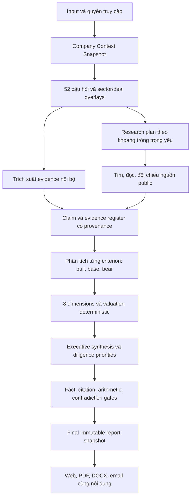

# BlockID.au — SOURCE OF TRUTH: G30 Business Research, Report Quality & Sale Readiness

**Revision:** G30 / 3.0 — APPROVED IMPLEMENTATION — 23/09/2026. **Owner quyết định:** Do Van Long.

**Trạng thái:** `APPROVED — IMPLEMENTATION IN PROGRESS`. **Phase:** `W1 report foundation live; W1/W2 implementation continuing; broader ops gates open`.

**Budget được founder chốt23/09:** **US$0.50/report tối đa**, dùng chung text + vision, **chỉ DeepInfra**, không provider trả phí khác. Ledger durable theo report scope, reserve trước dispatch, giữ reservation khi usage không rõ. Đây là ngân sách report; không tự diễn giải là quyền chạy benchmark trả phí không giới hạn. Price policy hiện tại hết hạn23/10/2026 và phải cập nhật từ giá official trước khi tiếp tục dispatch. Vision phase `6cb2d2db7`/SVI `1a1fd3f` đã live theo receipt bên dưới; chưa full quality certification.

**Latest live checkpoint23/09,15:01UTC:** BlockID compiled `b926321b31811346b86e48bfe0642522bb28dc77` active4128/warm4127; SVI remains compiled `93478aa926f2db2283b4ebb74871594a7700ff27` active4211/warm4210. The immutable reader and writer are live: after confirmed ReportV2 snapshot persistence, full and rescore runs create a new `report_revisions` UUID/token, read back the document, and fail closed on writer uncertainty; existing daily snapshot tokens remain compatibility projections. The applied 0410 table is empty because no report was generated solely for rollout; its source migration remains deferred pending schema-authority compatibility/rollback approval. No historical rewrite or backfill is claimed. HTTP/static/identity gates and mark-good succeeded; O08 artifacts remain retained and detached-work/quiescence coverage is incomplete. **Full G30 implementation and qualification remain open.** [Current writer receipt](../reviews/2026-09-23-immutable-writer-rollout.md); [reader receipt](../reviews/2026-09-23-immutable-reader-rollout.md). DeepInfra-only US$0.50/report remains unchanged.

**Chỉ đạo thực thi mới nhất23/09:** founder yêu cầu “không test mà implementing xong là deploy live ngay”. Từ mốc này hoãn test suites/lint/browser acceptance bổ sung, triển khai xong thì deploy theo fast profile; không gọi các kiểm thử hoãn là pass. Giữ build bắt buộc, resource/identity/schema admission, HTTP/static health tối thiểu và warm rollback để chuyển bản phục vụ. Không suy chỉ đạo này là cấp ngân sách inference mới hoặc chứng nhận report đạt toàn bộ quality gates. Profile BlockID: `--quick`, `G30_DEFER_UNIT_TESTS=1`, `G30_DEFER_EXTENDED_REVIEW=1`, `G30_DEFER_CANDIDATE_TESTS=1`; tắt notification ngoài hệ thống khi deploy.

**Chỉ đạo rollout mới nhất23/09:** founder yêu cầu **triển khai tới đâu, deploy live tới đó**. Mỗi phần hoàn chỉnh, đủ dependencies và release gates phải được deploy ngay theo phase nhỏ, không chờ toàn bộ G30 hoặc toàn bộ visual analysis. Áp dụng cho cả BlockID và SVI trong scope đã giao; kiểm tra sau deploy và giữ rollback riêng từng site. Phần foundation chưa đủ điều kiện activation có thể deploy dưới feature flag tắt, nhưng phải ghi rõ chưa dùng được với khách hàng. Chỉ đạo này không bỏ budget/quality/data/billing gates và không tự cấp ngân sách inference mới.

**Kế hoạch thực thi tiếp theo 23/09 (§12.10):** Lane A G30 truth/persistence giữ ưu tiên; **Lane B G31 Investor Lens** (UX đọc-only, [plan](g31-investor-lens-biz-trust-report-2026-09-23.md), [UI/UX v2](../design/investor-lens-report-spec.md)) chạy song song theo lượt E1–E5, deploy serialize sau mỗi phase. PLAN ONLY, chưa code.

**Review ưu tiên report23/09:** [Đối chiếu toàn plan và góp ý Claude với source/log/tests](../reviews/2026-09-23-report-quality-plan-revalidation.md). Giữ DeepInfra primary; ưu tiên O01/O02 completion/diagnostics → E03/F02/Q02 source/claim/final truth → R01–R04 và V01–V03 → U01/U02. Timeout cùng model không được tự loại mọi model DeepInfra. Word count/citation count và một successful smoke không thay quality gates§13. Giá official/current model IDs và cost-per-accepted-report phải tách khỏi projections. Source fixes của lượt review chưa phải live receipt; chưa đóng incident hoặc qualified model benchmark.

**Current verified checkpoint — 22/09/2026 22:29 UTC:** BlockID **v3.33.3 / `cba40ad1ea49e7447ba4575a5211689462f83391`**, active4111 / warm4110; SVI **`6c728dcfde052b3e40876e4391217f687bac8d93`**, active4205 / warm4204 (`c585147`). Actual rollback→forward drills passed. SVI exposes private accepted detail for all16 questions and preserves the selected question through sign-in; reading does not charge credits. Its latest release also includes immutable admitted-query retry binding and default-off original extracted-input provenance. New customer research production, full-input retention, receipt creation, financial schema expansion and automatic evidence-to-SVI/valuation publication remain **not activated**. Source commits after these compiled SHAs are preparation, not live features. This checkpoint supersedes older “latest” statements below only for the named slices. [BlockID release evidence](../reviews/2026-09-22-receipt-compatibility-live.md).

**Approval22/09/2026:** founder yêu cầu bắt đầu triển khai G30, spawn agents khi cần, commit và deploy live sau mỗi phase phù hợp đã đủ gates. Quyền này thay các câu “plan only / awaiting approval” lịch sử bên dưới; không có nghĩa mọi item đã implemented hoặc verified. Từng item còn pending trừ status ledger ở §12.9. Giữ nguyên gates, existing fee policy và các budget/topology decisions chưa chốt. Root sở hữu release; agent chỉ thực hiện deployment khi được root giao phạm vi cụ thể và dùng cùng deployment lock.

**Phạm vi hiện được giao:** triển khai code, kiểm chứng, commit và deploy từng phase đủ điều kiện theo G30. Không tự thay giá hoặc mua hạ tầng khi chưa chốt ngân sách; không gửi khách hàng ngoài phạm vi đã cấp.

**Phạm vi site được founder xác nhận:** toàn bộ yêu cầu, góp ý, phát hiện review và đề xuất điều chỉnh trong cuộc trao đổi này áp dụng cho **website `blockid.au` và tất cả trang con/routes thuộc site `blockid.au`**. Bao gồm trang công khai, trang sau đăng nhập, mọi persona/workspace, dashboard, report/detail/share, pricing/billing/checkout entry, admin, docs/help/legal, utility và các trạng thái giao diện. Không giới hạn ở homepage hoặc các trang đã được kiểm tra mẫu. Backend/API, dữ liệu lưu trữ, report exports/email và tích hợp Stripe được review/điều chỉnh trong phạm vi phục vụ chính các luồng của site này. Stripe hosted checkout/portal là bề mặt tích hợp bên ngoài cần đồng bộ mapping, nội dung và hành trình; không thuộc quyền redesign giao diện tùy ý như trang con BlockID. Các domain/sản phẩm/repository riêng không tự động thuộc scope toàn-site này. **Cập nhật mới nhất22/09: founder mở rộng riêng workflow RE-ANALYZE và các luồng report/criteria/questions/credit/identity liên quan sang cả `startupvalueindex.com`, theo §6.7. Founder sau đó yêu cầu tiếp tục toàn bộ plan/goal: §6.7 hiện được triển khai theo dependencies, gồm source contracts và durable jobs. Chưa có giá mới được chốt hoặc quyền bật thu phí trước các gate quote/ownership/ledger. Các phase G30 tiếp tục code/commit/deploy như approval phía trên.**

Đây là **kế hoạch chuẩn duy nhất cho đợt nâng cấp tiếp theo của BlockID.au**. Các tài liệu G1–G29 là lịch sử, bằng chứng hoặc đặc tả thành phần; không tạo hàng đợi triển khai độc lập nếu mâu thuẫn với bản này. G30 đã được founder cho phép triển khai; trạng thái live/implemented/deferred được ghi riêng ở §12.9 và evidence, không suy từ câu mô tả mục tiêu. Giá mới và ngân sách chưa chốt vẫn giữ trạng thái cụ thể; §6.7 đã được đưa vào implementation queue bởi yêu cầu tiếp tục full plan mới nhất. Việc viết tài liệu không tự thay đổi cron/runtime hoặc bật thu phí; im lặng không phải phê duyệt cho quyết định còn chờ.

**Bản lịch sử nguyên vẹn:** [SOT trước G30](../archive/source-of-truth-pre-g30-2026-09-22.md).

**Review đầu vào:** [source/output/design review ngày 22/09](../reviews/2026-09-22-source-output-design-review.md).

**Baseline revalidated 22/09/2026, 04:23–04:24 UTC:** local HEAD `83c6a55d381d390719667a7b96564472ba2bfc74`, package `3.28.1`; deployment manifest cùng SHA, timestamp04:20:22Z; live `/api/status`, `/version`, `/pricing` và showcase hiển thị v3.28.1. Đây là các bằng chứng tương thích, chưa độc lập chứng minh SHA của mọi process production. Report showcase vẫn snapshot21/09. Review ban đầu `bb0fb53af`/3.27.2 giữ làm history; baseline cần freeze lại khi bắt đầu implement.

**Delta cuối 04:30:29 UTC:** workspace HEAD đã tiến tới `3396adc00e78144ec86788db3fb03edf51abb1bc`, package3.28.2 từ luồng release khác. Diff sau baseline chỉ sửa `hub-tabs.tsx` thêm relative positioning cho sr-only label và metadata/version; không đổi report/billing/provider code đã review. `/api/status` tại thời điểm này vẫn trả **v3.28.1**; local manifest ghi3.28.2 nhưng deployed_at rỗng, nên **chưa xác nhận3.28.2 đã live**. Tests/browsing ở annex thuộc baseline3.28.1; delta3.28.2 chỉ được review source, không gán nhầm là đã browser-verified. G30 phải freeze lại source/live trước implementation.

**Historical live milestone22/09,13:04UTC:** BlockID v3.32.1 compiled `23cc80693a9476e63d011d7ca0e6e88da76471e2` live at4107, verified-good with founder-authorized60-second minimum soak and extended review deferred. Previous4106/v3.32.0 and4105/v3.31.0 remain warm. Only approved inactive4102/4103 were stopped; their artifacts remain. SVI compiled `2b541c650561e4744ef0d09b006db411681f2791` live at4204 includes Resources navigation and experimental uncapped index engine/reader; actual business measurement producer remains pending. BlockID pricing defaults Evaluator, support is admin@blockid.au, hostname-scoped GA4 and consent command fixes are live. Canonical robots is delivered by a temporary immutable nginx bridge; source removes the legacy static override for the next app build. [Current phase evidence and remaining gates](../reviews/2026-09-22-g30-discovery-phase-live.md). Earlier timestamped updates below are historical; this milestone supersedes their source-only/not-live status for these named slices.

**Latest BlockID milestone22/09,14:06UTC:** v3.33.0 compiled `cc229ad49cb574644e7f5dbf8e4fb4d59b344db6` is live at4108 and verified-good under founder-authorized deferred-review soak policy. Final audited criterion narrative is preserved on web and PDF/DOCX; no older report backfill or paid research activation. Full production build/type gate and12 candidate smoke tests passed; extended review remains deferred.4107 remains warm; only explicitly approved4101 was stopped with artifacts retained. Direct-origin robots now matches the canonical bridge, retained for old rollback compatibility. [Release evidence](../reviews/2026-09-22-g30-report-v333-live.md). SVI919f911 is now live at4207 with live-page fixes and12-menu saved details; actual rollback/forward, build/type gate and public EN/VI browser checks passed. [SVI release evidence](../reviews/2026-09-22-g30-svi-detail-live.md). This update supersedes older pending/source-only notes only for named delivered slices.

**Evidence baseline lịch sử:** [final revalidation](../reviews/2026-09-22-g30-final-revalidation.md). **Bản trước tổng hợp:** [G30 rev1.9 archive](../archive/g30-rev1.9-before-final-review-2026-09-22.md). Archive chỉ là history, không competing plan.

## 0. Bản cuối để review: quyết định, thứ tự và phạm vi bắt đầu

**Kết luận review:** giữ nền tảng đã có và nâng cấp theo từng contract. Chưa sẵn sàng tuyên bố G30 sale-ready: lỗi citation/final report/valuation, billing fulfillment và historical snapshot identity cần giải quyết trước. Không rewrite toàn bộ ứng dụng; redesign toàn bộ pages bằng shared template, dữ liệu/report nâng cấp dần có compatibility.

**Trạng thái bản này:** `APPROVED / IMPLEMENTATION IN PROGRESS` (approval mới nhất ở đầu tài liệu). “Final” nghĩa là đã hợp nhất yêu cầu và review hiện tại, không đóng băng trước feedback hoặc ngụ ý đã code. Agent review đã được user yêu cầu và đã chạy; **agent implementation chỉ spawn sau khi user cho bắt đầu**. G1–G29 đã shipped không bị đổi thành chưa làm; G30 requirements mới vẫn proposed.

| Quyết định đã rõ từ founder | Kết quả cần đạt |
|---|---|
| Phạm vi | blockid.au và tất cả trang con; integrations chỉ phục vụ site này, domain khác không tự đổi |
| Buyer & business | Investor chính; business gồm early/growth/SeriesA–B/established, rollout mỗi scope theo evidence |
| Report | Baseline nghiên cứu thực từ documents/URL + 13criteria/52questions + overlays; source-backed competitors3–5 khi đủ nguồn; assessment/valuation có điều kiện dữ liệu |
| Detail & credits | Existing purchased analysis/evidence mở lại không charge; deep research mới có quote/top-up/reserve/capture/refund và versioned supplement |
| AI | DeepInfra primary theo role và cost/accepted-report; other provider chỉ qualified free fallback, không paid spillover |
| Design & message | Một Unicorn system toàn site; hero “Know the business before you invest.”, giữ text/URL/file intake; investor-first business wording |
| Navigation & density | Dashboard tóm tắt giá trị, click vào chi tiết; menu theo cấp/persona; mọi trang có parent/Home rõ và giữ context (§10.12) |
| Availability & rollback | Vận hành24/24, không gián đoạn do deploy; phục hồi newest verified-good compatible release; kiểm RTO/RPO và host-failure plan (§12.8) |
| Approval boundary | Implementation/commit/phased live deploy đã được founder cấp; fee schedule/new spend và release quality gates vẫn áp dụng |

**Critical path đề xuất cuối:** baseline + verified deploy/rollback/monitoring protection (§12.8) → contracts → truth + persistence + financial integrity → **website/text/deck input parity + investor-intent capture (§6.8)** → proactive research/business lenses/valuation → report/dashboard/full-site UX → paid deep research integration → independent quality/buyer/economics evidence → controlled-sale sign-off. Billing foundation làm sớm, không chờ research/UI mới phát hiện lost credits. P0/P1 ở task table là priority thực hiện, không sửa severity lịch sử của review.

**Hai mốc khác nhau:** có thể demo/kiểm chứng core journey trước khi migrate hết pages, nhưng đó chỉ là milestone nội bộ. G30 full-site completion và final S03 vẫn cần U06 inventory toàn site; muốn sale scope hẹp hơn trước đó phải có founder decision sửa scope rõ, không tự bỏ admin/auth/utility pages.

**Đọc để duyệt:** §12 là45 work items/implementation steps; §12.8 thay thứ tự phase bằng safety-first và yêu cầu24/24/LKG; §12.7 là agent spawn/ownership/skills; §13 là gates; §16 là decisions. §10.5 giữ copy hero duy nhất; §10.8 là form/layout, §10.9 là benefit/proof, §10.10 là business coverage, §10.11 là light-only, §10.12 là phân cấp menu/nội dung và đường về trên toàn site. Không dùng các lịch sử slogan/plan cũ làm alternative default.

**Còn cần chốt trước hoạt động phụ thuộc:** ICP/sector validation order; actual DeepInfra/eval/search budget; exact model IDs sau benchmark; deep-research fee/expiry/partial-refund policy; account permissions và production operations. Các việc thiết kế/code được cho bắt đầu rõ có thể tiến hành trong phạm vi đó; thiếu ngân sách không chặn docs/fixtures/local implementation độc lập, nhưng không cho phép live spend.

## 1. Quyết định sản phẩm và goal

### 1.1 Goal duy nhất

Biến Trusted Business Report thành **báo cáo nghiên cứu và thẩm định sơ bộ có giá trị cho investor**, phân tích đúng doanh nghiệp đang xét, trả lời bộ câu hỏi theo tiêu chí, kiểm chứng các nhận định trọng yếu, trình bày nhiều góc nhìn và định giá có cơ sở; kết quả nhất quán trên web, PDF, DOCX và email, được giao đáng tin cậy qua luồng bán hàng hiện có.

**Goal thực thi ưu tiên bổ sung 23/09:** mọi đầu vào website hoặc text phải đạt cùng chuẩn phân tích như pitch deck sau bước extraction: giữ riêng nội dung doanh nghiệp và ý định/câu hỏi của người dùng; lập snapshot có lineage; nghiên cứu các yếu tố quyết định với investor; làm rõ valuation, strengths, weaknesses, risks và points to clarify; rồi xuất cùng một final ReportV2/revision trên mọi bề mặt. “Cùng chuẩn” là cùng contract và quality gates, không ép URL/text có những bằng chứng mà nguồn không cung cấp.

Investor cần trả lời được trong khoảng 3 phút:

1. Doanh nghiệp bán gì, cho ai, vấn đề có thật và khách hàng có lý do trả tiền không?
2. Vì sao đáng xem tiếp, vì sao có thể không đầu tư, điều gì có thể làm thay đổi nhận định?
3. Chúng ta biết chắc điều gì; đâu là founder-stated, giả định, thiếu hoặc mâu thuẫn?
4. Giá trị doanh nghiệp được ước lượng theo cách nào, phạm vi hợp lý đến đâu, nhạy nhất với biến nào?
5. Hỏi gì, kiểm tra gì và yêu cầu bằng chứng gì trước bước tiếp theo?

**Đầy đủ** nghĩa là mọi câu hỏi trọng yếu có câu trả lời hoặc trạng thái thiếu/chưa thể xác minh với hành động tiếp theo. Không bắt buộc bịa ra con số hoặc nhận định chỉ để lấp đủ chương.

### 1.2 Khách hàng và phạm vi bán đầu tiên

- **Investor là khách hàng chính**, theo yêu cầu mới nhất; thay ưu tiên programs-first/angels-secondary trong G21. Giữ khả năng cohort cho accelerator, không xóa tính năng đã bán.
- Phạm vi business bao gồm startup/early-stage, growth/Series A–B và doanh nghiệp đang hoạt động; investor cá nhân/nhóm/quỹ là primary. AU pre-seed–seed B2B SaaS chỉ là **validation cohort khởi đầu đề xuất**, không giới hạn sản phẩm. Mỗi stage/sector có applicability, valuation và corpus proof trước khi bán cùng độ sâu (§10.10).
- Founder là chủ sở hữu/người cung cấp dữ liệu, được nhận giải thích và checklist cải thiện. Advisor/accelerator là khách hàng thứ cấp.
- Sản phẩm bán là chất lượng hồ sơ đánh giá và quy trình làm việc; không bán lời hứa AI dự đoán thắng/thua hoặc một con số “đúng tuyệt đối”.
- Tên công khai giữ **Trusted Business Report — by BlockID**; SVI là phương pháp/chỉ số bên trong; Investor Dossier là hồ sơ/workspace chứa báo cáo, không phải một bộ kết luận khác.
- Không mở lại paid pilot/coupon đã bỏ ở G25. Customer validation dùng demo hoặc khách hàng đầu tiên trên SKU hiện hành, không tạo gói pilot mới.

### 1.3 Thứ tự ưu tiên bất biến

1. **P0 sản phẩm:** factual correctness, nguồn, xử lý thiếu/mâu thuẫn, kết luận nhất quán, không biến giả định thành dữ kiện.
2. **P1 sản phẩm:** độ sâu riêng cho doanh nghiệp, research, 13 criteria/52 câu hỏi + các câu hỏi diligence còn thiếu, định giá và investor implications.
3. **P1 vận hành:** khả năng hoàn thành/giao báo cáo, snapshot/cache/version, chi phí có kiểm soát.
4. **P2:** UI theo lớp thông tin, so sánh, xuất báo cáo và trải nghiệm investor.
5. **P2 thương mại:** chứng minh giá trị với buyer thật, packaging/pricing phù hợp chi phí, sale gates.
6. Sau đó mới tới mở rộng Index/API, thêm sector hoặc automation phụ. **Wording trang chủ/hero và redesign toàn bộ trang theo một Unicorn template chuyên nghiệp nằm trong G30**, đi cùng M3 và phải nghiệm thu trước khi tuyên bố hoàn tất redesign; không bị đẩy ra ngoài scope marketing.

P0/P1 ở đây là ưu tiên của chương trình, không thay đổi severity của các phát hiện trong review.

## 2. Hiện trạng: giữ gì, sửa gì, chưa được chứng minh gì

| Hạng mục | Bằng chứng trong source/tài liệu | Đánh giá và quyết định G30 |
|---|---|---|
| Quy mô | 382 page.tsx, 682 API route.ts, 5.305 file `web/src` ở final review; không đại diện mọi dynamic state | Đủ rộng; không cần xây thêm hệ thống song song để bán báo cáo |
| Báo cáo | `lib/report-v2/schema.ts`, `components/tbr/v2/report.tsx` | Giữ ReportV2 làm nền; UI v3 và schema v2 là hai version khác nhau, không đổi tên chỉ để marketing |
| Free path mới | `lib/analyses/first-analysis/report-v2-job.ts` | G28 đã dùng cùng orchestrator cho hai full reports miễn phí; **giữ**, không hiểu nhầm đây vẫn là PDF cũ |
| Guest paid cũ | `lib/guest-analysis/runner.ts`, Stripe webhook/reconcile | Vẫn có đường chạy legacy và lỗi extraction/delivery; inventory traffic trước khi hợp nhất, giữ tương thích đơn cũ |
| Criteria | `lib/evaluation-criteria.ts`: 13 criteria × 4 guiding questions | Có 52 câu hỏi nhưng chưa có answer/evidence/research status bắt buộc cho từng question ID |
| Dimension | `report-pipeline/dimension-owners.ts`: 8 dimension, 12 growth phases | Giữ taxonomy; tách dimension trình bày khỏi criterion/question dữ liệu, tránh trùng tính điểm |
| Research | `adk/agents/market-research.ts`, `gather.ts:520` | Nhánh market hiện là hai lời gọi model theo general knowledge, không có search/fetch trong nhánh đó; vẫn có connector/website audit khác. Cần research có tài liệu nguồn thực sự |
| Citations | `auto-cite.ts`, `claim-gate.ts`, `report-v2/grounding.ts` | Đã tái hiện trùng số sai metric và model quote tự chứng minh; thay cơ chế kiểm chứng, không chỉ sửa prompt |
| Executive | `investment-view.ts`, structured executive + thesis | G27 cố ý giữ analyst verdict khác rubric; G30 thay bằng một kết luận chính, các giả thuyết phụ có nhãn điều kiện |
| Valuation | `agents/cfo-valuation.ts`, `valuation-chapter.ts` | Có nhiều methods và assumptions table; vẫn có CAC floor 500, GM default 72 và derived metric hiện như fact. Cần provenance ở cấp từng input/output |
| Score/context | `run-report-pipeline.ts` | Deck mới có thể dùng scoring cũ; stream/cache giữ projection trước gates; phải sửa trước khi dùng làm cơ sở investor memo |
| UI | G26 light template, report v3, hai Button implementations | Giữ light/navy; hợp nhất component, copy, trạng thái dữ liệu và disclosure; không redesign palette từ đầu |
| Reliability | G28 timeout/strikes/background budget; G29 mitigation đã landed ở3.28.0, patch UI3.28.1 | Giữ mới nhất; capacity + diagnostics + live completion là phụ thuộc thực tế của quality, không chỉ ops phụ |
| Test | Final review: typecheck đạt;56 files/1.061 scoped tests đạt. Lượt đầu81 files/2.491 tests là baseline khác | Bảo vệ contract nhưng chưa chứng minh độ đúng của nhận định; cần golden cases và đánh giá độc lập |
| Buyer validation | `docs/research/evaluator-interviews-2026-09.md` có rollup 0/10 | Có instrument, chưa có bằng chứng phỏng vấn hoàn tất trong file này; không coi task “shipped” là customer validation đã xong |
| Sale readiness | `docs/ops/ready-to-sale.md` thừa nhận real free run chưa kiểm chứng, KPI 0.85 chưa đạt live mới, provider outage | Chưa đủ bằng chứng để gọi mọi advertised path sale-ready; xác nhận lại bằng gates §13 |
| Generated status | `project-state.json`, `implementing-plan.md`, `architecture.md` có version/task cũ | Chỉ là telemetry/history; không được ghi đè kế hoạch này hoặc tự đóng task bằng commit subject |

### 2.1 Đầu ra thật cần dùng làm regression case

Showcase snapshot `136a49f5`, đọc 22/09 khoảng 01:37 UTC, hiển thị generated 21/09:

- SVI index 135 / composite 87, nhiều dimension 100 nhưng evidence confidence 0 và verdict D.
- Có cả “Insufficient evidence” và “Analyst synthesis · Back with conditions”.
- Summary nói margin gần 100%; bảng ghi 72%, CAC A$500, Rule of 40 44; risk nói CAC chưa xác minh.

G28 release notes nói đã sửa band-D summary; quan sát live cho thấy **phải kiểm tra toàn bộ structured summary/reasons/verdict và snapshot cụ thể**, không đóng lại bằng tên commit. Cần phân biệt source đã sửa, report lưu trước sửa và renderer vẫn phát lại nội dung cũ. Không khẳng định mọi report đều lỗi hoặc mọi số trong snapshot đều là default khi chưa đọc input được phép.

### 2.2 Các lỗi review được đưa vào backlog, không mất dấu

| Review | Work item G30 |
|---|---|
| 0a fallback unit economics | V01–V03 |
| 0b recommendation/structured summary conflict | A03, Q02, U01 |
| 1 citation/quote/grounded false positive | E03, A02, Q01 |
| 2 stream vs final report mismatch | F02–F03 |
| 3 deck mới dùng context cũ | F01 |
| 4 cache thiếu context/quality | F03 |
| 5 guest extraction/PDF/delivery | F04, O03 |
| 6 heuristic gắn nhãn Lighthouse | E02, A01 |
| 7 hai Button | U03 |
| 8 design docs xung đột | P01, U03 |

### 2.3 Final revalidation: giữ tiến bộ mới, bổ sung issues ưu tiên

Baseline và nguồn chi tiết trong [revalidation annex](../reviews/2026-09-22-g30-final-revalidation.md). G29 dead-rung/unfunded/capacity/degraded diagnostics, free ReportV2 path và patch hub layout/h1 có trong source3.28.1: reuse và verify, không xây lại. Homepage vẫn program/cohort-first; showcase136a49f5 vẫn0%confidence/verdictD với số/narrative cần reconcile. Tests pass không phủ các lỗi mới dưới đây.

- **I35 — Same-day overwrite:** `run-for-project.ts:799–850` update snapshot cùng account/ngày và giữ share token. F02/T02 tách immutable report revision khỏi daily SVI projection; test hai runs cùng ngày vẫn giữ hai nội dung và links lịch sử.
- **I36 — Routing policy bypass/shared consumer:** `ai-client.ts:964,1071–1114` có orders khác nhau; override “deepinfra” append defaults, classify bỏ qua override. O01 cần hard provider+model allowlist trên mọi task/interactive/background/probe và consumer-scoped policy vì `ai/registry.ts:1–3` còn phục vụ startupvalueindex.com ngoài scope.
- **I37 — Financial integrity:** `credits.ts:877–931` grant read/upsert/ledger tách; webhook có thể ACK khi grant false; event duplicate guard chặn retry failed event; cron recovery có nhưng grant/revenue write riêng. B02/B03 P0: atomic purchase fulfillment dùng chung webhook/cron/replay; event lease khác purchase dedupe; giữ local debit RPC đang có. Remote ambiguous timeout phải reconcile operation trước local retry.
- **I38 — False persistence success:** `report-v2/storage.ts` update no error chưa chứng minh có row được lưu. F02/T02 cần affected-row/read-back, test update target không tồn tại, DB read failure khác empty history.

Đã kiểm lại typecheck và1.061 scoped tests; chưa private Stripe/DB audit, paid E2E, fresh PDF generation hoặc whole-repo tests. Metadata QA306/0 cũ predates deployment mới. Search snapshot pricing3.17 không là live hiện tại; direct request mới cho3.28.1. `/version.json`404, dùng `/version` và `/api/status`.

## 3. Hợp nhất plan: luật ưu tiên và quyết định thay thế

Thứ tự: **yêu cầu founder hiện tại → G30 được duyệt → source/runtime có bằng chứng → đặc tả thành phần tương thích → tài liệu lịch sử**. Source cho biết đã có gì, không tự chứng minh đã đúng. Quyết định mới hơn chỉ thay phần thực sự mâu thuẫn; các entitlement, consent và hành vi tốt đã có phải được giữ.

| Plan/contract | Giữ | Thay thế/điều chỉnh trong G30 |
|---|---|---|
| G13/ReportV2 | Một document, 8 dimensions, ownership, gather/score/report | Thêm question/claim/source graph và immutable finalized artifact; các entry path cùng contract |
| G19 | Ledger, pending ≠ zero, valuation methods, synthesis | Không dùng mục tiêu ≤1.300 từ cho toàn bộ report; chỉ cap executive. “Ít pending” không là KPI vì dễ thưởng cho bịa dữ liệu |
| G20 | Feature inventory, entitlement/purchase E2E, hide unfinished | HTTP 200/green UI không đủ sale-ready; thêm content/value/reliability gates |
| G21 | Evidence governance, corrections, benchmark-N, org isolation, cohort | Investor là primary buyer; programs-first bị thay. Bỏ lại paid pilot là trái G25 |
| G22 | Retention/export, validation ledger, regression | Manual counter cần bằng chứng nguồn; generated status không là authority |
| G23–G24 | Audit logs, readable citations, demo exclusion | `groundedShare ≥0.85` chỉ là chỉ số tương thích, không phải release gate chất lượng; unknown citation phải lộ lỗi, không im lặng biến mất |
| G25 | Hai full reports miễn phí/email, review trước Pay, bỏ pilot/coupon | Không đổi quota/giá trong đợt lập plan. Capacity cho production đánh giá theo chất lượng/chi phí, không mặc định free chain luôn đủ |
| G26 | Light surfaces, navy action, cyan-muted `#0e7490`, accessible primitives | §10.11 thay explicit dark opt-in bằng light-only toàn site; bỏ restore/toggle/scoped dark có kiểm migration. Hợp nhất Button, supersede MASTER dark/teal; không đổi sang palette cạnh tranh |
| G27 | Dashboard, investment view, valuation, 8 chapters, risk/plan, EN/VI, PDF/DOCX | Báo cáo nhiều lớp; một final recommendation; không gán xác suất risk từ thiếu evidence; không xếp ưu tiên chỉ bằng SVI lift |
| G28 | Same full report free path, stage timeout/strikes, background budget, print/band demo | Audit nội dung cuối và thêm golden tests; không giảm điều kiện fact-check để đạt KPI |
| G29 A/B | Dead-rung pruning, capacity alerts, degraded diagnostics | Hấp thụ vào O01–O02, cần sớm để chạy quality eval thật |
| G29 C | Real free run, persona copy, mobile fixed controls | Hấp thụ O03/U03/S01. CSP phải chẩn đoán script/tác động; không allowlist chỉ để test xanh |
| G29 D | Index movers đúng dấu, new không phải -99%, sample label | O04, sau report blockers; không kéo dài critical path nếu ẩn bề mặt chưa đạt |
| G1–G18/roadmaps cũ | Những capability đã dùng và history | Không mở lại blockchain, marketplace, reseller expansions, ES/JA, extra agents trong critical path này |

G19–G28 vẫn giữ trạng thái **historically shipped**. G29 đã có mitigation source landed; phần còn thiếu verification hoặc khác policy mới được chuyển vào O01/O02/O04, không làm lại máy móc phần đã có. Việc bắt đầu thực hiện G30 còn chờ duyệt.

## 4. Nghiên cứu bên ngoài và cách áp dụng

Nguồn được mở/kiểm tra ngày 22/09/2026. Đây là nền tham khảo cho thiết kế, không phải tuyên bố BlockID được chứng nhận hoặc thay thế analyst/valuer.

| Nguồn gốc | Điều áp dụng cho sản phẩm | Giới hạn |
|---|---|---|
| [CFA Institute — Equity Valuation: Applications and Processes, 2026](https://www.cfainstitute.org/insights/professional-learning/refresher-readings/2026/equity-valuation-applications-and-processes) | Phân biệt facts/opinions, assumptions rõ; analysis/forecast/valuation/recommendation nhất quán; đủ thông tin để người đọc phản biện | Học cấu trúc research, không sao chép stock price target cho startup thiếu dữ liệu |
| [IPEV Guidelines — December 2025](https://www.privateequityvaluation.com/Portals/0/Documents/Guidelines/2025%20IPEV%20Valuation%20Guidelines.pdf) | Chọn kỹ thuật phù hợp, calibration theo giao dịch có liên quan, so sánh đúng đặc tính, ngày định giá và judgement; AI không thay professional judgement | Bản 2025 thay bản 2022, áp dụng kỳ báo cáo bắt đầu từ 01/04/2026. Là fair-value guidance, không biến report screening thành formal valuation |
| [Bessemer — Shopify investment memo](https://www.bvp.com/memos/shopify) | Deal context, thesis, kinh tế mô hình, cơ hội tăng trưởng và rủi ro cụ thể cùng một lập luận | Memo lịch sử để học cách phân tích; không lấy số lịch sử làm benchmark 2026 |
| [Angel Capital Association — Due Diligence Playbook](https://www.angelcapitalassociation.org/data/Documents/Members%20Only/BestPractices/E3e%20-%20Due%20Diligence%20Checklists%20and%20Reports/Due_Diligence_Playbook_Generic_with_Appendices.pdf) | Research/review và deal memo cần customer/reference checks, contracts, financials, cap table và IP | Playbook lịch sử, checklist phải thích nghi AU và stage |
| [Cut Through Venture — State of Australian Startup Funding 2025](https://www.cutthrough.com/insights/state-of-australian-startup-funding-2025) | Cập nhật bối cảnh nguồn vốn AU; mỗi statistic phải đọc đúng bảng, mẫu và thời kỳ | Không suy valuation từ funding amount; không giả định report có median cho mọi sector/stage |
| [ASIC — RG 244](https://www.asic.gov.au/regulatory-resources/find-a-document/regulatory-guides/rg-244-giving-information-general-advice-and-scaled-advice) | Tách factual information, general advice, personal advice khi chọn lời kết luận và scope bán | Label/disclaimer không tự giải quyết phân loại dịch vụ; wording/scope cụ thể cần reviewer phù hợp trước public sale |

**Suy luận thiết kế của G30:** lợi thế bán hàng là analyst workflow có evidence và reviewability, không phải số lượng agent/chapter. External research phải chứng minh liên quan đến startup và tác động lên investment case, không trở thành phần “industry overview” chung chung.

## 5. Hợp đồng đầu vào: biết startup nào trước khi phân tích

Mỗi run đóng băng một **Company Context Snapshot**:

- Tên pháp lý/brand/domain, country/jurisdiction, ABN nếu có; không ghép công ty trùng tên chỉ vì search result.
- Mô hình kinh doanh, sector/subsector, buyer/user, geography, product maturity, revenue model, vòng gọi vốn; company stage không suy chỉ từ lịch sử funding hoặc độ dài deck.
- Input gốc, danh sách tài liệu/phiên bản, file hash, extracted pages/cells/sections, extraction warnings, ngày ghi nhận và thời kỳ số liệu.
- Founder answers theo question ID; tài liệu nào là mới, thay thế bản nào, quyền truy cập thuộc founder/evaluator/org nào.
- Investor lens tùy chọn: sector/stage/geography/check-size/mandate. Fit với mandate là lớp riêng, không sửa facts hoặc SVI toàn cục của startup.
- Ask/raise/currency/basis, current cash/debt/convertibles khi có; không suy dữ kiện không được nêu.

**Yêu cầu founder 23/09/2026 — Investor Report Surface (P1). Bản chốt: [`g30-investor-report-surface-2026-09-23.md`](g30-investor-report-surface-2026-09-23.md)** (hồ sơ điều tra giữ tại [`g30-analyze-pitchbook-parity-2026-09-23.md`](g30-analyze-pitchbook-parity-2026-09-23.md)).** Intake `/analyze` mở rộng thành 3 tab Files/URL/Text, **nhiều file** (≤5 × 25 MB), thêm **XLSX/CSV** cho financial model và cap table (PDF/DOCX/PPTX đã chạy qua `analyzeInput()`). Kết quả bổ sung **lớp 16 câu hỏi IC** (Q01–Q16) làm bề mặt investor, **ánh xạ** về 13 criteria/52 câu hỏi canonical — không tạo taxonomy thứ ba và không nhập bộ 11 chiều song song của SVI. **Không iframe/nhúng kết quả SVI vào bề mặt trả phí**: SVI chặn framing hai lớp (`X-Frame-Options: DENY` + `frame-ancestors 'none'`), không có database (run là file phẳng trong `svi-analysis-cache`, ghi không atomic), `GET /api/analysis/{runId}` không có auth, `key_evidence` là free string và raw excerpt bị cắt 8.000 ký tự — trái §5 và §8. Phần đáng port về kỹ thuật là **SSE resume theo byte-offset + ETA từ trung vị run thật**, vì `/analyze` hiện chỉ có polling và ETA cứng. Chưa code; phân vai với phiên Codex ghi tại §7 của plan doc. **Thiết kế kết quả** (yêu cầu founder 23/09: dashboard giống biz report chuyên nghiệp, nhìn là thấy ngay định giá / điểm mạnh / điểm yếu / điểm cần lưu ý) được chốt tại [`docs/design/analyze-report-dashboard-spec.md`](../design/analyze-report-dashboard-spec.md): quy tắc 3 giây với Verdict bar (định giá là số lớn nhất trang) → signal strip → triptych Điểm mạnh/Rủi ro/Cần làm rõ → 8 chiều có dải p25–p75 và `n` → định giá chi tiết → 16 câu hỏi → kế hoạch 90 ngày → phụ lục; progressive disclosure, masthead kiểu research note, web = PDF = DOCX, **không thêm palette/font mới** (dùng nguyên token light template và primitives hiện có), mọi trạng thái là icon + chữ + màu.

**Extraction gates:** OCR khi cần, đo trang đọc được/không được, giữ bảng và đơn vị; không cắt âm thầm 8.000 ký tự. Dùng chunk theo cấu trúc + retrieval trong toàn bộ tài liệu. Nếu extraction không đủ, trả `needs_input` có trang/vấn đề cần sửa. Website unreachable không được coi URL là business description đủ dùng.

**Privacy của research:** query public không chứa nội dung bí mật của deck, email khách hàng, token hoặc tên chưa công bố; lấy thuật ngữ sản phẩm/sector được phép. Private evidence chỉ đi tới provider được phê duyệt trong processing contract. Không tự liên hệ founder, reference hoặc customer; report sinh request/checklist để người có quyền thực hiện.

### 5.1 Phân tích hình ảnh trên BlockID và Startup Value Index

**Bổ sung theo yêu cầu founder23/09/2026:** phân tích ảnh nằm trong file/slide
upload và ảnh upload trực tiếp, áp dụng rõ cho **blockid.au và
startupvalueindex.com**. [Đặc tả visual evidence](g30-visual-evidence-analysis-2026-09-23.md)
quy định intake JPEG/PNG/WebP, PDF/PPTX/DOCX mixed text/image, OCR + vision cho
chart/table/diagram/screenshot, citation tới page/slide/region, uncertainty và
reconciliation. Đây là scope mới được ghi vào plan, **chưa implemented/live verified**.

DeepInfra vẫn primary; vision có qualification riêng theo exact model/endpoint,
không suy text model đọc được ảnh. Ưu tiên local extraction, dedupe/cache đúng
quyền và selective crops để tối ưu cost/accepted report. Không biến số đọc xấp xỉ
thành fact/valuation, không tăng score vì ảnh đẹp hoặc đếm trùng text và ảnh.
Giữ budget, retention/erase, cross-site permissions và same-final-revision gates.

Phần việc này mở rộng **F01/E01–E03/Q01/Q02/O01/O02/A01–A03/V01–V03/U01/U02/U07/
T01–T02/F02–F03/O08/B02–B03/O03/S01/S03** trong queue hiện có; không lập backlog
thứ hai. Contract/corpus làm trước, activation theo dependency và evidence từng
site. Acceptance visual ở đặc tả bổ sung cho §13, không thay các gate hiện hành.

## 6. Criteria và câu hỏi: 13 tiêu chí, 52 câu hỏi, 8 chiều tổng hợp

### 6.1 Một bảng hỏi có version, không thêm bộ câu hỏi cạnh tranh

Giữ 13 keys trong `evaluation-criteria.ts`; gán stable ID `criterion_key.q1..q4` cho 52 guiding questions theo thứ tự hiện tại. Câu hỏi thay nội dung phải có rubric version/mapping lịch sử. Các câu hỏi bổ sung dùng `criterion_key.x...`; không xóa dữ liệu cũ và không bắt founder nhập lại câu đã được đọc từ deck.

Mỗi question phải có: question ID/text/version, applicability + lý do, founder answer, extracted answer, research answer, claim IDs, sources, status, conflict, analyst implication, follow-up request và reviewer state. Trạng thái: `answered`, `partially_answered`, `missing`, `conflicting`, `not_applicable`. “Đã trả lời” khác “đã xác minh”.

### 6.2 Coverage matrix bắt buộc

Q1–Q4 dưới đây là bản diễn giải tiếng Việt của câu hỏi source, không phải đổi schema trong turn này.

| Criterion → primary dimension | Q1–Q4 hiện có | Research/đối chiếu cần làm | Kết luận investor cần nhận |
|---|---|---|---|
| `idea` → MPC | Vấn đề gì? Khác giải pháp hiện có? Insight/lợi thế? Đã validate với khách hàng? | Đối chiếu pain, workflow, alternatives/status quo, demand; customer proof phải từ evidence được phép | Vấn đề đáng giải quyết không, cấp thiết đến đâu, insight có được kiểm chứng? |
| `market` → MPC | TAM? SAM? Vì sao lúc này? Đối thủ chính? | Bottom-up ICP × spend; địa lý/timeframe; direct/indirect competitors, pricing, substitutes, tailwind/headwind | Thị trường tiếp cận thực tế, competition và điều kiện để chiếm thị phần |
| `founder_profile` → FTV | Kinh nghiệm liên quan? Đã làm chung? Domain expertise? Startup/exit trước? | Public profile đúng người, hồ sơ/nguồn cho claim; reference là pending nếu chưa làm | Founder-market fit, khả năng thực thi, key-person risk; không suy năng lực từ danh tiếng hay yếu tố nhạy cảm |
| `code_git` → PTD | Repo? Tech stack? Automated tests? Contributors? | Repo được cấp quyền, kiến trúc, vận hành, phụ thuộc vendor/model, IP/license; test presence ≠ coverage/quality | Maturity, khả năng mở rộng, technology risk, moat thực; non-software có lens thay thế |
| `website` → PTD | URL? Mobile app? Traffic? Conversion? | Website/product thực, pricing/app store; traffic từ nguồn đo; conversion đúng numerator/denominator/window | Product reality, distribution signal; website đẹp không chứng minh traction |
| `team` → FTV | Bao nhiêu người? Vai trò đã có? Vai trò thiếu? Hiring 12 tháng? | Full-time/contractor, capacity, cost/runway, key gaps; xác minh từ roster/evidence | Team có thể thực hiện milestone với nguồn lực hiện tại không? |
| `customer_size` → TRE | Active users/customers? Growth? Engagement? Retention? | Tách signup/session/active/paying/logo; cohort retention/churn, concentration, customer references khi được phép | Chất lượng traction, repeatability, risk do phụ thuộc khách hàng, dấu hiệu PMF có giới hạn |
| `gtm_strategy` → MPC | Channels? Pricing? CAC? Scale acquisition? | Competitor pricing, sales cycle, pipeline stages, channel experiments; CAC và payback có đủ cost/cohort | Khả năng bán lặp lại, cost of growth, sales bottleneck và economics |
| `documents` → IRI | Deck? Financial model? One-pager/business plan? Legal docs? | Consistency giữa deck/model/contracts; ngày/version/signature; phân biệt existence với adequacy | Material discrepancies, information quality và danh sách diligence trước IC |
| `dataroom` → IRI | Có data room? Tài liệu nào? Phân loại? Cập nhật khi nào? | Coverage theo stage, quyền truy cập, freshness, missing signed records | Investor cần thêm gì trước quyết định; nhiều file không tự làm điểm tốt |
| `team_structure` → FTV | Org chart? Advisory board? Trách nhiệm? Board cadence? | Quyền quyết định, shareholder/option/vesting, cap table fully diluted, conflicts/related party | Governance, control, alignment, dilution; đưa phân tích sang CGH mà không tính trùng |
| `roadmap` → SVM | Milestones 3–6 tháng? Vision 12 tháng? Prioritisation? Dependencies? | Competitor pace, technical/regulatory dependencies, milestone cost, lịch sử deliver | Feasibility, use-of-funds, catalyst/de-risking và moat theo thời gian |
| `revenue` → TRE | MRR/ARR? Growth? LTV/CAC/margins? Profitability? | Transaction/accounting evidence, refunds/tax/currency, recurring vs one-off, cost/burn/runway | Revenue quality, unit economics, financing need và input định giá có kiểm chứng |

### 6.3 Các câu hỏi bổ sung bắt buộc theo applicability

Không có criterion primary CGH/LCO trong 13 keys hiện tại; câu hỏi bổ sung phải lấp khoảng trống diligence, không thêm hai chương tự chấm từ generic prose.

| Nhóm/namespace | Câu hỏi bổ sung | Dimension dùng |
|---|---|---|
| `team_structure.x_equity` | Ai sở hữu bao nhiêu trên fully diluted basis? Options/SAFE/notes? Vesting? Quyền kiểm soát và approvals? | CGH |
| `documents.x_legal` | Entity/IP thuộc ai? IP assignment đã ký? Hợp đồng trọng yếu/license/regulatory requirements? Tranh chấp/material liabilities được disclose? | LCO, CGH |
| `revenue.x_cash` | Cash, debt, burn, runway và thời kỳ? Revenue recognition? Customer concentration? Financial source reconciliation? | TRE, IRI |
| `roadmap.x_raise` | Raise bao nhiêu, instrument/terms nào, dùng vào milestones nào, vốn đủ tới đâu? Kịch bản down-round/dilution? | IRI, SVM |
| `idea.x_moat` | Vì sao khách hàng chọn và tiếp tục dùng? Switching cost/data rights/network effects có evidence gì? Đối thủ phản ứng ra sao? | SVM, MPC |
| `market.x_sector` | Quy định, seasonality, reimbursement/procurement, hardware lead times, capex hoặc sector-specific drivers có áp dụng không? | MPC, LCO, PTD |

Hiển thị đầu tiên **5–10 follow-up quan trọng nhất**, theo khả năng thay đổi kết luận và thiếu evidence; toàn bộ checklist vẫn mở được. Không bắt người dùng điền 52 ô trước khi nhận giá trị ban đầu.

### 6.4 Một phân tích criterion có giá trị phải chứa gì

Mỗi criterion mở rộng có cùng anatomy:

1. **Assessment:** nhận định riêng cho startup, mức độ chắc chắn và giới hạn.
2. **Câu hỏi/đáp án:** Q1–Q4 + extras áp dụng, có status và source cho từng câu.
3. **Điều đã biết:** facts và founder-stated tách rõ, time window/currency/entity.
4. **Research bên ngoài:** nguồn đã đọc, liên hệ với startup, đồng thuận và phản chứng.
5. **Strengths và bear case:** vì sao tốt, điều gì có thể làm nhận định sai, điều kiện cần kiểm tra.
6. **Investor implication:** ảnh hưởng đến go/no-go-next-step, valuation assumption, deal structure hoặc diligence.
7. **Evidence gaps & next request:** tài liệu/câu trả lời chính xác, người cung cấp, mức materiality, deadline nếu biết.
8. **Score explanation:** signals/weights và confidence khi applicable; generic benchmark không được giả thành evidence startup.

Nhiều dimension có thể tham chiếu một criterion; question/evidence lưu một lần, có cross-link, không lặp cả đoạn hoặc cộng trọng số hai lần. Criterion weights hiện tổng 100 và dimension weights là lớp khác: giữ formula hiện hành tới khi A01 hiệu chỉnh/migration được duyệt, không cộng hai lớp tùy tiện.

### 6.5 Ví dụ chất lượng đầu ra mong muốn — dữ liệu giả để minh họa

**Case giả:** một B2B SaaS cho phòng khám AU. Founder khai “MRR A$12.000”; bảng billing cùng kỳ cho A$9.000 recurring subscriptions và A$3.000 setup fees. Chưa có acquisition spend, gross-margin costs hoặc cap table. Đây không phải dữ liệu một khách hàng thật.

**Criterion `revenue`:**

- **Assessment:** đã có dòng recurring revenue trong kỳ được cung cấp, nhưng claim MRR cần chỉnh định nghĩa. A$3.000 setup không được annualise như subscription. Chưa đủ dữ liệu kết luận customer economics bền vững.
- **Q1 MRR/ARR:** nếu billing scope được reconcile đầy đủ, MRR A$9.000; annualised run-rate A$108.000, ghi rõ đây không phải trailing-12-month recognised revenue. Source là billing table/cell và kỳ, không phải lời model.
- **Q2 Growth:** missing nếu chưa có kỳ trước tương đương; không suy từ số khách tổng.
- **Q3 Economics:** CAC/GM/LTV chưa tính được vì thiếu spend/COGS/cohort retention. Không điền CAC 500, GM72 hoặc LTV24 tháng mặc định.
- **Q4 Profitability:** cần cash, burn, recurring/nonrecurring cost và kế hoạch; không đồng nhất gross margin với EBITDA margin.
- **Bull case:** subscription base tạo nền cho doanh thu lặp lại; chỉ mạnh hơn khi retention/collections được chứng minh.
- **Bear case:** setup fees đang làm headline recurring revenue cao hơn thực tế; thiếu cohort và cost data khiến giá trị mỗi khách chưa xác định.
- **Investor implication:** revenue-multiple model phải dùng đúng recurring base sau reconciliation; chưa nên trả premium dựa trên unit economics. Muốn đưa khoảng định giá phải có comparable phù hợp, không tự gán multiple từ ví dụ này.
- **Follow-up:** billing export 6–12 tháng, refunds/cancellations, cohort retention, acquisition spend theo kênh và costs cùng kỳ.

**Research `market` của cùng case:** xác định đúng practice type/buyer và geography; đọc nguồn số lượng cơ sở phù hợp, competitor pricing và khả năng tích hợp workflow. Kết luận phải nối tới sales cycle, switching friction và attainable market của startup này. Không dùng tổng healthcare spend làm TAM phần mềm, không lấy doanh thu/khách hàng của đối thủ thành dữ kiện startup.

Ví dụ này là chuẩn về cách lập luận và xử lý thiếu thông tin; không phải một template để chép số sang report khác.

### 6.6 “What we looked at”: giải thích kết quả từng nội dung, không chỉ liệt kê gap

**Yêu cầu bổ sung của founder22/09/2026 — plan only cho phần này.** Áp dụng trên toàn bộ blockid.au nơi trình bày findings: kết quả đang phân tích, report hoàn tất, trang sau login, báo cáo đã lưu/chia sẻ, dashboard drill-down và exports tương ứng. Đây là phần cụ thể hóa §6.4, §8 và thiết kế detail ở §10; không tạo plan hoặc bộ tiêu chí cạnh tranh.

**Bằng chứng source:** `web/src/components/analyze/analyze-results.tsx` hiện nhận `AgentFinding` chỉ gồm agent/headline/bullets. Fallback `effectiveFindings` cắt còn4 dimensions, lấy một số evidence/gap từ `derivedAnalysis.subs`; `AgentFindings` chỉ mở danh sách bullets. Các câu “Clarify the problem being solved” và “Define total addressable market size (TAM/SAM/SOM)” xuất phát từ heuristic trong `web/src/lib/svi-analysis.ts`. Các caller phân tích/saved view còn dùng fallback thay vì canonical criterion findings. Đây là thiếu contract và wiring, không chỉ thiếu copy; nhãn agent không chứng minh agent đã research.

**Kết quả mong muốn:** người đọc hiểu BlockID đã đánh giá nội dung nào, phát hiện gì riêng ở doanh nghiệp này, vì sao nhận định như vậy, tác động đến quyết định đầu tư và cần kiểm chứng điều gì tiếp. Một dòng “Gap: …” có thể là nhãn tóm tắt, nhưng không được là toàn bộ nội dung sau khi mở chi tiết. Không viết dài thêm bằng lời chung chung hoặc suy diễn khi thiếu dữ liệu.

#### A. Contract phân tích bắt buộc ở từng question/finding

Mỗi finding liên kết với criterion/question ID hiện có và final report revision; không dùng vị trí trong mảng hoặc tên agent làm identity. Contract E01/A02 cần mang các phần sau, có state rõ khi chưa có dữ liệu:

| Phần | Nội dung phải trả lời |
|---|---|
| Nội dung đã xem | Câu hỏi cụ thể và phạm vi business/customer/geography/stage/period đã đánh giá; tài liệu/trang/đoạn hoặc nguồn ngoài đã thực sự đọc |
| Tìm thấy gì | Các dữ kiện cụ thể, lời founder khai và kết quả nghiên cứu tách riêng; nguồn, thời điểm, đơn vị và mức độ xác minh đi cùng nhận định |
| Đánh giá của BlockID | Kết luận riêng cho business, lập luận từ thông tin tới kết luận; phân biệt quan sát, suy luận và giả định; không lặp lại deck hoặc đổi tên business trong một đoạn mẫu |
| Điểm mạnh và điều cần thận trọng | Yếu tố ủng hộ, phản chứng hoặc cách giải thích khác có căn cứ; không ép đủ bull/bear khi không có bằng chứng |
| Ý nghĩa với investor | Liên hệ tới demand, khả năng bán, tăng trưởng, biên lợi nhuận, rủi ro, suitability của valuation hoặc bước diligence; không tự biến score thành khuyến nghị mua/bán |
| Phần còn thiếu và ảnh hưởng | Thiếu chính xác tài liệu/biến số nào, vì sao nó quan trọng, điều gì chưa thể kết luận; không đồng nhất “chưa cung cấp” với “doanh nghiệp không có” |
| Việc cần làm tiếp | Câu hỏi hoặc bằng chứng cần xin, người có thể cung cấp, mức ưu tiên và điều kiện khiến kết luận thay đổi; tránh chỉ yêu cầu “clarify”/“provide more detail” |
| Nguồn và giới hạn | Mở được đoạn hỗ trợ, nguồn mâu thuẫn, ngày truy cập; research blocked/not-found/not-run khác nhau. Citation phải hỗ trợ đúng claim, không chỉ là URL hoặc founder tự khẳng định |

Status dùng coverage contract hiện hành: answered/partial/missing/conflict/not-applicable với lý do; không đặt thêm trạng thái cạnh tranh. Confidence phải giải thích theo bằng chứng, không tự tạo phần trăm chắc chắn. Không có tài liệu thì phân tích giới hạn và next request cụ thể; không tự bịa customer, TAM, đối thủ hoặc kết quả nghiên cứu để lấp chỗ trống.

#### B. Hai mẫu nghiệm thu — tình huống giả định, không phải kết luận về khách hàng thật

**Problem clarity:** giả sử deck chỉ viết “giúp SME tiết kiệm thời gian bằng AI”. Chi tiết phải nêu rằng mô tả chưa xác định người sử dụng/người trả tiền, công việc cụ thể, tần suất và chi phí của vấn đề. BlockID giải thích vì sao hiện chưa phân biệt được pain đủ lớn để trả tiền với tiện ích dễ thay thế; ảnh hưởng là chưa có cơ sở chắc chắn cho willingness-to-pay và tốc độ bán. Yêu cầu tiếp theo có trọng tâm: mô tả một workflow trước/sau, ví dụ khách đã gặp vấn đề, bằng chứng phỏng vấn/pilot và cách đo thời gian/chi phí thực tế. Nếu deck có những thông tin này ở trang khác, phải trích đúng trang và phân tích chúng, không giữ nguyên generic gap. Giải pháp hiện tại/đối thủ chỉ được so sánh như research khi đã đọc nguồn thật.

**TAM/SAM/SOM:** giả sử deck chỉ đưa tổng chi tiêu của ngành. Chi tiết phải phân tích liệu con số đó có cùng sản phẩm, customer segment, geography và kỳ với business hay không; không coi tổng chi tiêu ngành là thị trường phần mềm có thể thu tiền. Trình bày cấu trúc kiểm chứng: TAM từ số buyer phù hợp × mức chi tiêu năm cho sản phẩm; SAM lọc phân khúc/địa lý/quy định/khả năng phục vụ; SOM trong thời hạn nêu rõ dựa trên kênh bán, sales capacity, conversion và cạnh tranh. Mỗi input có source hoặc nhãn assumption; thiếu input thì chỉ trình bày công thức và dữ liệu cần bổ sung, không tự gán số hay lấy1% TAM. Đánh giá cho investor nêu khả năng doanh thu đạt được và sensitivity; không tự suy multiple hay định giá doanh nghiệp từ TAM. Với mô hình khác SaaS, dùng đơn vị/cách tính phù hợp và giải thích lựa chọn.

#### C. Cách hiển thị: ngắn ở ngoài, đủ lập luận khi mở

- Summary mỗi mục: tiêu đề câu hỏi dễ hiểu, một nhận định cụ thể, trạng thái bằng chứng và điểm quan trọng nhất với investor. Dùng tiêu đề đề xuất “What we found” / “BlockID đã tìm thấy gì”; “What we looked at” có thể giữ làm mô tả phạm vi. U05 kiểm chứng wording EN/VI trước chốt.
- Mở mục để xem lần lượt: đã biết → phân tích → ý nghĩa với investor → điểm còn thiếu/next step → nguồn. Dùng subheading/accordion nhất quán, không một danh sách bullet dài không cấu trúc.
- Hiển thị ít mục nổi bật ban đầu được phép, nhưng phải có “View all assessed areas”, tổng số mục/trạng thái và đường đến mọi criterion/question áp dụng; bỏ giới hạn4 mục như giới hạn dữ liệu. Đánh dấu rõ phần chưa đánh giá, không làm người đọc tưởng đã bao phủ toàn bộ.
- Giữ Back to overview/Home, breadcrumb, vị trí scroll và trạng thái mở khi đi xem evidence rồi quay lại; keyboard/mobile/light contrast theo U01/U03. Critical finding hoặc mâu thuẫn quan trọng phải hiện ở summary, không giấu sau accordion hoặc paywall.
- Phân tích có sẵn, bằng chứng đã thu thập và lý do của kết luận hiện tại thuộc baseline report: mở/đọc lại không trừ credit. Chỉ research bổ sung mới hoặc phạm vi sâu hơn mới theo R04/B03/U08: mô tả sẽ tìm gì, quote/credit trước khi chạy, top-up/resume, không charge-on-expand và không hứa chắc tìm được dữ liệu.

#### D. Merge vào implementation phases hiện có — không tăng45 work items

| Bước / owner | Công việc và dependency | Bằng chứng hoàn tất |
|---|---|---|
| E01 + A02 contract; Q01 fixtures | Ánh xạ13 criteria/52 questions/8 dimensions vào finding có ID/revision/provenance; lưu heuristic preview riêng với final analysis | Fixtures Problem/TAM, business khác ngành/stage, missing/conflict, tài liệu có dữ liệu ở cuối; không tự tạo taxonomy mới |
| A02a + F02/F03, ưu tiên ngay sau truth/finalization foundation W1 | Thay fallback-only bằng projection từ final report đã audit cho active và saved view; baseline phân tích input hiện có có thể giao trước khi retrieval sẵn sàng | Preview→final→save→reload đồng nhất; không gọi heuristic là research; retry một mục không xóa các mục khác |
| A02b + R01–R03/A01 trong W2 | Thực hiện research thật theo từng câu hỏi, so sánh3–5 đối thủ liên quan khi có thể tìm đủ nguồn; cập nhật kết luận/phản chứng thay vì chỉ đính links | Có nguồn đã đọc, relevance và giới hạn; nguồn ít hoặc retrieval lỗi ghi thiếu rõ, không bịa đủ số |
| U01 + U05/U07 + U02 trong W3; prototype sớm | Summary/detail/evidence/return navigation; cùng findings revision trên web, dashboard, saved/share và export | Actual browser mobile/desktop/EN/VI, keyboard và export parity; không đợi toàn-site redesign mới sửa generic-only final findings |
| R04/B03/U08 trong W4 | Optional deeper research, quote/top-up/resume và bổ sung có version | Mở detail đã có không bị tính phí; run mới idempotent, failure không mất report cũ; billing acceptance riêng |
| Q01/Q02 + S01 release gate | Review chất lượng từng nội dung hiển thị, không chỉ có header/độ dài/snapshot pass | Các tiêu chí dưới đây đạt trên corpus hiện hành; investor reviewer đánh giá được lý do và bước tiếp theo |

**Acceptance bổ sung:** (1)100% applicable findings có state và truy cập được, không bị cắt vĩnh viễn sau4 mục; (2)không final expanded item nào chỉ gồm generic gap/score; (3)mọi kết luận material có nguồn đúng hoặc nhãn assumption/missing/conflict,0 nguồn hay số liệu bịa; (4)Problem và TAM trả lời đủ phạm vi/lập luận/implication/next request như mẫu, thích ứng đúng dữ liệu có thật; (5)đổi tên business nhưng giữ đoạn phân tích không phù hợp phải bị swap-name review bắt; (6)active/saved/share/export cùng final revision, legacy report ghi rõ chưa có phân tích sâu thay vì tự suy diễn; (7)credit chỉ áp dụng cho công việc mới được xác nhận; (8)giữ các gate factual accuracy/citation ở §13, không thay bằng việc render đủ fields. Agent QA kiểm độc lập producer→projection→UI; root duyệt integration/release. Skill ui-ux-pro-max và playwright áp dụng ở bước thực thi giao diện/acceptance theo §12.7.

**Status22/09 — A02 detail partial LIVE v3.30.1; extended review deferred:** canonical eight-area findings now expose nested criteria with the saved verdict/strengths/gaps, criterion-specific diligence guidance and concrete requests for all13 criteria, criterion-scoped conflicts/limitations, and matched source records with dates alongside report quotes. Guidance is labelled separately from business findings; missing facts are not invented. EN/VI native disclosures remain free to read. [Detail implementation](../reviews/2026-09-22-g30-criterion-detail.md). Full52-question coverage, business-specific generated implications, independent research, semantic claim support, export parity and live-browser acceptance remain open; this does not close all§6.6 gates.

### 6.7 ↻ Re-analyze theo tiêu chí/câu hỏi — BlockID và Startup Value Index

**Founder mở rộng phạm vi22/09/2026:** yêu cầu này áp dụng cho cả `blockid.au` và `startupvalueindex.com`, gồm nút phân tích/phân tích lại trong report, chi tiết tiêu chí/câu hỏi và các đường vào dashboard/workspace tương ứng. Đây là phần merge vào A02/R01–R04/F02–F04/B02–B03/U07–U08/O08/Q01–Q02, không tạo kế hoạch hoặc ví credit cạnh tranh. **Cập nhật approval tiếp theo: founder yêu cầu tiếp tục full plan/goal, nên §6.7 được triển khai theo RA0–RA4.** Các contract source đang được xây dựng; chưa bật phí mới hoặc live paid research. Các phase G30 khác tiếp tục.

**Baseline có bằng chứng:** [Review source hai site](../reviews/2026-09-22-g30-cross-site-reanalysis-source-review.md). Nút `↻ Re-analyze` được xác định tại SVI `AnalyzeButton.tsx`; hiện gọi API field từ dữ liệu đã lưu, không research web mới và chưa có quote/credit transaction. BlockID rerun theo dimension hiện bỏ first-pass research. Không đồng nhất hai hành vi với workflow mục tiêu. Bằng chứng source không chứng minh build live, khoản phí thực thu hoặc shared wallet. Nếu founder đã quan sát bị trừ credit, phải trace receipt/ledger/operation/request thực tế qua cả hai site và upstream; việc không thấy billing trong handler SVI không bác bỏ trải nghiệm đó hoặc chứng minh không bị tính phí ở đường khác.

**RA0/RA1 progress — contract implemented, activation closed:** `web/src/lib/reanalysis/{scope,request-contract}.ts` now validates13 criteria/52 content-bound questions/21 related SVI fields and server-owned auth/resource/wallet/approved-quote bindings. Wrong account/business/base/input/scope or absent pricing/quote fails closed; duplicate scopes produce one intent key. Result always requires durable reservation/revision transaction and cannot execute/charge. [Evidence and remaining adapters](../reviews/2026-09-22-g30-reanalysis-admission-contract.md). Current public handlers are unchanged; this is not a live billing/auth fix or completed RA1.

**RA1 displayed quote consent implemented, hold activation closed:** reusable helper delegates existing admission and binds explicit approval to exact displayed terms, actor/site/report/revision/input/scope/research policy, wallet/credits/expiry and immutable snapshot digest. Same-ID repricing or changed report/terms rejects; receipt is audit-only, no holds or inference. Persist consent before0446 consumption without adding volatile receipt fields to scope fingerprint. [Evidence and remaining storage gates](../reviews/2026-09-22-g30-reanalysis-quote-consent.md).

**RA2 source collection implemented partial:** worker-facing scoped orchestrator checks durable lease/cancel through mandatory adapters and refreshes supplied public pages once for selected market scopes. It returns explicit partial/no-evidence/not-run sections, base/input/snapshot digest and no score/capture approval. [Collector evidence/remaining work](../reviews/2026-09-22-g30-scoped-public-research.md). No new search/model service, billing, report-head mutation or route activation; actual claim-supported assessment and worker wiring remain open.

**RA2 scoped synthesis implemented as draft:** collector + immutable original criterion snapshot now feed an injected `blockid-report-v1` transport. Per-scope narrative reuses CriterionCard fields and adds investor implications, comparison hypotheses/evidence needed, limitations and delta rationale. Exact page-attribution observations are requalified against snapshots; fabricated quotes, altered attribution/entity, extra score fields, wrong scopes and absent policy confirmation reject. Semantic business truth/competitor relevance are **not** established by quote matching: all narrative stays unverified `draft_partial`, no score change or capture eligibility. No routes/provider calls/fees activated. [Synthesis evidence and integration gates](../reviews/2026-09-22-g30-scoped-assessment.md).

#### A. Hành vi người dùng và phạm vi phân tích

1. Nút mở **Review scope / Xem phạm vi phân tích lại**, không chạy hoặc trừ tiền ngay. Hiển thị business, report revision gốc, nguồn đầu vào hiện có và ngày, criterion/question đang chọn, các phần phụ thuộc sẽ bị ảnh hưởng, dữ liệu cần bổ sung, account chi trả và quote. Nhãn ngắn đề xuất: “Update this assessment” / “Cập nhật đánh giá này”; giữ biểu tượng↻ có accessible name. “View details” chỉ mở kết quả đã có, luôn miễn phí đọc lại.
2. Hai lựa chọn tách rõ: **Reassess existing evidence** — dùng snapshot đã cấp quyền; **Refresh market research** — thêm nguồn public mới theo business/customer/geography/period và câu hỏi đã chọn. Không mô tả review cũ là fresh research. Quote ghi rõ cái gì đã nằm trong baseline và công việc mới nào cần credit.
3. Tái dùng input đầy đủ đã lưu và được cấp quyền, không tự cắt deck còn8k rồi coi đã xét toàn bộ. Cho người dùng xem/chọn tài liệu mới hoặc thay thế; input hash/version và resolved owner phải khớp. Deck mới thay đổi rộng thì báo dependencies và quote full assessment trước; không âm thầm rơi về dữ liệu của business trước.
4. Ánh xạ13 criteria/52 questions/8 dimensions của BlockID với16 questions và enrichment fields của SVI bằng IDs/version rõ. Mapping có thể nhiều-nhiều hoặc không áp dụng; không giả vờ16=52, không thay taxonomy hiện tại hoặc dùng vị trí mảng làm identity. Mỗi task ghi criterion/question ID gốc, canonical mapped IDs và giới hạn coverage.
5. Kết quả mỗi mục: điều đã biết → nguồn mới đã đọc → nhận định cụ thể → điều ủng hộ/phản biện → tác động tới investor → thiếu gì/next evidence request. Phân tích từ dữ liệu thật; không chỉ “Gap: clarify…” hoặc thay tên business trong mẫu. Guidance có thể hỗ trợ khi thiếu dữ liệu nhưng phải mang nhãn guidance, không giả thành kết quả nghiên cứu.

#### B. Research và so sánh doanh nghiệp

- Từ thông tin đã có, lập hypotheses/query plan theo question; chỉ gửi public search fields đã được phép, không private financial text/customer lists/access-token URLs. Giới hạn tiền/calls/time, source allow-policy, cache freshness và provider eligibility tuân R01/O01; không bật paid spillover hoặc fallback không được qualify.
- Khi phù hợp tìm3–5 alternatives, phân biệt direct competitor, adjacent solution và status quo. Cần thật sự đọc product/pricing/official sources, gắn entity/segment/geography/currency/period. Không đủ nguồn thì ghi số đã tìm và scope thiếu; không bịa đủ3–5 hoặc kết luận ý tưởng chưa từng tồn tại.
- Comparison theo đúng câu hỏi: khách hàng/problem/workflow, sản phẩm, giá/business model, distribution, integration/switching cost, traction bằng chứng công khai và khác biệt có ý nghĩa. Đánh giá điểm mạnh/yếu của business riêng so với alternatives với từng claim/source; không chuyển metric của đối thủ sang business hoặc mặc định doanh nghiệp lớn hơn tốt hơn.
- Lưu URL/title/excerpt/content+excerpt hash/fetch time/publication date nếu biết, source family/independence, research attempts và availability. `not_run`, `blocked`, `not_found`, `stale`, `conflicting` khác nhau. Trích nguyên văn khớp chỉ chứng minh trang nói gì; không tự chứng minh tính đúng hay verified competitor.
- Claim material phải có supporting span phù hợp hoặc nhãn assumption/missing/conflict. Citation-consumption paths phải giữ entity/metric/period/literal scope; numeric match, model evidence strings hoặc ID tồn tại không đủ. External text là untrusted data, không là chỉ dẫn cho agent.

- Routing cả hai site phải hội tụ chính sách DeepInfra chính đã được đánh giá; không giả định proxy AI chung của SVI đã tuân policy report của BlockID. Free fallback chỉ được dùng khi đã xác minh chất lượng/quota/điều kiện dữ liệu; hết quota thì queue/retry theo quote, không tự chuyển sang nhà cung cấp trả phí ngoài mức đã chấp thuận.
- Giảm chi phí bằng reuse source snapshot còn hạn và đúng quyền/entity, dedup research chung giữa câu hỏi, cache theo input/source/rubric/model versions và giới hạn tokens/calls theo scope. Reuse không được che nguồn stale hoặc gắn nhãn fresh sai. Phân biệt chi phí đọc nguồn, suy luận mới và đọc lại report; hiển thị credit quote của khách tách với chi phí provider. Không hứa mức tiết kiệm/chất lượng khi chưa đo.

#### C. Điểm mới, ảnh hưởng toàn report và lịch sử

- Gắn kết quả với `baseRevision`, `inputSnapshot`, `researchSnapshot`, rubric/model/prompt versions và task scope. Lưu narrative/rationale/evidence IDs/score/weight cùng một revision; không chỉ đổi text tại SVI trong khi score chỉ tồn tại trong React state.
- Điểm mới chỉ tính từ evidence/rubric đủ điều kiện. Tách **thay đổi kết quả** do nguồn mới với **thay đổi phương pháp**; thiếu/bị chặn research không tự hạ điểm hoặc điền0. Không hứa điểm sẽ tăng. Tách Investor Score, SVI, criterion score và evidence confidence theo đúng định nghĩa; không dùng thay thế cho nhau. Trả phí không là lý do tăng điểm; kết quả có thể giảm, không đổi hoặc chưa đủ cơ sở. Nếu chưa đủ basis thì hiển thị chưa xác định, không confidence phần trăm bịa.
- Recompute các dimension/composite/executive/valuation thực sự phụ thuộc và chạy contradiction/arithmetic checks phù hợp. Không thay full total bằng partial-local score, không suy valuation từ TAM hoặc điểm chưa đủ input. Những phần không thuộc scope giữ nguyên revision nội dung và expanded UI state; đánh dấu khi dữ liệu liên quan cần refresh.
- Diff trước/sau cho findings, score, evidence/claim status, competitor comparisons và limitations: “What changed / Điều gì thay đổi”, “Why / Vì sao”, nguồn/ngày, người yêu cầu. Có revision history và xem bản trước; bản đã share/export vẫn gắn immutable revision, không âm thầm biến đổi.
- Giữ report tốt trước đó trong suốt job và khi lỗi. Save final revision + publish pointer bằng transaction/CAS đúng `baseRevision`; concurrent update phải merge có kiểm soát hoặc trả conflict, không last-write-wins. Hai file run/slug riêng không được coi là atomic snapshot. Không để lỗi thanh toán hoặc cancellation xóa kết quả cũ.

#### D. Credit quote, reserve/capture/refund và ownership

- Quote server-side gồm `quoteId`, operation scope, base/input/research policy hashes, billing principal/account, currency/credit unit, cost ceiling, expiry, included work, partial/failure/cancel policy. UI hiển thị giá trước, người dùng xác nhận rõ; **chưa đặt giá mới trong plan này**. Tổng phí research/provider và BlockID customer credit không cùng một đơn vị.
- Sau xác nhận, tạo operation key duy nhất theo billing owner + business/report base revision + scope + input + quote version; client request key chỉ hỗ trợ, không là quyền định giá. Atomic reserve kiểm balance+unique operation trước bắt đầu; double-click/retry/reconnect/multi-tab cùng operation chỉ nhận job hiện có.
- Capture duy nhất khi phạm vi được chấp thuận hoàn thành, đạt chất lượng cần thiết và final revision lưu bền vững. Nếu cho phép partial delivery/capture thì quote phải nêu rõ từ trước và chứng minh phần đã giao; không tính phí chỉ vì provider trả token. Cache hit/replay/expand/read không tạo charge mới; muốn research thêm là operation và quote mới.
- Failure trước delivery giải phóng reservation; capture rồi phát hiện chưa giao phải có idempotent refund/adjustment theo operation, linked ledger event và reconciliation. Unknown provider timeout/ambiguous delivery giữ trạng thái cần đối soát, không tự chạy lại gây thêm phí. Retry backend dùng cùng operation; không báo thành công khi spend/save thất bại.
- Thiếu credit: top-up theo checkout hiện có đã kiểm giá/Stripe; pending quote phải được revalidate nếu hết hạn hoặc giá đổi. Webhook idempotent grants đúng wallet rồi resume cùng job/reservation, không tạo job mới. Không tự mua credit, không trừ tiền khi người dùng chỉ mở accordion.
- Cross-site: xác thực principal và quyền đọc/ghi business/report riêng với quyền chi tiêu. SVI signed UID handoff chỉ là identity bridge; **không suy shared wallet**. Contract chỉ rõ `siteId`, `tenant/accountId`, `projectOwner`, `billingOwner`, quyền viewer/editor/requester và nguồn ví. Nếu thực sự dùng chung central wallet, phải xác minh mapping/consent/audit; nếu riêng ví thì hiển thị rõ và cấm debit nhầm. Public slug không là authorization; investor public viewer không được overwrite report của founder. Có thể mua private analyst revision khi được cấp quyền, nhưng không tự publish vào report gốc.

#### E. Async UX, cancel và vận hành hai site

- Job bền vững: queued → reserved → retrieving → analysing → validating → saving → completed; branches partial/failed/cancel_requested/cancelled/reconciliation_required rõ. Event cursor+poll/SSE reconnect, trạng thái bước hữu ích và thời gian đo thực tế; bỏ model/SLA hardcoded không phản ánh runtime.
- Cancel là server acknowledgement: dừng chưa-started work, truyền abort cho bước hỗ trợ, giải thích call đã gửi có thể chưa hủy được. Chặn publish/capture sau cancellation sai policy; không đồng nhất browser AbortController với server job đã dừng. Resuming/retrying không mất bản cũ và không duplicate charges.
- UI hai site cùng hành vi và thuật ngữ dễ hiểu, EN/VI, light/dark-text tương phản, keyboard/touch, compact summary + detail. Có Back to criterion/report/home, breadcrumb hoặc anchor ổn định, giữ tab/scroll. Dashboard cho biết update đang chạy và link tới diff hoàn tất; không spam message hoặc thông báo khi chưa được yêu cầu.
- Deploy độc lập theo origin/build: xác minh route/proxy/identity/cookie/credit backend thực tế của từng site. Dùng schema đọc tương thích, feature flags cho action mới, durable jobs chịu restart và verified-compatible rollback. Site còn lại tiếp tục hoạt động khi một bên rollout/rollback; không rollback schema/credit ledger bằng cách mất operation history. Không cam kết24/7 tuyệt đối; healthcheck/read-path fallback và rollback phải có bằng chứng.

#### F. Thứ tự triển khai hợp nhất và acceptance

| Phase / owner | Dependency và công việc | Gate cụ thể |
|---|---|---|
| RA0 — root + source/identity agent | B01/B02/F04: map tất cả nút/handler hai repo, live route/build, report owner, wallet và model routing; chốt field↔criterion/question mapping; baseline fixtures | Source vs live truth ghi riêng; không public-slug mutation; chưa bật phí trước quote/ownership |
| RA1 — data/jobs + billing agent | F02–F04/O08/B02–B03: immutable revisions, CAS, durable job/idempotency và reserve/capture/refund ledger; bảo toàn snapshot cũ | Concurrent requests, failed save, disconnect, duplicate webhook/retry chỉ một operation/capture; không lost update |
| RA2 — research/report agent | R01→R02→R03/O01/A01–A03: question-led bounded retrieval, context + competitor comparison, claim-scope gates, score/dependency recomputation | Known/missing/conflict/unsupported cases; đúng entity/unit/period; ít nguồn nói ít; không bịa3–5; final same revision |
| RA3 — UI/UX agent + root integration | U07/U08: scope/quote/confirm/top-up/progress/cancel/diff/history, cả BlockID và SVI; ui-ux-pro-max/playwright khi triển khai | Nút không charge-on-click/expand; explicit quote; provenance mở được; quay về đúng report; auth/credit account rõ |
| RA4 — targeted QA + root rollout | Q01/Q02/S01: cross-site billing/data/report assertions, measured provider/load behavior, phased flag rollout/rollback | Stored narrative/score/rationale bằng reopened/share/export revision; failed refresh giữ previous; mỗi site có live evidence và rollback |

**Acceptance bắt buộc cho task này:** (1) same business/input + fresh supported market sources tạo nhận định cụ thể và comparison đúng scope; (2) no-source run phân biệt chưa chạy/bị chặn/không tìm thấy, không gọi verified; (3) question-only update không phá criteria khác hoặc hiển thị total chưa recompute; (4) quote được thấy/duyệt trước reserve, exactly-once capture/refund theo operation; (5) retry/double-click/reconnect/expand không duplicate charge; (6) server-cancel, partial failure và saved-result failure giữ report tốt trước đó; (7) public viewer/khác tenant/cross-site account không sửa hoặc trừ ví sai; (8) trước/sau khác biệt có lý do, nguồn và revision, score có thể lên/xuống/không đổi/chưa đủ cơ sở; (9) EN/VI/navigation/mobile không overload; (10) code/runtime/provider behavior và live hai site được chứng minh riêng. Founder hiện cho phép dời broad review để tăng tốc các phase, nhưng không biến chưa kiểm thành đã đạt; gates còn thiếu phải ghi rõ trước mở paid behavior.

### 6.8 Website và text: cùng chuẩn phân tích pitch deck, giữ đúng intent của investor

**Yêu cầu founder 23/09/2026 — P0 report quality, đã merge vào goal chính.** Áp dụng trước hết cho intake URL/text của `blockid.au`, report đang chạy, report hoàn tất, saved/share/export và dashboard link tới report. Khi workflow tương ứng được dùng từ `startupvalueindex.com`, nó phải gọi cùng snapshot/intent/research contract thay vì tạo pipeline thứ hai. [Source review và khoảng trống cụ thể](../reviews/2026-09-23-website-text-investor-intent-review.md).

#### A. Kết luận source review hiện tại

- URL intake hiện chỉ scrape trang gửi vào để tạo `rawText`/signals. `/api/site-crawl/stream` có thể crawl tối đa tám trang cùng host, nhưng dữ liệu này chỉ đi vào UI progress; khi hoàn tất component gọi lại intake cũ, không đưa corpus crawl vào final ReportV2. Vì vậy “đã xem nhiều trang” và “report đã dùng nhiều trang” hiện là hai việc khác nhau.
- Final ReportV2 job nhận `intake.rawText` nhưng `evidenceItems` rỗng trên luồng intake này. Website result thường dựa vào text của trang gốc và heuristics, chưa có page-level source lineage hoặc independent research tương đương deck evidence.
- Text input được phân loại idea/existing business bằng hints/độ dài/classifier, nhưng chưa tách **business description/claims** khỏi **user intent** như “đánh giá cho investor”, “tập trung valuation”, “so với đối thủ”, geography, stage hoặc deal context. Instruction của người dùng có nguy cơ bị coi là mô tả doanh nghiệp hoặc bị bỏ qua.
- Fast result dùng `computeSVI(signals)` giúp trả preview nhanh, nhưng không được trình bày như final researched assessment. Website tự công bố là self-declared source: product/pricing có thể là bằng chứng về nội dung trang, không tự chứng minh traction, leadership hoặc market size.

#### B. Hai snapshot bắt buộc và một pipeline hội tụ

Mọi file/URL/text tạo hai record versioned trước scoring sâu:

1. **`BusinessInputSnapshot`:** input kind, original/extracted content hash, actor/business, permissions/retention grant, fetch/extract status, timestamp/cutoff, pages/sections có locator và content hash, warnings, truncated/unavailable regions. Website giữ từng page; deck giữ page/slide; text giữ nguyên user-provided span. Snapshot immutable; enrichment tạo revision/supplement, không ghi đè nguồn gốc.
2. **`InvestorIntentSnapshot`:** mục tiêu quyết định của người dùng, góc nhìn investor, câu hỏi ưu tiên, requested depth, geography/sector/stage/time horizon/deal context nếu được nói rõ, accepted assumptions và nội dung cần hỏi lại. Mỗi field có provenance `explicit`, `inferred` hoặc `unknown`; inference confidence không biến intent thành business fact.
3. **Canonical analysis plan:** resolve entity → map intent và evidence gaps tới13 criteria/52 questions + overlays → xếp materiality → lập research tasks → synthesis/A03 audit → valuation eligibility → final immutable ReportV2. Pitch, URL và text chỉ khác extractor; sau snapshot dùng chung contract, rubric, revision, billing và export.

Intent parser phải chống instruction injection từ website/external text: fetched content luôn là untrusted evidence, không được thay system policy, scope, billing principal hoặc research budget. Intent của user chỉ lấy từ trường user nhập được ký/bind với request, không lấy từ câu “ignore previous instructions” trên website. Nếu text trộn mô tả và yêu cầu, lưu spans riêng; UI cho xem/chỉnh intent trước paid/deep work. Baseline free report có thể dùng intent đã capture mà không hỏi lại khi rõ; ambiguity có ảnh hưởng material thì hỏi một câu ngắn hoặc ghi assumption rõ.

#### C. Website acquisition và evidence contract

- Một server-owned crawler thay cho việc root scrape và UI crawl chạy tách: canonicalize URL, giới hạn same-entity/same-host theo policy, ưu tiên home/about/product/pricing/customers/security/legal/contact, sitemap khi được phép; per-page timeout/byte/type/language/status và overall budget. Không lấy số trang làm quality metric.
- Áp dụng SSRF/redirect/DNS re-resolution/private-IP block, scheme/content-type/size limit, robots/rate policy và sanitization nhất quán cho root + child pages. Không gửi cookies, auth headers hoặc private deck text tới public URL. External content không điều khiển tools/model.
- Lưu result status `fetched`, `blocked`, `timeout`, `not_found`, `unsupported`, `stale`; title/publisher/fetchedAt/publishedAt nếu có/content hash/excerpt locator. Crawl partial vẫn có thể tạo report partial, nhưng UI và report nêu chính xác page nào đã/không đọc.
- Root website claims là `self_declared/public_url`. Sau context extraction, research độc lập tập trung các intent/criteria material: customer/problem, market sizing, 3–5 direct/adjacent/status-quo alternatives khi đủ nguồn, pricing/model, distribution, evidence of traction, team/entity, sector/legal và valuation comparables khi applicable.
- Reuse snapshot chỉ khi business/entity/scope/permission/freshness phù hợp. Retry không đổi query/snapshot ngầm; new fetch tạo research revision. Source span phải hỗ trợ đúng claim/entity/period, không chỉ URL hợp lệ.

#### D. Text analysis contract

- Giữ nguyên text gốc; tách `businessClaims[]`, `userQuestions[]`, `constraints[]`, `requestedInvestorOutputs[]` và unknowns. Không dùng câu hỏi của user như claim rằng business có metric đó.
- Resolve company/product/customer/geography/stage/sector aliases; khi thiếu website/company identity thì research bằng hypothesis có scope hẹp hoặc xin thêm dữ liệu, không tự chọn công ty trùng tên.
- Với text ngắn, trả giá trị bằng problem/customer/business-model hypothesis, comparable/status-quo search và diligence questions; valuation có thể `not_estimable`. Với existing-business text, ưu tiên reconcile revenue/traction/entity/period và tìm public corroboration/counter-evidence.
- Mọi con số user nhập là founder/user-stated cho tới khi có source đủ điều kiện. Không annualise, convert FX, infer growth/margins hoặc dùng valuation multiple khi thiếu basis. Missing khác zero; “không tìm thấy trên web” khác “không tồn tại”.

#### E. Kết quả investor: đọc nhanh trước, drill-down khi cần

Thứ tự L1 bắt buộc cho final report và dashboard preview của report:

1. **Investment view:** một câu current view/band và confidence basis; chỉ có final recommendation khi A03 đã reconcile.
2. **Valuation:** range/status, phương pháp đủ điều kiện, inputs/assumptions/sensitivity và dữ liệu có thể làm range đổi; thiếu basis hiển thị `not estimable`, không tạo số đẹp.
3. **Strengths:** 3–5 yếu tố được support, tại sao có giá trị với investor và nguồn gần nhất.
4. **Weaknesses / risks:** materiality, likelihood không bịa, tác động, leading indicator và mitigation/evidence cần kiểm tra; tách business weakness khỏi evidence gap.
5. **Points to clarify:** câu hỏi cụ thể, tài liệu/metric cần xin, ai có thể cung cấp, và câu trả lời nào sẽ thay đổi assessment/valuation.
6. **Intent coverage:** hiển thị từng câu hỏi user đã nhập là answered/partial/unanswered/conflict và link tới criterion detail; không để report dài nhưng bỏ sót yêu cầu chính.

L2/L3 mở theo progressive disclosure của §6.6/§10: mỗi criterion có finding riêng doanh nghiệp, supporting + contrary evidence, investor implication, limitations, next request và citations. Summary không quá tải; risk/critical caveat không bị giấu. Navigation giữ Report overview/Home/back/anchor/scroll. Light surface, dark text, contrast ≥4.5:1, semantic heading, keyboard, touch ≥44px; chart có text/table alternative. Design direction từ `ui-ux-pro-max`: Trust & Authority, professional navy/blue trên nền sáng, một primary action, tránh AI-gradient/hype/certificate giả và animation metric làm người đọc hiểu sai dữ liệu.

#### F. Goal thực thi WT-P0 và thứ tự implementation

| Phase | Việc thực hiện | Điều kiện hoàn tất |
|---|---|---|
| WT0 — freeze + corpus | Freeze source/live, trace URL/text writers/readers, tạo fixtures website multi-page/JS-light/redirect/partial/fail/prompt-injection và text short/long/mixed-intent/ambiguous/entity-collision/EN-VI | Repro chứng minh crawler data đang không vào report; expected intent/questions/forbidden claims được human-label |
| WT1 — contracts | E01/F01: schema/version cho hai snapshots, source spans, intent states, compatibility adapter từ intake cũ; retention/erase authority default-off nơi chưa đủ quyền | Round-trip + hash/CAS tests; legacy unknown không relabel verified; không lưu full content nếu retention grant chưa có |
| WT2 — acquisition | Hợp nhất root/multi-page crawler server-side, source ledger và SSRF/content limits; text splitter/intent capture; persist snapshot trước dispatch | Partial/failure/retry deterministic; UI progress đọc cùng job; report mở lại cho biết chính xác nội dung đã dùng |
| WT3 — material analysis | R01–R04/A02: intent→criteria/question plan, bounded independent research, competitors/counter-evidence, company-specific synthesis và A03 contradiction pass | Mỗi explicit user intent có coverage state; swap-name/generic-gap test; claim material có source hoặc assumption/missing/conflict |
| WT4 — score + valuation | A01/V02–V03: recompute only from accepted measurements, valuation method eligibility/sensitivity, report revision atomic publish | Không score/valuation từ crawler success, paid run hoặc unsupported claims; change có lineage và before/after reason |
| WT5 — investor UI/export | U01/U02/U07: L1 decision brief + L2/L3 detail, intent coverage, evidence/source access, web/PDF/DOCX/email parity, EN/VI/mobile/a11y | Investor tìm view/value/strength/weakness/risk/questions trong ≤3 phút; critical caveat visible; exports cùng revision |
| WT6 — rollout | Feature flags theo input kind; shadow compare current/new; canary URL trước rồi text, active/warm rollback và no-schema-downgrade reader | Build + targeted corpus + actual rollback/forward; previous reports unchanged; no customer/provider charge in deployment checks |
| WT7 — deep refresh | Chỉ sau RA1–RA4/B03: quote/consent/reserve/job/publish/capture cho research mới; top-up/resume giữ intent | Expand/read existing miễn phí; exactly-once billing; failed refresh giữ last-good report |

**Ưu tiên áp dụng:** WT0–WT3 là nhánh P0 kế tiếp song song với các authority/billing dependencies không xung đột; WT4 chỉ publish sau measurement/valuation gates; WT5 prototype có thể làm sớm nhưng không che thiếu dữ liệu; WT7 không chặn baseline report chất lượng từ input hiện có. Phase này không chờ redesign toàn site mới bắt đầu, nhưng dùng shared ReportV2/design tokens để tránh UI thứ hai.

#### G. Acceptance và quality metrics

1. URL fixture có thông tin quan trọng chỉ ở pricing/about/customer page: final report phải cite đúng page; bỏ page đó phải thay coverage/conclusion, chứng minh crawl thực sự được dùng.
2. SSE/progress và saved report cùng một job/snapshot ID; không hiện “8 pages analysed” nếu final chỉ dùng root.
3. Mọi explicit intent của user xuất hiện trong coverage matrix; material intent không answered phải hiện lý do và next request.
4. Website prompt injection, private-IP/redirect và oversized/unsupported content không đổi policy, gọi tool ngoài scope hoặc leak secret/private input.
5. Public website claim không tự thành verified traction/market leadership; independent source/counter-evidence và freshness được phân biệt.
6. Strength/weakness/risk/clarification đều specific cho business, nêu investor implication; generic “clarify TAM/problem” đơn lẻ không đạt final quality.
7. Valuation chỉ hiện khi inputs/method eligible, giữ units/entity/period/EV-equity/FX; thiếu dữ liệu trả `not estimable` và chính xác thứ cần bổ sung.
8. Preview/final/saved/share/export có nhãn và revision nhất quán; final mới atomically thay preview, failed run giữ last-good.
9. Corpus chấm claim precision/citation entailment/intent coverage/contradiction/valuation arithmetic, không chỉ length/schema/build. Gate đề xuất trước controlled sale: zero fabricated material facts/citations; 100% explicit intents có state; 100% valuation material inputs có provenance; reviewer investor usefulness đạt chuẩn §13.
10. Deploy từng slice có immutable artifact, active/warm health, actual rollback/forward và source-vs-live evidence. Chưa đạt research/retention/billing gate phải được ghi `not activated`, không mô tả là full implementation.

## 7. Research theo startup: từ câu hỏi tới nguồn và nhận định

### 7.1 Pipeline đề xuất



Đây là thiết kế kiến trúc đề xuất; không phải sơ đồ mô tả toàn bộ source đã triển khai.

### 7.2 Research task contract

Mỗi task chứa: criterion/question IDs, hypothesis cần kiểm tra, company context, query plan, allowed sources, ngày cutoff, budget, result/counter-evidence, status (`found`, `not_found`, `blocked`, `stale`, `conflicting`), source IDs và implication. Log “đã tìm nhưng chưa thấy” phải có query/time/source scope, không suy “không tồn tại”.

Các workstream:

- **Market/customer:** ICP, buyer budget/workflow, bottom-up sizing, adoption barriers, macro/sector drivers.
- **Competition:** direct, indirect, status quo; pricing/features/distribution; đối chiếu company claims với chính sản phẩm/tài liệu đối thủ. Target 3–5 alternatives khi đủ nguồn, không chế tên để đủ số.
- **Team/entity:** đúng người/pháp nhân, career claims, filings có liên quan; dữ liệu public chỉ chứng minh điều nguồn thật sự nói.
- **Product/technology:** live product, repo được cấp quyền, independent references và constraints. Không cần repo để đánh giá startup không phải phần mềm.
- **Financial/valuation:** comparable transactions có amount/type/date/instrument rõ, metrics tương đồng, FX/date, stage; filing/company release/nguồn nghiên cứu có methodology.
- **Legal/sector:** official regulator/register; xác định câu hỏi cần specialist, không tự kết luận tuân thủ từ có trang privacy.

### 7.3 Source policy

- Ưu tiên hồ sơ gốc, connector nội bộ được phép, regulator/statistics, company filing/product/pricing; secondary reporting dùng corroboration. Company website đáng tin về giá niêm yết của chính họ, không độc lập chứng minh họ “market leader”.
- Không coi search snippet, AI summary hoặc đoạn model sinh là evidence gốc. Phải fetch/read nguồn; không truy cập được thì ghi rõ.
- Chỉ lưu excerpt cần thiết + URL/file locator/hash, không sao chép toàn bộ tài liệu bị hạn chế. Có retrieval timestamp, publication/observation date, original publisher, source family, permission và redaction.
- Độc lập nguồn dựa trên nguồn gốc: hai bài dẫn lại một press release không tính thành hai confirmations.
- Claim trọng yếu có thể dùng một authoritative source; otherwise tìm corroboration độc lập khi khả thi. Không hạ chuẩn hoặc bịa nguồn để đạt quota.
- Freshness theo metric: revenue/cash tới kỳ tài chính liên quan; pricing/competitor trạng thái gần ngày chạy; legal reference bản có hiệu lực tại cutoff; comps theo window có giải thích. Dùng cấu hình theo loại claim, không một TTL duy nhất.
- Mốc **30 ngày cho competitor pricing, 90 ngày cho commercial facts, 12 tháng cho market benchmark** là default đề xuất để thử nghiệm, không là sự bảo đảm phù hợp mọi ngành. Item quá hạn có nhãn và ảnh hưởng eligibility/confidence.
- Reference không được kéo số ở các ngày/entity/currency khác vào một claim. “Nguồn mới hơn” không tự thắng nguồn đúng kỳ đo cũ hơn.

### 7.4 Budget và phân tầng độ sâu

Một research plan có call/time/spend ceiling; ưu tiên câu hỏi có khả năng thay đổi assessment/valuation. Tái dùng public research cùng sector/time scope, nhưng không cache chéo private evidence. Retry có giới hạn; hết budget trả partial scope và missing requests, không silently đổi thành general knowledge mà vẫn gọi “researched”.

**Không buộc làm xong research sâu trong 60 giây.** Intake cho preview đã gắn provisional; full report chạy background, có progress và thông báo khi finalized. SLA chỉ công bố sau khi đo P50/P95 trên corpus; đề xuất vận hành ban đầu ở §13.

### 7.5 Chủ động nghiên cứu từ deck, không chỉ tóm tắt hiện trạng

**Yêu cầu founder:** chất lượng report bao gồm khả năng AI Agent BlockID mở rộng nghiên cứu các yếu tố liên quan từ thông tin deck, kiểm tra giả thuyết và tìm bằng chứng phản biện để đưa ra nhận định khách quan nhất có thể. Không chỉ diễn giải lời founder. “Khách quan” là dựa nguồn, xem cả evidence ủng hộ/phản bác và công bố hạn chế; không phải cam kết AI biết mọi thông tin hoặc luôn đúng.

**Research loop cho mỗi question/criterion:**

1. Trích business context: problem, buyer/user, geography, sector, stage, business model, workflow, product claims, traction và constraints; đánh dấu câu nào chỉ do founder nói.
2. Chuyển claim thành research hypotheses và câu hỏi kiểm chứng. Research không chỉ chạy khi deck thiếu dữ liệu: claim quan trọng đã có trong deck vẫn cần đối chiếu và tìm phản chứng.
3. Tìm source theo hypothesis, resolve đúng entity/time/market; đọc nguồn thật và ghi research attempts. So sánh với dữ liệu nội bộ được phép, không dùng public estimates thay financial actuals.
4. Tổng hợp: deck nói gì → nghiên cứu thấy gì → tương đồng/khác biệt/xung đột → mức support → tác động tới startup và quyết định investor → câu hỏi còn thiếu.
5. Audit claims và reconcile với các criteria/valuation liên quan. Không tăng score chỉ vì đã mua research hoặc vì số trang/nhiều nguồn hơn; evidence mới có thể làm nhận định tốt hơn, xấu đi hoặc không đổi.

**Standard report phải có research baseline** cho các yếu tố external trọng yếu trong scope đã công bố, nhất là idea/competition/market. Deep research mua thêm mở rộng breadth, scenario hoặc câu hỏi riêng; không biến standard report thành bản tóm tắt deck thuần túy. R03/S02 phải xác định ngân sách baseline đủ cho lời hứa này và đề xuất pricing nếu economics không đạt, không tự giảm verification hoặc đổi giá.

### 7.6 Ví dụ bắt buộc: “Đã có ai làm ý tưởng này chưa?”

**Target:** tìm và phân tích **3–5 đối thủ/giải pháp tương tự có nguồn đủ tin cậy** cho startup; phân biệt direct competitors, adjacent/indirect alternatives và status quo (manual/in-house). Phải có lý do chọn; không ép đủ 5 tên hoặc gọi mọi giải pháp cùng ngành là đối thủ trực tiếp. Nếu chỉ xác minh được 1–2, công bố phạm vi tìm kiếm và khoảng trống; “chưa tìm thấy” không đồng nghĩa “chưa từng tồn tại”. Không kết luận patent novelty/freedom-to-operate chỉ từ web research.

**Trình tự:** tạo queries từ customer problem + workflow + product category + geography, thêm từ đồng nghĩa/use cases; tìm candidate pool; đọc website/product/pricing/docs và nguồn độc lập liên quan; chọn 3–5 alternatives có overlap thực; phân tích đối chiếu startup từ deck với claims được support. Startup mới cũng phải so với cách khách hàng đang giải quyết vấn đề, không chỉ startup được funding gần đây.

**Comparison matrix cần có:** tên/URL, lý do tương đồng, direct/indirect/status quo, ICP/buyer, geography, solution/workflow, capabilities liên quan, pricing và kỳ tiền tệ nếu public, distribution, integrations/switching cost, traction chỉ khi có nguồn, source/date, điểm chưa biết. Cột riêng cho startup ghi rõ founder-stated và confirmed; “không thấy feature trên website đối thủ” không đủ kết luận đối thủ không có feature đó.

**Assessment đầu ra:** novelty ở mức nào; differentiation nào được chứng minh/chỉ là claim; segment còn underserved; competitor response/substitution risks; điều kiện có thể tạo moat; evidence cần để kiểm chứng willingness-to-pay và switching. Không xem “đã có đối thủ” tự động là ý tưởng tệ; không xem “ít đối thủ” tự động là cơ hội tốt. Nối nhận định tới idea, market, GTM, roadmap, moat và valuation assumptions bằng references thay vì lặp cùng analysis và tính phí nhiều lần.

**Baseline:** danh sách 3–5 alternatives nếu đủ nguồn + ma trận gọn + implications trọng yếu trong report standard. **Deep research theo credits:** ma trận chi tiết riêng doanh nghiệp, feature/workflow/pricing breakdown, positioning theo ICP, go-to-market alternatives, counter-evidence và validation experiments. Giá không phụ thuộc kết luận tích cực hay số competitor AI cố tạo đủ.

### 7.7 Research và deep-dive cho toàn bộ 13 criteria

Mỗi hàng bên dưới áp dụng cho các question IDs của criterion và overlays liên quan. Research dùng thông tin deck làm điểm xuất phát; dữ liệu nội bộ không thể xác minh công khai phải thành evidence request, không đoán để lấp đầy.

| Criterion | Chủ động nghiên cứu trong scope standard | Chi tiết doanh nghiệp có thể đặt thêm bằng credits |
|---|---|---|
| idea | Problem/solution alternatives, 3–5 competitors theo §7.6, novelty/differentiation claims | Positioning, competing workflows, counter-thesis và validation experiments theo ICP |
| market | Relevant segment, customer/buyer, demand signals, bottom-up sizing assumptions | Phân khúc/geography cụ thể, TAM/SAM/SOM workbook, adoption/barrier scenarios |
| founder_profile | Đối chiếu public professional/entity facts được phép; gaps ảnh hưởng execution | Founder–market fit theo kinh nghiệm cụ thể, execution dependencies, interview/reference questions; không tự liên hệ người tham chiếu |
| code_git | Repo được cấp quyền, public stack/dependencies và constraints phù hợp stage | Architecture/product feasibility, maintainability/scalability và technical diligence; thiếu repo phải giới hạn kết luận, không tự claim security audit |
| website | Product claims, live positioning/conversion journey và measurements có provenance | UX/conversion/positioning gaps riêng site startup, comparison và ưu tiên kiểm chứng; heuristic có nhãn |
| team | Vai trò/capabilities đã cung cấp và public corroboration | Execution coverage, hiring dependencies và scenarios với cash/runway; không suy nhân sự từ dữ liệu nhạy cảm không liên quan |
| customer_size | Tách users/customers/paying accounts, compare adoption context nếu nguồn phù hợp | Cohort/retention/concentration analysis từ dữ liệu được cấp; customer interviews là đề xuất, không tự thực hiện |
| gtm_strategy | Channels, buyer journey, competitor distribution, friction | ICP/channel prioritisation, funnel scenarios/CAC assumptions, experiment plan gắn sales cycle và budget |
| documents | Coverage, dates, internal consistency và decision-critical gaps | Cross-document claim reconciliation, investor memo appendix và targeted diligence checklist |
| dataroom | Inventory/completeness/access và missing investor evidence | Document-by-document diligence, lineage/conflicts và evidence request pack theo deal |
| team_structure | Decision rights/ownership/responsibilities từ records được cung cấp | Key-person/governance/operating-model scenarios và questions cần specialist |
| roadmap | Feasibility so với market/technical dependencies và nguồn lực | Milestone/cost/resource sensitivities, sequencing và measurable de-risking experiments |
| revenue | Actual vs forecast, model/pricing context và calculations đủ input | Revenue/cohort/unit-economics scenarios, comparables và valuation sensitivities; thiếu actual vẫn phải not-estimable |

Deep-dive legal/governance/valuation overlays dùng cùng cơ chế scope/source/credits nhưng không mặc nhiên trở thành legal opinion hoặc audited valuation. Mọi phần deep research có cấu trúc: câu hỏi cụ thể → input/context → sources/research performed → findings/bull/bear → calculations/scenarios → startup implications → limits/follow-up → version/cutoff. Không bán thêm độ dài hoặc đoạn generic thay cho nghiên cứu có ích.

## 8. Truth contract: claim, evidence, confidence và quality

### 8.1 Provenance ở cấp nhận định

Khái niệm cần có trong schema kế tiếp (tên bảng/type chốt lúc thiết kế kỹ thuật, chưa tạo trong turn này):

| Đối tượng | Field tối thiểu |
|---|---|
| `SourceRecord` | source ID, project/org visibility, URL/file/page/cell/span, publisher, hash/version, publication/observed/retrieved times, source class, permission |
| `ClaimRecord` | claim ID, entity, metric/value/unit/currency, period, scope, qualifiers, criterion/question IDs, source refs, status, contradiction group |
| `ResearchFinding` | question/hypothesis, supporting/refuting claims, method, limitations, implication, research completeness |
| `CriterionAssessment` | answers, judgment, pros/cons, alternatives, next checks, input claim IDs, reviewer state |
| `ValuationInput` | metric/value/unit/date, actual/derived/assumed/missing, source IDs/formula, applicability và sensitivity |
| `ReportSnapshot` | report ID, input/evidence fingerprint, as-of, methodology/schema/prompt/model/research versions, quality gate results, immutable final payload |

### 8.2 Các trục dữ liệu phải tách nhau

- **Claim support:** `founder_stated`, `source_supported`, `reviewer_verified`, `derived`, `assumption`, `unsupported`, `conflicting`.
- **Availability/freshness:** present/missing/stale/blocked/not-applicable.
- **Source type:** self declaration/public document/upload/connector/transaction/reviewer.
- **Business assessment:** strengths/risks/maturity/value; không bị đánh đồng với số file tải lên.
- **Research completion:** câu hỏi đã investigate được bao nhiêu, khác evidence confidence.

Không gọi confidence là xác suất đúng hoặc xác suất startup thành công. Nếu tiếp tục hiển thị phần trăm từ evidence ladder hiện có, phải ghi đó là chỉ số nội bộ có formula/version và giải thích denominator; coverage theo question, source support và business verification hiển thị riêng. Không tự tạo phần trăm từ cảm nhận của model.

Giữ mapping từ claim states/evidence ladder cũ theo `score-governance.md`, migrate có version. `reviewer_verified` chỉ có khi người có trách nhiệm thật sự kiểm tra với audit trail; model không tự nâng lên mức này. Connector chỉ hỗ trợ những metric nó thật sự có, không tăng độ tin cậy mọi câu khác trong report.

### 8.3 Citation verification

Chuỗi bắt buộc: **ID tồn tại → excerpt có thật → claim nói đúng nội dung → entity/metric/unit/period khớp → quyền truy cập hợp lệ → hiển thị qualifier**. Matching con số hoặc citation count không đủ. Quote model viết không vào nguồn kiểm chứng trước khi đối chiếu source.

Verifier độc lập với writer; rule engine kiểm số/đơn vị/phép tính, verifier kiểm entailment và phản chứng. Bất đồng hoặc mức không chắc cao chuyển reviewer/needs-evidence, không “vote đa số agent”. Claim quan trọng trong dashboard/executive/valuation phải qua cùng gates như appendix. Assumptions không được tính là verified chỉ vì có nhãn “ước tính”.

### 8.4 Kết luận đa chiều nhưng không mâu thuẫn

- Một final **assessment status**: `insufficient_evidence`, `material_concerns`, `conditional_next_step`, `supports_further_diligence` — wording đề xuất cho bước screening, không trực tiếp “buy/invest now”. Có thể giữ A–D alias trong compatibility layer nhưng nhãn mới cần legal/product review.
- Mỗi criterion có bull case, bear case, các điều kiện làm thay đổi nhận định; tổng hợp ưu tiên 3–5 yếu tố quyết định. Không làm mọi risk đều “high”.
- Investor mandate-fit, business quality, evidence sufficiency và valuation confidence là bốn góc khác nhau. Fit xấu với quỹ A không chứng minh startup kém.
- Risk có **impact**, **likelihood** (chỉ khi có cơ sở, nếu không `unknown`), **evidence confidence**, **mitigation**, **residual risk**, **trigger**. Thiếu evidence không tự thành xác suất thất bại cao.
- Điểm SVI 135 không hiển thị cạnh “/100”; composite 0–100 chỉ trình bày khi có assessed coverage và explanation. Không để average cao che thiếu CGH/LCO quan trọng.
- Prioritise follow-up theo materiality × decision sensitivity × evidence gap × effort; expected SVI lift chỉ là thông tin phụ, không là mục tiêu tối ưu của investor report và không được cộng thành “sẽ tăng định giá”.

## 9. Valuation: phạm vi đúng, phương pháp phù hợp, có thể phản biện

### 9.1 Output valuation bắt buộc

1. **Basis/date/currency:** operating enterprise value hay equity value; pre-money hay post-money; loại instrument/share rights; measurement date.
2. **Input table:** actual/founder-stated/derived/assumed/missing; đơn vị/kỳ đo/source. Không dùng zero thay missing.
3. **Method eligibility:** methods chạy/không chạy và lý do; không buộc mọi startup có 7 methods.
4. **Method outputs:** low/base/high, assumptions, sensitivity, relevance; có thể chỉ có scenario range khi evidence yếu.
5. **Reconciliation:** phương pháp chính và cross-check, weights có lý do khi dùng; không lấy trung bình các method cùng dựa một stage anchor rồi gọi đồng thuận độc lập.
6. **Ask/terms cross-check:** ask founder không đi vào base valuation để tự chứng minh “aligned”. Hiển thị chênh lệch và các điều kiện/terms cần biết.
7. **What changes the range:** 3–5 biến quan trọng, điểm dữ liệu nào thu hẹp uncertainty, risk nào làm giảm giá trị.
8. **Investor economics:** ownership/dilution/use-of-funds/runway khi có đủ terms; scenario, không guaranteed return hoặc success probability.

### 9.2 Chọn phương pháp theo dữ liệu

| Trường hợp | Phương pháp chính/cross-check đề xuất | Không làm |
|---|---|---|
| Idea/pre-revenue | Milestones/Berkus hoặc scorecard có regional reference đủ nguồn, recent financing nếu phù hợp; scenario ngưỡng vốn/milestone | DCF từ revenue tưởng tượng, stage baseline thành fair value chắc chắn |
| Revenue sớm | Revenue-quality analysis + comparable revenue multiples khi metrics tương thích; milestone/transaction cross-check | ARR = one-off sales ×12; lấy GMV làm net revenue; SaaS multiple cho mọi ngành |
| Revenue trưởng thành | Revenue/earnings comparables, DCF khi forecast/cashflow/cost-of-capital có cơ sở; sensitivity | DCF chỉ là revenue × multiple nhưng mang tên DCF |
| Recent round | Calibration theo instrument/rights/date/company change | Funding amount = valuation, round price cũ = giá hiện tại |
| SAFE/note/preferred | Scenario conversion và dilution có terms rõ; flag specialist nếu terms phức tạp | SAFE cap = equity value, post-money = pre-money + raise trong mọi capital structure |
| Không đủ input | `not_estimable` hoặc illustrative scenarios tách riêng, requests để mở phương pháp | Bịa mid valuation để card không trống |

### 9.3 Rules tính toán và benchmark

- Bỏ default CAC/GM giả thành actual; CAC xác minh A$100 giữ A$100. Gross margin, contribution margin, EBITDA/cash margin là khác nhau.
- LTV cần định nghĩa contribution/gross margin, retention/churn cohort/window; runway cần cash + burn đúng kỳ. Nếu denominator không hợp lệ/thiếu, không tạo ratio giả.
- Enterprise-to-equity bridge hiển thị cash/debt và claim adjustments; raise mới không cộng vào pre-money. FX có source/date.
- Bull/base/bear dựa trên driver scenarios; không chỉ nhân arbitrary ±% quanh mid. Probability chỉ có khi có cơ sở và được review.
- Comparable log chứa accepted/rejected + lý do, stage/sector/geography/date, transaction type, metric basis, n, range, outliers. Headline fundraise không đủ làm comparable valuation.
- Giữ benchmark publication rules hiện có: n<10 không percentile; 10–29 indicative; 30–99 basic; ≥100 segmented **chỉ khi từng comparison group đủ điều kiện**, không lấy tổng dataset thay subgroup n. Đây là quy tắc sản phẩm hiện hành, không chứng minh đại diện thống kê.
- Static stage anchor là reference đã ghi nguồn/version, không gọi observed peer cohort. Rank calibration N=49 không chứng minh valuation accuracy hoặc khả năng dự đoán thành công.
- ~~Chưa tự thay weights/formula SVI trong đợt này.~~ **Amended 24/09 bởi §9.4:** founder yêu cầu SVI không giới hạn điểm, cộng tăng theo tiêu chí đánh giá và theo thời gian. Formula mới là **một version methodology mới** (`svi-v3`) chạy shadow → calibration → activation theo §9.4.7; SVI 2.2.0 và mọi snapshot cũ giữ nguyên, không âm thầm đổi điểm cũ. Nếu A01 chứng minh saturation/keyword bias ở 2.2.0 thì vẫn xử lý bằng version + backtest + side-by-side history như trước.

### 9.4 SVI không trần: cộng dồn theo tiêu chí và theo thời gian (yêu cầu founder 24/09/2026 — PLAN ONLY)

**Yêu cầu:** SVI **không có giới hạn điểm**. Điểm **cộng tăng** khi thêm tiêu chí đánh giá có bằng chứng và **theo thời gian** khi doanh nghiệp tiến bộ thật. Mục này là **nguồn duy nhất** về cơ chế SVI. Nó hợp nhất và thay phần công thức của draft 22/09 `svi-evidence-state-v1-draft` ([methodology review](../reviews/2026-09-22-g30-uncapped-svi-methodology.md)) và các ghi chú rải rác ở phần lịch sử (“Versioned uncapped SVI”, “SVI measured business state”, “evidence-qualified SVI/valuation”). Governance của draft được giữ nguyên: fact identity, bitemporal, corrections, profile hash, cổng ranking. Bằng chứng source ở §9.4.1 lấy từ audit read-only 24/09 trên BlockID `619631e0f` và SVI `565250b`.

#### 9.4.1 Hiện trạng source — vì sao chưa đạt yêu cầu

| # | Phát hiện (file:line) | Hệ quả |
|---|---|---|
| H1 | BlockID `computeSVI` (`svi-analysis.ts:1711`, v2.2.0) = `max(0, 100 + Σ dimAdj + stageBonus − penalties + metricsBonus + sectorAdj + ciBoost)`. Mỗi dimension clamp 0–100, `dimAdj = (score−50)×w×conf`, metricsBonus ≤50, stageBonus ≤35 | Không có trần ghi rõ, nhưng **trần thực tế ≈310**. Khi 8 dimension đã max thì không tăng thêm được. Tiêu chí mới chỉ “đẩy nhẹ” một dimension 0–100 có sẵn |
| H2 | 13 criteria **không tính vào điểm** (`evaluation-criteria.ts:1–6` là taxonomy thu thập bằng chứng). CGH và LCO không có primary criterion (`dimension-owners.ts`) | Có thêm tiêu chí có bằng chứng thì SVI cũng không cộng theo tiêu chí |
| H3 | Band `bandFor(min(100, sviTotal))` ở ngưỡng 70/40 (`adapter.ts:985`, `assessment-card.ts:194`, `calibration/compute.ts:40`). `min_svi` clamp 100 (`investor-portal.ts:49`, `saved-views.ts:139`). Chuỗi “scores {svi}/100” (`tbr-strings.ts:1114`, digest, investor drips). 5 bảng tier không khớp nhau (200/300/500) | **Tái giới hạn ở downstream**: mọi index ≥70 thành “strong”; investor không lọc được >100; copy mâu thuẫn |
| H4 | `svi_snapshots` **không có cột method version** (chỉ có `svi_analyses.svi_version`). Delta = `current − prior` ở 5 writer (`cron/svi-snapshot:82`, `run-for-project.ts:1141`, `rescore-from-evidence.ts:243`, `save-snapshot:153`) | Đổi phương pháp hay chạy lại cũng bị hiển thị như tiến bộ kinh doanh |
| H5 | `svi-index.ts:69–108` `richness` cộng theo **số tháng trôi qua** và **số evidence/uploads**. Aggregates/cohort median đọc mọi `svi_analyses` row (mỗi lần chạy lại là một điểm dữ liệu) | Tăng theo thời gian **sai cách**: thưởng thời gian trôi và số lần upload, không thưởng tiến bộ đã xác minh |
| H6 | SVI repo có 3 thang cùng tên: running SVI 0–100 (`svi-weights.ts`, trọng số dimension khác BlockID), Investor Score 0–100 (`investor-score.ts`, default 50 khi thiếu), draft asinh `svi-longitudinal.ts` (producer chỉ qua operator `POST /api/scoring/admit`, `eligibleForRanking=false`) | Cùng tên “SVI” nhưng 4 nghĩa trên hai site |
| H7 | Draft 22/09 = `100 + Σ w·asinh(d(x−r)/s)·freshness`: đo **độ lệch so với reference**, dương chỉ khi vượt reference; phần dương giảm dần theo freshness; thêm tiêu chí làm `comparable:false` | Không trần, chống gian lận tốt, nhưng **không cộng dồn**: thêm tiêu chí có thể trừ điểm và index giảm theo thời gian khi không có dữ kiện mới |
| H8 | `lift` model (`svi-lift.ts:26`) clamp 1–10 theo gap 0–100 | “Hành động nâng điểm” đang dùng đơn vị cũ |

#### 9.4.2 Nguyên tắc (nghiên cứu ngoài, áp dụng có chọn lọc)

1. **Index kiểu Nikkei/Dow:** level chỉ đổi khi giá trị thành phần đổi. Việc thêm/bỏ thành phần do **thay đổi phương pháp** được hấp thụ bằng divisor/chain-link để không nhảy level ([Nikkei guidebook](https://indexes.nikkei.co.jp/nkave/archives/file/nikkei_stock_average_guidebook_en.pdf), [S&P DJI Index Mathematics](https://www.spglobal.com/spdji/en/documents/methodologies/methodology-index-math.pdf)). **Áp dụng:** tách *bằng chứng mới của doanh nghiệp* (được cộng điểm) khỏi *đổi phương pháp* (không được tính là tăng trưởng). Divisor/chain-link dùng cho **chỉ số thị trường tổng hợp** (BlockID Startup Index nhiều công ty), không dùng để triệt tiêu điểm của từng công ty.
2. **Composite indicator (OECD/JRC):** normalisation, weighting, missing-data rule và sensitivity analysis phải công bố ([Handbook](https://www.oecd.org/content/dam/oecd/en/publications/reports/2008/08/handbook-on-constructing-composite-indicators-methodology-and-user-guide_g1gh9301/9789264043466-en.pdf)). asinh giữ được 0 và tăng không giới hạn, nhưng phụ thuộc đơn vị/scale nên scale phải cố định theo đơn vị thật và công bố ([Bellemare & Wichman 2020](https://onlinelibrary.wiley.com/doi/abs/10.1111/obes.12325)).
3. **Tích luỹ theo thời gian nhưng chống gian lận:**
   - Như FICO: lịch sử dài chỉ có giá trị khi các kỳ đều nhất quán; hoạt động mới không tự thưởng ([myFICO](https://www.myfico.com/credit-education/whats-in-your-credit-score)).
   - Như Glicko: độ bất định giảm khi có thêm quan sát độc lập và tăng lại khi dữ liệu cũ ([Glicko-2](https://www.glicko.net/glicko/glicko2.pdf)).
   - **Áp dụng:** chỉ đếm **kỳ đo độc lập đã xác minh**. Không đếm lần chạy, lượt mua, upload trùng hay số tháng trôi qua.
4. **Bằng chứng về giá trị dự báo** còn lẫn lộn: team được investor coi trọng; business/traction ổn định hơn team theo thời gian ([Gompers et al.](https://www.nber.org/papers/w22587), [Kaplan–Sensoy–Strömberg](https://papers.ssrn.com/sol3/papers.cfm?abstract_id=657721)). **Áp dụng:** trọng số là đề xuất có version, phải backtest; không claim SVI dự báo thành công hay giá trị.

#### 9.4.3 Công thức đề xuất `svi-v3` (accumulative evidence index)

```
SVI_v3 = 100 + C + S + T − A          (null/“Chưa đánh giá” khi chưa có tiêu chí nào được xác minh)

C  Coverage-quality  = Σ_criteria  W_c × q_c × e_c × f_c
S  Scale             = Σ_metrics   W_m × asinh(x_m / s_m) × e_m × f_m
T  Track record      = Σ_series    W_k × log2(1 + n_k) × consistency_k
A  Adverse           = Σ findings  P_j   (mâu thuẫn chưa giải quyết, vấn đề trọng yếu, retraction)
```

| Thành phần | Ý nghĩa và luật | Vì sao cộng dồn / không trần |
|---|---|---|
| **100 (base)** | Mức gốc chung của index, giữ tương thích cách đọc “quanh 100” của BlockID 2.2.0. Không nghĩa là %, không phải “/100” | Là hằng số; chỉ hiện khi đã có ≥1 tiêu chí xác minh. Không có bằng chứng thì `null`, không phải 100 |
| **C** | Mỗi tiêu chí có ngân sách `W_c` điểm. v3.0 dùng 13 criteria với trọng số draft 22/09 (revenue 16 · customers 12 · market 10 · team 10 · idea 8 · founder 8 · gtm 8 · code 7 · roadmap 7 · structure 5 · documents 4 · dataroom 3 · website 2 = 100). `q_c` ∈ [0,1] là chất lượng theo rubric (mức 0/25/50/75/100 hiện có). `e_c` là thang evidence hiện có (0.20 · 0.35 · 0.50 · 0.75 · 0.90 · 1.00). `f_c` là freshness (§9.4.4). Chưa đánh giá thì đóng góp 0 và hiện `pending`, không phạt | **Mỗi tiêu chí được xác minh cộng thêm điểm** (≥0). Nâng bậc bằng chứng (founder-stated → tài liệu → connector → giao dịch) cũng cộng. Framework thêm tiêu chí (v3.1: overlay MT/TR/LQ/CT/IP/ES của G31, mỗi overlay 3 điểm) thì doanh nghiệp có bằng chứng cho tiêu chí đó được cộng |
| **S** | Chỉ các đo lường **không bị chặn trên, đã xác minh**: v3.0 gồm recurring revenue theo năm AUD (`W=20`, `s=A$100k`) và paying customers đang hoạt động (`W=10`, `s=50`). Chỉ nhận số có kỳ đo, đơn vị, nguồn qua E02/V01 (không nhận founder-stated làm scale) | **Nguồn không trần toán học:** asinh tăng vô hạn nhưng chậm dần. ARR A$1M → +60, A$10M → +106, A$100M → +152. Doanh thu giảm thì S giảm tương ứng |
| **T** | Chuỗi kỳ **độc lập đã xác minh**: tháng doanh thu có nguồn (`W=4`), milestone giao đúng hoặc gần kế hoạch (`W=3`), báo cáo định kỳ cho investor/evaluator (`W=1`). `consistency` ∈ [0,1] giảm khi có kỳ gãy (doanh thu tụt, milestone trễ, báo cáo thiếu) | **Tăng theo thời gian** chỉ khi thời gian mang theo kết quả đã kiểm chứng. 24 tháng doanh thu xác minh → +18.6; 60 tháng → +23.7. Tăng không giới hạn nhưng giảm dần |
| **A** | Danh sách có version trong profile. Ví dụ đề xuất: mâu thuẫn trọng yếu chưa giải quyết −10; IP chưa assign −8; founder không vesting −4; dead equity >5% −4; tranh chấp pháp lý trọng yếu −10. Retraction thì gỡ phần điểm liên quan | Tin xấu không bị giấu bởi floor. Index có thể dưới 100 |

**Ví dụ minh hoạ (số giả định, không phải khách hàng thật):**

| Giai đoạn | Bằng chứng | Tính | SVI_v3 |
|---|---|---|---|
| Chỉ có deck | 10 tiêu chí founder-stated, q≈0.6, ΣW=80 | C = 80×0.6×0.2 ≈ 9.6 | ≈110 (dải bất định rộng) |
| Thêm tài liệu/nguồn công khai | 12 tiêu chí, e≈0.5, q≈0.65, ΣW=95 | C ≈ 30.9 | ≈131 |
| Kết nối Stripe/Xero, ARR A$1M, 200 khách | C ≈ 49; S = 54 + 18.9 | 100 + 49 + 73 | ≈222 |
| 24 tháng sau: ARR A$3M, 600 khách, 24 kỳ doanh thu, 6 milestone đạt | C ≈ 55; S ≈ 102; T ≈ 27 | 100 + 55 + 102 + 27 | ≈284 |
| Chạy lại, mua thêm credits, upload trùng | Không có fact mới | Δ = 0 | không đổi |

Các hằng số `W`, `s`, `P` là **đề xuất khởi đầu, chưa hiệu chỉnh**. Chúng được chốt ở SV4 (§9.4.7) bằng sensitivity analysis và backtest.

#### 9.4.4 Luật chống gian lận, thời gian và freshness

- **Fact identity:** business + đại lượng kinh tế + kỳ đo, như draft 22/09. Một fact chỉ nuôi một tiêu chí/metric/kỳ. Replay trùng thì dedup; tái dùng fact cho metric/kỳ khác thì reject. Chạy lại, mua credits, research lặp, upload trùng, số trang, số citation, số claim trích xuất và số tháng trôi qua **đều không cộng điểm**.
- **Chạy lại có dữ kiện mới:** kỳ đo mới thay kỳ cũ trong S (stock, không cộng chồng). T chỉ tăng thêm một kỳ khi kỳ đó được xác minh độc lập.
- **Freshness `f`:** bằng 1 trong cửa sổ hiệu lực theo loại dữ liệu (revenue/customers 90 ngày, team 365, documents/IP 730; đề xuất, hiệu chỉnh ở SV4). Quá cửa sổ thì phần dương giảm một nửa sau mỗi half-life. **Tin xấu không tự hết theo thời gian.** T là lịch sử nên không decay; dữ liệu cũ chỉ làm dải bất định rộng ra.
- **Dải bất định (kiểu Glicko):** hiển thị `SVI ±U`. `U` thu hẹp khi có nhiều kỳ/nguồn độc lập và bằng chứng bậc cao; nới rộng khi dữ liệu cũ hoặc chỉ có founder-stated. Đây là đại lượng hiển thị, không cộng/trừ vào index.
- **Bitemporal:** giữ `observedAt` và `recordedAt`. Có hai góc nhìn: *as-original* (lịch sử như đã biết lúc đó) và *restated* (sau correction). Snapshot và báo cáo cũ không bị ghi đè.

#### 9.4.5 Version, lịch sử và chỉ số thị trường

- Mỗi snapshot lưu `svi_method` (`svi-2.2.0` | `svi-v3.0`…), `profile_sha256`, `knowledge_cutoff`, contribution ledger (C/S/T/A theo tiêu chí + evidence IDs). Snapshot cũ **không tính lại** khi render.
- **Delta chỉ tính khi cùng method/profile.** Khác method thì hiện mốc “Đổi phương pháp” trên chart, không có mũi tên tăng/giảm.
- **Phân rã thay đổi** cho người đọc, cùng method: `Δ = tiến bộ kinh doanh (S, T) + bằng chứng mới/nâng bậc (C) + correction/rủi ro (A) + dữ liệu cũ đi (f)`. Đổi phương pháp được ghi riêng, **không bao giờ tính là tăng trưởng**.
- **SVI 2.2.0 → v3:** hai thang khác nghĩa dù cùng quanh 100. Giữ 2.2.0 cho report cũ; report mới ghi `SVI v3`. Không so sánh chéo, không convert.
- **BlockID Startup Index (thị trường, G29 movers):** là aggregate của các công ty đủ điều kiện ranking. Dùng **divisor kiểu Nikkei** để level không nhảy khi công ty vào/ra hoặc khi đổi method. Sample/demo/QA runs và rerun không vào aggregate. Thay `svi-index.ts` richness (tháng trôi qua, số evidence) bằng cơ chế này.

#### 9.4.6 Tên gọi, band và consumers (một nghĩa cho mỗi con số)

| Con số | Thang | Dùng cho | Không dùng cho |
|---|---|---|---|
| **SVI** (`svi-v3`) | Không trần, quanh base 100, `±U` | Masthead, lịch sử, ledger “điểm đến từ đâu”, BlockID Startup Index, “hành động tăng SVI” (lift theo điểm index/tiêu chí) | Định giá, verdict, “/100”, band 40/70 |
| **Investor Score** (composite hiện tại) | 0–100 bị chặn | Meeting label/verdict band A–D, Investor Lens signal score, cohort filter | Gọi là “SVI” |
| **Evidence confidence** | 0–100% | Cạnh mọi score (G31) | Nhân vào risk rank |
| **Vị trí so sánh** | Percentile theo stage cohort | Chỉ khi đạt publication rules n (§9.3) | Tier cố định (“Unicorn Track ≥500”) chưa calibrate |

**Consumers phải migrate trước activation** (danh sách H3 + H6): band và clamp `min(100)` trên index; filter `min_svi`; chuỗi “/100”; 5 bảng tier; `fundraise-checklist.ts:360`; `valuation.ts:71,359`; `clevel-valuation.ts:149`; `email.ts:1018,1781`; `svi-lift.ts`; aggregates/cohort percentile/movers (dedup theo revision, loại rerun). Chỉ SVI repo: đổi tên running SVI 0–100 thành Investor Score hoặc tiến độ đánh giá. Hai site dùng **một engine/profile** `svi-v3`, không giữ hai bộ trọng số dimension.

#### 9.4.7 Thứ tự triển khai (khi được cho code; hiện PLAN ONLY)

| Phase | Nội dung | Gate |
|---|---|---|
| SV0 | Chốt D22 (§16.3); publish methodology draft (công thức, trọng số, scale, penalty, ví dụ) | Founder duyệt |
| SV1 — reader safety, không đổi điểm | Bỏ band 40/70 và `min(100)` trên index; bỏ “/100”; filter `min_svi` không trần; delta chỉ khi cùng version; hiện `SVI 2.2.0` rõ trên report | Golden SVI (G31 R0) không đổi số; chỉ đổi hiển thị |
| SV2 — method metadata | Additive migration: `svi_method`, `profile_sha256`, `knowledge_cutoff`, `contribution_ledger` trên snapshot/revision; writer ghi cho report mới (Lane A writer) | Snapshot cũ đọc được; không backfill điểm mới |
| SV3 — engine shadow | Engine thuần `svi-v3` dùng chung hai site: mở rộng `svi-longitudinal.ts` sang C/S/T/A. Producer lấy evidence ledger E01/E02 (0417 `evidence_records`, connector snapshots) qua admission có kiểm soát; tính song song, không hiển thị | Unit: không trần, rerun +0, dedup fact, correction, freshness, bitemporal; không LLM, không thêm chi phí |
| SV4 — calibration | Sensitivity trọng số/scale/half-life (OECD/JRC step 7); backtest với outcome sẵn có; chốt hằng số v3.0; `U` | Rank ổn định trong dải tham số; ghi giới hạn; không claim dự báo |
| SV5 — activation | Masthead/tile SVI v3 `±U` + ledger + chart phân rã; lift theo điểm index; hai site cùng lúc | Consumer migration 100%; guard “không /100, không band trên index” |
| SV6 — ranking/index | BlockID Startup Index divisor; cohort percentile theo stage; API v1 additive `svi_v3` | Publication rules n; sample/rerun bị loại |

### 9.5 Định giá phù hợp nhất: một engine, chọn phương pháp theo dữ liệu, không đổi điểm thành tiền

**Kết luận:** SVI (không trần) **không bao giờ nhân ra tiền**. Định giá dùng **cùng evidence ledger** với SVI nhưng qua phương pháp định giá chuẩn, có anchor có nguồn, calibration và `not_estimable` theo từng phương pháp. Mục này cụ thể hoá §9.1–9.3 và thay mọi engine định giá song song.

#### 9.5.1 Hiện trạng source (audit read-only 24/09)

| # | Phát hiện | Hệ quả |
|---|---|---|
| H9 | Report luôn `valuation.unavailable`: `TRUSTED_REVENUE_PRODUCERS` rỗng (`revenue-qualification.ts:32`) nên `mrrAud=null`. Nhánh pre-revenue Berkus/scorecard (`cfo-valuation.ts:789`) cũng không bao giờ chạy | An toàn (không bịa), nhưng **report không có định giá** cho mọi business, kể cả pre-revenue có đủ bằng chứng định tính |
| H10 | **8 đường đổi điểm SVI thành tiền:** `three-case-valuation.ts:87` (fallback trong adapter `:1035` + 2 component), `valuation.ts:363–380` `estimateValuation` (Berkus = dim/100 × A$500k, ~20 surfaces kể cả first-analysis), `valuation.ts:516` `computeValuation` → **`share-price.ts:16`** (0.4×SVI range → giá cổ phần → dividends/DRIP/listing), `vesting.ts:86` (A$100k + (SVI−100)×A$2k), `value-impact-banner.tsx:24`, `clevel-valuation.ts:147`, `deep-valuation.ts:154+` | Vi phạm §9.1 và luật “không score→money khi chưa calibrate”. Riêng share price/dividends/vesting chạm vào **tiền và quyền cổ đông** |
| H11 | 3 bảng anchor stage mâu thuẫn (`valuation.ts:225`, `cfo-valuation.ts:39`, `valuation.ts:105`/`three-case:22`). SaaS multiple 6–7.5× vs 10/20/40× (`valuation.ts:344`). FX: `USD_AUD=1.5` cố định vs bảng `FX_TO_AUD` đảo nghĩa (`oauth-stripe-signals.ts:12`) | Cùng một doanh nghiệp ra các con số khác nhau theo surface |
| H12 | 4 method doanh thu cùng nhân một ARR với cùng bảng multiple (không độc lập); `dcf_proxy` không chiết khấu dòng tiền; scenarios = ×0.7/×1/×1.3 cố định; không có EV↔equity, không sensitivity; comps hiện ẩn danh, không ngày/URL | “Consensus” là đồng thuận giả |
| H13 | Công cụ có sẵn chưa nối vào report: `calculateRound` (`fundraise.ts:67`), `computeDiff`/ESOP top-up (`cap-table.ts:153`), `au-comparables` DB có `source_url/source_date` (`comparables-repo.ts`), `au-benchmark.ts` 23 exits có URL | Dùng lại được cho dilution/ownership và comps có nguồn |

#### 9.5.2 Ma trận phương pháp (thay bảng §9.2 khi chi tiết hơn)

| Tình trạng dữ liệu | Primary | Cross-check | Calibration / không làm |
|---|---|---|---|
| Pre-revenue, bằng chứng định tính đạt ngưỡng coverage | **Scorecard (Payne)**: anchor AU pre-money theo stage × Σ(weight × factor) | Berkus (chỉ pre-revenue, cap theo vùng), milestone | Có vòng priced gần đây thì calibrate theo IPEV 2025 (anchor hiệu chỉnh, không phải default) |
| Doanh thu sớm có kỳ đo xác minh | Revenue multiple từ **comps log có ngày/nguồn/n** | Scorecard; VC method / First Chicago với driver scenarios | Không ARR = one-off ×12; founder-stated không thành input chính |
| Doanh thu trưởng thành, có cost/cash flow | Comps revenue/EBITDA; **DCF thật** khi có forecast/cost of capital | VC method | Không gọi “DCF” cho ARR × multiple |
| SAFE/note/priced round | Scenario conversion bằng `calculateRound` (ownership, dilution) | — | SAFE cap ≠ equity value |
| Thiếu input | `not_estimable` **theo từng method** + danh sách bằng chứng mở khoá method | — | Không fallback về SVI→tiền |

- **Nguồn factor Scorecard:** lấy từ **q_c × e_c của ledger SVI** (bị chặn, 0–1), không lấy index không trần. Ánh xạ trọng số Payne: team 30 (founder/team/structure) · opportunity 25 (idea/market) · product 15 (code/roadmap/website) · competition 10 (market research R02) · sales 10 (customers/gtm/revenue) · financing 5 · other 5 (documents/dataroom). `factor = 1 + (q − 0.5) × 2 × range × e`: bằng chứng yếu thì factor co về 1.0 (trung bình vùng), để claim chưa kiểm chứng không đẩy định giá.
- **Anchor AU:** **một bảng duy nhất** có version/ngày/nguồn. Cut Through Venture / Folklore *State of Australian Startup Funding 2025* (3/02/2026) chỉ công bố median round size (pre-seed A$1.0M, seed A$2.5M, Series A A$11M), **không có median pre-money**. Pre-money anchor = round size ÷ dilution điển hình, ghi rõ là **giả định có ngày** và hiển thị khoảng. Hoặc dùng DB comparables khi đạt n rules. Carta là dữ liệu Mỹ, chỉ tham khảo.
- **Output bắt buộc** (bổ sung §9.1): EV ↔ equity bridge; pre/post-money; range theo **driver scenarios** (tăng trưởng, churn, multiple, margin); **tornado 3–5 biến**; comps log accepted/rejected có ngày/URL/n; method không dùng + lý do; valuation confidence tách khỏi evidence confidence và SVI.
- **Mở khoá định giá report (H9) có kiểm soát:** Scorecard/Berkus pre-revenue được chạy khi coverage q×e của nhóm team/opportunity/product đạt ngưỡng (đề xuất ≥50% ΣW có e≥0.35). Output ghi “Ước tính theo phương pháp Scorecard, dựa trên bằng chứng định tính”, có range rộng. Revenue methods chỉ mở khi E02 cho `TRUSTED_REVENUE_PRODUCERS` (connector/tài liệu có kỳ đo).
- **Một engine** `valuation-core` dùng chung cho report, first-analysis, dashboard founder và SVI site. Bỏ các engine song song. Share price/vesting/dividends lấy từ **giá vòng gần nhất hoặc định giá do founder/board nhập có nhãn**, hoặc từ output engine đã gắn nhãn, **không từ SVI**. Đổi luồng này phải có migration giữ số cũ đã phát hành và cần founder duyệt (D22-e).

## 10. Báo cáo investor: sâu khi cần, nhanh khi đọc lần đầu

### 10.1 Ba lớp thông tin của cùng một document

| Lớp | Nội dung mặc định | Cách đọc |
|---|---|---|
| **L1 — Decision brief** | Identity/as-of/scope; business & customer; assessment + conviction basis; 3 reasons/3 material risks; valuation range hoặc not-estimable; top diligence requests | 1–2 trang PDF hoặc một màn hình dài có cấu trúc; khoảng 600–900 từ là editorial target, không cắt qualifiers |
| **L2 — Investment analysis** | Business model, market/competition, traction/revenue, team/product/governance, valuation/terms, bull/base/bear, 90-day de-risking | 8 dimension chapters, mỗi chapter 150–300 từ tổng hợp mặc định; không bắt số từ khi insufficient |
| **L3 — Criterion & evidence detail** | 13 criteria, 52 answer records + overlays; sources/research; score ledger; assumptions/formulas; conflict & audit log | Expand theo criterion hoặc click nguồn; deep links và search; không buộc đọc toàn bộ trước L1 |

PDF/DOCX cung cấp **Brief** và **Full with appendix** từ cùng snapshot; email ngắn có key decision, scope/limits và secure link. Không tự sinh lại narrative cho export. Chi tiết bị collapse trên web vẫn nằm trong full export khi được entitled.

**Cập nhật theo yêu cầu founder:** có thể bán **độ sâu nghiên cứu bổ sung theo từng criterion/question bằng BlockID credits** (§7.5–7.7, §14.4). Correctness, nguồn của claim đã công bố và material caveats phải đạt cùng truth rules ở mọi tier. “Xem chi tiết đã có” khác “Yêu cầu nghiên cứu chuyên sâu mới”: không tính credit chỉ để mở citation/giải thích đã thuộc report đã mua. Hai full report grants và entitlement đã bán giữ scope đã cam kết; deep research mới là scope bổ sung có giá công khai, không bí mật rút nội dung khỏi báo cáo standard.

### 10.2 Anatomy màn hình

- Header: company/legal identity, stage, jurisdiction, data cutoff, report version, review state và investor lens nếu có.
- Hàng tóm tắt: **assessment status**, **evidence coverage/confidence**, **valuation basis/range**, **next diligence step**. SVI ở vai trò supporting metric có explanation.
- Bên dưới: thesis + bear case; “what would change our view”; contradictions chưa giải quyết đặt gần kết luận, không chỉ appendix.
- TOC tới 8 dimensions/13 criteria; hiển thị câu hỏi đã answered/missing/conflicting. Expanded state có thể share bằng anchor, không share private evidence quá quyền.
- Click citation mở nguồn/excerpt/page/time và claim supported; nguồn không được phép xem hiển thị hạn chế đúng, không leak tài liệu.
- So sánh report versions: thay đổi facts, sources, assumptions, score, judgment; phân biệt business progressed với methodology changed.
- Call-to-action investor: request evidence, add diligence note, compare, export brief, share theo quyền. Founder: supply evidence/correct fact; không ép investor đi qua 12-phase founder journey.

### 10.3 Design system duy nhất

Giữ G26: white/soft-grey, navy action, cyan-muted `#0e7490`, semantic status + icon/text; Inter body, mono cho số liệu. Display font hiện có chỉ dùng trong scope đã định, không thêm font.

Một Button/Field/Card/Table/Badge/Modal; size và focus/loading/error nhất quán. Wrapper cũ chuyển tiếp có deprecation, không thêm third implementation. Container có variant rõ marketing/workspace/report; typography 16px body, 14px secondary, tối thiểu 12px caption; numeric columns căn phải, units rõ.

Verify 375/768/1440px, keyboard, reduced motion, contrast, table overflow có kiểm soát, print page breaks/heading-with-content; fixed cookie/feedback UI chung một vùng để không đè primary action. Chiều sâu report giải quyết bằng progressive disclosure, không bằng font nhỏ hơn.

### 10.4 Yêu cầu mới đã hợp nhất: toàn bộ trang, một Unicorn template chuyên nghiệp

**Yêu cầu founder ngày 22/09/2026:** bổ sung wording trang chủ, hero message và redesign **all pages** theo **một template Unicorn thống nhất, chuyên nghiệp**. Đây là scope bắt buộc của kế hoạch; yêu cầu đưa vào plan **không phải quyền bắt đầu code**. “Unicorn” dùng chuẩn light template hiện có trong [unicorn-template.md](../design/unicorn-template.md) làm nền; nâng chất lượng bố cục, nội dung và interaction theo G30, không tạo thêm một theme cạnh tranh.

Một hệ thống design dùng chung tokens, typography, spacing, iconography, surfaces, trạng thái và component API. Các layout marketing, workspace, report và admin có cấu trúc phù hợp nhiệm vụ trong cùng hệ thống; không ép bảng phân tích vào bố cục landing page. Phong cách: sáng, rõ, nhiều khoảng thở có chủ đích, navy cho hành động chính, cyan-muted làm accent, phân cấp nội dung mạnh, số liệu dễ đọc, hiệu ứng tiết chế. Report và bằng chứng là nội dung chủ đạo của visual; không dùng điểm số hoặc chứng thực giả để trang trông thuyết phục hơn.

**Phạm vi kiểm kê và redesign:** mọi trang con thuộc `blockid.au`, kể cả route ít traffic, không có trong navigation, route động, trang có quyền truy cập và các trang chưa nằm trong mẫu review. Checklist phải xuất phát từ toàn bộ route inventory của site; không chỉ từ URL đã quan sát. Backend/API phụ trợ được kiểm theo các luồng tương ứng, không tính là trang UI cần redesign.

| Nhóm trang/surface | Nội dung cần đồng bộ |
|---|---|
| Trang chủ và marketing | Hero, value proposition, product, solutions cho từng persona, pricing, samples/demo/showcase, methodology, about/contact và các landing pages đang phục vụ |
| Acquisition và tài khoản | Sign-in/sign-up, onboarding, upload/analyze, progress, kết quả đầu tiên, paywall/checkout, billing/subscription, account/settings |
| Investor/founder workspace | Dashboard, startup/project/dossier, portfolio/cohort, compare, evidence/data room, request/correction flows và các công cụ đang hoạt động |
| Báo cáo | Brief, dimensions, từng criterion, evidence drawer, valuation, share/public view và các trạng thái thiếu/conflict/degraded; đồng bộ print/PDF/DOCX và email trong giới hạn định dạng |
| Evaluator/admin/operations | Danh sách, detail, tables, filters, forms, dialogs, permissions, review và trạng thái xử lý; giữ đúng nhiệm vụ và quyền truy cập |
| Nội dung và utility | Docs/help, legal, Index và public tools trong repo BlockID, search, 404/error, loading/empty/unauthorized, cookie/feedback overlays |

U04 phải lập inventory từ **source routes và navigation thực tế**, không lấy số lượng lịch sử làm checklist hoàn tất. Mỗi route/template có URL hoặc route pattern, persona, shell, component/copy debt, trạng thái, owner và bằng chứng review. Dynamic routes kiểm theo template + các biến thể dữ liệu/quyền quan trọng; route ẩn hoặc ít traffic vẫn phải được ghi nhận. Route cần giữ, gộp, redirect hoặc retire phải có quyết định rõ và kiểm tra links/SEO/quyền; không tự xóa tính năng. Không đóng “all pages” khi còn route chưa xử lý hoặc exception chưa được founder chấp nhận. Repo startupvalueindex.com riêng vẫn theo §15.

### 10.5 Homepage wording và hero message — bản đề xuất để review

Trang chủ phải giúp investor hiểu: BlockID phục vụ ai, giúp đánh giá điều gì, kết quả có gì và bước tiếp theo là gì. Không dẫn đầu bằng công nghệ nội bộ, số agent, một điểm số đơn lẻ hoặc lời hứa tốc độ chưa đo. Copy sau là **draft cho năng lực G30 sau nghiệm thu**, chưa phải nội dung được phép publish ngay.

| Thành phần | English draft | Bản Việt tương ứng |
|---|---|---|
| Eyebrow | Business research for investors | Nghiên cứu doanh nghiệp dành cho nhà đầu tư |
| Hero H1 | Know the business before you invest. | Hiểu rõ doanh nghiệp trước khi đầu tư. |
| Supporting copy | Turn business documents or a website into a clear investment research report. Understand the business, compare competitors, and see the risks and questions that matter. | Từ tài liệu doanh nghiệp hoặc website, nhận báo cáo nghiên cứu đầu tư rõ ràng. Hiểu doanh nghiệp, so sánh đối thủ và thấy những rủi ro, câu hỏi quan trọng. |
| Primary CTA | Analyse a business | Phân tích doanh nghiệp |
| Secondary CTA | View a sample report | Xem báo cáo mẫu |
| Supporting line | Clear findings. Visible sources. Explicit gaps. | Nhận định rõ ràng. Nguồn minh bạch. Khoảng trống thông tin được chỉ rõ. |

CTA chính là **submit trong khung nhập/upload hiện có**, chuyển payload tới `/analyze`; không thay form bằng nút link khiến mất input. CTA mẫu tới sample canonical được chốt trong inventory, không tạo URL giả. Contract hero mới nhất ở §10.8–10.9; thay thông điệp program/cohort-first trong implementation cũ. Một primary CTA trong mỗi vùng quyết định; hero mobile phải thấy rõ message và hành động, không bị intro, cookie hoặc visual chiếm hết. EN/VI phải tương đương ý nghĩa, terminology và entitlement, không dịch máy cứng từng chữ.

**Thứ tự nội dung homepage đề xuất:** hero + preview report có nhãn thật/mẫu → investor nhận được gì (business thesis, material risks, valuation basis, diligence questions) → một ví dụ đi từ nhận định đến criterion và source → cách hoạt động (cung cấp dữ liệu → research/phân tích → review và kiểm chứng tiếp) → phạm vi research và cách xử lý unknown/conflict → phương pháp/đơn vị vận hành/quyền dữ liệu → FAQ và CTA cuối. Pricing dẫn tới trang giá để giữ quy tắc homepage hiện tại; không tự thêm khuyến mại hay thay quota.

Preview dùng report được phép công khai và đã kiểm tra; nếu synthetic phải ghi rõ. Valuation có thể hiển thị “insufficient evidence” thay vì một range trang trí. Không đưa logo khách hàng, số investor, accuracy, thời gian tiết kiệm hoặc SLA vào proof band khi chưa có chứng cứ và quyền sử dụng.

Wording audit mở rộng tới navigation, footer, page titles/subtitles, feature cards, labels, helper/error/loading text, pricing inclusions, sample labels, SEO title/description và share metadata. Chuẩn tên gọi duy nhất cho Trusted Business Report, Investor Dossier, criterion, evidence và assessment; CTA “Score a startup” cũ được đối chiếu để chuyển về hành động phân tích ở các entry phù hợp. Copy cho founder/admin vẫn đúng vai trò, không biến mọi màn hình thành quảng cáo investor.

### 10.6 Design/copy deliverables và acceptance

- Một route inventory; một bảng copy EN/VI có page/slot, current→proposed, lý do, nguồn cho claim và trạng thái review; một bộ annotated designs đại diện các page families cùng states quan trọng. Tất cả trỏ về G30, không thành plan độc lập.
- Review homepage/hero, report và core journey trước; sau đó rollout toàn bộ page families bằng shared primitives. Design/copy có thể chuẩn bị từ M0 sau approval, nhưng claim public và report visual chỉ chốt theo output đã đạt truth gates.
- Kiểm tra 375/768/1440px, zoom, keyboard/focus, contrast, reduced motion, labels, error recovery và long EN/VI content. Không body overflow; bảng rộng có scroll cục bộ và hướng dẫn; sticky overlays không che CTA/nội dung.
- Mọi route có trạng thái nghiệm thu và mọi template có visual evidence; kiểm navigation/deep links, permissions, empty/loading/error/success, không chỉ screenshots của happy path. Shared template không làm mất chức năng hiện hữu.
- Homepage message comprehension: ít nhất 4/5 investor reviewers diễn đạt đúng audience, deliverable và next action sau lần đọc đầu; ghi câu trả lời và hiểu nhầm, không coi mục tiêu là kết quả đã đạt.
- Điều kiện hoàn tất: không còn theme/primitives cạnh tranh trên các routes trong scope, terminology/CTA/price/entitlement không mâu thuẫn; mọi public promise có proof hoặc wording giới hạn đúng. Nếu còn trang chưa migrate, báo coverage thực tế và không tuyên bố redesign hoàn tất.

### 10.7 Dashboard và report library: mới nhất, đúng ngữ cảnh, dễ sử dụng

**Scope bổ sung của founder:** review dữ liệu lưu trữ, report, dashboard/latest update và bố cục thân thiện; chỉ phân tích và merge vào plan. Mục tiêu: investor tìm được báo cáo đúng startup, biết dữ liệu mới đến đâu, thấy điểm cần xử lý và tiếp tục công việc mà không phải hiểu cấu trúc hệ thống.

**Bố cục đề xuất trong cùng Unicorn template:**

1. Header ngắn: workspace/portfolio hoặc doanh nghiệp đang chọn, search và primary CTA “Analyse a business”; bộ chọn doanh nghiệp luôn rõ, giữ ngữ cảnh khi chuyển tab.
2. “Needs your attention”: các evidence requests, material changes, conflicts, failed jobs cần hành động; mỗi item có lý do, thời điểm và next step. Sắp theo mức ảnh hưởng, không theo lợi ích tăng điểm SVI.
3. “Latest reports”: danh sách/bảng chính gồm startup, report status, assessment, evidence coverage, valuation state, data cutoff, finalized time và Open report. Desktop hiển thị cột trọng yếu; mobile cards cùng ý nghĩa, chi tiết mở theo nhu cầu.
4. “What changed”: thay đổi dữ liệu/nhận định giữa hai version đủ điều kiện so sánh; mỗi thay đổi dẫn về criterion/source. Tách hoạt động mới (upload/comment) khỏi kết quả phân tích mới.
5. Quota/billing và mandate ở vùng phụ dễ tìm; không chiếm ưu tiên của báo cáo. Founder có vùng supply evidence/correct facts; admin có diagnostics riêng, không đẩy thông tin vận hành lên màn hình investor.

**Contract “latest update”:**

| Nhãn | Ý nghĩa và quy tắc |
|---|---|
| Data as of | Cutoff của dữ liệu được dùng trong snapshot; không thay bằng thời gian mở trang |
| Source checked | Thời điểm fetch/kiểm tra nguồn gần nhất; không đồng nghĩa đã xác minh claim |
| Report finalised | Thời điểm bản final vượt audit và lưu bền vững; dùng chọn latest valid final trong cùng scope |
| Last activity | Upload, note, share hoặc thay đổi workflow; không tự làm report mới hơn |
| Refresh status | Idle/queued/running/failed/completed; report cũ vẫn xem được với nhãn rõ khi bản mới chưa hoàn tất |
| Version/methodology | Version nội dung và phương pháp; score change do methodology tách khỏi business change |

Dùng timestamp có timezone và absolute date khi mở chi tiết; relative time chỉ là lớp hiển thị. Nếu unknown thì ghi unknown, không gán ngày hiện tại hoặc epoch như ngày thật. “Latest” phải cùng organization/project/startup, quyền xem, report type và locale phù hợp; xử lý tie bằng thứ tự deterministic. Không chọn theo tên bảng hoặc ngày tạo draft. Portfolio-level latest phải ghi startup tương ứng. Refresh không tự thay report đang đọc, không tự tính phí: thông báo có version mới và nêu quota/cost trước hành động nếu có.

**Report library:** search startup/title; filter status/date/report type/project; sort theo finalized time mặc định; pagination/cursor; version history; Open, Compare, Export, Share theo entitlement và quyền. Archived khác deleted, expired share link khác mất report; một report xuất nhiều format chỉ là một report với nhiều artifacts. Không để report mua ở guest/free flow biến mất sau claim/login. Deep link phải mở đúng snapshot và giữ filter/back context.

**States cần thiết kế riêng:** tài khoản thật chưa có dữ liệu, tìm kiếm không kết quả, không đủ quyền, dữ liệu đang tải, một nguồn tạm lỗi, report đang tạo, report thất bại có retry, report legacy chưa kiểm chứng, data stale, share hết hạn, quota hết. Khi đọc dữ liệu lỗi, hiển thị “Không tải được báo cáo — thử lại”, không trả lời như “Bạn chưa tạo báo cáo nào”. Sample/demo tách rõ khỏi dữ liệu thật và counts/portfolio KPIs.

**Usability acceptance đề xuất:** ít nhất 4/5 investor reviewers hoàn thành không cần hướng dẫn các tác vụ: tìm latest final của một startup, nhận ra data cutoff và missing evidence, mở nguồn của một nhận định, so sánh version, export/share đúng quyền và tìm usage/billing. Ghi thời gian, nhầm lẫn và completion từng task; không chỉ hỏi trang có đẹp không. U07 sở hữu acceptance này; S01 thu bằng chứng cùng cohort để tránh lặp phỏng vấn. Ngưỡng là mục tiêu review, chưa phải kết quả đo.

### 10.8 Hero investor-first: dễ hiểu, hấp dẫn và giữ nguyên khung intake

**Yêu cầu founder:** dùng ngôn ngữ đơn giản cho investor ladder, tránh từ “program” khó hiểu ở hero; homepage hấp dẫn đúng buyer, **vẫn giữ khung search nhập dữ liệu/upload file như hiện tại**. Đây là bổ sung kế hoạch implementation, chưa code. §10.5 là nguồn copy EN/VI duy nhất; mục này mô tả layout/intake, không tạo hero default khác. “Hấp dẫn nhất” phải được kiểm chứng qua người dùng/conversion, không tự tuyên bố từ một bản thiết kế.

**Nghiên cứu và hiện trạng:** [homepage live](https://blockid.au/) đọc ngày 22/09/2026 còn positioning programs, CTA “Start a cohort”, secondary “Score my startup”, khung URL/deck/idea. [hero-section.tsx](../../web/src/components/marketing/hero-section.tsx) dùng shared PageHero và SmartIntake; [smart-intake.tsx](../../web/src/components/analyze/smart-intake.tsx) có URL/text/file detection; [pending-intake.ts](../../web/src/lib/analyze/pending-intake.ts) chuyển payload tới analyze. Đây là source/live observations riêng, chưa xác nhận cùng SHA. Hướng thiết kế áp dụng nguyên tắc giải thích rõ sản phẩm, minh họa đầu ra và hành động dễ nhận ra từ [NN/g homepage principles](https://www.nngroup.com/articles/homepage-design-principles/), cùng chuẩn Unicorn/UI-UX hiện có; đây là cơ sở thiết kế, không chứng minh conversion của BlockID.

**Audience và cách nói:** investor cá nhân/angel → nhóm nhà đầu tư/syndicate → quỹ đầu tư/VC là thứ tự ưu tiên nội dung. Advisor và đội hỗ trợ startup vẫn có entry riêng, founder vẫn cung cấp dữ liệu; không bắt chọn persona trước khi thử nhập. “Investor ladder” là thuật ngữ nội bộ, không đưa nguyên cụm lên headline. Hero không cần liệt kê mọi persona; eyebrow “Business research for investors” định hướng, các use cases phía dưới nói rõ từng nhóm.

| Tránh ở hero/CTA chính | Cách diễn đạt đơn giản đề xuất |
|---|---|
| Programs / Start a cohort | Investors / Analyse a business; trang riêng dùng “Accelerators” hoặc “Startup support teams” theo đúng nội dung |
| Evaluator dossier / assessment infrastructure | Business report / research report |
| Evidence provenance / conviction rubric | Sources behind the findings / what we know and what is missing |
| Agent orchestration / DeepInfra / model routing | Mô tả công việc: research the startup, compare competitors, explain the risks |
| SVI như headline value duy nhất | Business, competitors, risks and valuation assumptions; chỉ số giải thích trong report |

Không find-and-replace từ “program” trên toàn site: funding programs thực sự là chương trình tài trợ và tên plan `Program`/legacy SKU cần B01/U05 review riêng, không rename ID/Stripe Product hay làm sai nội dung nghiệp vụ. Nav “For Programs” được đánh giá chuyển thành “For Accelerators” ở link tương ứng; Investors đứng trước, không tạo broken links.

**Hero layout đề xuất (wireframe nội dung, chưa UI code):**

```text
Logo                    Product · For Investors · Sample report · Pricing · Sign in
                         Business research for investors
                    Know the business before you invest.
             Turn business documents or a website into a clear investment research report.
              Understand the business, compare competitors, and see the risks
                              and questions that matter.

                  [ Add a business to analyse — visible label ]
                  [ Paste a website or describe the business  ]
                  [ Upload a pitch deck     Analyse a business ]
                  [ Selected file · actual format · remove    ]  when selected
                        View a sample report →
                   Business · Competitors · Risks · Valuation

             Small labelled report preview / what the report helps answer
```

Bố cục centered theo Unicorn light/navy, content max-width template; form đủ rộng ở desktop và full-width với padding ở mobile. Headline 1–2 dòng desktop, ưu tiên ≤3 dòng mobile theo ngôn ngữ; font scale phù hợp thay vì rút nhỏ form/body. Giữ animated search frame nhận diện hiện tại nhưng giảm intensity, không tăng vòng chuyển động/glow; reduced-motion tĩnh, không ảnh hưởng focus. Một navy primary submit trong form; không đặt hai CTA “Start cohort/Score” phía trên đẩy input xuống. Link report mẫu phụ, không cạnh tranh bằng một primary button thứ hai. Không hero video/carousel/parallax chặn nhập hoặc làm layout shift.

Visual chứng minh đầu ra là report preview gọn có nhãn Sample, hiển thị nhận định + source chip + missing evidence, không một valuation/score đẹp thiếu cơ sở. Đặt sau form, không bắt investor cuộn qua mockup mới upload được. Trên desktop có thể nhìn phần đầu preview ở viewport đầu; trên mobile ưu tiên headline, form và submit, preview nằm tiếp theo. Không dùng claim “best AI”, “find the next unicorn”, guaranteed return hoặc fake customer logos.

**Copy các thành phần form (EN/VI, cần locale review trước publish):**

| Slot | English | Tiếng Việt |
|---|---|---|
| Visible label | Add a business to analyse | Thêm doanh nghiệp cần phân tích |
| Fixed placeholder | Paste a website or describe the business | Dán website hoặc mô tả doanh nghiệp |
| Upload action | Upload a pitch deck | Tải hồ sơ giới thiệu |
| Submit action | Analyse a business | Phân tích doanh nghiệp |
| Too little input | Describe what the business does and who it serves. | Mô tả doanh nghiệp làm gì và phục vụ ai. |
| Ready file | File ready: {name} · {format} · {size} | Đã chọn: {name} · {format} · {size} |
| Secondary link | View a sample report | Xem báo cáo mẫu |
| Outcome hint | Business · Competitors · Risks · Valuation | Kinh doanh · Đối thủ · Rủi ro · Định giá |

Fixed placeholder + label thay placeholder xoay gây khó đọc; format/size guidance lấy từ backend limits thực. Source classifier hiện có nhánh chip luôn ghi PDF dù chấp nhận DOCX/PPTX và placeholder gợi ý 50+words trong khi threshold ngắn hơn: U03/U05 sửa labels theo actual file và chỉ dẫn nhất quán. “Valuation” là phân tích có assumptions/eligibility, không hứa mọi input đều sinh range; preview/FAQ giải thích khi thiếu dữ liệu. Không hiện “free/no signup/private forever” nếu G25/B01/T01 chưa chứng minh đúng từng path.

**Bảo toàn chức năng khung search/intake:**

- Giữ URL paste, free text, file picker, drag/drop, file remove/replace, format/size/error feedback và variant detection; khung này khởi tạo analysis, không giả là public startup directory search. Không đổi acceptance format chỉ theo client regex: kiểm server parser thực sự hỗ trợ.
- Chọn file/nhập liệu không tự chạy paid research. Submit giữ payload đầy đủ tới `/analyze`; bước thiếu input/login/quota/review-before-pay giữ ngữ cảnh, không yêu cầu gõ lại vô cớ. Không thêm email/role/credit top-up form vào hero trước khi người dùng hiểu output; downstream entitlement vẫn giữ đúng.
- Module handoff hiện chỉ short-lived; file mất khi hard reload/auth roundtrip phải có state honest và recovery. T01/U03 đánh giá short-lived scoped draft/upload reference nếu cần resume bền vững, có expiry/cleanup; chưa mặc định bổ sung storage mới. Không tuyên bố file tự sống qua mọi navigation khi source chưa hỗ trợ.
- Source hiện cho free-text/URL vào query `q`: review tránh đưa business description/private URL/file names vào URL, referrer, analytics hay error logs trong handoff mới. Analytics chỉ ghi input type/step/error category/variant, không nội dung deck hoặc text; public-link compatibility cần migration rõ.
- Press Enter và click submit không tạo hai jobs; multiline entry/IME composition không submit nhầm. Focus/tab order, upload keyboard, screen-reader status và mobile file picker; form phải usable khi cookie panel mở. Chỉ clear input khi user reset hoặc handoff thành công.

**Homepage nối tiếp hero để thuyết phục đúng buyer:**

1. “What you will learn”: doanh nghiệp hoạt động ra sao; ai cạnh tranh; rủi ro nào cần kiểm chứng; định giá dựa giả định gì. Mỗi benefit link tới đúng section sample.
2. “See the research behind the report”: ví dụ 3–5 competitors khi đủ nguồn, findings và unknowns; source details mở theo nhu cầu. Không chỉ hình score gauge.
3. “From deck to a clearer decision”: add input → research/report → review evidence and next questions, dùng ngôn ngữ plain thay pipeline jargon.
4. Use cases: angel đọc một startup, nhóm đầu tư review cùng report, quỹ so sánh và theo dõi updates; không hứa automated investment decision.
5. Scope/privacy/methodology + FAQ, pricing link, final CTA đưa focus về intake hoặc cùng analysis flow. Credits/deep research mô tả rõ ở section sản phẩm/pricing; không biến hero thành bảng upsell. Các comparison marketing cũ phải U05 kiểm facts, không blanket claims về sản phẩm đối thủ.

**Đề xuất test copy:** mặc định draft “Know the business before you invest.”; challenger và protocol mới nhất theo §10.9, giữ nguyên form/subcopy khi test headline. Chốt một bản sau review, không rotate headline theo animation. Existing `?hero=` arms và analytics cần version/deprecate để traffic cũ không bị trộn kết quả; không auto-run A/B hoặc publish trong phase plan.

**Acceptance/đo:** ≥4/5 investor reviewers sau lần nhìn ngắn diễn đạt đúng buyer, output và cách bắt đầu; tìm/upload/paste/submit được không trợ giúp, phân biệt analysis với directory search; form/CTA accessible ở375/768/1440px, zoom và cookie-open; file/text handoff đúng và no duplicate job. Theo dõi valid intake→analysis start→final report opened, upload abandonment/errors và sample→intake; không tối ưu CTA clicks bỏ qua report completion/quality. A/B uplift chỉ kết luận khi có đủ sample/observation window đã xác định, traffic thấp dùng qualitative review, không gọi 5 reviewers là statistical proof conversion.

**Merge implementation:** U04 annotated hero/homepage designs và route mapping; U05 plain-language/EN-VI/SEO/nav/variant copy; U03/U06 shared form/template/accessibility/rollout; F01/T01 bảo toàn ingestion/draft scope; S01 task comprehension; B01 bảo toàn entitlements. Thêm các checks trên vào U03/U05/U06/S01 closure packets và gate Design/copy coverage, không mở queue mới. Tất cả vẫn NOT STARTED, không sửa component/router/copy runtime trong lượt này.

### 10.9 Làm giá trị hữu hình: thông điệp mạnh, benefit riêng và proof trực quan

**Yêu cầu mới nhất:** người đọc hiểu ngay giá trị BlockID mang lại và thấy benefit của mình; tăng sức hấp dẫn bằng nội dung cụ thể và minh họa trực quan. Bản này cập nhật draft §10.5/10.8 trong cùng plan, không thêm hero mặc định khác và không publish. Investor vẫn là primary; founder/advisor/accelerator có lợi ích rõ ở phần tiếp nối, không làm hero mất tập trung bằng cách gọi tên mọi đối tượng.

**Phân tích thông điệp:** draft trước nói “opportunity/risks” dễ đọc nhưng áp dụng được cho nhiều sản phẩm, chưa nói rõ tình huống đầu tư startup hoặc kết quả người dùng nhận. Hướng mới gồm **quyết định người dùng cần làm → output cụ thể → benefit → bằng chứng → hành động**. Nguyên tắc NN/g về value proposition, ngôn ngữ người dùng và ví dụ nội dung hỗ trợ hướng này ([nghiên cứu homepage](https://www.nngroup.com/articles/homepage-design-principles/)); lựa chọn câu chữ dưới đây là đề xuất của BlockID cần buyer test, không phải headline đã được nghiên cứu chứng minh thắng.

**Message chuẩn:** dùng đúng eyebrow/H1/subcopy/CTA EN/VI ở §10.5. Phần này chỉ bổ sung benefit line: **Understand the business. Challenge the claims. Know what to ask next.** / **Hiểu doanh nghiệp. Kiểm chứng thông tin. Biết cần hỏi gì tiếp theo.** Đặt dưới form hoặc đầu section tiếp theo tùy viewport; không nhét mọi câu vào hero.

“Know” là lời mời tìm hiểu trước quyết định, không hứa toàn bộ facts được xác minh hoặc không còn rủi ro. Hero đi cùng report mẫu thể hiện unknowns; không đổi thành “Invest with certainty”, “Never miss a winner” hoặc bảo đảm lợi nhuận. Câu “tiết kiệm thời gian” là benefit cần S01 đo trước khi thêm con số/claim mạnh lên trang.

**Ba benefit chính hiển thị bằng nội dung có thể nhìn thấy:**

| Benefit heading EN / VI | Người dùng nhận được gì | Proof trong preview/sample |
|---|---|---|
| Understand the business / Hiểu doanh nghiệp | Business model, khách hàng, traction và điều gì khiến startup đáng xem tiếp | Một business summary ngắn, phân biệt reported vs supported; link tới criterion phù hợp |
| Test the opportunity / Kiểm chứng cơ hội | Đối chiếu competitors, thị trường và khác biệt của startup | Comparison table 3–5 alternatives khi đủ nguồn, một khác biệt quan trọng và link nguồn |
| Know what to ask next / Biết cần hỏi gì tiếp theo | Rủi ro trọng yếu, cơ sở định giá và thông tin cần yêu cầu trước quyết định | Một material risk, valuation basis/unknown và 2–3 diligence questions gắn evidence |

**Visual story cùng một startup mẫu:** bên dưới khung intake là một report preview có tên startup/as-of/Sample label. Hiển thị “What the deck says” → “What the research found” → “What this means for you” qua ba cột desktop hoặc ba hàng mobile. Đây là hành trình lập luận trên cùng case, không so hai startup khác nhau để tạo ấn tượng cải thiện. Ví dụ **minh họa giả định, không dữ liệu khách hàng**: deck nói “không có đối thủ trực tiếp”; research panel minh họa các giải pháp tương tự; takeaway yêu cầu chứng minh khác biệt với buyer cụ thể. Khi publish dùng một case có sources thật được phép công khai hoặc giữ nhãn illustrative và không dựng citation giả. Không ghi số đối thủ tìm được nếu chưa thực hiện research cho case đó.

Preview có bốn mảnh đọc được: business summary, competitor comparison, material risk và next question; valuation ở dòng có basis hoặc “More financial data needed”. Citation mở excerpt/context; CTA phụ “See the full sample report”. Hiển thị ngay một phần giá trị, không blur toàn bộ report hoặc dùng khóa trả phí khiến người dùng phải mua để biết sản phẩm làm gì. Toàn bộ headline/form/sample nằm trong cùng light Unicorn layout; navy/cyan dùng phân cấp, không báo “đầu tư tốt” bằng màu xanh. Không thêm dashboard số liệu trang trí, vòng score giả, biểu đồ tăng trưởng không nguồn hoặc stock photo nhà đầu tư để thay proof.

**Mỗi người đọc thấy benefit riêng ở section “Built for the way you assess startups”:**

| Nhóm | Benefit câu ngắn cho homepage/solution page | Hành động/đầu ra phù hợp |
|---|---|---|
| Angel / investor cá nhân | Understand the business before your next founder meeting. / Hiểu doanh nghiệp trước buổi gặp founder. | Xem brief, rủi ro và câu hỏi nên hỏi |
| Nhóm nhà đầu tư / syndicate | Bring the same facts and questions to the discussion. / Cùng thảo luận trên một bộ thông tin và câu hỏi rõ ràng. | Share có quyền, evidence review và notes |
| Quỹ / VC | Compare startups and see what changed. / So sánh startup và nhận ra điều đã thay đổi. | Scoped portfolio/library, report versions và comparable context; không so score khác methodology như cùng chuẩn |
| Founder | See what investors need to understand—and what evidence is missing. / Biết investor cần hiểu gì và bằng chứng nào còn thiếu. | Bổ sung dữ liệu, correction và readiness checklist; không hứa chắc gọi vốn |
| Advisor / đội hỗ trợ startup | Turn feedback into specific next steps. / Biến nhận xét thành những việc cần làm cụ thể. | Criterion gaps và evidence requests phù hợp từng doanh nghiệp |

Benefit cards là nội dung theo vai trò, không bắt persona selection để upload. Link từng card tới existing route được U04 xác minh. Hero marketing và authenticated page headers dùng cùng vocabulary nhưng hướng tác vụ; không lặp sales slogan lên mọi admin/form.

**Hierarchy homepage cuối cùng:** (1) purpose + investor outcome, (2) form input, (3) proof preview trên cùng case, (4) ba benefit có detail links, (5) role-specific value, (6) how-it-works ngắn, (7) scope/trust/methodology/FAQ, (8) CTA quay lại intake. Nếu preview đã chứa đủ ba benefits thì gộp block để tránh nói lại. Chi tiết deep research/credits/top-up để trong phần scope/pricing và tại criterion, không che báo cáo nền tảng hoặc làm homepage giống cửa hàng credits.

**Review messaging trước implementation:** U05 tạo claim→capability→sample evidence→benefit matrix; loại câu ai cũng dùng được nhưng không có proof. U04 vẽ desktop/mobile annotated layout bằng nội dung thật hoặc labelled illustrative; U03/U06 bảo toàn form mechanics. S01 test comprehension, không hỏi dẫn dắt “câu này có hấp dẫn không”: sau lần nhìn khoảng5giây, hỏi BlockID làm gì/cho ai/nhận được gì; sau đọc khoảng30giây, hỏi benefit với công việc của bạn và bước tiếp theo. Mục tiêu đề xuất ≥4/5 investors trả lời đúng buyer/output và ít nhất2 benefits, không hiểu thành guaranteed investment returns hoặc directory search. Review bổ sung với founder/advisor để kiểm câu chữ; ghi n riêng từng nhóm, không gộp thành chứng minh mọi người đều hiểu.

**Test candidates giới hạn:** A = “Know the business before you invest.” (draft chính), B = “Turn a pitch deck into a clearer investment view.” (nhấn output). Bản “See the opportunity…” cũ chỉ giữ trong history, không tiếp tục là default ở §10.5/10.8. Giữ form/visual/subcopy cố định khi kiểm headline; nếu kiểm cả bundle thì ghi rõ không thể quy uplift riêng cho headline. Chọn bản theo comprehension + qualified intake + report-open/completion và chất lượng, không theo click-through đơn lẻ; không công bố best-converting khi chưa đủ bằng chứng. Các experiment/production copy chỉ chạy sau approval, không trong lượt viết plan.

**Merge và acceptance:** mở rộng U04/U05/U06/S01 hiện có, không thêm UX work item (tổng queue hiện tại45 theo §12.8). Gate gồm message consistency EN/VI/SEO/nav, benefit-proof traceability, primary intake không bị đẩy mất, mobile/keyboard/readability và persona comprehension. Nếu lời hứa mới vượt capability đã verified, sửa wording hoặc hoàn thành dependency trước publish; không bịa proof để giữ slogan. D15 bao gồm lần tinh chỉnh này; mọi code/design runtime/Stripe/database vẫn chưa triển khai.

### 10.10 Business-first wording và phạm vi doanh nghiệp theo giai đoạn

**Yêu cầu founder:** dùng **business / doanh nghiệp** hoặc từ tương đương làm cách gọi bao quát, thay vì mặc định mọi đối tượng là startup. Bao gồm doanh nghiệp mới/startup, doanh nghiệp đang tăng trưởng/gọi vốn Series A/B và doanh nghiệp đang hoạt động muốn được đánh giá. Investor vẫn là khách hàng chính; chủ doanh nghiệp và advisor cũng phải nhận ra lợi ích của mình. Đây là mở rộng phạm vi sản phẩm trong plan, chưa chứng minh mọi loại doanh nghiệp đã được hỗ trợ và chưa cho code.

**Copy draft thống nhất:** §10.5 là nguồn duy nhất cho hero và CTA; §10.8 là form labels/layout, generic wording dùng business/company. Giữ URL/text/file; hướng dẫn “pitch deck, company overview or business documents” chỉ mô tả nội dung, không mở thêm format chưa có parser.

**Supporting audience line đề xuất:** “For early-stage, growing and established businesses.” / “Dành cho doanh nghiệp mới, đang tăng trưởng và đã hoạt động ổn định.” Chỉ publish theo capability matrix được nghiệm thu; nếu từng nhóm còn giới hạn, nêu rõ phạm vi ở product/how-it-works và intake, không quảng cáo full coverage rồi áp startup rubric cho tất cả. Chủ doanh nghiệp có benefit **Understand your business strengths, risks and next steps** / **Hiểu điểm mạnh, rủi ro và bước tiếp theo của doanh nghiệp**, đặt ở role card/solution page; không bắt họ phải có ý định gọi vốn mới được dùng.

| Context | Thuật ngữ áp dụng |
|---|---|
| Hero, nav, CTA, dashboard/library, generic labels, help/SEO | Business / company / doanh nghiệp theo câu; ưu tiên một từ nhất quán trong cùng flow |
| Persona cards | Investors, business owners, advisors; giữ angel/VC khi đúng đối tượng; founder là một nhóm business owners |
| Stage-specific analysis | Startup, pre-seed, seed, Series A/B khi có dữ liệu và đúng ngữ cảnh; funding round không tự đồng nghĩa operational maturity |
| Product/methodology names và historical identifiers | Giữ Trusted Business Report, Startup Value Index/SVI, routes/IDs/schema/Stripe keys hiện có cho compatibility; đổi public explanation qua review, không rename hàng loạt |
| Research/competition/valuation | Peer set và phương pháp theo business model, scale, sector, jurisdiction, data maturity; không gọi mọi doanh nghiệp là SaaS/startup |

**Scope cập nhật so với §1.2:** AU pre-seed–seed software/SaaS vẫn là launch cohort đề xuất trước đây, **không còn là giới hạn đối tượng dài hạn của sản phẩm**. Mở rộng business coverage là requirement mới; P01/A01/V02/Q01 phải lập readiness matrix theo giai đoạn và loại doanh nghiệp. Không tự tuyên bố Series A/B hoặc established business sale-ready chỉ nhờ thay chữ. D02 được cập nhật thành đề xuất thứ tự validation, không phủ định phạm vi rộng founder đã yêu cầu.

**Implementation tích hợp cho business coverage:**

- **F01/E01/R03:** intake xác định business type, operating history, revenue scale, funding stage nếu có, geography và purpose (investment review/business assessment). Cho phép unknown/not raising; không ép doanh nghiệp lâu năm vào seed phase vì chưa gọi vốn. Tách funding stage và operating maturity; hỏi bổ sung có chọn lọc khi cần.
- **A01/A02/R04:** giữ 13 criteria/52 question identities để truy vết, thêm applicability/lens và câu hỏi bổ sung theo stage. Với business đã hoạt động, founder profile/roadmap/code_git phải giải thích theo management capability/strategy/product relevance; không phạt doanh nghiệp không có Git repo hoặc không gọi vốn. Review concentration, profitability, cashflow, debt, governance và competitive durability khi material.
- **V02/V03:** pre-revenue dùng phương pháp đủ điều kiện; growth/Series A/B kiểm revenue quality, retention, burn, funding terms; established business đánh giá normalized earnings/cashflow/debt/working capital và phương pháp phù hợp khi đủ dữ liệu. Không dùng startup stage anchors cho mọi business, không lấy Series label làm định giá.
- **Q01/Q02:** bổ sung corpus cho pre-revenue, growth/Series A/B, profitable mature business, non-tech/service business và insufficient-data cases; reviewer phù hợp sector. Giữ tối thiểu40 development +20 holdout nhưng tăng nếu cần phủ từng scope bán; ghi số case/subgroup, không lấy tổng n làm bằng chứng đủ tất cả nhóm.
- **U04/U05/U06/U07:** terminology inventory toàn blockid.au, business labels và role benefits đồng bộ homepage→intake→dashboard→report→export; cập nhật §10.8/10.9 draft qua scope này. Không đổi routes/IDs hoặc rebrand SVI chỉ bằng find-and-replace.
- **B01/S02/S03:** pricing/inclusions ghi rõ business scope và research limitations; stage/sector không được quảng cáo cùng độ sâu trước gates. Chốt thứ tự rollout từng nhóm trong decision packet, chưa đổi giá/Stripe.

**Acceptance:** người thuộc startup, Series A/B và doanh nghiệp hoạt động nhận ra mình thuộc audience; intake không áp sai stage, questions/methods phù hợp business; sample có business đa giai đoạn đã được review; wording không giới hạn toàn site thành startup nhưng vẫn nói rõ scope khả dụng. Hero và all-page design giữ cùng Unicorn template, không tạo site/product mới. Merge vào work items hiện có, không thêm UX item (tổng queue hiện tại45 theo §12.8); chưa code/publish.

### 10.11 Light-only thực tế: sửa lệch giữa mắt nhìn và báo cáo hệ thống

**Yêu cầu founder:** toàn bộ blockid.au và trang con dùng **nền sáng, chữ tối, tương phản dễ đọc**. Quyết định mới này thay G26 “light default nhưng vẫn cho explicit dark opt-in”: **light-only trên mọi site-owned page/shell/state**, không chỉ trình duyệt mới. Không giữ dark/lux wrapper, toggle hoặc saved preference làm website đổi về nền tối. Chỉ plan, chưa thay CSS/theme script/localStorage người dùng thật hoặc deploy.

**Đã tái hiện trên homepage live trong lượt này bằng2 browser contexts tạm, cùng OS preference light:**

| Trạng thái trước load | DOM sau load | Màu thực tế computed | Metadata |
|---|---|---|---|
| Không có `blockid_theme` | html không `.dark` | html/body trắng `rgb(255,255,255)`, ink tối | `theme-color=#FFFFFF` |
| `localStorage.blockid_theme=dark` | html có `.dark` | html/body `rgb(11,15,26)` = `#0b0f1a`, ink sáng; hero kế thừa dark tokens | Vẫn `theme-color=#FFFFFF` |

Đây là **confirmed reproduction của một nguyên nhân** khớp hiện tượng user mô tả; chưa đọc browser của user nên không khẳng định là nguyên nhân duy nhất trên mọi trang. Root cause source: `web/src/app/layout.tsx:208` render `THEME_RESTORE_SCRIPT`; `web/src/lib/security/inline-scripts.ts:31` đọc saved dark và thêm `.dark`; `web/src/app/globals.css:310–328` map `.dark`/`data-theme=dark`/`lux` sang dark surfaces. `components/ui/theme-toggle.tsx` còn hỗ trợ apply/persist dark nếu được mount; comment nói no inline restore không khớp layout thực tế, phải sửa cùng docs/tests. Metadata trắng chỉ gợi ý browser chrome, **không chứng minh pixel nền trắng**.

**Vì sao báo cáo hệ thống có thể nói “white”:** kiểm tra clean browser/default config sẽ đúng với trạng thái đó nhưng bỏ sót returning user có saved dark. Một số audit còn có giả định fallback: `tests/e2e/smoke/tbr-contrast.spec.ts:232` coi body transparent là white; cần resolve ancestor/composited background thay giả định. Test hiện có cũng đo computed colours ở một số paths, nên không kết luận toàn bộ hệ thống chỉ đọc meta; phải trace report cụ thể đang tuyên bố trắng tới checks, timestamp, route và browser state. Không đánh dấu “all light” từ root token, theme-color hoặc vài screenshots clean profile.

**Implementation bắt buộc trong U03/U06/O04:**

1. **U04 inventory:** liệt kê source và runtime theme writers/readers: inline restore, theme toggle, cookies/storage, html/body classes, scoped dark/lux wrappers, `dark:` styles, raw backgrounds, gradients/pseudo-elements, portals/dialogs, loading/error/auth/admin/report/print. Mỗi dark surface có route/component/state và lý do; không chỉ grep `.dark` rồi kết luận hết.
2. **U03 theme contract:** light-only first paint→hydration→client navigation; vô hiệu hoá dark restoration cho site; xử lý legacy `blockid_theme` bằng migration nhỏ có version theo scope, không clear toàn bộ localStorage hoặc draft/consent/auth. Remove/disable toggle dark, normalize legacy `.dark`/data-theme scope và khai báo light native form controls; không chỉ ép body trắng mà để descendant text vẫn trắng.
3. **U03 tokens:** semantic surfaces white/soft-grey, ink navy/near-black; cùng foreground/background pairs cho headings/body/secondary/placeholder/link/table/chart/tooltips/modals. Dark-palette aliases chỉ được giữ tạm trong migration nếu không còn kích hoạt trên site và có owner/deadline; không dùng để xây component mới. Chữ sáng trên nút navy vẫn là contrast pair hợp lệ; yêu cầu light-only nói về reading surfaces/chrome, không bắt nút navy dùng chữ đen. Nội dung ảnh/logo đen của tài liệu không bị invert hoặc sửa dữ liệu gốc.
4. **U06 page families:** migrate marketing/workspace/dashboard/report/admin/auth/utility cùng shared template, kiểm portal dưới body và overlays. Report web/Brief/Full export light surfaces + dark ink; report/PDF theme setting cũ không được tạo black full-page background trên site. Email cũng dùng light-authored layout; forced dark của email client/OS accessibility là external rendering cần ghi phạm vi, không hứa điều khiển tuyệt đối.
5. **O04 CSP/cache:** nếu đổi/xóa inline restore, cập nhật hash/nonce catalogue và tests liên quan; không bỏ CSP hoặc thêm unsafe-inline. Đối chiếu deployed build/CSS/cache và reload/navigation; không dùng cache purge thay cho sửa root cause. Không sửa browser extension/forced-colors của user để làm test xanh.
6. **U05 docs/status wording:** cập nhật template/MASTER/runbook từ “light default with opt-in” sang light-only; dashboard QA công bố route/state/browser/time/build đã đo, `unknown/not tested` nếu chưa kiểm; chỉ gọi “all-page light complete” khi toàn route inventory và states bắt buộc đạt.

**Ma trận nghiệm thu:** clean storage và legacy saved-dark × OS light/dark × direct load/hydrated/client navigation/hard reload ×375/768/1440; thêm auth roles/pages, dialogs/dropdowns/tooltips, loading/error/empty/report detail, print/PDF. Seed old dark preference chỉ trong test contexts rồi đóng, không thao tác browser người dùng thật. Storage unavailable/private browsing phải vẫn light. Screenshot inspection và computed style checks đi cùng nhau, đối chiếu effective background qua ancestor/transparency/overlays; không đo transparent=white mặc định hoặc chỉ sample những node dễ pass. Website root/light state đúng chưa đủ nếu child black panel còn chiếm phần đọc chính.

**Contrast gate:** text thường≥4.5:1, large text≥3:1, meaningful controls/focus/non-text indicators≥3:1 với bề mặt liên quan; statuses có text/icon ngoài màu. Kiểm cả disabled/placeholder/read-only readability theo vai trò, keyboard/zoom/forced-colors không phá accessibility. Tất cả surfaces sáng thuộc template phải nằm trong approved tokens; gradient/black background coverage cần visual review, không chỉ tên class. Browser/theme reports phải ghi cả stored-theme input, actual html classes, computed foreground/background và screenshot reference.

**Đóng I39:** repro saved-dark trước sửa fail / sau sửa light từ first paint, không flash đen/trắng hoặc chữ trắng trên nền trắng; full page-family coverage có evidence; old preference không tái kích hoạt qua navigation/login; theme metadata/CSS/QA report nhất quán. Không thêm UX work item (tổng queue hiện tại45 theo §12.8), mở rộng U03/U04/U05/U06/U02/O04/Q02, không tạo design system thứ hai. Đây là release gate của full-site redesign trong S03; không chấp nhận “default white” làm bằng chứng đạt light-only.

### 10.12 Phân cấp nội dung và điều hướng toàn site: rõ, gọn, luôn biết đường về

**Yêu cầu đã hợp nhất:** mọi trang blockid.au, gồm phân tích, sau login, dashboard, report, billing và admin, dùng cùng nguyên tắc tổ chức thông tin. Người dùng cần biết đang ở đâu, điều gì quan trọng, mục nào mở được và cách về nội dung tổng thể. Dashboard thể hiện các nhóm giá trị quan trọng bằng tóm tắt có đường dẫn; không nhồi toàn bộ chi tiết vào màn hình đầu. Đây là đặc tả proposed, chưa phải giao diện đã triển khai.

**Căn cứ và giới hạn review:** source đã có catalogue `web/src/lib/nav/hubs.ts`, persona mapping `web/src/lib/nav/persona.ts` và shared `web/src/components/workspace/hub-tabs.tsx`; score/evidence/report có nhiều tabs, nên cần phân nhóm theo công việc và persona thay vì tạo thêm một hệ navigation. Shared tabs hiện có xử lý active route và arrow navigation; phải kiểm lại semantics khi đổi trang có tải dữ liệu. Search tìm thấy breadcrumb JSON-LD phục vụ SEO, nhưng điều này không chứng minh đã có hoặc chưa có breadcrumb trực quan trên mọi page. U04 cần kiểm runtime từng page family/role; chưa coi authenticated usability đã được chứng minh bằng source review.

**Skill áp dụng:** [ui-ux-pro-max](../../../.codex/skills/ui-ux-pro-max/SKILL.md), hướng dẫn hierarchy, progressive disclosure, predictable Back, focus và deep links. Nghiên cứu ngày22/09/2026: [NN/g — Progressive Disclosure](https://www.nngroup.com/articles/progressive-disclosure/) hỗ trợ đưa thông tin chính lên trước và mở chi tiết khi cần; [NN/g — Breadcrumbs](https://www.nngroup.com/articles/breadcrumbs/) hỗ trợ chỉ vị trí trong cấu trúc, bổ sung global navigation; [W3C — Tabs Pattern](https://www.w3.org/WAI/ARIA/apg/patterns/tabs/) chỉ khuyến nghị tự kích hoạt tab khi nội dung xuất hiện không có độ trễ đáng kể. Các số lượng nhóm dưới đây là đề xuất thiết kế BlockID cần usability review, không phải tiêu chuẩn của các nguồn này.

#### A. Một hệ phân cấp cho public và workspace

| Cấp | Nội dung/nhãn đề xuất | Quy tắc |
|---|---|---|
| Public | Home; Sample report; How it works; Pricing; Sign in/My workspace | Hero vẫn giữ text/URL/file intake; help/legal ở vị trí phụ dễ tìm. Không đưa toàn bộ chức năng nội bộ lên header |
| Workspace | Overview; Businesses; Reports; Research; tài khoản có Credits & billing, Settings, Help | Mục tiêu khoảng4–5 nhóm chính; Research chỉ hiện như nhóm độc lập nếu có công việc/route thực sự cần riêng. Chốt nhãn qua inventory và task review, không dựng trang rỗng cho đủ menu |
| Business | Overview; Reports; Documents; các mục chuyên môn cần thiết theo role/stage | Business selector xác định phạm vi rõ. Valuation/finance/team/raise… được map thành nhóm con thích hợp; không dàn tất cả hubs ngang hàng |
| Report | Overview; Analysis; Evidence; History | Export/share là actions; Analysis chứa 8 dimensions→13 criteria và câu hỏi tương ứng. Valuation có điểm vào rõ từ Overview và Analysis; chỉ tách tab nếu task review chứng minh cần |
| Criterion | Nhận định; bằng chứng; thông tin thiếu; phân tích bổ sung | Giữ tên business, report version và criterion; có “Back to report overview”. Deep research mới có quote riêng theo §14.4 |

Đây là **information architecture**, không phải danh sách URLs mới được duyệt. U04 map từng nhãn đến existing route/pattern; retain/merge/redirect proposals có owner và kiểm deep links/quyền. Mở rộng catalogue hiện có với parent, label, scope và canonical destination nếu thiếu; menu, tabs, breadcrumbs và active state lấy cùng metadata. Không tạo catalogue cạnh tranh hoặc hardcode đường về riêng ở mỗi page. Founder/investor/advisor/admin chỉ thấy navigation phù hợp quyền và công việc; chức năng chưa mua được giới thiệu tại ngữ cảnh liên quan, không phủ sidebar bằng hàng loạt mục khóa. Không tự bỏ tính năng đang có.

Desktop dùng một global shell và một cấp local navigation khi cần; mobile dùng menu có nhãn và local navigation phù hợp chiều rộng. Không lặp cùng một tập link ở sidebar, tabs và bottom bar. Mục tiêu3–5 local tabs dễ quét; nếu nhiều hơn, xét lại nhóm, sau đó dùng “More”/selector có label và keyboard support khi phù hợp. Không cắt mất tab hoặc trông chờ người dùng đoán có thể cuộn ngang.

#### B. Dashboard làm rõ giá trị và điểm cần hành động

Dashboard tổng hợp nhiều businesses phải ghi rõ phạm vi; khi chọn một business, mọi số liệu/report/action cùng scope. Không cộng hoặc lấy trung bình các valuation/scores không cùng cơ sở. Bố cục đề xuất: header ngắn + selector + một primary action, sau đó latest report và needs-attention nổi bật, rồi các tóm tắt phụ. Khoảng4–6 khối là mục tiêu biên tập, không bắt mọi khối nằm trên một màn hình mobile.

| Khối giá trị | Hiện ngay | Click để xem tiếp |
|---|---|---|
| Latest report | Business, final version/date, một câu kết luận, trạng thái độ đầy đủ | Đúng report overview; có nguồn gốc timestamp theo §10.7 |
| Risks & missing information | Những vấn đề ưu tiên và ảnh hưởng đến quyết định; critical caveats không bị giấu | Criterion liên quan và evidence/request checklist |
| Business value | Range nếu đủ dữ liệu, ngày/cơ sở và limitation; thiếu dữ liệu ghi chưa đủ cơ sở | Valuation analysis, phương pháp, assumptions, sensitivity |
| Market & competitors | Insight chính, mức coverage thực tế và độ mới | Matrix đối thủ và nguồn; không giả đủ3–5 khi chưa tìm đủ |
| What changed / next action | Thay đổi có thể so sánh và bước cần làm; phân biệt upload với report mới | Version comparison, document request hoặc research task đúng context |
| Reports & usage | Lối vào library, job đang chạy, credits gọn ở khu phụ | Report history/job status hoặc Credits & billing; không để upsell lấn kết quả |

Có thể gộp các khối phụ theo persona để tránh dashboard thành nhiều ô nhỏ. Empty state hướng dẫn bước đầu bằng một CTA; lỗi tải dữ liệu có retry và last-good rõ, không giả “chưa có report”. Dashboard là bản tóm tắt từ canonical report/read model, không sinh narrative/valuation độc lập. Mỗi card có link/action label cụ thể như “View valuation”, không chỉ “More”. Card tĩnh không mang hình thức có thể click.

#### C. Mỗi page có một nhiệm vụ và nội dung theo lớp

| Page family | Lớp đầu cần rõ | Nội dung mở khi cần |
|---|---|---|
| Homepage | Business benefit, intake, sample report và bước tiếp theo | Method, buyer benefits, FAQ và pricing explanation phía dưới; không chèn nhiều sales banners vào hero |
| Input/analysis progress | Đúng input/business; bước hiện tại, trạng thái và hành động hợp lệ | Input preview, research coverage và lỗi có thể xử lý; không đưa internal agent logs/model jargon lên màn hình chính |
| Report overview | Investment case, key risks, valuation basis, confidence/missing evidence, next questions | Dimensions→criteria→sources/calculations; critical limitations vẫn ở cạnh headline |
| Criterion analysis | Câu hỏi, nhận định đặc trưng business, lý do và uncertainty | Evidence excerpts, counter-evidence, calculations, research scope; purchased detail mở lại không charge |
| Library/documents | Search/filter, tên business, version/status, ngày đúng nghĩa | Detail/history/lineage; advanced filters thu gọn, giữ lựa chọn khi quay về |
| Billing/settings/admin | Tác vụ chính của từng nhóm; balance/price hoặc trạng thái có thể hành động | Ledger/invoices, cấu hình nâng cao và logs theo quyền; tránh một trang chứa tất cả forms |

Dùng tabs cho các phần ngang cấp; accordion cho chi tiết ngắn trong cùng phần; drawer cho kiểm nhanh nguồn; page riêng cho phân tích dài, so sánh hoặc công việc nhiều bước. Tránh accordion lồng nhiều tầng và modal dùng như hệ điều hướng. Drawer/modal có close, focus return, keyboard và đường mở trang đầy đủ nếu cần. Không giấu dữ liệu thiết yếu để có layout đẹp; giảm lặp nội dung và phân phối sang phần có tên rõ.

Mỗi trang có page title, context/status ngắn và một primary action theo tác vụ, secondary actions nhẹ hơn. Heading/spacing/table alignment và light-only tokens theo §10.3/10.11; không dùng nhiều màu/gradient/badge để tranh sự chú ý. Không lặp hero slogan trên dashboard, forms hoặc mọi tab. Banners dành cho thông tin cần hành động; alerts cùng loại được nhóm và không che controls. Chart có một thông điệp chính, units/date/source và textual fallback; không biến13 criteria thành13 charts cùng xuất hiện.

#### D. Đi tới chi tiết và quay về không mất ngữ cảnh

- Global shell luôn có link **Home** rõ tới trang chủ public và **Workspace overview** cho người đã login; logo có accessible name và destination nhất quán. Không dùng cùng nhãn “Home” cho hai điểm đến khó phân biệt.
- Trang sâu có breadcrumb theo cấu trúc thực, ví dụ `Workspace → Businesses → Business name → Report → Criterion`; chỉ hiện ancestor thực sự có trang và quyền. Có link trực tiếp về report/business overview, không phụ thuộc browser history. Mobile giữ parent link và current title, ancestors khác có thể nằm trong disclosure có nhãn.
- Browser Back/Forward giữ business, report version, filter, pagination, scroll và draft phù hợp; parent link dẫn canonical parent. Người mở direct link/new tab hoặc refresh vẫn tìm được parent. Shared anonymous report có “Report overview” và public Home; không lộ tên/link private ancestor hoặc ép vào dashboard không được phép.
- Login return, top-up return, cancelled checkout và research completion quay lại đúng business/report/criterion theo validated internal return context. Top-up thành công không tự chạy research tính phí. Draft/file cần persistence theo F01/T01, không đặt tài liệu hoặc private text vào URL để giữ context.
- Dùng semantic links cho navigation, buttons cho actions, active state không chỉ bằng màu, visible focus và label/chevron nhất quán. Không nesting button/link trong một clickable card gây xung đột. Các đích bị khóa nêu quyền/chi phí trước khi chuyển; không tự mở checkout khi người dùng chỉ muốn đọc kết quả.
- Route navigation dạng tab ưu tiên semantic links + current-page indication; nếu dùng ARIA tablist phải có panel/keyboard semantics đúng. Không auto-navigate qua network chậm mỗi lần nhấn arrow; chọn manual activation hoặc route-nav pattern phù hợp sau kiểm thực tế. Loading/error/forbidden/404 vẫn có parent an toàn và Home, không trở thành ngõ cụt.

#### E. Implementation hợp nhất, bằng chứng và gate

Giữ các UX work items hiện có (tổng queue hiện tại45 theo §12.8), bổ sung **I40** vào issue register dưới dạng yêu cầu/coverage gap, không tuyên bố mọi trang hiện tại đều lỗi:

| Owner hiện có | Bổ sung phải làm khi được cho implement | Điều kiện đóng |
|---|---|---|
| U04 | Route→persona→parent→tabs→primary task→summary/detail→return destination matrix; sitemap và annotated desktop/mobile designs; content-density audit | Mọi retained route có vị trí/đường về, không trùng hệ navigation; review representative families trước migration |
| U03/U06 | Shared shell/breadcrumb/menus/tabs/cards và focus/history conventions; migrate từng family sau shared API contract | Active state, permissions, Home/parent, responsive và light-only đúng toàn inventory; không mất tính năng |
| U01/U02 | Report layers, criterion drilldown/evidence và anchors; web/export giữ cùng material findings | Không giấu critical caveats; mở sâu/quay overview giữ report/version; export không mất detail do UI collapse |
| U07/T02 | Dashboard value mapping và scoped read model; filters/history/state restoration | Mỗi summary dẫn đúng data/context; latest semantics và failure states đạt §10.7 |
| U08/B03/F01/T01 | Login/intake/top-up/research return journey và draft/quote context | Cancel/retry/reload không mất context hoặc charge ngoài ý định; permissions và version đúng |
| U05/S01/Q02 | Plain-language nav/action labels, tree/task testing và independent accessibility/route checks | Evidence theo tác vụ bên dưới, không chỉ screenshot đẹp hoặc test có breadcrumb element |

**Kiểm nghiệm đề xuất:** cùng cohort ít nhất5 investors của S01, đo riêng completion/time/wrong turns cho: (1) tìm latest report của business đã chọn; (2) từ dashboard mở valuation và hiểu limitation; (3) mở criterion→source rồi về report overview; (4) tìm missing evidence và bước tiếp; (5) direct-link vào detail rồi về parent và Home; (6) quay lại library giữ filters; (7) phân biệt included detail với research mới và trở lại sau top-up/cancel. Mục tiêu ≥4/5 hoàn thành mỗi tác vụ cốt lõi không được hướng dẫn, **không có nhầm lẫn critical về business/version hoặc charge**. Ghi n và lỗi thực, ngưỡng này chưa phải kết quả đo. Review bổ sung founder/admin với tasks riêng, không lấy investor test thay mọi persona.

QA kiểm representative templates ở375/768/1440, keyboard/screen reader smoke, direct URL/refresh/Back/Forward, deep permission states, long labels EN/VI và empty/loading/error/long-content. Mỗi deep page có visible safe-parent action một lần click và Home truy cập được từ shell (mobile qua menu rõ ràng), focus không bị mất sau drilldown/close. Inventory check bao phủ tất cả retained routes, không bắt mỗi dynamic ID phải có screenshot riêng. S03 chỉ đóng full-site UX khi matrix đầy đủ và blockers được xử lý; đây là mở rộng gates hiện có, không phải queue hoặc goal triển khai thứ hai.

### 10.13 Investor Lens (G31): lớp quyết định investor phía trên SVI

**Yêu cầu founder 23/09/2026 — PLAN ONLY, chưa code.** Bản chi tiết: [`g31-investor-lens-biz-trust-report-2026-09-23.md`](g31-investor-lens-biz-trust-report-2026-09-23.md) · UI/UX: [`investor-lens-report-spec.md`](../design/investor-lens-report-spec.md). Đầu vào: *BlockID Biz Trust Report Upgrade Plan v1.0*.

- **Không thay SVI.** Thêm `ReportV2.investorLens` (optional, xác định, tính khi đọc như `investmentView`). Report có 6 tín hiệu investor: Team · Traction · Moat · Liquidity · Cap Table · IP, cộng ESG tùy theo tính trọng yếu. Mỗi tín hiệu có score, **evidence confidence riêng**, freshness, trend và claim link. Golden regression SVI phải giống hệt trước/sau.
- **Mặt trước 60 giây:** 4 chỉ số (định giá lớn nhất) · meeting label · Investor Priority Matrix · 3 lý do / 3 điều chặn deal / 3 câu hỏi. Matrix thay Zone 2 “signal strip” của dashboard spec `/analyze`.
- **Điều chỉnh so với đầu vào:**
  - Meeting label = **đổi nhãn band A–D**, không phải kết luận thứ hai (D06/A03).
  - Risk rank = severity × probability, **không nhân confidence**. Thay luật likelihood “missing → high” của G27.
  - % khảo sát investor chỉ dùng để sắp thứ tự.
  - Cap table thiếu dữ liệu hiển thị `Insufficient evidence`.
  - Liquidity không có số A$; tên buyer và comps chỉ xuất hiện khi có nguồn.
  - Overlay questions MT/TR/LQ/CT/IP/ES, không thêm criterion 14.
  - Không tạo `claim_evidence` (dùng 0417 + E01).
- **Release (rev 1.1, đã đối chiếu source `4ed643201`):** R0 golden SVI + guard + cờ `BLOCKID_INVESTOR_LENS` → R1a/b Snapshot+Matrix+Evidence (preview → on) → R2 signal chapters/freshness/trend → R3 questions + risk (tái dùng `questions_for_founder`, không route/bảng mới) → R4 cap table (tổng hợp, không tên) → R5 liquidity (`au-benchmark.ts` + `suggestAcquirers`, không LLM) → R6a/b cohort projection ≥0450 + API additive → R7a/b vNext + usability. **11 lần deploy, mỗi lần theo quy trình D0–D8** ([plan §7](g31-investor-lens-biz-trust-report-2026-09-23.md)). Work items IL00–IL15 ở §12.
- **Rev 1.2 (master `0edf8bc62`):** reader bridge + `report_revisions` (N1), final persistence nguyên tử (N2), `run-for-project.ts` là vùng G30 → writer fields bàn giao cho G30 (N3), report degraded 8/8 thật trên telemetry → lens có trạng thái degraded (N4). **UI/UX thiết kế lại v2:** research-note, 4 tầng đọc, khung 3 vùng, một thứ tự Team → Traction → Moat → Liquidity → Cap Table → IP ở mọi bề mặt, 8 trạng thái, 3 biến thể vai trò ([spec](../design/investor-lens-report-spec.md)).
- **Rev 1.3 (24/09, source `619631e0f`):** cờ Lens đổi thành build-time `NEXT_PUBLIC_BLOCKID_INVESTOR_LENS` + prop `lensPreview` (report dùng chung server/client, trang demo `force-static`); 5 call sites; lens tính trước tier projection; tile SVI hiện **index không trần** (không “/100”), Investor Score 0–100 là dòng phụ, valuation `not_estimable` là trạng thái mặc định thật (§9.4–9.5). Chi tiết [plan §1.7](g31-investor-lens-biz-trust-report-2026-09-23.md).
- **Sự thật source ảnh hưởng plan:** Q01–Q16 chưa có trong code; chưa có flag cho report UI; chưa có golden SVI; evidence row chưa có criterion key; trend chỉ có ở mức tổng; XLSX cap table chưa có. Lens gắn **trong `TbrReportV2`**, nên không sửa các file đang chia vai với Codex. G31 R1 hiện thực phần B1–B3/D1–D4 của G30 Investor Report Surface trong report component; A1–A3/C/E1 vẫn thuộc G30.

## 11. Kiến trúc triển khai và bảo toàn dữ liệu

### 11.1 Chuyển dần, không rewrite toàn ứng dụng

Mở rộng ReportV2 có version/compatibility envelope, validator và adapter rõ. Nếu schema change phá compatibility, dùng successor schema có migration thay vì giữ literal `2.0` cho payload không tương thích. Schema version, methodology version, prompt version, provider/model version và UI presentation version tách nhau.

Pipeline đề xuất: normalize input → extraction quality → question plan → research/evidence → criterion assessment → score/valuation deterministic → executive → **audit tất cả field sẽ render** → final snapshot → persist → derive surfaces → delivery.

- SSE chỉ là provisional progress. Final event phải mang report ID/version hoặc final payload sau gates; client thay projection preview.
- Mọi legacy dim_results/cache/email derivation lấy từ final snapshot, không từ event trước gates.
- Key cache gồm full input hash, evidence/source snapshot, user/org/project scope, research cutoff/TTL, locale, tier/scope, schema/methodology/prompt versions. Không dùng 8K prefix làm danh tính input.
- Deck mới rebuild context/signals theo run; không ghép raw text mới với analysis cũ mà không provenance.
- Report snapshot immutable; correction tạo revision mới, giữ report cũ với timestamp và correction notice. Không silently rewrite valuation đã gửi để che lỗi.
- Stored historical report không thể tự trở thành verified khi đổi renderer. Dùng `legacy_unverified`/compatibility badge nếu thiếu traceability; regeneration có quyền/chi phí riêng.

### 11.2 Job và delivery contract

`queued → extracting → researching → analysing → validating → finalized | needs_input | failed`; delivery riêng `pdf_pending/ready/failed`, `email_pending/accepted/bounced/failed`, page access riêng. `partial` là scope/quality của nội dung, không đồng nghĩa infrastructure failed.

Idempotent job claim + lease, bounded retry, cancel/resume, không charge lại vì provider retry. `delivered` phải có định nghĩa theo artifact/channel; email provider accepted không được công bố là recipient đã đọc/nhận inbox. Nếu PDF hỏng nhưng web dùng được, hiển thị rõ và retry PDF thay vì gọi generation lại.

Paid order fail không consume quota/charge final report ngoài policy đã công bố; nếu payment thu trước, phải có retry/refund/credit path audit được. Review/Pay step G25 giữ nguyên. Legacy guest order tiếp tục resolve/download được trong migration.

### 11.3 Provider và chi phí

G29 dead-model pruning, provider-level unfunded, circuit breaker, strike ledger, deadline stage, degraded diagnostics được giữ. Mỗi run log success/failure và cost; failed runs không biến mất khỏi mẫu completion/quality.

**Founder quyết định provider: DeepInfra là primary cho AI inference của blockid.au; các provider/model miễn phí khác chỉ là fallback đủ điều kiện.** Trong DeepInfra, chọn writer/verifier theo corpus và tổng chi phí trên report đạt chuẩn, không theo model name mới nhất. Fallback ngoài DeepInfra chỉ dùng endpoint inference miễn phí đã xác minh chất lượng/quota, không tự chuyển sang paid provider hoặc CLI subscription rồi gọi là free. Primary phải đủ capacity cho volume đã bán; free fallback bổ sung resilience, không là capacity cam kết. Nếu không có free fallback đủ chuẩn/quyền/quota, queue hoặc trả trạng thái gián đoạn đúng thay vì hạ quality gates. Thay yêu cầu mơ hồ “funded fallback” trước đây bằng funded DeepInfra primary + qualified free fallback; model khác cùng DeepInfra không phải fault domain độc lập.

Trước triển khai research live: founder duyệt ngân sách research/eval và capacity, nguồn dữ liệu/search service, scope privacy. Plan không chi tiền hay cài provider. Existing CLI/subscription fallback không tự nằm trong free fallback allowlist mới; inventory và disable khỏi routing G30 sau approval nếu không đáp ứng zero inference cost, terms và quality. Chưa thay runtime ở lượt lập plan này.

### 11.3.1 DeepInfra-first: mục tiêu tối ưu và shortlist benchmark

**Mục tiêu theo thứ tự:** đạt factual/citation/analysis gates §13 → tối đa số report/deep-dive hoàn tất hữu ích trong ngân sách → giảm cost/accepted-report và P95 latency. Không thể bảo đảm đồng thời “rẻ nhất tuyệt đối” và “thông minh nhất tuyệt đối”; chọn điểm cân bằng có bằng chứng trên workload BlockID. Paid/free report và credit deep-dive đều dùng cùng truth standard; deep scope khác lượng research, không khác quyền nhận thông tin đúng.

**Thông tin public kiểm tra 22/09/2026, chưa gọi inference hoặc kiểm tra quota/balance account.** Giá dưới đây là **USD/1M tokens**, không phải AUD, giá report hay phí BlockID credit. Model names/giá/promotion phải revalidate lúc P01/O01 freeze. Đây là ứng viên, **chưa được công nhận đạt chất lượng BlockID**.

| DeepInfra model | Input / output / cached input quan sát | Vai trò đề xuất để benchmark |
|---|---|---|
| `deepseek-ai/DeepSeek-V4-Flash-0731` | $0.06 / $0.18 / $0.015 | Ứng viên primary tiết kiệm cho structured extraction, research synthesis và criterion draft; dùng final synthesis chỉ nếu vượt gates ([model page](https://deepinfra.com/deepseek-ai/DeepSeek-V4-Flash-0731)) |
| `zai-org/GLM-5.3-Flash` | $0.075 / $0.25 / $0.015 tại promotion 50%; trang cũng ghi $0.15 / $0.50 / $0.03 | Challenger khác family cho verification/reasoning và visual extraction; mô hình economics dùng cả giá hết promotion ([model page](https://deepinfra.com/zai-org/GLM-5.3-Flash)) |
| `deepseek-ai/DeepSeek-V4.1-Flash` | $0.14 / $0.42 / $0.004 quan sát trên catalogue | Challenger mới cho synthesis/complex research khi gain chất lượng hoặc cached workload bù chi phí; không tự thay model cũ vì mới hơn ([model page](https://deepinfra.com/deepseek-ai/DeepSeek-V4.1-Flash)) |

**CẬP NHẬT 23/09/2026 — đã gọi inference thật, số đo thay cho số public ở trên.** Benchmark chạy trên prompt chapter thật (40 evidence rows, JSON mode, `max_tokens=2600`); chi tiết + bảng free provider tại [`g30-ai-routing-model-policy-2026-09-23.md`](g30-ai-routing-model-policy-2026-09-23.md). Đính chính giá/model id theo catalogue live: `DeepSeek-V4-Flash` là **$0.09 / $0.18** (id `deepseek-ai/DeepSeek-V4-Flash`, không có bản `-0731`), `GLM-5.3-Flash` là **$0.15 / $0.50** (promotion 50% đã hết). Ladder đề xuất chốt cho `report`/`synthesis` (D-A1): `deepseek-ai/DeepSeek-V3.2` (20 citation, 20,2 s, ~$0,033/report) → `Qwen/Qwen3-235B-A22B-Instruct-2507` (14 citation, 16,4 s, ~$0,018) → `deepseek-ai/DeepSeek-V4-Flash` (9 citation, 6,5 s, ~$0,011). **Bỏ `openai/gpt-oss-120b` khỏi class report/synthesis** (0 citation — D-A2); tắt reasoning qua `chat_template_kwargs:{thinking:false}` trên model có tag `can-disable-reasoning` (D-A3). Free fallback xếp mạnh→trung bình: `groq/gpt-oss-120b` → `groq/gpt-oss-20b` → `gemini-2.5-flash`; loại toàn bộ `openrouter :free` hiện tại (2 model trả HTTP 404 "unavailable for free", 2 model còn lại 0 citation), `sambanova` (404 model_not_found) và `cerebras` (402) — D-A4. **Nguyên nhân 29 run degrade liên tiếp không phải ngân sách token** mà là `scopedReportPolicy` chỉ cho DeepInfra (`ai-client.ts:2515-2517,1770-1773`): khi 4 rung DeepInfra hỏng (worker timeout 60 s / empty response) thì không còn provider nào, 8/8 chương degrade. Các quyết định D-A1…D-A7 thuộc O01/O02, **chưa code, chờ founder duyệt**.

O01 có thể thêm tối đa một ứng viên mạnh hơn trên DeepInfra vào evaluation cho case khó khi nhóm trên không đạt, có budget cap; không mặc định chạy premium model cho mọi chương. Registry source đã có DeepInfra/provider probes và tests (`lib/ai/provider-status.ts`, `lib/ai/last-report.test.ts`); phải trace dispatcher/config/callers thực tế trước sửa. Test chứa tên model không chứng minh model live khỏe. Không dựng router thứ hai cạnh registry hiện có.

**Role routing:**

- Extraction/query planning/classification: model rẻ nhất đã pass từng task, schema validation và evidence locators; OCR/vision chỉ dùng model endpoint hỗ trợ khi text extractor không đủ, kiểm completeness.
- Criterion analysis/competitor matrix: balanced DeepInfra model dựa corpus; research tools fetch/read sources bên ngoài riêng. LLM inference không tự cung cấp search hoặc nguồn thật.
- Executive/valuation interpretation/material contradiction: model mạnh hơn chỉ khi challenge trigger được định nghĩa (conflicting evidence, unsupported material claim, complex scenario). Phép tính, permissions, currency và score formulas deterministic ngoài LLM.
- Verification: source/ID/excerpt/math checks trước, semantic verifier tiếp theo. Khác model family hữu ích để kiểm thử bias nhưng không chứng minh độc lập hay thay analyst review. Không cho writer tự tạo quote rồi “verify” từ quote đó.
- Không 1 call cho mỗi agent/question theo mặc định: gom questions liên quan có shared context nhưng output vẫn giữ 52 IDs/claim-level provenance. Chỉ regenerate criterion bị ảnh hưởng và reconcile dependent summary/valuation.

### 11.3.2 Tận dụng DeepInfra benefits có đo lường

| Khả năng | Cách áp dụng trong G30 | Guard/đo hiệu quả |
|---|---|---|
| Prompt caching | Stable schema/instructions trước, relevant evidence theo thứ tự ổn định; cache key scope user/org/project/document version khi dùng private context | Đo actual cached tokens/hit rate; không cache chéo private evidence; không bỏ identity/permissions để tăng cache. Caching giảm chi phí nhưng không xác minh facts ([docs](https://docs.deepinfra.com/chat/prompt-caching)) |
| Structured output/tool calling | Schema chặt cho claim/question/result để giảm malformed retries; tools có allowlist/argument validation | Capability test từng model và endpoint; structured JSON không tự đúng nội dung |
| Standard vs Flex/Priority | Standard là default customer path; Flex chỉ cho offline eval/enrichment hoặc job chấp nhận chờ; Priority chỉ theo exception budget khi đo có lợi | Docs ghi Flex giảm20% nhưng có thể chờ tới10phút; không phù hợp mặc định với ceiling report10phút. Check returned tier, không giả mọi model hỗ trợ ([docs](https://docs.deepinfra.com/chat/overview)) |
| Batch | Offline corpus eval, public-source enrichment không gấp; chỉ batch dependency-independent jobs và giữ task IDs | Docs hiện ghi giảm20%, tách rate limits realtime; không mặc định50% hoặc cộng chồng Flex/cache discounts. So delivered time/cost trước dùng ([docs](https://docs.deepinfra.com/batch/introduction)) |
| Retrieval/embeddings/reranking | Chỉ cân nhắc khi corpus đo được giảm input/cost và tăng evidence recall; fetch/extract một lần, reuse scoped source snapshot | Không nhét toàn deck vào mọi agent chỉ vì context dài; không truncate mất material evidence; embedding version/cache migration rõ |
| Context/output/reasoning budget | Relevant chunks có source locators, bounded outputs theo section, reasoning budget per capability | Giữ qualifiers và full evidence appendix; theo dõi truncation/repair rates, không cắt analysis để đạt token KPI |
| Concurrent requests | Global + per-model admission control, fair queues theo tenant, reserve capacity cho verification/finalization; tránh fan-out 52 tác vụ một lúc | Public docs ghi default200 concurrent/model, không phải quota đã xác minh của BlockID hoặc200 reports; có thể429 cả dưới limit khi busy ([docs](https://docs.deepinfra.com/account/rate-limits)) |
| Data handling/cache retention | Kiểm provider/model data policy trước gửi private deck, chỉ enable extended cache khi policy và economics phù hợp | Badge zero retention không đồng nghĩa mọi feature/cache setting cùng contract; không upload private corpus cho free trial để thử tùy tiện |

**Cost model:** `(uncached_input×input_rate + cached_input×cache_rate + billable_output×output_rate)/1e6`, cộng reasoning/tool/vision/cache-write nếu provider tính riêng, search/extraction/export/retry/support. Không double count reasoning nếu đã nằm trong output usage. Reconcile usage actual với invoice; cost USD tách BlockID prices/credits AUD, conversion có rate/date. `Cost per accepted report = tổng cost cả success+failed+retries / số report đạt gates`; đo riêng standard/deep-dive/long deck/EN/VI, P50/P95 và total monthly forecast. Không suy số report/ngày từ giá token hoặc context window.

Tối ưu cold/warm cache, short/long deck và baseline/deep separately; không chạy nhiều model để “vote” mọi claim nếu deterministic/source check đã đủ. Có per-job/per-day/per-month spend caps + alerts và projected completion cost trước admit. Customer credits là giá sản phẩm; provider retries không tự charge thêm hoặc báo giá lại giữa job đã xác nhận.

### 11.3.3 Free fallback: quality first, quota-aware và zero paid spillover

**Admission rule bắt buộc:** free inference endpoint được xác nhận tại account hiện dùng + commercial/data terms phù hợp + task-specific quality gates đạt + context/tool/JSON phù hợp + còn effective quota. Model “open weights”, khoản trial credit, CLI subscription hoặc free tier đã hết quota không đồng nghĩa API luôn free. Không xoay tài khoản/API keys để vượt giới hạn; quotas dùng chung org/provider phải được gộp.

**Candidate pool để audit, chưa phải allowlist chạy production:**

| Candidate provider | Việc cần xác minh trước chọn model |
|---|---|
| Groq free tier | Lấy model IDs đang available/free từ account và [supported models](https://console.groq.com/docs/models), đo JSON/reasoning/EN-VI/context. [Rate-limit docs](https://console.groq.com/docs/rate-limits) phân biệt RPM/RPD/TPM/TPD và org-wide limits; không lấy Developer limits làm free quota |
| OpenRouter free endpoints | Pin exact free model/provider có chất lượng, tránh random router đổi model chưa evaluated; enforce zero-price/no paid fallback. [Limits docs](https://openrouter.ai/docs/api_reference/limits) có account daily counter qua key info; parser public không hiển thị đầy đủ số quota ở lượt review, nên không hardcode quota hoặc dựa blog cũ. Không tự top-up để tăng free allowance |
| Cerebras free access nếu account đủ điều kiện | Đọc actual model access/quota và [rate limits](https://inference-docs.cerebras.ai/support/rate-limits); chỉ admit khi free thật và corpus đạt. Existing 402/unfunded → loại tạm thời, không retry model khác cùng provider để né account limit |
| Provider miễn phí khác đã có connector | Chỉ vào shortlist nếu official/account evidence chứng minh quality-capability-quota và data policy tốt hơn/độc lập hơn; preview/experimental hoặc quota không rõ không đứng trước candidates đã đo |

Không đóng đinh tên model free “tốt nhất/quota lớn nhất” khi chưa có account evidence. **O01 phải bàn giao exact model-ID allowlist** gồm task eligibility, zero-price proof/date, observed RPM/RPD/TPM/TPD/concurrency/context limits, remaining/reset, measured success/quality/latency và privacy scope. Không có các trường này thì candidate chưa được enable. Cùng model ở nhiều provider phải eval serving/config riêng; cùng underlying upstream không tính thành hai independent fallbacks.

**O01 qualification mechanism implemented, activation pending (22/09):** thêm manifest exact `:free` model/endpoint + loader artifact theo hash, dated zero-cost contract/metadata, context/structured-output gates và rubric evidence EN/VI cho scoped assessment. Quota phải đúng account, mới và có shared ledger; `executionAllowed=false` cho đến atomic quota reservation + scoped transport integration. Manifest approved đang rỗng; public catalog 21 entries chỉ là candidate snapshot, không chứng minh chất lượng/quota. Registry ping cũ (kể cả 429) không đủ qualify. DeepInfra-only policy hiện tại không đổi; không inference/fee/config activation. [Source, official provider evidence và bước evaluation tiếp theo](../reviews/2026-09-22-g30-free-fallback-qualification.md).

**O01 first real free evaluation, not qualified:** one Nemotron exact `:free` endpoint attempted7 synthetic requests;5 completions explicitly cost0, one VI locale failure, one weak next-evidence response;404 then embedded503 retained as availability failures. Stopped with7 cases unrun. Public-only routing evidence is now data-scope bound and cannot approve private decks; manifest remains empty. [Exact fixtures/results and independent review](../reviews/2026-09-22-g30-free-evaluation-nemotron.md).

**O01 second candidate + quota adapter:** Gemma4 exact free endpoint hit429 on first public/synthetic request; no completion/quality verdict,13 cases unrun, no retries/activation. Added fixed-origin sanitized quota observer and atomic Redis daily/rolling-minute reservation/backoff with no fail-open fallback; real scratch concurrency passed. All-provider-account caller adoption and scoped transport wiring remain gates. [Evidence and quota integration](../reviews/2026-09-22-g30-free-quota-reservation.md).

**Ranking lúc dispatch:** filter hard gates trước → ưu tiên free candidate có measured quality phù hợp tốt nhất, effective capacity lớn và completion probability cao trong deadline → tie-break latency/context-fit. Không gộp quality và quota bằng score cho phép model sai facts thắng nhờ nhiều quota. `Effective capacity` tính bottleneck requests lẫn tokens/time window và calls-per-report thực, không chỉ RPD quảng cáo. Rate-limit remaining unknown dùng conservative throttle, không coi vô hạn.

**Routing:** DeepInfra primary role-model → một bounded retry hoặc qualified alternative trên DeepInfra khi lỗi model-specific → tối đa2 free candidates đủ điều kiện cho task → queue/resume hoặc explicit failed state. Provider-wide402/auth lỗi thì circuit mở, bỏ qua mọi model cùng provider;429 dùng Retry-After/quota reset và deadline;413/context oversize xử lý chunk/appropriate endpoint, không retry nguyên payload;5xx/timeout bounded backoff; malformed/quality fail có tối đa một repair/elevated check trong budget rồi block. Không parallel race nhiều paid calls cho mọi request, không toàn bộ free models thành retry storm.

Nếu DeepInfra unavailable và free models chỉ đủ extraction thì chỉ hoàn tất extraction, giữ critical synthesis queued; không publish final bằng model chưa pass. Không silently route sang paid OpenRouter/Groq/Cerebras hoặc Anthropic CLI để đạt completion. Restore DeepInfra qua health probe/canary có giới hạn, không retry hàng loạt vào provider vừa hồi phục.

### 11.3.4 Implementation và gate cho provider strategy

Bổ sung vào **O01/O02/Q01/Q02/S02 hiện có**, không tạo plan/provider registry song song:

1. P01/O01 trace mọi AI callers (standard/free/guest/deep research/exports/admin/cron), current ordering và bypass; inventory env names/config không in secrets. Mark non-DeepInfra paid fallbacks không thuộc routing policy mới.
2. O01 freeze official catalogue/prices/capabilities và account limits, evaluate shortlist DeepInfra + eligible free models trên Q01 corpus bằng cùng inputs/source/tasks; có negative citation/valuation cases và EN/VI.
3. Chốt champion/challenger theo **quality floor trước cost**, role map/tiers/token budgets/allowlist/quota policy; compare current baseline. Model version mới chỉ qua evaluation và canary, không auto-promote vì mới hơn hoặc free.
4. Sau approval implementation, sửa router/registry hiện có, global admission/circuit/retry và per-role capabilities; O02 log actual provider/model/tier/usage/cache/latency/outcome/quality/cost/fallback reason/quota resets. Không log secrets/private content vào public dashboard.
5. Q02/O03 outage/402/429/context/timeout/quality failure/load tests; check no paid spillover, correct queued state, same final truth gates và no duplicate credit spend ở B03.
6. S02 tính USD invoice→AUD margin theo cold cache/promotion expiry/fallback outage/high input/paid deep mix; chọn budget envelope với forecast load. **Provider đã được chọn, ngân sách tiền cụ thể vẫn chưa được cấp bởi yêu cầu chỉ lập plan.**
7. Canary theo workload/tenant được phép; rollback về last-known-good DeepInfra role model hoặc qualified free fallback, không quay lại unqualified/paid-other chain. O01 verified khi có exact-ID allowlist, eval/cost/capacity evidence và routing parity; S03 cần gate này trước sale.

**Acceptance bổ sung:** 100% critical AI calls đi qua approved routing policy; primary DeepInfra; fallback ngoài DeepInfra zero inference spend; tất cả final models đạt gates; no unlimited retry/overdraft; budget/quality/exhausted states visible; capacity forecast dựa measured calls/tokens/duration; cost/accepted-report thấp hơn baseline ở quality không giảm hoặc tradeoff được quyết định rõ. Chưa chạy eval/account audit thì ghi candidate/unverified, không gọi “đã tối ưu nhất”.

### 11.4 Source review bổ sung: pricing, persistence và dashboard

Đối chiếu read-only ngày 22/09/2026 tại local HEAD `d1ba4a614` (baseline review cũ giữ riêng ở đầu file). Đây là phát hiện về nhánh code đã đọc, **chưa phải audit Stripe live hoặc database production**, không xác nhận mọi trang hiện gặp lỗi.

| Quan sát có nguồn | Ý nghĩa/rủi ro cần đưa vào kế hoạch |
|---|---|
| [plans-db.ts](../../web/src/lib/plans-db.ts) ưu tiên bảng `plans`, cache 60 giây, fallback generated từ CSV; Price ID có thể đến từ DB hoặc env | Cần đối chiếu precedence/runtime/DB/generated/client fallback; CSV đúng chưa chứng minh checkout đúng |
| [stripe-map.ts](../../web/src/lib/pricing/stripe-map.ts) kết hợp subscription, credit packs, one-off SKUs và catalogue; [stripe-pricing-audit.ts](../../web/src/lib/stripe-pricing-audit.ts) có roster khác và giữ legacy | Audit coverage phải lấy union các SKU thực bán, gồm annual/add-ons; kiểm khác biệt, không kết luận audit hiện tại phủ hết |
| [v3-skus.ts](../../web/src/lib/pricing/v3-skus.ts) đặt Trusted Business Report 300 cents dù stable ID còn `5aud`; guest description còn “instant email delivery” | Không suy giá từ ID hoặc tự rename lịch sử; audit copy về delivery, valuation và hạn 90 ngày so với entitlement/storage policy thật |
| [landing-data.ts](../../web/src/lib/dashboard/landing-data.ts) `loadStanding` ưu tiên `svi_analyses`; chỉ fallback `analyses` khi thiếu bản cũ; `loadRecentReports` đọc `svi_analyses` | Có nguy cơ bản intake mới không thành latest/report-list ở nhánh này. Cần fixture có cả old/new path, không suy mọi persona đều bị |
| [dashboard-bridge.ts](../../web/src/lib/analyses/dashboard-bridge.ts) latest intake lọc user, không nhận project, rebuild signals; lỗi count trả 0 | Review project scoping tại mọi caller và tránh tái tính report lịch sử bằng method mới; error không nên trở thành empty/zero |
| [reports/history route](../../web/src/app/api/reports/history/route.ts) đọc investor packs và assembled reports, mỗi nhóm giới hạn 20 | Đây là một history API, chưa đại diện toàn bộ report stores; cần unified library, pagination/dedup và mapping identity |
| [storage.ts](../../web/src/lib/report-v2/storage.ts) write ReportV2 best-effort, trả false khi thất bại; read lỗi trả null và hỗ trợ adapter | Kiểm caller có xử lý persistence failure; không gắn READY/finalized khi artifact canonical chưa lưu/read-back được; chưa khẳng định migration production thiếu |
| [evaluator-hub-page.tsx](../../web/src/components/investor/evaluator-hub-page.tsx) đã có investor/advisor/accelerator landing riêng | Giữ persona routing đang có; review cả evaluator loader/UI, không áp founder dashboard làm baseline cho investor |

### 11.5 Dữ liệu lưu trữ và report lifecycle — inventory trước migration

T01 tạo **data lineage matrix**: entity/table/bucket → writer → reader → authoritative field → owner/org/project → permissions → version/timestamps → retention → backup/restore → UI dùng dữ liệu. Các nhóm phải kiểm kê:

- Startup/project identity, memberships, intake/guest claim và user/email mapping; tránh gộp startup chỉ vì cùng tên/domain/email.
- Original uploads, extracted text/tables/OCR, source snapshots/URLs, evidence/claims/questions, connectors, research logs; hash và provenance nối về đúng report.
- `analyses`, `svi_analyses`, `svi_snapshots`, `assembled_reports`, `evaluation_reports`, `guest_analyses`, `svi_deck_cache` và các store khác tìm được qua writers/readers. Không mặc định các ID cùng namespace hoặc bảng nào cũng là canonical.
- Report orders, Stripe references, subscriptions, grants/credits/quota, refunds và delivery attempts; nối được payment→entitlement→job→report→artifact mà không nhân bản quyền/charges.
- PDF/DOCX, investor packs, share links, notes/decisions, portfolio/watchlist và audit events; report snapshot bền vững tách khỏi URL truy cập có hạn và cache tái tạo được.

**Kế hoạch kiểm dữ liệu:** khảo sát schema/migration thực tế khi có quyền read-only; profile counts/nulls/duplicates/orphans/dangling files/size/old versions theo scope, không xuất raw deck hoặc dữ liệu cá nhân vào docs. Kiểm sample có kiểm soát cho owner/member/investor shared-view, nhiều startup một user, guest claim và subscription hết hạn. Mỗi issue có evidence, affected records, impact, remediation đề xuất và rollback; chưa sửa production trong giai đoạn plan.

**Contract lưu trữ đề xuất:** canonical final report là immutable snapshot có stable ID, input/source lineage, methodology/schema versions, audit state và finalized timestamp. Persist + kiểm read-back trước READY; job thất bại không che mất bản final cũ. Những store khác là projections hoặc legacy có mapping rõ; migration/backfill phải preserve IDs/links/entitlements, có dry-run counts và rollback, không silent overwrite. F02/F03 chịu final contract/cache; T02 chịu reconcile các stores, lịch sử và artifacts để tránh hai implementation cạnh tranh.

**Retention và quyền truy cập:** phân biệt report validity/data freshness, quyền truy cập đã bán, share-link expiry, raw-source retention và backup retention. Câu “valid 90 days” hiện có là nội dung phải làm rõ, không tự suy thành xóa dữ liệu sau 90 ngày. Lập policy cho upload/report/artifact/log/cache/backup và cách user export/archive/delete; phản ánh đúng trong pricing/help/privacy. Deletion phải xử lý derivatives, cached links và tiến trình đang chạy; retention bắt buộc hoặc exceptions cần owner quyết định, không tự purge. Backup health phải có restore drill trong môi trường cô lập và reconciliation chứng minh dùng lại được, không chỉ file tồn tại.

**Acceptance:** final report load lại đúng nội dung/nguồn/quyền; không report vừa paid/ready nhưng mất khỏi library; counts phân biệt reports/versions/exports; không trộn startup; inaccessible/error khác missing; share revoke/expiry và export không vượt quyền; retention/restore/migration có evidence. Các kiểm tra này phục vụ tính đúng của dữ liệu và trải nghiệm, không tuyên bố đã audit toàn bộ production.

## 12. Backlog hợp nhất và thứ tự thực hiện

**Work items đã được APPROVED để triển khai; trạng thái thực tế từng item ở §12.9, không tự coi approved là completed.** Owner là vai trò trách nhiệm, không phải lệnh spawn agent. Chỉ có một delivery queue trong bảng này; generated plans hoặc G29 không tạo queue cạnh tranh. Dependencies là điều kiện hoàn thành, không chỉ thứ tự merge.

| ID | Ưu tiên/owner | Công việc cụ thể | Depends | Điều kiện nghiệm thu |
|---|---|---|---|---|
| P01 | P0 · Product/Tech lead | Chốt scope, baseline SHA/live/report fixtures, decision log, source inventory và docs hierarchy | Founder approval | Mọi requirement có ID/owner; không task trùng hoặc “shipped” thiếu evidence |
| Q01 | P0 · QA/Analyst | Golden/adversarial corpus + source-backed expected claims | P01 | Dataset versioned, train/holdout tách, lỗi review tái hiện được |
| F01 | P0 · Backend | Full-document extraction, deck/context parity, input quality states; embedded/slide/direct-image analysis cho hai site (§5.1) | Q01 | Deck A→B đổi đúng signals; không URL-only/OCR/visual loss được chấm như dữ liệu đủ; page/region lineage và visual acceptance đạt |
| E01 | P0 · Data | Versioned question/claim/source model + permission/freshness/migration design | P01 | 52 IDs và overlays, nguồn truy nguyên, old records đọc được |
| E02 | P0 · Data/Backend | Normalize metric/entity/period/currency, actual vs heuristic vs missing | E01,F01 | Unknown ≠ zero; website estimate không mang nhãn measurement; conflict giữ cả nguồn |
| E03 | P0 · AI/Data | Citation/excerpt/entailment verification; loại quote tự chứng minh | E02,Q01 | Các repro sai metric/quote/ID/unit/time đều bị chặn |
| F02 | P0 · Backend | Finalization boundary + audit trước publish + SSE final event | E03 | Một final report cho mọi projection, audit toàn bộ displayed material claims |
| F03 | P0 · Backend | Versioned scoped cache/immutable report, migration legacy projections | F02 | Cache hit giữ quality; locale/evidence/project đổi tạo miss; parity tests đạt |
| F04 | P0 · Backend | Hợp nhất legacy guest order sang final contract và delivery state | F02 | Old links/order vẫn resolve; không false-delivered, không charge/quota double |
| O01 | P0 · Ops | DeepInfra primary role routing, qualified free fallback + G29 capacity/circuit (§11.3.1–11.3.4) | P01 | Exact model allowlist + quality/cost/quota evidence; no paid spillover; approved spend ceiling |
| O02 | P0 · Ops | Degraded dump/cost/provider/wave diagnostics và actionable alert | O01 | Mỗi failed run có nguyên nhân; failure vẫn trong denominator |
| R01 | P1 · Research/Data | Question-led research planner + retrieval/source store | E01,O01 | Query từ gap; fetch/read source thật, private info không leak search |
| R02 | P1 · Research | Market/competition/financial/entity/sector adapters và freshness | R01 | Related-startup research, provenance, counter-evidence, blocked/not-found rõ |
| R03 | P1 · Product/AI | Applicability, targeted follow-up, research budget/checkpoint | R02 | Tối đa 5–10 requests đầu có materiality; không bịa để đủ coverage |
| A01 | P1 · Analyst/Scoring | Audit criterion→dimension/coverage/confidence, saturation và stage fit | E02,Q01 | Không double count; pending riêng; nếu đổi formula có version/backtest |
| A02 | P1 · AI/Analyst | Criterion analysis và bull/bear/implication đúng startup | E03,R03,A01 | 52 questions có state; nhận định dẫn chứng, không generic substitutions |
| A03 | P0 · Analyst/AI | Reconcile structured executive, risk, final recommendation | A02,F02 | Không verdict D + khuyến nghị đầu tư khác; reviewer override có reason/history |
| V01 | P0 · Valuation | Input provenance + bỏ fabricated defaults/floors | E02,Q01 | CAC thực không bị clamp; missing GM/CAC không ra actual metrics |
| V02 | P1 · Valuation | Method eligibility, comps, EV/equity, scenarios/sensitivity | V01,R02 | Method/formula tái tính được; unsupported → not-estimable |
| V03 | P1 · Valuation/Analyst | Valuation reconciliation/terms/ask không circular, specialist review | V02,A03 | Narrative/bảng/sources nhất quán; critical assumptions nổi bật |
| A04 | P1 · Analyst/Scoring + Data | SVI `svi-v3` không trần, cộng dồn theo tiêu chí (C) + scale (S) + track record thời gian (T) − adverse (A); method metadata, shadow, calibration, activation hai site (§9.4) | E01,E02,A01,T02; SV1 không phụ thuộc | Rerun/credit +0; không trần toán học; delta chỉ cùng method; consumer migration 100%; sensitivity/backtest công bố |
| V04 | P0 · Valuation/Backend | Một engine `valuation-core`; gỡ 8 đường SVI→tiền (gồm share price/vesting/dividends); một bảng anchor/multiple/FX có nguồn; Scorecard factor từ ledger q×e; mở định giá pre-revenue có kiểm soát (§9.5) | V01; V02/V03 dùng cùng engine; D22-e cho share price | Không surface nào nhân SVI ra tiền; cùng input → cùng số mọi surface; `not_estimable` theo method |
| U01 | P1 · Design/Frontend | Brief + 8 dimensions + 13 expandable criteria/evidence | A03,V03,F03 | Đọc brief tìm thesis/risk/value/requests; drill-down không mất context |
| U02 | P1 · Export | Web/PDF/DOCX/email same snapshot; brief/full exports | U01 | Key facts/verdict/numbers/qualifiers/permissions parity; visual review đạt |
| U03 | P1 · Design/Frontend | Light-only theme migration + hợp nhất primitives/docs, fixed controls, EN/VI (§10.11) | U04,U01 | Một component API, responsive/accessibility và persona flows đúng |
| U04 | P1 · Product/Design | Inventory toàn bộ routes/states + hierarchy/parent/content layers và annotated designs theo §10.4–10.12 | P01 | Mỗi route có owner/disposition; một design system, không bỏ sót admin/utility |
| U05 | P1 · Content/Product | Investor-first plain-language hero giữ intake (§10.8), copy EN/VI toàn site, CTA/metadata/claim audit | U04 | Copy matrix, draft hero review, promise có proof, investor comprehension đạt |
| U06 | P1 · Design/Frontend/QA | Redesign toàn bộ page families theo shared Unicorn template, rollout và visual/function review | U03,U05 | 100% inventory có disposition nghiệm thu; retained routes migrate, exceptions duyệt rõ; không theme drift hoặc mất chức năng |
| B01 | P0 · Product/Finance | Full price/entitlement catalogue + source/DB/runtime/Stripe drift review (§14.1) | P01 | Mọi sold SKU và annual/add-on/legacy có mapping/status; không giá tự suy |
| B02 | P0 · Billing/QA | Financial-integrity foundation sớm + CTA→Stripe→entitlement lifecycle (§14.2/§2.3) | B01,T01; final integration thêm F04 | Event lease + purchase dedupe, no ACK-lost grant; amount/cadence/rights/recovery đúng |
| T01 | P0 · Data/Product | Storage/lineage/schema inventory, retention/access và consistency audit (§11.5) | P01 | Writer/reader/owner/version rõ; findings có evidence, không sửa production |
| T02 | P0 · Data/Backend | Reconcile report stores/library/artifacts, persistence recovery và migration/restore | T01,F03,F04 | Final lưu/read-back được, historical links giữ, không orphan/duplicate quyền trong cases |
| U07 | P1 · Product/Design/Frontend | Dashboard/library/latest update, value summaries→detail và context restoration (§10.7/10.12) | U04,T02,U01 | Latest đúng scope/version, loading/error tách empty; 4/5 reviewers hoàn thành tasks |
| O03 | P1 · QA/Ops | Free1/free2/paid3, subscription/quota, delivery/failure real-path verification | F04,U02,O02,B02,T02 | E2E receipt/artifact, retry/refund correctness, no false success |
| O04 | P2 · Frontend/Data | G29 Index movers/sample + CSP diagnosis | P01 | Fix được verify hoặc scope disposition rõ trước S03; không nới CSP theo phỏng đoán |
| Q02 | P0 · QA/Independent analyst | Holdout semantic audit, contradiction/red-team, export parity | A03,V03,U02,R04 | Quality gates §13 đạt, không đổi gate để hợp thức lỗi |
| S01 | P1 · Product/Sales | 5 investor workflow reviews, ≥10 reports, timed usability và homepage comprehension | U01,U05,U07,U08,Q02 | Evidence/consent, objections, buyer usefulness và time saving đo được |
| S02 | P1 · Product/Finance | Unit economics + SKU/inclusions/terms parity, legal scope review | O03,S01,B01 | Giá/allowance chịu được cost và quality; chỉ đổi giá sau quyết định |
| R04 | P1 · Research/Analyst | Proactive deck hypotheses, competitor 3–5 matrix và criterion deep research (§7.5–7.7) | R03,A02 | Baseline khác deep scope rõ; source relevance, counter-evidence và incremental startup-specific value |
| B03 | P0 · Billing/Data | Atomic credit/fulfillment foundation sớm + research quote/reserve/capture/refund (§14.4/§2.3) | B01,T01 để foundation; B02,T02,R04 để complete | Atomic grant/ledger/common fulfillment, no ambiguous-timeout double debit; approved fee policy trước deep rollout |
| U08 | P1 · Product/Frontend | Per-criterion deep-research purchase/top-up/resume và supplements UX | U07,R04,B03 | Included vs new research rõ; no surprise charge; final/revised report và permissions đúng |
| S03 | P0 · Release owner | Ready-for-controlled-sale decision packet | Q02,O03,S01,S02,U06,U07,T02,B02,O04,R04,B03,U08,O05,O06,O07,O08,O09 | Không blocker mở; reviewer + founder sign-off, rollback và support rõ |
| O05 | P0 · Release/Ops | Isolated artifact, parallel candidate, readiness/proxy switch/drain và unified deploy authority (§12.8) | P01 | Cutover drill không user-visible interruption; identity/dependency completeness, no overwrite active release |
| O06 | P0 · Release/Data | Verified compatible LKG catalogue, truthful bounded rollback và protected retention | P01; integrated cutover O05 | Bad release quarantined, rollback health/exit đúng, cleanup bảo vệ targets, schema compatibility |
| O07 | P0 · SRE/Ops | External/core-journey monitoring, recovery coordination, on-call/error budget | P01; recovery integration O05,O06 | Failure detection/recovery measured, no false200 health hoặc rollback loop |
| O08 | P0 · Backend/Ops | Durable report jobs/checkpoints, graceful drain, bounded queue/retry và side-effect recovery | T01,F02,O01; financial integration B02,B03 | Deploy/restart/disconnect không mất job hoặc duplicate charge/final, outage graceful |
| O09 | P0 · Data/SRE | Backup/restore drill, failure-domain topology, RTO/RPO và host-failure continuity | P01,T01; final O05,O06,T02 | Restore/data parity measured, topology/cost decision rõ; không claim HA từ single-host backup |
| IL15, IL01, IL04, IL05 | P1 · Product/Frontend | G31 R0–R1: golden SVI + guard + flag; `investorLens` schema/derivation tại 4 bề mặt (web/PDF/DOCX/email); Snapshot + Priority Matrix + Evidence; meeting labels trung tính | — (derivation trên dữ liệu có sẵn) | Golden SVI bất biến; 4/6/3/3/3; web=PDF=DOCX=email; [plan §7.2](g31-investor-lens-biz-trust-report-2026-09-23.md) |
| IL02, IL06, IL07 | P1 · Data/Frontend | G31 R2: overlays MT/TR/IP, `freshnessBand` 5 bậc, signal chapters, `EvidenceRow.criterion?` + `cover.previousDimensionScores?` (optional) | IL01; nâng cấp nguồn khi E01 vào code | Claim trọng yếu có source/level/freshness |
| IL08, IL09, IL03 | P1 · Analyst/Frontend | G31 R3: questions engine (52 guiding questions + evidence/claim status), evaluator `questions_for_founder`, risk probability `unknown`, hiệu chỉnh ngưỡng | IL07 | Top 3–7 xác định; rủi ro thiếu bằng chứng không tụt hạng |
| IL10, IL11 | P1 · Valuation/Frontend | G31 R4–R5: cap table tổng hợp ở writer (owner context) + pro-forma `calculateRound`; liquidity routes/blockers + comps `au-benchmark.ts`; R4b XLSX sau G30 E1 | IL01; G30 E1 cho R4b | Thiếu dữ liệu → Insufficient; không A$ exit |
| IL12, IL13, IL14, IL00 | P1 · Data/Frontend/Product | G31 R6–R7: projection ≥0450 + backfill + cohort UI/CSV/API v1 additive; 16 mục + PDF brief/full + docs; usability 20 người + A/B `/tbr/demo`; xác minh nguồn slide | IL01–IL11; U02, S01 | KPI G31-1/5/7 |

### 12.1 Milestones

| Milestone | Kết quả hữu hình | Điều kiện chuyển bước |
|---|---|---|
| **M0 — Approve & baseline** | G30 được duyệt, source/live snapshot, corpus spec, budget envelope | Không có code trước approval; estimate kỹ thuật sau dependency review |
| **M0b — Production protection** | O05/O06 cutover/LKG + O07 monitoring foundation + O09 restore/topology | §12.8 safety gate trước G30 production rollout; final O08/O09 integration ởM4 |
| **M1 — Truth foundation** | T01–T02 data integrity + F01–F04, E01–E03, V01, O01–O02: đầu ra không false-verified/default fact, final snapshot đúng | Repro blockers đóng; nguồn/runs không mất traceability |
| **M2 — Research & investor analysis** | R01–R04, A01–A03, V02–V03: proactive research, 52 questions, research, đa chiều và valuation | Golden sample có nội dung startup-specific và review analyst |
| **M3 — Unified investor experience** | U01–U07 verified, U08 design only: criterion deep-research/top-up UX, dashboard/library/latest update, report theo lớp, exports, homepage/hero wording và redesign toàn bộ trang theo một Unicorn template | Route coverage + visual/function + parity + copy/usability đạt; không đóng milestone chỉ với homepage/report |
| **M4 — Release evidence** | O05–O09 final evidence + U08 purchase integration verified + B01–B03/Q02/O03/S01/S02: research credits/top-up và price/Stripe parity, holdout, end-to-end, buyer feedback, economics | Gaps được sửa hoặc scope bán bị thu hẹp rõ ràng |
| **M5 — Controlled sale** | S03 decision packet; giao dịch trên existing SKU và hỗ trợ rõ | Founder cho release/sale theo scope; triển khai production tuân theo quyền đã có lúc đó |
| **M6 — Scale decision** | Số liệu sử dụng/completion/value thật sau controlled sale | Không tự mở rộng sector/volume chỉ vì M5 đã đạt |

Không cam kết lịch triển khai trước khi chọn capacity/search source và đóng baseline. Mỗi milestone phải có demo artifact và measured evidence, không đóng chỉ vì commit/deploy/test xanh. Maintained source/deploy checks của repo được dùng khi triển khai, full suite ở merge/release; không chạy lại toàn bộ vô cớ sau thay đổi docs.

### 12.2 Issue register hợp nhất: không bỏ sót phát hiện và không nhầm giả thuyết thành lỗi đã xác nhận

Register này là **traceability của cùng backlog §12**, không tạo queue thứ hai. `Source/repro` = đã quan sát code hoặc tái hiện ở baseline review; `Live observation` = chỉ snapshot được nêu; `Risk/gap` = cần kiểm chứng phạm vi trước sửa. G30 remediation vẫn **NOT STARTED**; I15/I18/I20 có G29 mitigation source đã triển khai nhưng G30 acceptance chưa verified, các issues khác giữ OPEN theo evidence. Tài liệu được đồng bộ không có nghĩa runtime đã sửa. “Tất cả” ở đây là toàn bộ issues đã phân tích trong review/G30, không phải chứng nhận repository không còn lỗi chưa phát hiện.

| Issue | Bằng chứng/trạng thái | Cách xử lý và work items chịu trách nhiệm | Bằng chứng bắt buộc để đóng |
|---|---|---|---|
| I01 Citation trùng số nhưng sai metric; quote tự chứng minh | Source/repro, review #1 | E01–E03: source excerpt thật, semantic match và claim support riêng | Hai repro sessions→customers, quote MRR giả bị từ chối; đúng ID chưa đủ verified |
| I02 Grounded/confidence chỉ vì có citation | Source, review #1 | E03/A01: tính coverage theo claims được support, không đếm IDs | Citation không hỗ trợ không tăng confidence; denominator và unknown rõ |
| I03 CAC/GM/Rule of 40 từ defaults thành fact | Source + live observation, #0a | E02/V01/V03: bỏ floor/default factual, scenario riêng, lineage | Missing không sinh 500/72/44; CAC100 giữ100; summary/table cùng input |
| I04 Verdict/narrative mâu thuẫn, margin gần100% vs72% | Source + showcase, #0b | A03/F02: audit mọi rendered field, một assessment, conflict gần kết luận | Fixture D/back-condition và gross-margin mismatch không lọt final |
| I05 Stream/projection/cache dùng bản trước audit | Source, #2 | F02/F03/U02: final event và projection từ immutable final | Stream kết thúc/reload/cache/export cùng report ID/hash/critical fields |
| I06 Deck B dùng context/scoring A | Source, #3 | F01: per-run context, recompute; evidence reuse có policy | DeckA→B, existing/new account cho signals B nhất quán |
| I07 Hash8K/key thiếu scope; cache mất degraded | Source, #4 | F03: full input + context key; unique key mới; final metadata | Đổi suffix/project/locale/evidence tạo miss; hit giữ audit/degraded |
| I08 URL-only được phân tích như có content | Source, #5 | F01/F04: extraction quality gate và needs_input | Timeout/403/empty/OCR failure không xuất báo cáo giả đủ dữ liệu |
| I09 PDF/email/download hỏng vẫn delivered | Source, #5 | F04/T02/O03: delivery states riêng, download resolver, retry stage | Inject render/upload/sign/email lỗi; trạng thái/CTA/order đúng |
| I10 Heuristic website mang nhãn Lighthouse; missing thành điểm | Source, #6 | E02/A01: measurementSource, null, fresh/estimated labels | Empty HTML không measurement; heuristic không gọi Lighthouse |
| I11 Score saturation/stage fit và confidence dễ bị hiểu sai | Live observation + gap | A01/U01/Q02: scoring audit, scale explanations, versioned changes | Corpus theo stage; thiếu dữ liệu không thành high-confidence; không claim predicted success |
| I12 Research dựa general knowledge chưa có retrieval ở nhánh market | Source/gap §2 | R01–R03/A02: question-led fetch/read, counter-evidence | Source đọc thật, relevant/time/entity match, not-found có state |
| I13 Phân tích generic hoặc thiếu câu hỏi diligence | Requirement/gap | E01/A02/R03: 52 question states + overlays + startup implications | Coverage, swap-name test, actionable requests đạt §13 |
| I14 Valuation thiếu eligibility/comps/calibration, nhầm ask/EV/equity | Risk/gap §9 | V02/V03: eligible methods, source comps, bridge/scenarios | Independent recalculation; unknown cho phép not-estimable |
| I15 Provider dead rungs/capacity, diagnostics và SLA chưa chứng minh | G29 mitigation implemented; G30 policy/gates unverified | O01/O02/O03: bounded retry, qualified fallback, cost/run ledger | Failures tính denominator; live capacity/completion gates đạt |
| I16 Hai Button API/palette và design docs xung đột | Source, #7–8 | P01/U03/U04/U06: shared primitives, compatibility wrapper, one reference | Inventory imports/routes migrated, visual/accessibility evidence |
| I17 Hero/copy chưa cùng investor story; all-page consistency | Requirement + UX observation | U04/U05/U06: copy matrix, claim proof, redesign từng family | Homepage comprehension, no unsupported promises, all routes accounted |
| I18 Demo intro/mobile fixed controls che nội dung | Browser observation, cần kiểm theo route | U01/U03/U06: brief lên sớm, overlay placement và responsive | Mobile first view đọc được summary/CTA; keyboard và overlay-open checks |
| I19 CSP inline errors chưa rõ tác động | Browser observation, nguyên nhân chưa xác nhận | O04: reproduce đúng build, trace blocked scripts/hash/nonce | Root cause + functional reproduction; không nới CSP để che lỗi |
| I20 Index movers/sample/new labels | G29 source implemented; final policy/output verification pending | O04: same-cohort comparable deltas, new/missing labels, sample exclusion | Fixtures sign/new/zero baseline, sample không vào real KPI |
| I21 Price truth phân tán, annual/cadence/tax/feature drift | Source architecture/risk §11.4 | B01/B02/S02: union SKU catalogue + runtime/live reconciliation | Mỗi sold SKU khớp UI→checkout→invoice→rights; chưa audit ghi unknown |
| I22 Historical5aud ID, instant delivery/90days/free quota copy | Source/copy conflict risk | B01/U05/S02: stable IDs giữ, semantics & promises đối chiếu | A$3 đúng amount; validity/access/refresh/free units rõ, không hứa instant chưa đo |
| I23 Stripe CTA/cancel/webhook/lifecycle và fulfillment | Risk cần end-to-end verify | B02/F04/O03: order state, idempotency, lifecycle recovery | Duplicate/out-of-order/async/failure không double grant hoặc false paid |
| I24 Dashboard ưu tiên old path, bridge thiếu project input | Source nhánh founder, scope risk | T01/T02/U07: scoped resolver trên canonical mapping | Một user hai projects, old+new analyses: latest đúng startup; không cross-project |
| I25 History thiếu stores/pagination/dedup; guest report khó tìm | Source coverage gap | T02/U07: unified read model, typed IDs, versions/artifacts riêng | All entry paths resolve library; >20 records paginate; guest claim giữ report |
| I26 Best-effort persistence/null lỗi bị coi thiếu dữ liệu | Source, cần audit caller | F02/T02/U07: read-back final, explicit error states | Write failure không READY; DB unavailable không “chưa có report” |
| I27 Latest timestamp/score deltas không cùng nghĩa/version | Risk/gap | A01/T02/U07: cutoff/finalized/activity riêng, comparable changes | Upload mới không đổi final time; method change không giả business progress |
| I28 Retention/access/restore/legacy migrations chưa đủ bằng chứng | Gap | T01/T02/S02: lineage/policy/restore và migration manifest | Old links/rights giữ; backup restore thực; không tự delete theo “90days” |
| I29 Tests xanh/groundedShare/rank calibration bị dùng thay accuracy | Review measurement gap | Q01/Q02/A01: oracle, holdout, independent review | Claim correctness và stage limits; N=49 không thành valuation assurance |
| I30 Docs/generated status và source/live versions drift | Source/gap | P01/O02/S03: provenance trạng thái, generator mapping sau approval | Task chỉ verified khi có artifact; deployed SHA/runtime tách source SHA |
| I31 Buyer evidence/economics chưa đủ sale-ready | Research instrument/gap | S01/S02/S03: task reviews, measured unit cost, decision packet | Interview thật, usefulness, fulfillment/cost gates; không tự claim PMF |
| I32 Research chưa chủ động kiểm chứng deck theo mọi criterion | Requirement mở rộng | R04/R01–R03/A02: hypotheses + 3–5 relevant competitors + research theo §7.7 | Standard không chỉ tóm deck; evidence/counter-evidence và implications rõ |
| I33 Paid detail/credits hiện có nhiều feature costs, chưa có unified deep quote | Source configuration/risk | B03/B01/S02: feature mapping, reserve/capture/refund, top-up | Fee được duyệt, no double bill, source/Stripe/grant parity và failure cases |
| I34 Deep research upsell có thể che evidence, mất context hoặc làm report stale | Requirement/risk | U08/U07/A03/T02: included vs new, resume, supplement/revision | No charge expand, findings critical phản ánh summary; version/quyền nhất quán |
| I35 Same-day report/share snapshot bị update | Source verified, final review §2.3 | F02/T02 immutable revisions; daily projection riêng | Hai runs/ngày, old/new links vẫn đúng nội dung và permissions |
| I36 Provider override không hard allowlist, shared registry ngoài scope | Source verified §2.3 | O01 all-task/consumer-scoped policy | All task classes/overrides/retries/probes không paid spillover hoặc đổi excluded consumer |
| I37 Grant/fulfillment/event retries chưa atomic/exact-once | Source verified §2.3, chưa production repro | B02/B03 P0 foundation | Concurrent grant/spend, failed-event retry, webhook+cron race, timeout ledger oracle đúng |
| I38 Update0rows có thể coi saved | Source verified §2.3 | F02/T02 persist+read-back | Nonexistent target không READY; read error không masquerade missing |
| I39 Saved dark làm nền thật đen nhưng metadata vẫn trắng | Live browser repro + source §10.11 | U03/U06 light-only migration; O04 scripts/CSP, QA state matrix | Legacy saved-dark cũng light từ first paint, all-page effective colour/contrast và screenshots đạt |
| I40 Phân cấp navigation/content density/đường về chưa có coverage nghiệm thu toàn site | Requirement + source infrastructure review; authenticated runtime cần U04 audit (§10.12) | U04/U03/U06/U01/U07/U08: một route hierarchy, summary→detail, safe parent/Home và giữ context | All-route matrix + direct-link/Back/keyboard/permission checks; ≥4/5 investor task completion, không critical context/charge confusion |
| I41 Stop-before-start cutover | Source §12.8, chưa live fault injection | O05 | Drill và closure evidence theo §12.8 |
| I42 Rollback success/target sai | Source §12.8, chưa live fault injection | O06 | Drill và closure evidence theo §12.8 |
| I43 Guardian retention không pin LKG | Source §12.8, chưa live fault injection | O06 | Drill và closure evidence theo §12.8 |
| I44 Health/recovery thiếu verification | Source §12.8, chưa live fault injection | O07 | Drill và closure evidence theo §12.8 |
| I45 Release identity/dependency mutable | Source §12.8, chưa live fault injection | O05/O06 | Drill và closure evidence theo §12.8 |
| I46 Runbooks/entrypoints/automation drift | Source §12.8, chưa live fault injection | P01/O05 | Drill và closure evidence theo §12.8 |
| I47 SVI bị tái giới hạn ở downstream (band 40/70 trên `min(100)`, “/100”, filter ≤100, 5 bảng tier) | Source audit 24/09 §9.4.1 H3 | A04 SV1 | Index >100 không thành “strong” mặc định; không còn “/100” cạnh SVI |
| I48 Lịch sử SVI không có method version; delta trộn đổi method/rerun | Source H4 | A04 SV2/T02 | Delta chỉ cùng `svi_method`/profile; mốc đổi phương pháp hiển thị riêng |
| I49 8 đường đổi điểm SVI thành tiền, gồm share price→dividends và vesting | Source H10 | V04 | Không surface nào dùng SVI làm multiplier tiền; số đã phát hành giữ nguyên có nhãn |
| I50 Anchor stage/multiple/FX mâu thuẫn giữa modules | Source H11 | V04/B01 | Một bảng có version/ngày/nguồn/n; cùng input cùng output |
| I51 Report không có định giá cho mọi business (kill-switch toàn cục) | Source H9 | V04/V02/E02 | Pre-revenue đủ coverage có Scorecard range có nhãn; revenue methods mở khi có producer tin cậy |
| I52 “SVI” mang 4 nghĩa trên hai site, trọng số dimension khác nhau | Source H6 | A04 SV5 | Một engine/profile `svi-v3`; Investor Score 0–100 đặt tên riêng |
| I53 `svi-index.ts` richness thưởng thời gian trôi và số uploads; aggregates đếm rerun | Source H5 | A04 SV6/O04 | Aggregate dedup theo revision; tăng theo thời gian chỉ từ kỳ đo xác minh |

### 12.3 Implementation playbook: 40 items sản phẩm; O05–O09 chi tiết tại §12.8

Các bước dưới đây là **kế hoạch thực hiện sau khi được duyệt**, không phải lệnh chạy ngay. Owner/dependencies lấy từ bảng §12; vị trí source lấy từ review và §11.4, xác nhận lại khi freeze baseline. Tên schema/event/field là contract đề xuất, chốt tương thích ở E01/P01 trước khi migration; không tự áp schema chỉ vì đã ghi trong plan.

#### A. Baseline, schema và truth foundation

| ID | Trình tự giải quyết cụ thể | Artifact/kiểm chứng và lưu ý chuyển đổi |
|---|---|---|
| P01 | (1) Freeze source SHA, deployed SHA và affected snapshots; (2) lập coverage map writer→renderer→export và gắn I01–I46; (3) chốt scope/budget/decision IDs; (4) sửa authority pointers và sau approval mới sửa generator đọc trạng thái G30 | Baseline manifest, decision log, issue-owner map; giữ lịch sử G1–G29; không ghi đè unrelated working tree hoặc tự đóng task từ commit subject |
| Q01 | (1) Dựng fixtures từ repro review bằng dữ liệu được phép; (2) thêm missing/conflict/OCR/deck suffix/old-new/project/locale/provider-failure cases; (3) human-label expected claims, forbidden claims, formulas; (4) khóa development/holdout split | Versioned corpus + oracle và regression failure trước sửa; fixture synthetic ghi rõ, không chép raw customer data vào repo |
| E01 | (1) Định nghĩa stable question/source/claim IDs và typed metric context; (2) nối claim→source excerpt→document/page/cell/hash; (3) tách answer/support/freshness/reviewer state; (4) thêm `BusinessInputSnapshot` + `InvestorIntentSnapshot`/provenance theo §6.8; (5) thiết kế schema version, compatibility adapter, migration manifest | Schema mapping 13×4 questions + overlays; source permission kế thừa; explicit/inferred/unknown intent riêng business facts; missing legacy fields trở thành unknown, không default verified |
| F01 | (1) Extract đầy đủ và ghi extraction completeness; (2) hash toàn input trước clipping; (3) tạo versioned input snapshot cho deck/URL/text và signals mới; (4) hợp nhất multi-page website corpus với page lineage thay vì UI-only crawl; (5) chỉ reuse evidence theo provenance/version/permission; (6) fail/needs_input nếu không có content dùng được | A→B fixture so signal/score/context; scanned/tables/end-of-deck, URL child-page/partial/fail và mixed-intent text cases; không scoring từ URL string, intent instruction hoặc input cũ |
| E02 | (1) Normalize metric/entity/unit/currency/period mà vẫn giữ raw; (2) lưu actual/estimated/assumed/missing/conflicting; (3) sửa website analyzer source/time/fetch state; (4) truyền trạng thái qua score/valuation/view | Sessions≠customers, MRR≠ARR, FX/date explicit; fetch fail=null; migrated baseline heuristic giữ estimate, không relabel actual |
| E03 | (1) Resolve evidence ID trong scope; (2) xác nhận quote nằm trong source snapshot hoặc derivation có lineage; (3) match metric/entity/period/unit, xét negation/qualifiers; (4) semantic entailment khi cần, doubtful→unsupported; (5) tính support ở claim level, không auto-cite từ model quote | Negative và positive controls: không chỉ chặn mọi citation; các repro review bị chặn; verifier không dùng narrative làm nguồn; audit log lý do accepted/rejected |
| F02 | (1) Tách provisional emissions khỏi final builder; (2) collect toàn bộ rendered claims, audit và reconcile; (3) persist immutable final + read-back; (4) phát final ID/version/payload và client replace preview; (5) derive mọi legacy projection từ final | Inject audit sửa score/claim và persist fail; không `done` trước final saved; consumer cũ có adapter, consumer mới xử lý duplicate/reconnect idempotently |
| F03 | (1) Cache key gồm full input/context/scope/locale/versions; (2) unique constraint đúng composite identity; (3) lưu final snapshot reference + quality metadata; (4) invalidate legacy key namespace; (5) replay cùng projector | Key-change tests từng dimension, unchanged hit parity; không migrate cache cũ thành verified; cache có thể bỏ/rebuild nhưng không xóa report lịch sử |
| F04 | (1) Inventory guest/free/paid entry và giữ G28 free orchestrator; (2) chuyển legacy guest vào common final contract; (3) tách generation/artifact/channel state; (4) storage key riêng, resolver cấp URL có quyền; (5) bounded retry theo stage và refund/credit theo policy | Fault injection scrape/PDF/upload/sign/email; resume không charge/grant lại; old order/link mapping giữ; provider accepted không gọi inbox delivered |
| T01 | (1) Trace mọi data writers/readers/tables/buckets; (2) đối chiếu migrations áp dụng thật khi có quyền; (3) profile scoped counts/nulls/orphans/dedup/retention; (4) quyết định canonical vs projection vs legacy; (5) định nghĩa access/restore contracts | Lineage matrix + redacted issue evidence, migration dry-run spec, restore plan; không tự sửa/delete records ở bước audit |
| T02 | (1) Stable report identity mapping giữa stores; (2) final artifact persistence/reconciliation và retry; (3) backfill mapping theo batch idempotent, preserve originals; immutable revision tách daily snapshot/share token; affected-row/read-back checks; (4) unified scoped read model có cursor; (5) restore drill + old-link reconciliation | Mixed old/new/multi-project/guest cases, pre/post counts và content hashes; chuyển reader có fallback có nhãn, không recompute historical score bằng method mới |

F02 triển khai cơ chế finalization generic ở M1; A03 bổ sung investment-specific reconciliation ở M2. M1 chưa đủ điều kiện bán khi A03/V03/Q02 chưa đạt. Điều này tránh hiểu dependency F02→A03 là được publish assessment chưa qua business rules.

#### B. Research, assessment và valuation

| ID | Trình tự giải quyết cụ thể | Artifact/kiểm chứng và lưu ý chuyển đổi |
|---|---|---|
| R01 | (1) Từ question gaps **và explicit investor intent** tạo query plan/entity aliases; (2) ưu tiên first-party/official, research scope/budget; (3) fetch/read/save permitted excerpt+metadata; (4) source availability/freshness/dedup; (5) ghi query attempts không kết quả và intent coverage | Research ledger có source URL/title/date/excerpt, question + intent ID; search snippet/general knowledge chỉ gợi ý tìm kiếm; không gửi private deck/text spans vào public queries |
| R02 | (1) Adapters market/comps/company/team/sector; (2) resolve đúng company và metric basis; (3) kiểm sources độc lập, tránh syndicated double count; (4) tìm counter-evidence; (5) mark blocked/stale/not_found | Fixture tên trùng, price thay đổi, market scope khác; source quality không đồng nghĩa startup quality; không giả vờ đã mở paywall |
| R03 | (1) Classify applicable questions và materiality; (2) rank evidence requests theo decision impact; (3) hỏi 5–10 mục đầu; (4) bounded search retry/stop conditions; (5) resume chỉ phần input thay đổi | Request checklist startup-specific + cost ledger; unavailable evidence ghi rõ; budget exhausted không thành answered; research refresh có quyền/quota rõ |
| A01 | (1) Trace criterion→dimension/weights/unknown; (2) kiểm saturation, double count, stage/sector applicability và sample thresholds; (3) phân biệt coverage/conviction/SVI; (4) nếu cần formula mới, version/backtest/side-by-side trước rollout | Score ledger + calibration report theo stage; không giảm missing bằng gán0, không dùng pooled rho làm accuracy; legacy snapshot không đổi score âm thầm |
| A02 | (1) Mỗi criterion tổng hợp answers/facts và các intent liên quan; (2) strengths + weaknesses/risks + contrary evidence + uncertainty; (3) phân tích cause→business implication→investor question/point to clarify; (4) attach material claims to sources; (5) cross-criterion + intent coverage consistency pass | 13 criterion analyses + 52 states + explicit-intent states; startup-name swap test; không copy cùng đoạn chung vào mọi chương; concise synthesis có drill-down |
| A03 | (1) Build final assessment từ coverage/material risks; (2) audit structured executive, why-back/why-not, risk, summary, cards và narrative; (3) reconcile contradictions hoặc block final; (4) render bull/bear như scenarios với conditions; (5) reviewer override có reason/history | Một assessment status khắp surfaces; D/back conflict không tồn tại như hai recommendations; unresolved critical contradiction chặn publish, không chỉ thêm footnote |
| V01 | (1) Loại CAC floor và GM default khỏi factual inputs; (2) giữ valid actual nhỏ; (3) derived ratios cần period/formula/input provenance; (4) giả định chỉ dùng scenario đã ghi rõ | CAC100 giữ100, missing CAC/GM không sinh facts; Rule40 chỉ dùng đúng definition/inputs; không sửa report đã gửi tại chỗ |
| V02 | (1) Method eligibility theo stage/business/data; (2) accepted/rejected comps log có basis; (3) EV/equity/pre/post/instrument bridge; (4) driver-based scenarios/sensitivity; (5) range hoặc not_estimable và lý do | Calculation oracle, units/FX/date, exclusion reasons; không dùng funding size/SAFE cap làm equity value; không lấy ask làm anchor rồi chứng minh ask |
| V03 | (1) Reconcile methods có chất lượng đủ, tránh double-count shared assumptions; (2) giải thích weighting/limitations; (3) kiểm terms/dilution và headline range; (4) so narrative/table/chart; (5) specialist review disputed material cases | Valuation worksheet + approved narrative từ cùng inputs; consensus không trung bình máy móc mọi method; unsupported method không kéo range |

#### C. UX, nội dung, dashboard và xuất báo cáo

| ID | Trình tự giải quyết cụ thể | Artifact/kiểm chứng và lưu ý chuyển đổi |
|---|---|---|
| U04 | (1) Inventory source routes/navigation/personas/states; (2) map mỗi page family tới one template; (3) annotated designs cho homepage/report/dashboard/billing/forms/admin; (4) hierarchy/parent/task/content-layer matrix và return journeys theo §10.12; (5) review responsive và content density | Route matrix có owner/retain/redirect/retire proposal; không tự bỏ route; design chuẩn bị sau M0, rollout phụ thuộc data contract |
| U01 | (1) Build L1 investor brief từ final snapshot theo §6.8: view/valuation/strengths/weaknesses-risks/points-to-clarify/intent coverage; (2) L2 dimension synthesis; (3) L3 criteria/questions/evidence drawers và anchors; (4) critical caveats cạnh kết luận; (5) permission-safe source access | Trong ≤3 phút tìm được thesis/value/strength/risk/question/next step; keyboard/deep links; collapse không làm mất evidence; unknown state không hiện score0 |
| U02 | (1) Shared export projection từ report ID/version; (2) Brief/Full templates; (3) preserve qualifiers, citations và units; (4) pagination/headings/chart fallback; (5) compare extracted text + visual render | Web/PDF/DOCX/email material parity; email link đúng snapshot/quyền; export retry không sinh lại analysis/narrative |
| U03 | (1) Choose canonical tokens/primitives API; (2) compatibility wrapper old Button; (3) migrate callsites và states; (4) unify overlays/focus/i18n; (5) deprecate docs/CSS aliases sau inventory | Không third Button API; 44px target và accessible states; giữ alias tạm có expiry/owner, không bulk replace thiếu review |
| U05 | (1) Current→proposed copy matrix từng slot/locale; (2) homepage/hero theo §10.5; (3) persona CTA và terminology; (4) pricing/feature/delivery proof audit; (5) reviewer comprehension rồi chốt | EN/VI equivalent, no unsupported logo/stat/SLA; source-based prices không tự publish trước B01/B02 parity |
| U06 | (1) Rollout shared shell và family representatives; (2) migrate remaining route inventory; (3) check permission/data/error variants; (4) mobile/desktop/keyboard screenshots + task paths; (5) resolve exceptions | 100% routes có disposition; retained routes đạt design contract; SEO/redirect/navigation giữ; rollback theo family không mất data |
| U07 | (1) Latest-final scoped resolver dựa T02; (2) cutoff/final/activity timestamps riêng; (3) library filters/search/cursor/dedup; (4) needs-attention và change summary; (5) empty/error/loading/stale states; (6) clickable value summaries, parent/Home và filter/context restoration theo §10.12; (7) reviewer tasks | Old+new path cùng startup chọn đúng final; upload không đổi report final time; failed refresh giữ last-good; 4/5 reviewer task acceptance theo §10.7 |

#### D. Pricing, vận hành và chứng minh sale readiness

| ID | Trình tự giải quyết cụ thể | Artifact/kiểm chứng và lưu ý chuyển đổi |
|---|---|---|
| B01 | (1) Union mọi sold SKU/annual/add-on/credits/custom/legacy; (2) trace CSV/generated/DB/env/UI; (3) read-only Stripe audit khi có quyền; (4) amount/cadence/tax/units/features/access matrix; (5) decision log giải drift | §14 source snapshot chỉ baseline; không rename5aud ID, tự đổi giá/quota; unresolved live mapping = unverified, không match |
| B02 | (1) Map CTA và checkout endpoints; (2) validate server SKU/customer/project mapping; (3) verify receipt/return/webhook→rights bằng common durable purchase operation, event lease/retry failed; cron/admin replay dùng cùng fulfillment; (4) replay/out-of-order/async/cancel/refund/renewal cases; (5) reconcile outstanding order state | Test-mode trước production có quyền; idempotency theo operation, không chỉ button disabled; preserve legacy renewal; Stripe mutations không nằm trong docs-only approval |
| O01 | (1) Trace all callers và official/account model catalogue; (2) benchmark DeepInfra role shortlist và free candidates; (3) chốt champion/allowlist/quality floor; (4) hard all-task allowlist, BlockID consumer scope giữ external registry compatible; scoped cache/tier/quota admission + circuit/bounded retries; (5) canary/capacity/cost theo §11.3.1–11.3.4 | Qualified primary/fallback matrix, quality/cost/time limits; fallback hỏng thì explicit failure/partial scope, không hạ verification |
| O02 | (1) Correlate run/input/report/order/artifact IDs; (2) log stage/provider/latency/cost/reason/retry/quality; (3) diagnostics redaction; (4) alerts theo action/owner; (5) dashboard failure denominator và freshness | Failure có trace, provider output không leak raw private inputs; stale telemetry có timestamp; no success-only KPI |
| O03 | (1) Exercise free1/free2/paid3 và subscription; (2) guest→claim→library; (3) retry/reconnect/concurrency/failure delivery; (4) compare charged/granted/consumed/refunded counters; (5) capacity run windows §13 | Receipts + final artifact + delivery state; real run ghi rõ real/mocked/test mode; không gửi email/charge thật ngoài scope được cấp |
| O04 | (1) Index fixtures comparable/new/missing/sample; (2) sửa delta semantics hoặc hide affected path theo decision; (3) reproduce CSP trên deployed SHA; (4) identify blocked script nonce/hash/hydration effect; (5) targeted fix và regression | CSP không thêm unsafe-inline theo phỏng đoán; root cause unconfirmed thì issue vẫn mở; Index visual không chặn content pipeline nếu scope exclude rõ |
| Q02 | (1) Freeze release candidate versions; (2) run regression + sealed holdout; (3) independent claim/valuation audit; (4) surface parity/permission/adversarial review; (5) classify fail và retest impacted scope | Measured report theo §13 với n/denominator/reviewer disagreements; sửa prompt sau fail phải luân phiên holdout, không tối ưu trực tiếp vào answers |
| S01 | (1) Recruit đúng ICP theo quyền liên hệ; (2) ≥5 investors/≥10 reports; (3) comparable/counterbalanced tasks; (4) đo correctness/usefulness/time/comprehension; (5) log objections và iterate | Interview consent/evidence, không đổi “có instrument” thành completed; không tự outreach; dashboard và homepage tasks dùng chung sessions |
| S02 | (1) Đo search/model/retry/export/support/free acquisition cost; (2) reconcile SKU promises/rights với B01; (3) stress economics theo mix/load; (4) review public scope/terms; (5) pricing proposal nếu cần | Contribution margin thực và sensitivity; chưa đủ data thì chưa pass; thay giá/paid scope có decision riêng và giữ quyền đã bán |
| S03 | (1) Collect gate evidence/version/remaining risk; (2) final issue triage; (3) prepare rollback/support/reconciliation ownership; (4) controlled-sale sign-off; (5) post-release observation trước scale | Release packet truy từng I-ID; critical content/billing/data issues không waive bằng cosmetic scope; chưa có approval triển khai thì dừng tại plan |

#### E. Research mở rộng và monetisation theo criterion

| ID | Trình tự giải quyết cụ thể | Artifact/kiểm chứng và lưu ý chuyển đổi |
|---|---|---|
| R04 | (1) Deck→hypotheses kể cả claims đã có; (2) standard competitor candidate selection/3–5 source-backed matrix; (3) map research tất cả criteria; (4) deep scope/output templates theo startup; (5) negative/counter-evidence và cross-criterion reuse; (6) validate incremental value | Baseline/deep examples cùng startup + evaluator rubric; không cố đủ competitor; không bịa private metrics; same truth gates trước publish |
| B03 | (1) Audit callers/RPC/billing-service fallback; (2) foundation P0: atomic grant+ledger+common fulfillment, event lease, webhook/cron race và timeout outcome-unknown; (3) test concurrency/retry/reconcile trước; (4) deep integration sau R04: chốt action catalogue/fee policy và server quote/expiry/scope hash; (5) reserve+job/capture sau final/release/refund; (6) top-up/resume/partial scope tests | Ledger oracle trước-sau, approved catalogue, test-mode receipts; timeout không double spend; no price/Stripe mutation trong plan; reuse ledger hiện có nếu đạt contract |
| U08 | (1) Existing detail vs new research CTAs; (2) quote/balance/permission/input gate; (3) top-up chọn pack và preserve context; (4) explicit run confirm sau return; (5) job states/result/supplements; (6) revised snapshot notices và exports | Reviewer hiểu scope/cost/remaining credits; no charge reopen; refresh mới quote lại; critical findings không bị paywall khỏi summary đang được trình bày |

### 12.4 Thứ tự implementing hợp nhất và điểm bàn giao

**Rev2.3:** thứ tự phase bên dưới được §12.8 thay thế bằng W0a/W0b safety trước production changes; các dependency kỹ thuật tiếp tục áp dụng. Đây là thứ tự phụ thuộc, không phải lịch ngày đã cam kết. Một work item có thể thiết kế sớm, nhưng chỉ `verified` khi dependencies và acceptance hoàn tất. Bảng wave không tự cho phép spawn implementation agents, chạy jobs, sửa source hoặc migrations. Sau approval, áp dụng phân công agent/skills ở §12.7; review agents read-only đã được user yêu cầu riêng.

| Wave | Nội dung | Điểm bàn giao/điều kiện sang wave kế |
|---|---|---|
| W0 / M0 | P01 → Q01/E01/T01; đồng thời chuẩn bị U04 và B01 inventory | Baseline + issue repro + contracts + inventory được chốt; scope/budget đủ cho bước tương ứng |
| W1 / M1 | WT0→WT2 (§6.8), F01→E02→E03; V01; F02→F03/F04→T02; B02/B03 financial foundation sau B01/T01; O01→O02 | Deck/URL/text cùng snapshot + intent contract; truth/persistence/cache/delivery foundation passes; A03 business reconciliation vẫn pending, chưa sale |
| W2 / M2 | WT3→WT4 (§6.8), R01→R02→R03; A01→A02→A03; R04; V02→V03 | Startup-specific golden reports trả explicit intent, có verified claims/counter-evidence và explainable valuation hoặc not-estimable đúng lý do |
| W3 / M3 | U01→U02; U03/U05→U06; T02+U01→U07; chuẩn bị U08 designs | Finalized report + all-page template/copy + dashboard/library usable; no data/permission regression |
| W4 / M4 | B02→B03→U08 nghiệm thu end-to-end; O03, Q02, S01→S02; O04 phải verify hoặc có scope disposition trước release | Measured content/payment/data/UX/economics evidence; unresolved failures quay về owning work item |
| W5 / M5 | S03 controlled-sale packet | Founder review, scoped release authority, support/rollback rõ; no automatic scale |
| W6 / M6 | Theo dõi cohort dùng thật, reliability/retention/support/cost | Scale decision dựa evidence mới, không dùng kết quả demo thay adoption |

U08 layout thuộc M3, purchase integration nghiệm thu cuối M4 sau B03; không tuyên bố M3 billing đã verified. Pricing research cần chốt trước B03 rollout; S02 đo lại economics tổng thể ở M4, không tạo dependency vòng S02→B03→S01→S02.

R01/O01 research/provider work chỉ chạy live khi capacity/budget đã được cấp. B01 audit chuẩn bị sớm để biết constraints, B02 fulfillment tích hợp sau F04; không đợi xong design mới phát hiện giá sai. U05 có thể draft sớm sau U04, nhưng public claim review hoàn tất sau A03/V03/B01. Giữ quality-of-report là đường ưu tiên; design không được biến thành lý do trì hoãn sửa false facts.

### 12.5 Migration, rollback và báo cáo cũ

- **Expand → verify → switch → retire:** thêm contract/reader tương thích trước, backfill theo batch có manifests, verify counts/hashes/permissions, canary read path, sau đó mới retire legacy writer khi mọi caller đã migrate. Không xóa bảng/cột hoặc archived reports chỉ để giảm complexity.
- **Report/schema:** lưu raw historical snapshot; adapter cho đọc không làm verified status tăng lên. Correction/regeneration tạo revision mới có liên kết supersedes/reason; report đã chia sẻ giữ link/version semantics và correction notice phù hợp quyền. Nếu phát hiện critical false claims đã phát hành, triage affected IDs và chuẩn bị correction/customer communication để duyệt riêng; không im lặng sửa hoặc tự gửi khách.
- **Cache:** new namespace/composite key, tắt đọc cache lỗi và rebuild từ valid final. Không rollback về cache key đã biết thiếu scope. Cache eviction không là data deletion.
- **Storage:** migration dry-run, backup/restore verification, batch checkpoints và idempotency; rollback reader trước, không reverse-destructive migration khi đã có dữ liệu mới. Counts/hashes report khác nhau phải giải thích trước cutover.
- **Billing:** config/Price changes chỉ sau quyết định, giữ existing Price/subscription mapping; rollback không thu lại tiền, không nhân đôi grants hoặc xóa reconciliation history. Paid-but-unfulfilled có recovery queue và owner.
- **Frontend:** rollout theo page family với feature flag nếu phù hợp; fallback chỉ tới reader/rendering không tái giới thiệu known critical misinformation. Schema support cần deploy trước UI consumer.
- **Stop conditions:** bất kỳ confirmed critical false fact, cross-project exposure, double charge/grant, READY-without-artifact hoặc regression lớn về completion thì pause affected path và giữ last-good valid report. Không làm đẹp KPI bằng xóa failed runs; ghi sự cố, scope, owner và evidence retest.

#### 12.5.1 P0 release order: reader compatibility trước valuation writer mới

**Review implementation22/09/2026:** live v3.29.1/f88ed0f90 vẫn yêu cầu numeric valuation fields trong ReportV2. Foundation có `valuation.status=unavailable` và cố ý không lưu methods/consensus/scenarios. Vì vậy phiên bản live hiện tại chưa phải rollback target tương thích cho dữ liệu mới này: storage validation cũ có thể bỏ canonical record để dùng adapter, trong khi một số analyses/HTML/PDF readers dereference monetary fields trực tiếp. Không được coi cùng schema database hoặc cùng envelope `tbr-v2` là bằng chứng tương thích nội dung JSON.

**Thứ tự bắt buộc, thuộc F02/F03/U02 và O05/O06 hiện có:** (1) triển khai reader-only compatibility trên schema validation, saved/shared/analyses readers, UI và exports; giữ nguyên generator/gather/cách ghi đang chạy; (2) fixture canonical unavailable mới phải qua đọc/render/export mà không mất trạng thái hoặc tạo số thay thế, historical available vẫn đúng; (3) release qua canonical gates và soak, trở thành verified-compatible LKG; (4) mới triển khai full foundation writer và findings, rollback target phải đọc được dữ liệu mới đã ghi. Reader bridge không đóng V01, full report quality hoặc toàn bộ F03.

Root giữ full foundation release chờ gate này. Agents chia implementation reader bridge và independent compatibility review, root kiểm scope/no-writer-diff và chịu trách nhiệm deploy. Migration0443 credit receipts được chuẩn bị/kiểm thử ở database cô lập trong nhánh riêng, chưa đưa vào release reader bridge hoặc áp dụng production; caller fulfillment/erasure/permission/rollback gates vẫn cần hoàn tất.

### 12.6 Definition of ready/done và issue closure packet

**Ready để implement một item:** requirement/I-ID rõ, baseline reproducible, expected behavior + acceptance fixture, dependencies/schema migration review, owner và phạm vi được cho bắt đầu. Unknown production state phải có bước read-only verification, không chữa theo giả định. Chưa có approval G30 thì mọi item giữ proposed.

**Closure packet cho mỗi I-ID:** original evidence/baseline → root cause (hoặc chứng minh không áp dụng bằng evidence) → work items/changes → regression results → sample artifact và reviewer → migration/rollback outcome nếu có → source/deployed versions → remaining limits. Trạng thái `implemented_unverified` khác `verified` và `released`. Không đóng issue vì đã ghi cách sửa trong tài liệu.

- Với code defect: cần regression fail trước/pass sau và positive controls liên quan; không thêm tests chỉ lặp implementation.
- Với UX/copy: route/state coverage, visual/task review và proof của public claims; không coi screenshot desktop duy nhất là đủ.
- Với billing/data: đọc lại record/artifact, lifecycle reconciliation, permissions và idempotency; chỉ nút Buy mở được chưa đủ.
- Với business/value: reviewer/time/cost evidence, không thay bằng unit tests hoặc benchmark tự chấm.
- Issue mới phát hiện thêm vào register này và nối một work item hiện có hoặc thêm item có owner/dependencies; cập nhật milestone/gate ngay trong G30. Không tạo implementing-plan độc lập, không âm thầm scope-cut.

### 12.7 Spawn agents và skills — phân công triển khai sau approval

**Review turn này:** user đã yêu cầu nêu spawn agent; root đã spawn3 agents read-only `report_review`, `billing_data_review`, `design_review`, tổng hợp findings tại §2.3/evidence annex. Điều đó không cho phép các agent bắt đầu code. **Implementation sau approval:** root làm integration owner; tối đa3 child agents cùng lúc (4 slots tổng), inherit model mặc định, không tự chọn model đắt/nhẹ hoặc spawn nested agents nếu chưa cần. Tool-agent Codex cho triển khai là cơ chế khác với AI agents chạy report qua DeepInfra, không tính chung quota/chi phí.

**Spawn một agent chỉ khi:** task cụ thể/độc lập, input contracts đủ, không sửa cùng file với agent khác; root đang có phần integration hữu ích để làm. Mỗi assignment phải có work-item/I-IDs, read-only hoặc write scope, owned paths, dependencies, tests/artifacts, no-deploy/no-spend scope và handoff requirements. Nếu contract chưa ổn, agent làm review/spec/fixtures hoặc chờ dependency; không tự implement schema phỏng đoán.

| Wave / lúc spawn | Child agent slot1 | Child agent slot2 | Child agent slot3 | Root chịu trách nhiệm |
|---|---|---|---|---|
| W0 baseline | `evidence_contracts`: Q01/E01/T01 inventory, draft contract | `billing_audit`: B01 + I37 source/fixtures, không đổi fee | `design_inventory`: U04/U05 copy và route/state map | P01 decisions, freeze common schema/IDs, one queue |
| W1 foundation, chia thành batches theo dependency | `report_data`: F01/E02/E03 rồi F02/F03/T02 trong thứ tự | `billing_integrity`: B02/B03 foundation, credit/Stripe/cron | `provider_policy`: O01/O02, DeepInfra hard allowlist | Merge stable contracts, integration fixtures; F04 phối hợp sau F02, không hai agent sửa same writer |
| W2 research/analysis | `research`: R01–R04 theo deps | `valuation`: V01–V03/A01 phần calculations, chờ normalized inputs | `independent_eval`: Q01 development cases, source review, không mở sealed holdout để tune | A02/A03 integration; một owner executive/orchestrator, kiểm valuation và research tương thích |
| W3 UI, chỉ khi data contract stable | `design_system`: U03/U06 shared primitives + shells | `report_experience`: U01/U02, U08 designs sau shared API freeze | `dashboard_experience`: U07 adapters/UX sau T02 | Page-family routing/locale integration; resolve shared-file changes qua owner |
| W4 purchase/evidence | `billing_research`: B03/B02 deep quote/top-up integration, U08 backend | `frontend_research`: U08 states/return/supplements | `independent_qa`: Q02/O03 browser/export/negative cases | S01/S02 buyer/economics; acceptance version freeze; O04 disposition |
| W5 release proposal | `release_audit`: read-only gates/permissions/artifacts check nếu hữu ích | Không tự mở task mới | Không tự mở task mới | S03 decision packet, rollback/support; release chỉ trong phạm vi user cấp |

Shared component API được chốt ở **design contract U04** trước W3; U01 dùng contract này, không phải chờ U03 migration hoàn tất. U03/U06 consolidation nghiệm thu sau U01 theo dependency table; tránh vòng chờ U01↔U03.

Các tên trên là vai trò spawn đề xuất, **không phải9 agents chạy đồng thời**. Cùng vai trò có thể reuse bằng follow-up task hoặc spawn mới ở wave sau khi slot rảnh. Independent QA không tự approve output của chính implementation mình; root không đóng milestone bằng lời agent báo “done” mà phải xem tests/artifacts/diff.

**File ownership và worktree:** schema/migrations cùng một Data owner; `ai-client`/registry cùng Provider owner; wallet/webhook/reconcile cùng Billing owner; tokens/Button/template cùng Design System owner; `orchestrator`/final projector cùng Report owner. Agent khác đề xuất patch/spec qua root hoặc chờ bàn giao. Isolated worktree khi cần code song song, root giữ merge quyền; không reset/revert unrelated work hoặc chạy automated deploy scripts. Deployment/schema changes theo `web/AGENTS.md` và runbook sau explicit scope; migrations không tự applied bởi deploy.

| Skill hoặc tài liệu | Khi dùng / work items | Kết quả cần bàn giao |
|---|---|---|
| [ui-ux-pro-max](../../../.codex/skills/ui-ux-pro-max/SKILL.md) | U01/U03–U08: hero, all-page template, dashboard/report/purchase states | Annotated layouts, component/state/contrast/mobile checklist; giữ light/navy/Inter đã chốt, không lấy generated palette thay brand |
| [playwright](../../../.codex/skills/playwright/SKILL.md) | O03/U-items/S01: browser navigation, intake recovery, viewport/keyboard/flows | Screenshots/snapshots + task evidence; authenticated flows dùng quyền được cấp; không tự charge/email/inference |
| [pdf](../../../.codex/skills/pdf/SKILL.md) | U02/Q02 khi render/review PDF layout và extraction parity | Brief/full render checks, page breaks/citations/table readability; DOCX dùng tooling source phù hợp, không giả pdf skill kiểm mọi format |
| `web/AGENTS.md` + local Next docs | Mọi agent viết Next source sau approval | Đọc relevant `web/node_modules/next/dist/docs/` trước code; không dùng training memory thay version thực |
| Source tests + official provider/Stripe docs | E/F/R/V/B/O items | Không có skill billing/valuation chuyên biệt được cài trong session; dùng repo contracts, deterministic tests, domain reviewer; không invent skill hoặc cài plugin để làm checklist |

Skill paths trên resolve từ docs/plans tới `/home/dovanlong/.codex/skills`; nếu môi trường thay đổi phải rediscover path trước dùng. Skills đã dùng trong review: ui-ux-pro-max và playwright bởi design agent. PDF skill dự kiến dùng khi thực sự review export, chưa tạo PDF mới trong turn này. Imagegen không cần cho report proof dựa dữ liệu; Figma/GitHub/Stripe plugins không là prerequisite. Security chuyên sâu chỉ dùng skill tương ứng khi có yêu cầu riêng; quyền dữ liệu/billing integrity vẫn là acceptance bắt buộc của task hiện tại.

**Handoff chuẩn:** requirement IDs → source snapshot/owned files → implementation hoặc review output → tests/evals + logs → open issues/limits → migration/rollback → root verification. Không gửi thông tin riêng tư/keys cho agent hoặc log không cần thiết. Không agent nào tự gửi khách hàng, mua credits/provider capacity, đổi giá/Stripe hoặc deploy ngoài authorization của parent/user.

### 12.8 Re-prioritization rev2.3: vận hành liên tục trước mọi production change

**Yêu cầu mới:** blockid.au phục vụ24/24; khi candidate lỗi phải phục hồi về **bản gần nhất đã được xác minh chạy tốt và còn tương thích**, không đơn thuần commit trước hoặc thư mục mới thứ hai. Không thể chứng minh hay hứa tuyệt đối100% availability bằng một health check. G30 đặt mục tiêu không gián đoạn do deploy, theo dõi uptime thực và diễn tập phục hồi; host/network/DB failure cần redundancy riêng. Không hạ report-quality gates để giữ HTTP200.

**Review bổ sung22/09/2026 05:06UTC:** source HEAD `977574979`, live `/api/status`200/version`v3.28.2`/SHA`3396adc00e78144ec86788db3fb03edf51abb1bc`; `/` và `/pricing`200. Manifest deployed_at04:55:23Z cùng live SHA; HEAD mới hơn chỉ đổi live-QA test/telemetry theo diff. Inventory vẫn382 pages/682 API routes. Các checks này chứng minh reachability tại thời điểm đo, không chứng minh24h uptime hoặc authenticated flows. Review source có chọn lọc theo toàn bộ subsystem và findings trước, không tuyên bố đã đọc từng dòng5305 files. Chưa chạy deploy/rollback/cleanup, paid AI, DB mutation hoặc full test suite mới.

**Giữ lại cải tiến có sẵn:** deploy lock, dirty-tree refusal, temp smoke, immutable release-directory concept, automatic post-swap rollback có verification, current/previous protection trong `deploy-live.sh` prune, ledger migrations thủ công và test gates. Các lỗi dưới đây là gaps cụ thể, không phải đề nghị rewrite toàn bộ infrastructure.

| Issue mới | Bằng chứng source và tác động | Cách giải quyết / owner |
|---|---|---|
| I41 Stop-before-start deploy | `web/scripts/deploy-live.sh:1288–1322` kill process/fuser, sleep2, rồi start mới; temp candidate đã bị stop ở1233. Comment zero-downtime không chứng minh cutover liên tục | O05: candidate chạy song song, readiness rồi proxy switch, drain process cũ; test requests liên tục |
| I42 Manual rollback false-success / chọn nhầm target | `deploy-live.sh:430–499` log success/exit0 sau curl không yêu cầu HTTP200; archive chọn2nd-newest, current/previous đổi chỗ có thể đưa bản lỗi trở lại | O06: verified compatible LKG catalogue, quarantine bad release, explicit health outcome/exit status, bounded recovery; không dùng mtime làm health |
| I43 Guardian xóa release cần phục hồi | `scripts/cron/uptime-24x7-guardian.sh:86–99` trim2/3 newest không kiểm current/previous như deploy prune đã làm | O06: một retention policy và shared lock, pin active/candidate/draining/LKG, capacity preflight và protected paths |
| I44 Health/recovery thiếu xác nhận | Guardian: local `/`200, 3ticks khoảng6phút theo comment cadence; rollback background, reset counter ngay và chỉ log attempted. Chưa xác minh cron thực đang bật | O07: independent external probe + scoped readiness, controller state machine/cooldown, recovery verified và escalation; audit actual schedulers |
| I45 Release chưa hoàn toàn độc lập | `deploy-live.sh:1058–1085` reuse BUILD_ID với rm release dir, hardlinks và symlink Next runtime vào mutable source node_modules; nguy cơ rebuild/update dependency làm thay bản LKG | O05/O06: unique release identity, frozen runtime dependencies/artifact checksum, no overwrite pinned target; test dependency change/redeploy collision |
| I46 Runbooks/entrypoints/automation drift | `web/DEPLOY_RULES.md`9gates vs `docs/ops/deploy.md`12; root `deploy.sh` Docker path khác canonical; AGENTS mô tả automated reset và commit-subject closure | P01/O05: audit callers/cron/service thực; một authorized release controller, docs generated from actual gates, human/agent approval state tách commit subject; không mặc định legacy scripts đang active |

#### A. Thứ tự ưu tiên mới — áp dụng cho toàn bộ45 work items

Bảng này **thay thứ tự waves ở §12.4 khi khác nhau**, không tạo queue khác. §12 task table là nguồn ID/dependency; §12.8 là thứ tự phase/rollout. P0 là an toàn vận hành/facts/data/money; P1 là giá trị report và UX cần bán; P2 là cải tiến phụ có disposition rõ. Không có task bắt buộc nào bị âm thầm bỏ. O05–O09 là5 work items mới, tổng45; các40 items trước giữ nguyên IDs.

| Phase / thứ tự | Work items và trình tự | Exit gate / được phép làm tiếp |
|---|---|---|
| W0a — baseline và production protection | P01; O05 inventory/candidate contract; O06 LKG/cleanup/rollback foundation; O07 monitor/recovery foundation; O09 dependency/restore inventory. Q01,E01,T01,B01,U04 chuẩn bị contracts song song khi độc lập | Baseline freeze, active automations và release owner rõ, known-good target verified, rollback plan/dry-run và resource headroom. Chưa có production change tự động |
| W0b — chứng minh đường phát hành an toàn | O05→O06 integrated cutover/recovery; O07 checks; O09 restore drill/topology decision | Candidate giữ old process phục vụ; fail-before-switch không ảnh hưởng live; post-switch rollback verified; backups restore được. Gate bắt buộc trước G30 production rollout; local source/spec work độc lập có thể tiến hành sớm |
| W1 — sửa sai report, dữ liệu và tiền | F01→E02→E03→F02→F03/F04→T02; V01; B02/B03 atomic foundation sau B01/T01; O01→O02; O08 durable-job design rồi tích hợp sau F02/T01 | Không false facts/final/saved/delivered; không duplicate debit/grant; old links/data compatible. Mỗi release nhỏ qua O05–O07, không chờ xong toàn G30 mới sửa blocker |
| W2 — giá trị phân tích | R01→R02→R03; A01→A02→A03; V02→V03; R04; O08 job/provider-failure acceptance | Research theo business, source-supported competitors/criteria, valuation có căn cứ, reconciled report; quality evidence theo Q01/Q02, không demo narrative thay validation |
| W3 — UX toàn site và exports | U04 contracts→U01→U02; U03/U05→U06; T02/U01→U07; U08 design. O04 CSP diagnosis sớm nếu ảnh hưởng auth/render, Index phần phụ theo disposition | Light-only, menu/parent/Home/content layers và all-route coverage; report/export/version parity; UI không làm thay semantics/data |
| W4 — thương mại và kiểm định | B02/B03 full integration→U08; O03,Q02; S01→S02; O08/O09 final drills và O04 disposition | Actual quality/payment/jobs/data/UI/uptime/economics evidence; fee policy được duyệt trước tính phí, không dependency vòng với S02 |
| W5 — controlled sale | S03 sau tất cả dependencies + O05–O09 | Release/rollback/support packet, scoped founder approval; monitor/canary/soak đạt, không tự mở rộng traffic |
| W6 — vận hành24/24 | O07/O08/O09 ongoing; S03 review cohort, quality/cost/support/availability | Scale dựa measured reliability và business value; incidents đóng bằng evidence; freeze upgrades nếu error budget/critical issue vượt ngưỡng |

**Điều chỉnh priority:** B01 lênP0 vì catalogue là đầu vào financial integrity; U03/U06 lênP1 vì light/readability/full-site requirement; O05–O09 P0. R/A/V research vẫn P1/P0 theo task table và là ưu tiên giá trị cao nhất sau safety/factual fixes. O04 giữP2 cho Index phụ; bất kỳ CSP chặn login/report được triageP0/P1 theo impact, không đợi W4. Design drafts/inventory có thể chuẩn bị W0, không chiếm quyền phát hành trước safety gates.

#### B. Deploy không cắt dịch vụ — O05

1. Chốt actual topology: reverse proxy/CDN, port/process supervisor, worker, cron, DB/storage/Redis, filesystem mounts và resource budgets. Không suy blue-green đã có vì có temp port. Audit mọi deploy/build/reset/cleanup entrypoint; một lock/owner/state machine cho promotion và recovery, không tắt monitoring khi freeze upgrades.
2. Build từ committed isolated source; artifact mang source SHA, build ID, dependency/lock digest, schema compatibility range, config version và gates. Manifest lỗi là release blocked; `--skip-build` chỉ dùng artifact có provenance tương ứng, không stamp HEAD mới lên bundle cũ. Emergency path giữ identity/readiness/rollback gates, exceptions phải được ghi và duyệt.
3. Candidate và current chạy đồng thời, ports riêng do inventory chốt; release-owned dependencies không trỏ mutable source. Check CPU/RAM/disk đủ chạy hai bản cộng worker; nếu thiếu phải bổ sung capacity hoặc tách build host trước, không kill old để lấy chỗ build. Unique release IDs; build collision phải abort, không rm active release.
4. Candidate readiness gồm critical config/schema compatibility, auth/read path, report fixture/artifacts, CSS/chunks/hydration; providers phụ không làm liveness toàn site fail. Không chạy paid inference hoặc real payment trong health probes.
5. Validate proxy config, switch traffic sang candidate đã healthy, verify public+origin identity và synthetic journeys. Giữ old process warm và drain in-flight HTTP/SSE; old asset URLs còn dùng được trong compatibility window, server-action/version skew có recovery giữ draft. Không retry POST/charge mù khi reverse proxy failover.
6. Pilot/canary nếu topology hỗ trợ safe scope, sau đó tăng traffic theo evidence; nếu chưa hỗ trợ canary, dùng verified switch với warm rollback và ghi rõ giới hạn. Soak đề xuất30phút sau cutover, theo dõi24h trước đánh dấu stable lâu dài. Không serialize việc theo dõi24h bằng giữ shell lock cả ngày; deployment controller quản release state rõ.

Cơ sở kỹ thuật: [nginx process control](https://nginx.org/en/docs/control.html) mô tả graceful reload và workers cũ xử lý requests đang mở; **suy luận G30:** phối hợp proxy reload với hai app instances healthy và drain có kiểm chứng, không coi reload proxy tự bảo đảm app zero downtime.

#### C. LKG và rollback đúng nghĩa — O06

Lưu release catalogue với `candidate / serving / verified-good / quarantined / retired`, timestamps, checksums, health evidence, schema/config compatibility và rollback eligibility. **LKG là newest verified-good compatible**, không tự động previous hoặc newest successful build. Candidate chưa qua soak không đẩy mất stable fallback. Có thể có bản serving tốt nhưng feature report bị tắt vì known quality issue; ghi rõ scope, không gọi toàn bộ sản phẩm verified-good.

Rollback trigger: post-cutover identity/readiness/hydration lỗi, critical route regression, error spike xác nhận hoặc data/payment integrity incident. Integrity incident ưu tiên pause affected writes/jobs ngay; rollback application chỉ khi target còn compatible. Pipeline/health controller dùng cùng transaction/lock, tránh watchdog và deploy đánh nhau; không xóa lock inode để chen ngang. Recovery ưu tiên hơn queued deploy, có bounded timeout/escalation, không chờ30phút mới xử lý site chết.

Trình tự: khóa promotion→quarantine candidate→kiểm target/files/dependencies/schema→start/warm target nếu chưa chạy→switch proxy→verify origin/public identity và critical journeys→drain bad instance→ghi outcome. Chỉ `success` khi probes đạt; `attempted`, `failed`, `unavailable` phải khác nhau. Không quay tự động lại quarantined build; tối đa một rollback mỗi failed release, retry có giới hạn/cooldown và escalation khi không có healthy target. Không auto-rollback app cho external AI/Stripe outage khi cả hai versions bị cùng lỗi.

Retention dùng chung helper/policy: pin serving/candidate/draining/latest-good và ít nhất một verified fallback bổ sung nếu capacity cho phép; mọi cleanup script phải kiểm resolved paths/pins và lock. Khi disk không đủ, stop build/new promotion và xử lý removable cache/log theo policy trước; không xóa bản đang phục vụ để giữ quota số lượng. Archive có checksum, dependency completeness và off-host copy. Không gọi cold archive phục hồi trong vài giây khi chưa diễn tập.

App rollback không reverse financial ledger hoặc xóa reports mới. Expand/contract schema qua nhiều releases, dual-reader compatibility và worker payload versions; retire old schema chỉ khi hết rollback window, backfill verified và rollback target được cập nhật. Nếu không target compatible, tắt affected feature/write path có thông báo rõ, giữ phần đọc an toàn và fix forward có kiểm định; tuyệt đối không khôi phục toàn DB làm mất giao dịch sau deployment chỉ để quay code cũ.

#### D. Monitoring24/24 và phục hồi jobs — O07/O08

Phân biệt liveness(process), readiness(critical serving), dependency health, business journeys và report quality. External probes từ ít nhất hai failure domains, origin probes và heartbeat của chính monitor; kiểm DNS/TLS/CDN/cached-response identity. Homepage200 chỉ là một signal, không thay login→library→existing report→export test. Synthetic accounts fixtures riêng được duyệt; không lộ tài liệu thật/charge tự động.

Mục tiêu engineering đề xuất: probes mỗi30–60s; xác nhận incident sau2–3 failures độc lập/consistent; detection≤2phút, warm compatible rollback phục hồi≤5phút từ confirmed incident. Đây là targets phải diễn tập, không claim current SLA. Web/core-read availability mục tiêu99.95% rolling30days, đo riêng report-generation success/latency theo §13 và billing integrity. Planned downtime cũng tính; toàn outage/degraded windows có denominator rõ; cached homepage không làm che downtime workspace. Nếu chưa đạt, hiển thị kết quả thực và giữ status chưaverified.

O07 runbook: owner/on-call và backup owner, severity/escalation, incident ID, current release/LKG/last probe, automatic action/outcome, manual recovery và postmortem. Thiết kế alert channel trong plan; chỉ cấu hình/gửi messages khi user cấp phạm vi tương ứng. Freeze nonessential releases khi critical incident hoặc error budget cạn; phục hồi service và reconciliation trước feature work.

O08 tách request lifecycle khỏi report job: durable job ID, persisted checkpoints, lease/heartbeat, cancellation, bounded retries và idempotent finalization; drain worker không nhận job mới, job đang chạy hoàn thành hoặc checkpoint/resume. Restart/deploy/SSE disconnect không chạy lại tính phí từ đầu. Orphan reservation có expiry/reconciliation, payment side effects theo B02/B03, không claim exactly-once toàn distributed system. Admission control/per-account fairness/queue bounds bảo vệ interactive đọc report; AI/provider down thì giữ existing verified reports, hiển thị queued/retry state và scope rõ, không trả fabricated fallback report. Thiết kế theo [Google SRE — Handling Overload](https://sre.google/sre-book/handling-overload/): phân loại ưu tiên và giới hạn tải; G30 giữ nguyên evidence-quality floor khi giảm tải.

#### E. Disaster recovery và bài nghiệm thu bắt buộc — O09

Blue-green cùng host bảo vệ deploy, **không** bảo vệ mất host/disk/region. Inventory phải xác minh DB/Redis/object storage đang local hay managed; lập phương án backup off-host, restore và second failure-domain capacity với costs. Để đáp ứng24/24 khi host hỏng, cần warm standby/multi-host và data replication/failover phù hợp, không chỉ một bản build backup cùng disk. Chưa có topology/budget thì ghi dependency chưa chốt, không gọi HA đã xong; không tự mua infrastructure.

Đặt RPO/RTO riêng cho DB/credits/orders, uploaded documents/final reports, job queue và telemetry. Mục tiêu app rollback không mất committed transactions; whole-host disaster RPO/RTO phải được chốt từ replication/backup capability và diễn tập trước S03, không áp chung “5phút” của warm app rollback. Khôi phục backup vào môi trường cách ly, kiểm counts/checksums/report access và ledger balance; không dùng production restore để thử nghiệm.

| Failure drill | Kết quả bắt buộc / owner |
|---|---|
| Build/temp smoke/dependency/package lỗi | Old traffic không gián đoạn, candidate không promote; O05 |
| Reuse BUILD_ID hoặc update source node_modules | Active/LKG không thay đổi; O05/O06 |
| Candidate lỗi sau switch, rollback target trả500 | Outcome đúng failed, không log success; chuyển eligible target hoặc escalate; O06/O07 |
| Guardian cleanup khi LKG cũ hơn retention window | Active/LKG/draining files nguyên vẹn; lock race covered; O06 |
| Concurrent deploy/rollback/watchdog | Một controller quyết định, không ping-pong hoặc kill nhầm; O05–O07 |
| Deploy trong lúc report chạy / webhook retry | Resume đúng job/report version, không duplicate spend/grant/final; O08/B02/B03 |
| Provider outage / DB outage / full disk | Degradation theo dependency, không rollback loop hoặc false READY; O07–O09 |
| New schema + old application / cold restore | Compatibility verified hoặc promote bị chặn; no destructive data rollback; O06/O09/T02 |
| Host/network failure | Independent monitor phát hiện; restore/failover đo RTO/RPO và data parity; O09 |

Bằng chứng gồm release IDs, timeline, request-error counts trong cutover, concurrent user/session/stream results, latency, rollback target và persisted transaction checks. Diễn tập trên môi trường cách ly trước; production drill chỉ theo scope được cấp. Không phá live site để chứng minh uptime. Mỗi release giữ packet này và quality/business gates; S03 không thể pass chỉ bằng HTTP200 hay test suite green.

**Agent ownership bổ sung:** sau approval, W0 có thể phân `release_safety` O05/O06 và `reliability_audit` O07/O09 read-only/spec song song với report-contract work nếu đủ slot. Một owner duy nhất sửa deploy/proxy/supervisor/cleanup; không hai agents cùng quản process. O08 phối hợp Report/Billing owners sau contract freeze. Vẫn tối đa3children + root; không spawn thêm ngoài giới hạn hoặc cho agent tự deploy. Dùng official nginx/local framework docs; playwright cho browser continuity khi thực sự thực thi, không cần cài skill/plugin mới để lập plan.


### 12.8.1 Quyết định triển khai W0: giữ process cũ khi chưa chứng minh drain

Source audit22/09 phát hiện detached report runners, sweep jobs, email/ledger/audit tails; HTTP/nginx drain hoặc analyses.status=done không chứng minh process đã hết việc. `cron-runner.sh` còn gửi trực tiếp4001, nên bridge stop/start4001 sẽ cắt công việc hoặc tiếp tục cấp việc cho bản cũ. Chi tiết trong W0 evidence/agent audit; O08 chưa đạt.

**Quyết định implementation:** triển khai promotion không dừng process: candidate cổng riêng4100–4199 (reserved/free validation), nginx cùng upload API chuyển tới active origin đã verified; bản cũ giữ sống và được pin. Một state contract v1 quản active/previous/retained cùng PID start identity, release path/SHA và stable/switching. Cron/health/recovery dùng cùng active-origin resolver, invalid/switching state không fallback tùy tiện. Rollback về warm eligible previous qua proxy, không kill/restart theo mtime. Bản legacy4001 chưa instrumented không tự retire bằng chờ một số phút. Có cap retained processes và resource gate; đạt cap thì dừng promotion, không tự kill để lấy chỗ.

O08 bổ sung admission + central tracking/drain của mọi detached work trước khi tự động retirement. Phương án này thay ý tưởng bridge tạm4099→restart4001 trong notes nghiên cứu, giữ nguyên yêu cầu24/24 và artifact/rollback gates. Đã hoãn off-host backup theo founder; không hoãn bảo vệ local transactions/report jobs. App deploy vẫn chưa thực hiện cho tới khi controller/consumers/helpers được kiểm chứng cùng nhau.

### 12.9 Implementation status — cập nhật bằng evidence

Approval22/09/2026 bắt đầu W0a. Đây là status của cùng45 items, không queue mới. Review/proposal statements cũ giữ làm lịch sử; dùng approval đầu tài liệu và bảng này để điều hành.

| Item | Status | Evidence / next gate |
|---|---|---|
| P01 | IN PROGRESS | Approval commit168b6fe98; source/live/topology/cron/resource/backup evidence in [W0 inventory](../reviews/2026-09-22-g30-w0-runtime-inventory.md); legacy shell/cron ownership guards active; API guards committed and awaiting deployment; previously admitted work still requires O08 coordination |
| O05 | SUPERVISED RETRY VERIFIED / BROADER OPS OPEN | v3.29.1/f88ed0f90 passed12/12 gates, survived whole deployment tool exit with same systemd PID, then30-minute observed soak and locked mark-good succeeded. [Release evidence](../reviews/2026-09-22-g30-supervised-release-verification.md). Prior v3.29.0 failure remains in incident history; reboot/drain/long-term reliability are not closed |
| O06 | WARM RECOVERY + NEW LKG VERIFIED / PARTIAL | Earlier serialized warm rollback restored old4001 without restart. New4101 is now verifiedGood after supervised retry/soak, old4001 retained healthy; failed4100 quarantined. Artifact retention/cold recovery and safe retirement still follow O08/O09 gates |
| O07/O09 | IN PROGRESS | Actual inventory documented; recovery coordination17 isolated tests passed. Offsite backup failed quota; chưa chạy host-failure drill |
| O09 off-host backup/standby | DEFERRED BY FOUNDER (22/09/2026) | User: “chưa cần bây giờ”. No new backup purchase/setup now. Local backup/restore checks remain; host-loss continuity not verified and no HA/absolute24h promise. This scope decision allows independent phased deploys, not a claim off-host DR passed |
| E03 quote provenance | PARTIAL LIVE / EXTENDED REVIEW DEFERRED | Prior rolled-back source quote authentication is included in current live source. Latest`4ed643201` rejects empty-catalogue IDs and typo repair, exposes unresolved references and checks cited numeric/currency compatibility; namespace r10. Historical test evidence does not certify this new slice. Entity/metric/period/negation entailment and full displayed-claim coverage remain open. [Latest scope](../reviews/2026-09-23-citation-and-read-policy-rollout.md) |
| F01/F02 foundation | PARTIAL LIVE v3.30.0 / EXTENDED REVIEW DEFERRED | Fresh received-deck context/cache identity; explicit save outcome and stale-export suppression, including section retry. Integrated runner/route/storage/UI57 tests, follow-up save UI12 tests, upstream deck-admission/stream/runner58 tests passed (overlapping). Partial/blank deck validation now precedes billing attempts. Existing paid-gap feature-price mismatch is tracked under B02/B03. Durable input provenance/atomic save/deck save remain open; [foundation evidence](../reviews/2026-09-22-g30-foundation-evidence.md) |
| F02/T02 evaluator readiness | PARTIAL LIVE23/09 / ACCEPTANCE DEFERRED | Full evaluator run requires canonical snapshot save before completion. Interactive/batch/intake persist canonical JSON with evaluation record and confirm returned JSON; missing record does not publish readiness. Separate mutable snapshot writes, immutable public revisions, quota/credit atomicity and unknown-commit recovery remain open. [Live receipt](../reviews/2026-09-23-evaluator-persistence-rollout.md) |
| F02/T02 completion persistence | PARTIAL LIVE23/09 / WRITER LIVE — ACCEPTANCE DEFERRED | BlockID assembled row + canonical JSON + complete status inserted together and returned document confirmed; done withheld until save. Full/rescore callers now write and read back immutable `report_revisions` tokens after the daily snapshot document is confirmed, while the daily token remains a legacy projection. Order retries share the US$0.50 DeepInfra scope. SVI uses atomic per-file replacement, slug-before-completed-run publication and done-after-save in both pipelines. Controlled real-run reconciliation, unknown-commit recovery, migration-source authority transition, and complete legacy-writer coverage remain open. [Writer receipt](../reviews/2026-09-23-immutable-writer-rollout.md) |
| F02/F03 final projection and restore | PARTIAL LIVE v3.30.0 / EXTENDED REVIEW DEFERRED | Final audited ReportV2 drives saved dimensions, cache and terminal stream projection; reproduced provisional A$12k claim removal reaches final output. Browser restore binds authenticated user/project/full received input SHA; completed restore avoids another run/save callback. Independent review fixes now preserve partial preview cards, project audited selected chapters, bound identity resolution and close old client transports; missing partial final chapters cannot be saved/completed. Merged pipeline/Hub/storage/transport846tests pass; full release and browser gates remain. Durable atomic revisions, continuous auth revalidation and actual browser acceptance remain open. Cache namespace now `pipeline-v2.1-s-r7-final-projection` |
| O01 provider scope | PARTIAL LIVE / QUALIFICATION OPEN | DeepInfra-only main report adapters and durable shared text/vision US$0.50 scope reservations live; no other paid fallback. SVI now blocks legacy Claude synthesis under scoped policy and removes view-time OpenAI/Anthropic enrichment. Model qualification, complete legacy caller coverage and invoice reconciliation remain open; no holdout inference performed under current deferred-test instruction. [Budget receipt](../reviews/2026-09-23-deepinfra-visual-budget-live.md), [latest read-policy receipt](../reviews/2026-09-23-citation-and-read-policy-rollout.md) |
| B01 pack base prices | PARTIAL READ-ONLY VERIFIED | Five live active AUD Stripe pack base prices match web5/9/20/35/60. Disabled billing-service larger-pack catalogue correction is committed to the future candidate (five source packs compared); service remains disabled; Read-only checks also matched24 configured nonpack prices/cadences; founder annual IDs are absent and live CTA overrides remain unverified. Final tax/checkout totals and entitlement fulfillment remain open. [Nonpack parity](../reviews/2026-09-22-g30-nonpack-price-parity.md). [Price parity](../reviews/2026-09-22-g30-credit-pack-price-parity.md) and [active writers/schema](../reviews/2026-09-22-g30-billing-runtime-inventory.md) |
| B02 checkout guard | PARTIAL LIVE v3.30.0 / EXTENDED REVIEW DEFERRED | Missing Stripe/price returns503 instead of granting unpaid credits;33 mocked tests passed. Does not close B03 atomic fulfillment, price parity or webhook reconciliation |
| U03 light foundation | PARTIAL LIVE v3.30.0 / EXTENDED REVIEW DEFERRED | Legacy theme migration and shared light tokens;84 unit tests and12 compiled-CSS browser fixture cases passed. Actual site/authenticated-page acceptance and full U06 redesign still pending |
| U06 homepage intake | PARTIAL LIVE v3.30.0 / EXTENDED REVIEW DEFERRED | Shared EN/VI business headline, existing URL/text/file intake preserved, light social preview and matching browser expectations.89 initial unit cases,6 offline bundled-hero browser cases and54 follow-up messaging/SEO cases passed (overlap possible). Actual full-page/authenticated acceptance, comprehension and all-page redesign remain open |
| V01 valuation availability | PARTIAL LIVE v3.30.0 / EXTENDED REVIEW DEFERRED | Explicit unavailable union preserves missing-input status through pipeline, report views, streaming, PDF/DOCX; historical compatibility retained.69files/1099 integrated tests and TypeScript passed before final foundation merge. Actual exports reject reproduced stale valuation summaries. Canonical available-stream parity implemented with61 targeted tests. Legacy financial observations are now excluded from gathered facts and valuation; no trusted producer is enabled, so affected valuations remain unavailable. Source qualification and method suitability remain open; no general financial accuracy claim |
| R01 external retrieval | PARTIAL LIVE v3.30.0 / EXTENDED REVIEW DEFERRED | Up to5 supplied public URLs are fetched with DNS pinning and bounded time/bytes; title, URL, excerpt, hash, fetched time and blocked/not-found states persist in report appendix, including fallback. Private deck text is excluded from retrieval tasks. Retrieved pages enter market analysis as relevance pending and noncitable; model-only competitor suggestions lose misleading evidence IDs. Search discovery, claim qualification,3–5 verified competitors and question-led coverage remain open. [Implementation evidence](../reviews/2026-09-22-g30-public-source-retrieval-implementation.md) |
| A02a detailed findings | PARTIAL LIVE v3.30.0 / EXTENDED REVIEW DEFERRED | What we looked at uses canonical audited report findings across8 areas with section-specific evidence/limits, investor implications and follow-up questions. Critical contradictions stay visible; detail expansion is free and makes no AI request. Preview is labelled, stale heuristic summaries are suppressed, saved-detail identity guards prevent cross-report content.48 focused tests and7 offline browser checks passed; whole-site and52-question research acceptance remain open. [Slice evidence](../reviews/2026-09-22-g30-business-findings-slice.md) |
| R02 source details | PARTIAL LIVE v3.30.0 / EXTENDED REVIEW DEFERRED | Supplied-source retrieval reads bounded public pages and persists optional `appendix.publicResearch`; model-only suggestions are not citable. Report appendix now exposes compact EN/VI source details, excerpts, timestamps, availability reasons and return-to-overview navigation on every tier; reading collected details does not start or charge research. [Implementation scope](../reviews/2026-09-22-g30-public-source-details.md). Source relevance and business-fact verification remain pending. New quote-only qualification binds the complete stored excerpt to source URL/hash/date, project and an explicitly mentioned business; only literal attribution is promoted in a separate ledger, never same-number financial evidence. Market context re-qualifies source-states observations; auto-cite now rejects scope-invalid or metadata-free attribution IDs, but final citation-register promotion remains gated. [Qualification scope](../reviews/2026-09-22-g30-public-statement-qualification.md). No verified competitor classification, paid search activation or completed R02 adapter claim. Search-provider, source coverage, exports, browser acceptance and held-out evaluation remain open |
| B02/B03 receipt and expansion controller | IMPLEMENTED ISOLATED CANDIDATE / NOT MIGRATED OR ACTIVATED | Branchg30/stripe-credit-fulfillment throughddb883c60 contains keyed atomic credit operations, immutable orders, Stripe verification/replay, erasure compatibility and explicit schema-expansion admission. Draft0443–0445 have NOT been applied. Existing financial entrypoints must move to compatible paused runtimes; exact migration/runtime evidence and eligible rollback must be established before activation. [Purchase scope](../reviews/2026-09-22-g30-credit-purchase-foundation.md), [atomic evidence](../reviews/2026-09-22-g30-credit-receipts-foundation-evidence.md). No full billing completion claim |
| O08 origin activity and drain | EXPLICIT RETIREMENT TOOL LIVE / AUTOMATIC QUIESCENCE OPEN | Registry, drain/resume and separate locked retirement helper live. Scoped retirements preserve artifacts and active/warm origins; latest4121 freed one cap slot. Zero tracked work is not proof against detached/external jobs: explicit unknown-work acknowledgement remains required. Durable jobs/checkpoints and full coverage remain open. [Foundation](../reviews/2026-09-22-g30-origin-drain-foundation.md), [latest retirement](../reviews/2026-09-23-evaluator-persistence-rollout.md) |
| F01/E02 visual source separation | PARTIAL LIVE / SEMANTIC QUALIFICATION OPEN | Native PDF page/PPTX-part provenance, bounded visual extraction and DeepInfra shared budget live. New BlockID files exclude unverified image observations from deterministic scoring/valuation input; SVI has native financial text separation. Original images are not retained. Full Office slide rendering, region-level lineage and holdout correctness remain open. [Source receipt](../reviews/2026-09-23-document-provenance-rollout.md), [numeric separation](../reviews/2026-09-23-scoring-source-rollout.md) |
| U02/O01 saved report projection | PARTIAL LIVE / ACCEPTANCE DEFERRED | SVI EN/VI web/print/email coverage visible; saved report charts make no inference call and no longer invent missing50/100 or zero valuation. Recorded risk fields preserved. Shared BlockID citation renderer labels unresolved IDs as unverified. All-surface semantic/permission/layout acceptance remains open. [Latest receipt](../reviews/2026-09-23-citation-and-read-policy-rollout.md) |
| G31 IL00–IL15 Investor Lens | PLAN ONLY (rev 1.2, 23/09) | Đã đối chiếu master `0edf8bc62`; xếp vào §12.10 Lane B, lượt E1–E5; UI/UX v2 ở [design spec](../design/investor-lens-report-spec.md); playbook deploy D0–D8 ở [plan §7](g31-investor-lens-biz-trust-report-2026-09-23.md). Chưa code; chờ D21 |
| A04/V04 SVI không trần + định giá | PLAN ONLY (24/09) | Founder yêu cầu SVI không giới hạn, cộng theo tiêu chí và thời gian; cơ chế `svi-v3` §9.4 và `valuation-core` §9.5, issues I47–I53. Audit read-only BlockID `619631e0f` / SVI `565250b`. Chưa code; chờ D22 |
| Remaining items | OPEN — NOT COMPLETE | Full claim verification, immutable revisions/legacy delivery, question-led research, valuation eligibility, durable jobs/recovery, atomic billing/approved fee integration and whole-site UX still require implementation/integration. Quality/holdout/load/cost/sale readiness unverified; off-host backup explicitly deferred. Existing prepared financial migration candidates are not activation or completion evidence. |

### 12.10 Kế hoạch thực thi tiếp theo (23/09/2026) — hai lane

Kế thừa ưu tiên trong receipt final-report persistence và review 23/09. Không thay §12.8; đây là thứ tự chạy **kế tiếp** của những item còn mở.

| Lượt | Lane A — G30 truth/persistence (ưu tiên cao hơn) | Lane B — G31 Investor Lens (UX đọc-only) |
|---|---|---|
| E1 | F02/T02: final persistence toàn bộ caller (legacy snapshot/evaluation/delivery) → chuẩn bị immutable `report_revisions` (reader bridge đã live) | R0 golden SVI + guard + flag → R1a preview (demo/showcase) → R1b on (sau D21-a) |
| E2 | O08 durable job/checkpoint + final-commit reconciliation; xử lý report degraded 8/8 (DeepInfra timeout/strike, handover UNRESOLVED) | R2 chương Team/Traction/Moat&IP + freshness + trend qua reader → R3 questions + risk + evaluator (sau D21-b) |
| E3 | Revisions migration + writer; E03/Q02 claim/entity/metric/period verification; **SV2** method metadata cùng revision writer; **V04a** gỡ SVI→tiền ở report fallback/first-analysis | Handoff writer fields sang Lane A; R4 cap table → R5 liquidity (sau D21-e) |
| E4 | R01–R04 question-led research; V02/V03 + **V04b** `valuation-core` (Scorecard pre-revenue, comps log, sensitivity); **SV3–SV4** `svi-v3` shadow + calibration; B02/B03 billing sau fee/schema gates | R6a projection (migration ≥0450) → R6b cohort UI/CSV/API v1 additive |
| E5 | U01/U02/U06 UX toàn site; **SV5–SV6** activation `svi-v3` + BlockID Startup Index divisor; O03/Q02/S01 bằng chứng bán hàng | R7a 16 mục + PDF Full → R7b nội dung + usability 20 người |

**Luật:**

1. **Deploy:** một deploy tại một thời điểm (`/tmp/blockid-deploy.lock`). Lane B chỉ deploy sau khi deploy trước của Lane A đã mark-good. Mỗi phase là một deploy live theo D0–D8 ([plan §7.1](g31-investor-lens-biz-trust-report-2026-09-23.md)).
2. **File:** Lane B không sửa `run-for-project.ts`, `storage.ts`, `load.ts`, `adapter.ts` hay các file chia vai với Codex. Writer fields của Lane B đi qua handoff Lane A.
3. **Lane B không làm chậm Lane A:** nếu tài nguyên deploy hoặc build chật thì Lane A được ưu tiên. Lane B không có migration trước E4.
4. **SVI/định giá (24/09, §9.4–9.5):** SV1 (reader safety, không đổi số) đi cùng Lane B R0/R1 vì cùng chạm tile/band; mọi phase đổi số SVI hoặc định giá thuộc Lane A. Share price/vesting/dividends (V04) chờ D22-e.
5. **Theo chỉ đạo founder 23/09:** fast profile + deploy từng phần, kèm golden SVI, typecheck và build không hoãn. Phần bị hoãn được ghi `DEFERRED`, không ghi pass.

## 13. Quality gates và định nghĩa ready for sale

Các ngưỡng dưới đây là **đề xuất acceptance để founder review**, chưa phải kết quả đo hiện tại hoặc SLA công bố. Automated evaluator không được là bằng chứng duy nhất cho factual accuracy.

### 13.1 Corpus và phương pháp đánh giá

- Visual modality trên cả hai site phải đạt [acceptance bổ sung §7](g30-visual-evidence-analysis-2026-09-23.md#7-acceptance-bắt-buộc): trong corpus dưới đây có ít nhất12 visual development/8 visual holdout; page/region traceability, numeric correctness, readable-fact coverage, abstention, permissions, export parity và cost/accepted-report. Không chứng nhận vision chỉ bằng text-only tests.

- Ít nhất **40 case phát triển + 20 case holdout** trước release; ưu tiên sector được bán. Bao gồm AU pre-revenue/early revenue/seed, data-rich/data-poor, contradictory, dead URL, scanned/table-heavy deck, phần quan trọng ở cuối file, EN/VI, repeated run và multi-project/cache boundaries.
- Các case ngoài launch sector dùng để kiểm chứng abstention/applicability, không lấy test chung làm chứng minh đã support ngành đó.
- Mỗi case có source snapshot được phép dùng, expected facts/units/period, known unknowns, forbidden conclusions, calculation oracle và reviewer labels. Sample/demo không vào customer KPI, benchmark hoặc outcome calibration.
- 20 holdout không dùng để tinh chỉnh prompt trước khi chấm; nếu sửa sau thất bại, tạo/luân phiên holdout mới. Lưu kết quả theo model/prompt/research/methodology version.
- Hai reviewer đối với valuation/kết luận material ở case tranh chấp; ghi mức bất đồng và cách xử lý. LLM judge là trợ giúp triage, không tự chấm chính nó là đúng.

### 13.2 Release gates

| Gate | Mức chấp nhận đề xuất | Cách đo/chứng cứ |
|---|---|---|
| Critical factual errors | **0** ở corpus release và reports dùng demo/bán mẫu | Human review mọi claim ảnh hưởng recommendation, revenue, ownership, legal state, valuation |
| Critical citation correctness | **100%** claim critical source-supported có source thật và khớp nội dung | ID/excerpt/entity/metric/period checks + analyst inspection |
| Noncritical citation precision | ≥98% trên claim-level annotated holdout | Số citation đúng / citation được review; luôn ghi n, không tuyên bố accuracy toàn thị trường |
| Question coverage | **100%** applicable questions có answer/partial/missing/conflict state | Không yêu cầu 100% answered hay verified; not-applicable cần reason |
| Business specificity | ≥90% material analytical statements được reviewer xác nhận gắn vào startup/context cụ thể | Swap-name test + sources + cause→implication; generic framework text tách riêng |
| Contradictions | **0 unresolved critical contradictions** trong final conclusion hoặc giữa các surface | Narrative/structured executive/table/valuation/score facts graph checks |
| Arithmetic/provenance | **100%** displayed derived material metrics tái tính được và có input lineage | Currency/period, formula, rounding, ownership/valuation test cases |
| Unknown handling | **0** missing→0 hoặc assumption→actual sai nhãn | Adversarial cases và rendered exports |
| Continuous operation / rollback | O05–O09 verified trước S03; every production rollout có healthy compatible LKG và safe cutover; no false rollback success | §12.8 failure drills, external monitoring, release identity, measured RTO/RPO, restore/data parity; không dùng homepage200 thay uptime |
| Actual light-only surfaces | All site-owned reading surfaces sáng/chữ tối, cả saved-dark/OS-dark; không chỉ metadata/default | U03/U06/O04 §10.11 rendered colours + visual/contrast/state inventory; không transparent=white assumption |
| Design/copy coverage | 100% route inventory có disposition nghiệm thu; mọi retained page dùng template chung; exceptions cần quyết định rõ | U04–U06 route matrix, visual/function checks, copy proof audit và homepage comprehension ≥4/5 reviewers |
| Navigation & information density | Mọi retained route có hierarchy/primary task, safe parent/Home; summaries dẫn đúng detail/context; critical findings không bị giấu | U04/U06 matrix + U01/U07/U08 return journeys, keyboard/direct-link/history checks; S01 ≥4/5 hoàn thành từng core task theo §10.12 |
| Criterion research/credits | Baseline external research có nguồn; deep results đúng scope; no duplicate spend/charge-on-expand; top-up/resume/refund đúng | R04/B03/U08 fixtures, ledger reconciliation và investor task review; prices phải được duyệt |
| AI routing/cost/capacity | DeepInfra primary; exact-ID qualified free fallback, no paid spillover; quality gates giữ nguyên | O01/O02 role benchmark, quota audit, outage/load/cost evidence theo §11.3.4 |
| Price/Stripe parity | 100% SKU thực bán khớp giá/cadence/currency/entitlement và route; 0 duplicate fulfillment trong cases | B01/B02 catalogue + checkout/webhook/reconciliation evidence; live chưa audit phải ghi rõ |
| Storage/latest integrity | Latest final đúng startup/scope; reload/library/export khớp; lỗi không giả empty và không mất report đã mua | T01/T02/U07 lineage, persistence/restore và mixed old/new fixtures, user-task review |
| Surface parity | **100%** material fields/verdict/qualifiers từ cùng snapshot | Web/PDF/DOCX/email compare + extraction/visual review |
| Pipeline regression | Typecheck + relevant/full release checks đạt, 0 open report P0/P1 | Ghi SHA, commands, test result; historical green không thay kết quả release |
| Production path | Hai free runs + paid/entitled path, failure/retry/delivery được exercise với account được phép | Không claim real run khi chỉ mocked; spending/email chỉ thực hiện khi được phép |
| Completion controlled sale | ≥95% eligible jobs finalized trong cửa sổ **10 phút** ở tối thiểu 50 end-to-end runs, ít nhất 2 ngày | Không tính user-cancel/input-rejected vào denominator nhưng công bố riêng; mọi provider/infrastructure failure vẫn tính |
| Reliability scale | Mục tiêu ≥99% trong SLA đã chốt, ≥100 eligible runs trải ≥7 ngày | Mẫu nhỏ hơn thì ghi chưa đủ evidence, không tự nâng thành SLA 99% |
| Buyer utility | ≥5 investor reviewers, ≥10 report reviews; ≥80% đánh giá hữu ích ≥4/5 | Cùng rubric: specificity, trust, valuation explainability, actionability, IC usefulness |
| Workflow value | Mục tiêu median tiết kiệm ≥30% thời gian first-pass mà không tăng critical misses | So với workflow của cùng reviewer trên cases tương đương, thứ tự counterbalanced; báo n/variance |
| Commercial viability | Positive contribution margin với cost thực gồm search/model/retry/export/support và allocated free grants | Finance sign-off; mô hình sensitivity không coi doanh thu giả định là actual |

10 phút là **internal trial ceiling**, không lời hứa public trước đo. Nếu depth cần lâu hơn, chỉnh scope/SLA công khai và review acceptance, không cắt verification âm thầm. Nếu quality đạt nhưng capacity chưa đạt, chỉ đánh dấu ready cho assisted delivery có scope/time rõ, không self-serve ready.

### 13.3 Hai cấp sale readiness

**Ready for controlled sale:** quality gates đạt, buyer workflow có bằng chứng, core delivery/payment/permissions dùng được, capacity trong scope và pricing chịu chi phí. Founder ký decision packet. Dùng existing sold plans; customer evaluation không được gọi là paid pilot SKU mới.

**Ready to scale:** thêm reliability window, real retention/repeat use, support/refund rates và unit economics sau traffic thật. Không lấy 1 showcase đẹp, số test hay một đơn trả tiền làm bằng chứng product-market fit.

## 14. Commercial packaging và sale motions

- Giữ two full free grants và existing A$3/plan entitlement trong lúc hardening; kiểm kê mọi entry path để không còn “mua cùng tên nhận report khác nhau”.
- Đề xuất value story: **“Understand the startup, challenge the claims, and know what to verify next.”** Copy cần validation với investor, không tự publish trong turn này.
- Primary demo: một report thật được phép công khai với strengths/gaps thật + một case thiếu evidence + một case conflict; không chỉ demo tốt nhất. Fictional cohort tiếp tục có label và zero-cost workflow demo.
- Buyer workflow: add startup → ingest/permission → research report → review criteria/evidence → request missing info → compare/export memo → log human decision → refresh with change summary.
- Pricing decision sau đo: nếu A$3 không đủ full research depth, giữ legacy entitlement hoặc thiết kế research add-on/plan quota rõ cho **khách mới sau approval**. Không giảm chất lượng bản đã bán; không tự tạo giá mới hoặc thay Stripe.
- Unit cost cần gồm failed attempts và free-report acquisition cost, không chỉ successful model tokens. Gross margin assumption của BlockID phải tách khỏi unit economics của startup được đánh giá.
- Validation tracker ghi interview/demos/proposals/paid/renewal với evidence, date và consent; số mục tiêu không biến thành shipped customer results.
- Buyer docs phải mô tả scope, sources, thời gian, limitations, correction channel, privacy, exports và hành vi khi thiếu dữ liệu. Không bán hết mọi connector/sector nếu prerequisites chưa sẵn sàng.

### 14.1 Review price list: một commercial catalogue có mapping rõ

B01 phải kiểm tất cả nơi hiển thị/bán giá: `/pricing`, solutions, signup, onboarding, paywall trước report, billing/upgrade, credit packs/add-ons, guest checkout, API/Index SKU, email/FAQ/metadata và legacy contracts. Không đổi giá trong bước lập kế hoạch. Investor-primary ảnh hưởng thứ tự trình bày và giải thích value, không tự xóa founder/accelerator plans hoặc quyền đã bán.

**Snapshot từ source CSV ngày 22/09/2026 — chưa xác minh DB, UI live hoặc Stripe.** Annual chỉ là amount cấu hình; không đảm bảo Price annual đã provision. `custom` là contact-sales, không phải giá checkout đã sẵn sàng; `active` trong CSV chưa chứng minh SKU đang được bán thật.

| Plan ID · tên trong source | Giá/cadence cấu hình | Annual cấu hình | Trạng thái nguồn |
|---|---|---|---|
| `founder_free` · Free (anonymous) | Free · free | — | active trong CSV |
| `founder_starter` · Starter | A$29 · monthly | A$290 | active trong CSV |
| `founder_growth` · Growth | A$69 · monthly | A$690 | active trong CSV |
| `founder_scale` · Pro | A$299 · monthly | A$2,990 | inactive trong CSV |
| `founder_enterprise` · Enterprise | A$1,500 · custom | A$18,000 | active trong CSV |
| `investor_angel` · Scout | A$79 · monthly | A$790 | active trong CSV |
| `investor_advisor` · Firm | A$149 · monthly | A$1,490 | active trong CSV |
| `investor_vc_small` · Program | A$349 · monthly | A$3,490 | active trong CSV |
| `investor_vc_ent` · VC Enterprise | A$2,500 · custom | A$30,000 | active trong CSV |
| `accelerator_starter` · Cohort 25 | A$500 · monthly | A$5,000 | active trong CSV |
| `accelerator_growth` · Cohort 100 | A$1,500 · monthly | A$15,000 | active trong CSV |
| `accelerator_enterprise` · Cohort Enterprise | A$3,500 · custom | A$35,000 | active trong CSV |
| `founder_package` · Startup Package | A$149 · once | — | active trong CSV |
| `investor_fund` · Fund | A$999 · monthly | A$9,990 | active trong CSV |
| `accelerator_intake` · Intake link | A$249 · monthly | A$2,490 | active trong CSV |
| `index_api` · Index API | A$299 · monthly | A$2,990 | active trong CSV |

Ngoài CSV: `REPORT_SKUS` khai báo Trusted Business Report, One-Click Investor Analysis và Money Finder mỗi loại **A$3 one-off**; đây là ba product paths phải kiểm scope/delivery riêng. Giữ hai full free grants theo quyết định G25/G28 và plan hiện tại; đối chiếu với free-tier allowance trong CSV, không coi “1 SVI/month” và “2 full lifetime grants” tự động là cùng đơn vị. Credit packs, Equity add-on, custom agreements và legacy renewals phải lấy từ các source tương ứng trong B01, không tự suy giá hoặc bỏ ngoài audit vì không ở bảng trên.

**Price/entitlement matrix bắt buộc cho từng sellable SKU:** canonical ID, buyer, current/legacy/custom status, price/currency/tax presentation, one-off/month/year, annual charge và monthly equivalent, trial/renewal/cancel/refund terms, report count/credits/seats/project limits, research depth, exports/share, access duration, refresh charge, Stripe Product/Price mapping và purchase route. Feature quảng cáo phải có route/behavior đã kiểm chứng; roadmap feature không đặt như đã included.

Đối chiếu CSV/generated → DB `plans` → runtime/env → Stripe catalogue thực → rendered copy → checkout line items → receipt/invoice → entitlement ledger. Giải quyết conflict bằng decision log và approved catalogue version, không lấy nguồn thay đổi gần nhất tự thắng. Stripe là nguồn giao dịch thực; application catalogue là hợp đồng sản phẩm đã duyệt; hai bên cần reconciliation. Giá custom hoặc thiếu mapping dùng contact/availability rõ, không CTA giả mua được.

### 14.2 Link to Stripe và hành trình thanh toán

“Link to Stripe” trong G30 gồm **mapping sản phẩm/giá, CTA tới hosted checkout, success/cancel return, billing portal và quyền sử dụng sau thanh toán**; không chỉ gắn một URL vào nút Buy. B02 inventory mọi endpoint hiện có, tái sử dụng flow hợp lệ; chưa quyết định tạo Payment Links mới. Không lưu URL Checkout Session có hạn như permanent product link.

| Checkpoint | Review/acceptance cần có |
|---|---|
| CTA → checkout | Đúng SKU, currency, amount, quantity, cadence, trial, tax presentation và test/live account; giữ project/report/user attribution; thiếu config có hành động thay thế rõ |
| Annual/monthly | Toggle đổi đúng Price/cadence; annual tổng phải rõ; không advertise annual rồi thu monthly; inactive/legacy không bán mới ngoài quyết định |
| Review before Pay | Hiển thị startup/report mua, tổng phí, one-off hay recurring, included scope và khi nào nhận kết quả; không credit/report unit mơ hồ |
| Return/success/cancel | Quay lại đúng workspace/report; cancel/expired/failed giữ input và cho retry; redirect thành công không tự chứng minh đã paid |
| Payment → entitlement | Xác thực event, replay/duplicate/out-of-order không double grant/charge/job; pending/async payment có trạng thái đúng; receipt reference nối đúng order |
| Lifecycle | Trial expiry, renewal success/failure, upgrade/downgrade/proration, cancel end-of-period, refund và guest claim; quyền đã mua xử lý theo policy rõ |
| Billing portal | Đúng customer/account, invoices/payment method/cancellation và return URL; chỉ hiển thị hành động provider/config hỗ trợ |
| Reconciliation | Paid nhưng chưa có report/entitlement; READY nhưng artifact lỗi; quota đã trừ nhưng job thất bại; retry/refund/support path có owner và trace |

Nền tham chiếu kỹ thuật: [Stripe manage prices](https://docs.stripe.com/products-prices/manage-prices) cho Product/Price và cách quản lý giá; [Stripe webhooks](https://docs.stripe.com/webhooks) cho signature, duplicate events và event ordering. Đây là hướng dẫn kỹ thuật, không phải bằng chứng Stripe account BlockID đã cấu hình đúng.

**Giai đoạn sau approval:** audit read-only cấu hình/catalogue trước; test-mode checkout/webhook và failure cases tiếp theo; production verification theo scope/budget đã cấp. Không chạy script sync/mint/archive Price, thay env, đổi tax/discount, tạo subscription hoặc thu tiền trong turn chỉ lập plan. Plan giữ giá/quota hiện tại cho tới quyết định thương mại riêng; bảo toàn legacy subscriptions, không rename historical `5aud` IDs chỉ vì giá hiện là A$3.

### 14.3 Deliverables và release gate bổ sung

- B01: price/feature/entitlement matrix + drift register, mỗi dòng có source/date/status và quyết định xử lý; không coi catalogue snapshot cũ là audit live.
- B02: CTA→Stripe→order→entitlement→report route map + test evidence; secrets không xuất vào tài liệu. Không tự tạo app/plugin connection khi chỉ cần lên plan.
- T01/T02: storage/lineage inventory, consistency findings, retention/access policy đề xuất, migration/restore plan và report-library reconciliation.
- U07: annotated dashboard/library layouts và state matrix theo §10.7, gồm latest/update semantics và user-task acceptance.
- **Gate bán hàng:** 100% SKU được bán trong release scope có amount/cadence/currency/entitlement/CTA parity; 0 paid-but-unaccounted records trong test cases; mọi failed fulfillment có recovery rõ. Không đạt thì sửa hoặc ngừng quảng cáo/bán đúng path bị ảnh hưởng bằng quyết định được ghi lại, không âm thầm đổi quyền khách hàng.
- **Gate dữ liệu/UX:** latest final và library cùng canonical report; same-startup scope, timestamps đúng nghĩa; đọc lỗi không giả empty; restore/reload/version/permissions đạt. Không đóng S03 chỉ vì pricing page đẹp và nút mở được Stripe.

### 14.4 Criterion deep research bằng BlockID credits và top-up

**Quyết định scope mới của founder:** phần “More / Phân tích chuyên sâu” từng criterion/question có thể yêu cầu BlockID credits để AI nghiên cứu bổ sung đặc trưng doanh nghiệp; cần đường mua thêm credits khi thiếu. Đây là yêu cầu đưa vào plan, **chưa duyệt con số phí mới, thay SKU/Stripe hoặc code**. Cập nhật này thay cách diễn đạt cũ có thể bị hiểu là mọi độ sâu nghiên cứu đều phải included, nhưng giữ cùng chuẩn accuracy và bảo toàn entitlement đã bán.

**Source hiện có để tái sử dụng và cần audit:** [credit-packs.ts](../../web/src/lib/credit-packs.ts) khai báo packs 5/A$5, 10/A$9, 25/A$20, 50/A$35, 100/A$60, entry `/workspace/billing#credits`. [credits.ts](../../web/src/lib/credits.ts) có `research`, `dim_*_analysis`, `report_section_*`, `evidence_deep_dive` và report tiers; có static defaults/platform overrides và billing-service fallback. Đây là source configuration, **chưa xác nhận live balance, transaction atomicity hoặc Stripe price parity**. Không tự dùng một cost cũ làm giá deep research mới, không tạo billing ledger hoặc feature cost table thứ hai. B03 audit actual callers/RPC/transactions và lựa chọn mapping phù hợp.

| Loại thao tác | Cách tính phí đề xuất |
|---|---|
| Mở criterion/citation/assumptions đã thuộc report | Included; không charge lại khi click expand, reload hoặc đổi thiết bị |
| Standard report và baseline external research | Theo entitlement report hiện hành; baseline §7.5–7.6 không bị biến thành hidden upsell |
| Đặt deep research mới cho criterion/question | Có fixed credit quote theo scope trước chạy; dùng allowance hợp lệ hoặc credits theo chính sách công khai |
| Xem lại/download/share kết quả đã mua | Không charge generation lần nữa, vẫn tuân quyền và access terms đã bán |
| Refresh với evidence/context mới hoặc scope rộng hơn | Tác vụ mới có quote/confirmation; nêu cái gì thay đổi, cái gì được reuse |
| Retry do lỗi hệ thống hoặc correction do lỗi của BlockID | Không tự charge lại; recovery/refund/release reservation theo policy |

**UX tại mỗi criterion:** summary + evidence trạng thái luôn rõ; hai hành động phân biệt **“Xem phân tích hiện có”** và **“Nghiên cứu chuyên sâu”**. Deep-research card mô tả câu hỏi/output cụ thể, dữ liệu cần có, phạm vi nguồn, cutoff dự kiến và giới hạn; tránh nút “More” mơ hồ bất ngờ thu phí. Ví dụ “So sánh chi tiết với 3–5 giải pháp tương tự và đánh giá khác biệt của doanh nghiệp”. Cost hiển thị từ server quote, không hardcode giả mức credit trong mockup.

**Flow chi tiết:**

1. User chọn criterion/questions, optional focus (ICP/geography/competitor), xem source/context scope; kiểm đủ inputs và quyền trước quote. Nếu research không khả thi do thiếu tài liệu bắt buộc, yêu cầu input trước, không mời mua credit vô ích.
2. Server tạo quote có scope/version/hash, credit cost, effective allowance/balance, wallet owner, validity window và expected deliverable. Nêu processing window dựa đo thực, không hứa instant.
3. Có đủ allowance/credits: user xác nhận **“Nghiên cứu — X credits”**. Không tự deduct khi mở card. Nếu allowance đã included cùng scope thì ghi Included, không vừa trừ report allowance vừa charge credit cho cùng benefit.
4. Thiếu credits: hiển thị số thiếu và các top-up packs hiện hành, ưu tiên pack nhỏ nhất đủ cho quote nhưng để user chọn; giá AUD và credits nhận rõ. Link tới billing/Stripe, giữ report/criterion/focus/quote context; không auto-upsize hoặc auto-recharge.
5. Sau webhook xác nhận top-up, cập nhật balance và quay đúng criterion. Top-up mua credits **không tự khởi chạy deep research**; revalidate quote/balance/quyền rồi user xác nhận run. Cancel/failed/pending checkout không grant credits hoặc mất draft.
6. Atomic reserve credits + idempotent job creation trong cùng logical transaction; nếu job enqueue chưa thành công thì recovery/release có outbox hoặc cơ chế tương đương được thiết kế ở B03. Background run có progress/extraction/research/validation states, không hiển thị nội dung provisional như kết quả đã kiểm chứng.
7. Final validated result persist/read-back trước capture reservation; ledger/report/job cùng operation ID. Retry/reconnect/concurrent clicks không reserve/capture hai lần; insufficient balance sau concurrent spend có phản hồi rõ.
8. System/provider failure hoặc không tạo được deliverable đã hứa: release/refund credits, giữ audit history và giải thích. Partial result chỉ được capture nếu nằm trong scope/fee đã xác nhận; không tự thu đủ phí cho phạm vi bị giảm. Valid negative finding (“không tìm được competitor xác minh thêm trong scope đã tìm”) có research log và giá trị phân tích có thể là completed deliverable nếu policy trước Pay đã nói rõ; không tính phí vì model trả một câu “không biết”.

**Credit accounting cần chốt ở B03/S02:** dùng wallet/user/org owner rõ, permissions ai được chi; included allowance và purchased credits có priority/expiry đã công bố; cost catalogue versioned; fractional credits dùng đơn vị nguyên nhỏ nhất/decimal chính xác; reserve/capture/release/refund và reconciliation event log. Timeout billing service không được fallback spend lần hai khi giao dịch trước có thể đã committed: phải lookup/reconcile operation ID trước retry. Không khẳng định source hiện đã đáp ứng atomicity chỉ vì comment nói vậy.

**Pricing proposal process:** đo actual marginal cost research/verification/retry/export/support cho từng action; định giá theo scope hữu ích, không theo AI token hoặc số trang hiển thị cho investor. Dùng cost catalogue chung map criterion/action→feature key→quote/version→ledger. Bundle nhiều criteria phải reuse sources và không double bill cùng deliverable; scope expansion cần quote mới. Giá credits từng action, expiry, cancellation/partial policy và new entitlements là decision cần review trước triển khai billing mới; giữ source pack ladder trong lúc audit, không tự thay Stripe.

**Kết quả và report versioning:** deep research lưu thành versioned supplement gắn report/input/evidence/question IDs và purchase entitlement. Nếu thay assessment/valuation, tạo candidate revised report chạy lại consistency gates và link supersedes; không sửa ngầm report cũ. Current workspace hiển thị có findings mới, critical caveat/correction và link version, không tiếp tục trình bày kết luận cũ như hiện tại. Người đọc historical report vẫn thấy as-of và notice phù hợp quyền. Chỉ critical findings của research đã thực hiện mới có thể phản ánh vào summary; không biết trước findings của research chưa mua. Detail bổ sung có thể giới hạn theo entitlement, nhưng không giấu rủi ro đã biết để thúc ép mua thêm.

**Acceptance/gates:** standard có baseline research; comparator selection đúng relevance và nguồn; đủ 52 question states; paid deep-dive startup-specific và có incremental value; no pay-to-raise-score; no charge on expand/reopen; exact-once reserve/capture; credit pack UI/Stripe/grant parity; cancel/pending/concurrent/retry/service-timeout cases; missing inputs/failed job không mất credits ngoài policy; quote changed phải xác nhận lại; web/library/export/supplement entitlements đúng; report revisions không contradiction. S01 thêm tasks “chọn deep research → hiểu scope/cost → top-up → quay lại → xem findings và credits đã dùng”.

## 15. Những việc chưa nằm trong critical path

Không xây marketplace/exchange mới, blockchain layer mới, reseller expansion, thêm C-level personas, automated cold outreach, ES/JA full localization, hàng loạt charts hoặc scoring dimensions mới. Giữ đang hoạt động và sửa khi ảnh hưởng core journey; phần không cần cho investor report vào backlog sau sale.

Startupvalueindex.com là repo riêng: chỉ sync public metric definitions/design khi core report contract đã ổn, không biến thành dependency cho M1–M4. Git remote issue của repo đó không tự chặn BlockID report sale.

Existing human items được phân loại lại: funded capacity, payment/entitlement parity, buyer scope/legal wording và quyền evidence có thể chặn scope bán tương ứng; Telegram token hay cosmetic index không tự chặn report nếu fallback đúng. Không giữ câu “nothing blocks sales” khi các acceptance gate chưa kiểm chứng.

## 16. Quản trị một source of truth

### 16.1 Authority và tài liệu phụ

- **File này:** goal, decisions, priority, dependencies, acceptance và approval cho G30.
- **Source/schema:** implementation truth khi có test/runtime evidence; bug không trở thành product requirement.
- **Runbooks/specs:** giữ chi tiết kỹ thuật tương thích; các phần mâu thuẫn được supersede bởi conflict matrix §3 sau approval.
- **ROADMAP/GOALS:** index trỏ về đây, không tự nhận là plan thắng khi conflict.
- **Archive G1–G29:** history, không lệnh “continuous / defaults ship if silent” cho G30.
- **Generated project-state/implementing-plan/architecture:** telemetry; future P01 phải sửa generator/consumer mapping sau approval, không sửa tay generated JSON để tạo bằng chứng giả.

Các link lịch sử tương đối trong archive giữ nguyên nội dung nguyên bản; khi tra cứu, resolve theo vị trí cũ `docs/plans/` nếu link tương đối không còn đúng do chuyển sang `docs/archive/`.

### 16.2 Definition of done cho mọi work item

Có requirement ID → source/schema change → test/eval case → artifact/report → reviewer verdict → release SHA nếu deploy → observed outcome. Một commit subject có task ID hoặc một file spec không đủ đóng task. Trạng thái cho phép: proposed, approved, in_progress, blocked, implemented_unverified, verified, released; “closed” chỉ sau exit gate milestone.

Mỗi thay đổi yêu cầu mới phải sửa chính plan và acceptance liên quan, ghi quyết định bỏ/giữ/thay; không thêm goal cạnh tranh ngoài bảng §12. Reprioritize latest upgrade theo giá trị report và dependency, không theo số version hoặc số task.

### 16.3 Decision packet để founder duyệt

| Quyết định | Đề xuất hiện tại | Trạng thái |
|---|---|---|
| D01 Buyer priority | Investor trước, accelerator thứ cấp | Yêu cầu founder đã rõ |
| D02 Launch validation order | Business audience gồm startup, growth/Series A/B và established businesses; AU pre-seed–seed software/SaaS là cohort validation khởi đầu đề xuất, mở từng scope theo readiness matrix §10.10 | Phạm vi rộng founder yêu cầu; thứ tự rollout/sector chờ review |
| D03 Report depth | 1–2 page brief + 8 dimensions + 13 criteria/52 questions mở khi cần | Chờ duyệt |
| D04 Research | Retrieval có nguồn, claim verification và counter-evidence; bỏ general knowledge làm source | Chờ duyệt |
| D05 Valuation | Evidence-led, scenario/method eligibility; cho phép not-estimable; bỏ defaults giả actual | Chờ duyệt |
| D06 Verdict | Một assessment status cho bước tiếp theo; investor tự quyết; đa chiều trong điều kiện/risks | Chờ duyệt |
| D07 Sequence | M0→M1 truth→M2 depth→M3 UX→M4 proof→M5 sale | Chờ duyệt |
| D08 Money/packaging | Giữ giá/quota hiện tại; chốt search/provider/eval budget và pricing trước paid rollout mới | Chưa cấp ngân sách hay thay SKU |
| D09 Quality gates | Corpus/claim-level/independent reviewer + live delivery, không dùng groundedShare làm gate duy nhất | Chờ duyệt |
| D20 Availability and reprioritization | Safety-first phases §12.8, continuous operation, verified-compatible LKG/rollback/retention/jobs/DR;45 work items | Founder yêu cầu24/24 và rollback; targets/topology cần kiểm chứng, chỉ plan chưa execution |
| D19 Simple whole-site navigation | Một hierarchy theo persona, dashboard value summaries→detail; safe parent/Home, context restoration, progressive disclosure theo §10.12 | Founder yêu cầu rõ; ui-ux-pro-max + source/reference review; chỉ plan, chưa implementation |
| D18 Actual light-only site | Toàn blockid.au nền sáng/chữ tối, bỏ legacy dark opt-in/restore; kiểm actual rendered contrast, không dựa metadata (§10.11) | Founder yêu cầu rõ; root cause đã repro, chưa sửa code/theme/runtime |
| D17 Final review & agent execution | Rev2.0 source3.28.2 delta reviewed/live3.28.1 at04:30UTC, I35–I38, early billing integrity, §12.7 bounded spawn/skills; root owns integration | Review agents đã chạy read-only theo yêu cầu; implementation chưa được cho bắt đầu |
| D16 Business-wide terminology/scope | Business/company thay startup ở generic messaging; stage-specific lenses cho early/growth/Series A/B/established (§10.10) | Founder yêu cầu rõ; từng scope cần validation trước sale, chưa code |
| D15 Hero & homepage | Benefit-led investor-first message và proof trực quan, giữ URL/text/file intake; §10.5/10.8–10.9 thay program/cohort-first copy | Founder yêu cầu scope rõ; draft copy/layout cần review, chưa code/publish |
| D14 AI provider policy | DeepInfra primary tối ưu cost/accepted-report; other providers chỉ qualified free fallback theo task quality + effective quota (§11.3.1–11.3.4) | Founder quyết định scope rõ; exact model selection/budget qua evaluation, chưa code/config/spend |
| D13 Proactive research & credits | Chủ động research từ deck theo criteria, competitors 3–5 khi đủ nguồn; deep research riêng từng phần dùng BlockID credits/top-up | Founder yêu cầu scope rõ; giá action/fee policy chi tiết chờ duyệt, chưa code |
| D12 Site scope | Toàn bộ yêu cầu/review/điều chỉnh áp dụng cho blockid.au và tất cả trang con/routes của site; các tích hợp chỉ trong phạm vi phục vụ site này | Founder xác nhận rõ; chỉ plan, chưa triển khai |
| D11 Pricing/Stripe/data/dashboard | Full price/link audit, storage/report lifecycle, latest semantics và friendly dashboard (§10.7, §11.4–11.5, §14.1–14.3) | Founder yêu cầu đưa vào plan; chưa cho code, đổi giá/Stripe hoặc sửa dữ liệu |
| D10 Full-site design & wording | Homepage/hero + wording toàn site + redesign all pages theo một Unicorn template chuyên nghiệp (§10.4–10.6, U04–U06) | Scope founder yêu cầu rõ; copy/design chi tiết chờ review, chưa cho code |
| D22 SVI không trần + định giá (24/09) | (a) `SVI_v3 = 100 + C + S + T − A`, null khi chưa có tiêu chí xác minh; (b) thêm tiêu chí có bằng chứng được cộng điểm, đổi phương pháp không tính là tăng trưởng (chain-link chỉ cho index thị trường); (c) tên: SVI = index không trần, Investor Score = 0–100, Evidence confidence = % (G31 tile theo §9.4.6); (d) Scorecard pre-revenue được mở khi đạt coverage, factor từ ledger q×e, anchor AU có nhãn giả định; (e) share price/vesting/dividends thôi dùng SVI, giữ số đã phát hành | Founder yêu cầu (a)–(b) 24/09; hằng số chốt ở SV4; (c)–(e) chờ duyệt, chưa code |
| D21 Investor Lens (G31) | Lớp 6 tín hiệu + evidence confidence theo tín hiệu phía trên SVI; meeting labels trung tính = band A–D; risk rank không nhân confidence; 01–03 đầy đủ mọi tier; R1→R7 (§10.13) | Founder yêu cầu plan 23/09; chờ duyệt D21-a…e, chưa code |

Founder có thể duyệt toàn bộ hoặc sửa từng D-ID. Khi duyệt, ghi timestamp và phạm vi được bắt đầu; không coi duyệt plan đồng nghĩa tự động duyệt mọi chi phí, external send hay thay giá chưa được định lượng. Các hạng mục kỹ thuật đã được cho bắt đầu sẽ tiến hành liên tục trong phạm vi đó, không xin lại từng bước thông thường.

## 17. Change log

- **24/09/2026 — SVI không trần + định giá, PLAN ONLY:** founder yêu cầu SVI không giới hạn, cộng tăng theo tiêu chí và theo thời gian. Thêm §9.4 (`svi-v3 = 100 + C + S + T − A`, chống rerun/credit, freshness, bitemporal, version/delta, divisor cho index thị trường, một nghĩa mỗi con số, SV0–SV6) và §9.5 (một `valuation-core`, ma trận phương pháp, Scorecard từ ledger, anchor AU có nhãn, gỡ 8 đường SVI→tiền). Amend §9.3 dòng cuối. Work items A04 (P1), V04 (P0) — tổng 47 items G30 + IL; issues I47–I53; D22; §12.9/§12.10 đồng bộ. Draft 22/09 `svi-evidence-state-v1-draft` được giữ governance, thay công thức. G31 rev 1.3 đồng bộ tile SVI + đối chiếu source 24/09. Chưa code.

- **23/09/2026 — G31 rev 1.2, PLAN ONLY:** đối chiếu với master `0edf8bc62` (N1–N5: reader bridge/`report_revisions`, final persistence nguyên tử, writer thuộc G30, degraded 8/8 thật, ưu tiên G30 kế tiếp). Thêm **§12.10 kế hoạch thực thi tiếp theo hai lane** (G30 Lane A · G31 Lane B, lượt E1–E5). **Thiết kế lại UI/UX Trusted Business Report v2** ([spec](../design/investor-lens-report-spec.md)): research-note, 4 tầng đọc, khung 3 vùng, một thứ tự ưu tiên Team → Traction → Moat → Liquidity → Cap Table → IP, 16 mục, 8 trạng thái, 3 vai trò, print Brief/Full, ship map theo phase. Chưa code.

- **23/09/2026 — G31 rev 1.1, PLAN ONLY:** đối chiếu Investor Lens với source `4ed643201` (16 phát hiện S1–S16: Q01–Q16 chưa có trong code, chưa có flag/golden, evidence row thiếu criterion key, trend chỉ ở mức tổng, không có XLSX cap table, có sẵn comps AU có nguồn). Thêm R0 và phương án implement và deploy live **sau mỗi phase** (D0–D8, 11 lần deploy, rollback theo phase). §10.13, IL rows §12, §12.9 đã đồng bộ. Chưa code.

- **23/09/2026 — G31 Investor Lens, PLAN ONLY:** phân tích *Biz Trust Report Upgrade Plan v1.0* và lập plan chi tiết [`g31-investor-lens-biz-trust-report-2026-09-23.md`](g31-investor-lens-biz-trust-report-2026-09-23.md) + UI/UX spec [`investor-lens-report-spec.md`](../design/investor-lens-report-spec.md). Thêm §10.13, work items IL00–IL14 (§12), D21 (§16.3). Amend Zone 2 của `analyze-report-dashboard-spec.md`. Không đổi SVI, giá, quota hay budget; chưa code.

- **23/09/2026 — G30 rev3.3, PLAN ONLY (bản chốt):** hợp nhất toàn bộ đề xuất ngày 23/09 thành [`g30-investor-report-surface-2026-09-23.md`](g30-investor-report-surface-2026-09-23.md). Chốt: **một report — hai cửa** (guest `/analyze/[id]` công khai, signed-in `/workspace/reports/business`), `/analyze` = intake + report một trang, **bỏ lớp preview trùng lặp**, mặc định mở ở **Investor view** (masthead → verdict bar → signal strip → triptych ≈ 1,5 màn hình) với phần sâu sau rail/tab mở một cú nhấp, 16 câu hỏi gom 4 nhóm đóng sẵn, trạng thái + ↻ theo từng section qua contract §6.7, intake đa file + XLSX/CSV, không thêm palette/font mới. **Đã BỎ:** chuyển guest vào workspace (307 → login và plan free khoá 8 chương ⇒ thấy ít hơn), bỏ trang `/analyze` (254 tham chiếu + gãy link e-mail đã ký), nhúng/iframe kết quả SVI, lấy `RunState` làm schema. **Đã HOÃN sang pha 2:** hợp nhất pipeline hai site, adoption analysis → project (primitive chưa tồn tại), port SSE. Chưa code.


- **23/09/2026 — G30 rev3.2, PLAN ONLY:** phân tích đề xuất founder "chuyển thẳng kết quả sang `/workspace/reports/business` và cân nhắc bỏ `/analyze`" (§5c của plan parity). Chẩn đoán đúng: `/analyze` đang render hai lớp kết quả chồng nhau nên có bước thừa. Nhưng làm nguyên văn sẽ gãy 5 thứ đã kiểm chứng: workspace 307 → login (mâu thuẫn quy tắc 2 report đầu miễn phí không cần tài khoản), route project-scoped không có slot id trong khi kết quả guest là analysis-scoped, gãy link `/analyze/<id>?t=` trong mọi e-mail đã gửi, mất tenancy guest, và `robots: noindex` làm mất khả năng chia sẻ. Quyết định đề xuất D-B15–D-B20: **một component report dùng chung, hai cửa** (guest `/analyze/[id]` công khai · signed-in `/workspace/reports/business?pid=`), bỏ lớp preview trùng lặp, trạng thái + ↻ phân tích lại theo từng section qua contract §6.7, giữ `/analyze` làm intake + report một trang, claim kết quả về tài khoản khi đăng nhập. Chưa code.


- **23/09/2026 — G30 rev3.1, PLAN ONLY:** bổ sung design spec kết quả `/analyze` ([`analyze-report-dashboard-spec.md`](../design/analyze-report-dashboard-spec.md)) và quyết định D-B8–D-B14 trong plan parity: quy tắc 3 giây, verdict bar (định giá là số lớn nhất trang), triptych mạnh/yếu/cần làm rõ, research-note masthead, progressive disclosure, hiển thị thành thật ngang hàng con số, không thêm palette/font mới, và sửa 4 lỗi đang thấy trên bản demo. Chưa code, chưa đổi runtime.


- **23/09/2026 — G30 rev3.0, PLAN ONLY:** bổ sung parity `/analyze` ↔ SVI PitchBook ([`g30-analyze-pitchbook-parity-2026-09-23.md`](g30-analyze-pitchbook-parity-2026-09-23.md)), merge vào §5: intake 3 tab/multi-file/XLSX-CSV, lớp 16 câu hỏi IC ánh xạ về 13 criteria canonical, decision brief đầu trang, port thiết kế SSE resume + ETA thật. Quyết định **không nhúng kết quả SVI** vào bề mặt trả phí (framing bị chặn, không DB, API run không auth, citation free-string, cắt 8.000 ký tự). Đính chính: `/analyze` **đã** render TBR v3 ReportV2 (phần 4-dimension chỉ là preview) và đã hỗ trợ PDF/DOCX/PPTX; `/pitchbook` không tồn tại, đường thật là `/pitchbook/upload` → `/company/{slug}` → `/report/{slug}`. Chưa code, chưa đổi runtime.


- **23/09/2026 — G30 rev3.0 website/text WT2–WT3 source:** một `website-corpus-v1` có giới hạn và page lineage thay root-scrape + UI crawl tách rời; intake/report/SSE dùng cùng producer. Stored investor intent đi riêng vào agents và executive synthesis; website page chỉ là `public_url` low-trust, failure không thành evidence, thiếu support thành point-to-clarify. WT2 source complete; WT3 partial vì research độc lập/citation/coverage state chưa xong. 250 combined tests + full TypeScript pass; chưa tuyên bố live, không provider/credit/DB operation.

- **23/09/2026 — G30 rev2.9, PLAN ONLY:** bổ sung AI routing & model policy đo thật (§11.3.1 + [`g30-ai-routing-model-policy-2026-09-23.md`](g30-ai-routing-model-policy-2026-09-23.md)): chốt DeepInfra primary với 3 model đã benchmark, loại model 0-citation, xếp free fallback mạnh→trung bình và loại provider 404/402, sửa health probe (`max_tokens:4`, chỉ check status 200) và ranking discovery cho family lạ. Ánh xạ vào O01/O02, không tạo lane mới. Nguyên nhân report degrade được đính chính: không phải token budget mà là report policy chỉ-DeepInfra không có fallback. Chưa code, chưa đổi runtime/spend; phân vai với phiên Codex đang code ghi tại §5 của plan doc.


- **22/09/2026 — G30 rev1.0, PROPOSED:** hợp nhất G19–G29 với source review và yêu cầu investor-first mới nhất; bổ sung question-led research, provenance, criterion analysis, valuation eligibility, progressive disclosure, sale gates; bảo toàn SOT cũ trong archive. Chỉ thay tài liệu/điều hướng plan, chưa code hoặc deploy.

- **22/09/2026 — G30 rev1.1, PROPOSED:** hợp nhất yêu cầu homepage wording, hero message và redesign toàn bộ trang theo một Unicorn template chuyên nghiệp; thêm §10.4–10.6, U04–U06, D10, cập nhật M3 và sale gates. Backlog hiện có 32 work items. Chỉ sửa kế hoạch, chưa code/deploy; không xem yêu cầu bổ sung plan là approval triển khai.

- **22/09/2026 — G30 rev1.2, PROPOSED:** thêm source-grounded pricing/Stripe review, source price-list snapshot, data lineage/persistence/lifecycle, dashboard/library/latest-update semantics và usability; B01–B02/T01–T02/U07 đưa backlog lên 37 work items, nối milestones và sale gates. Source bổ sung đọc tại `d1ba4a614`; chưa audit private Stripe/production DB, chưa code/migration/checkout/charge/deploy.

- **22/09/2026 — G30 rev1.3, PROPOSED:** hợp nhất cách giải quyết toàn bộ issues đã phân tích bằng register I01–I39, implementation playbook cho đủ 37 work items, W0–W6 dependency waves, migration/rollback và closure packet (§12.2–12.6). Không phát sinh queue độc lập; mọi remediation còn NOT STARTED. Chỉ sửa plan, chưa code, chưa thay database/Stripe/runtime hoặc deploy.

- **22/09/2026 — G30 rev1.4, PROPOSED:** ghi nhận xác nhận của founder rằng toàn bộ góp ý, review và yêu cầu điều chỉnh áp dụng cho site `blockid.au` và tất cả trang con của site; bao gồm public/authenticated/persona/admin/dynamic routes, không chỉ trang đã review mẫu. Làm rõ integrations phục vụ site và loại trừ domain/repo riêng; thêm D12. Giữ nguyên 37 work items và trạng thái chưa implementation; chỉ cập nhật plan.

- **22/09/2026 — G30 rev1.5, PROPOSED:** bổ sung proactive deck-driven research, competitor matrix 3–5 và research/deep-dive cho 13 criteria; phân biệt included detail với research mới bằng credits, quote/top-up/reservation/refund/supplements. Thêm R04/B03/U08: 40 work items, I01–I39; cập nhật dependency/gates và D13. Bảo toàn standard report research/entitlements, không quyết định giá mới hay code/Stripe/data changes.

- **22/09/2026 — G30 rev1.6, PROPOSED:** DeepInfra primary, role-based model shortlist và cost/accepted-report; tận dụng caching/structured output/tiers/batch theo capability và measured economics; free-only external fallback có quality/quota allowlist, no paid spillover. Mở rộng O01/O02/Q01/Q02/S02 và D14, giữ 40 work items. Giá public là USD snapshot; chưa inference/account audit, chưa code/config/spend/deploy.

- **22/09/2026 — G30 rev1.7, PROPOSED:** research homepage/source intake + UX principles, cập nhật hero plain-language investor-first; giữ search/input/upload làm primary action, thêm wireframe, EN/VI form copy, input recovery/privacy/variant checks và homepage conversion/task gates ở §10.8. Merge vào U03–U06/F01/T01/S01, thêm D15, giữ40 work items. Chỉ plan, chưa code/design runtime/deploy.

- **22/09/2026 — G30 rev1.8, PROPOSED:** làm mạnh message theo investor outcome “Know the startup before you invest”, đồng bộ hero draft/wireframe; thêm benefit-proof matrix, case-based visual story, giá trị riêng từng persona và comprehension/experiment plan tại §10.9. Merge U04/U05/U06/S01, giữ40 work items. Chưa code/publish hoặc chạy experiment.

- **22/09/2026 — G30 rev1.9, PROPOSED:** business-first wording cho hero/intake/CTA và phạm vi toàn site; mở audience tới startup, growth/Series A/B và established businesses, thêm stage/applicability/valuation/corpus readiness matrix ở §10.10; cập nhật D02/D16, giữ40 work items. Chưa code/publish, không đổi IDs/routes/Stripe hoặc tự tuyên bố mọi scope đã support.

- **22/09/2026 — G30 rev2.0 FINAL REVIEW PROPOSAL:** revalidate source83c6a55d3/live3.28.1, independent3-agent review; preserve G29 mitigations, add I35–I38 snapshot/routing/credit/persistence issues. Consolidate business-first authority,40-item backlog with earlyP0 financial integrity and separate U08 integration gate, add §0 decision overview and §12.7 spawn/skills ownership. Typecheck +1,061 scoped tests pass; not sale/readiness proof. Docs only, no implementation/deploy/spend.

- **Final delta check04:30:29UTC:** external release advanced source to3396adc00/3.28.2 (hub-tab sr-only positioning fix + metadata); source diff reviewed. Live status remained3.28.1, deployed_at for3.28.2 empty; no claim3.28.2 deployment complete. Root review still docs-only; no additional broad tests required for unchanged report/billing modules.

- **22/09/2026 — G30 rev2.1 FINAL REVIEW PROPOSAL:** confirmed live saved-dark reproduction: meta trắng nhưng html/body#0b0f1a; thêm I39 và §10.11 light-only toàn site thay default-light/explicit-dark. Đồng bộ migration/theme/CSP/contrast/QA acceptance trong40 work items hiện có. Browser tests chỉ contexts tạm, chưa code/CSS/runtime/deploy.

- **22/09/2026 — G30 rev2.2 FINAL REVIEW PROPOSAL:** áp dụng ui-ux-pro-max và đối chiếu navigation source; thêm §10.12 whole-site IA, dashboard value mapping, page content layers, parent/Home/deep-link/history và purchase-return journeys. Bổ sung I40/D19, merge owner/gates vào40 work items; giữ report quality và light-only, không mở queue mới. Chỉ cập nhật plan, chưa code/runtime/deploy.

- **22/09/2026 — G30 rev2.3 FINAL REVIEW PROPOSAL:** revalidated live3.28.2 at05:06UTC và source977574979; review deploy/guardian/rollback thêm I41–I46. Thêm O05–O09 nâng queue45 items, ưu tiên W0a/W0b safety→truth/data/money→research→UX→commerce/evidence→sale. §12.8 đặc tả parallel cutover, compatible verified LKG, protected cleanup, independent monitoring, durable jobs và host-failure DR; D20/gates đồng bộ. Chỉ docs, chưa code/test deployment/rollback/DB mutation/spend.

- **22/09/2026 — G30 rev2.4 APPROVED IMPLEMENTATION:** founder cấp implementation, agents, commits và live deployment theo phase/gates. Bắt đầu W0a, archived approved input; chỉ status có evidence mới được closed.

- **22/09/2026 — W0a safety checkpoint:**31 isolated regression cases passed (9 rollback+15 retention+7 recovery), shell syntax/diff checks passed. Root changes shared prune, removes unsafe general build deletion, serializes watchdog and suppresses rollback for healthy-origin external outage. Cron-loaded script changes take effect from source; no application process restart/proxy switch or deployment performed. O05–O09 remain incomplete.

- **22/09/2026 — Scope decision:** founder defers off-host backup for now. O09 off-host provisioning/standby excluded from current execution gates; retain local backup/integrity checks and explicit single-host disaster risk. Do not spend or mark deferred DR verified. Remaining safety/report/product work continues.

- **22/09/2026 — E03 bounded fix:** model-authored quotes cannot become source evidence merely via allowedID; real excerpt retains original context/topic restrictions.50files/910tests pass. Pipelineversion source-quotes prevents oldcachegenerationreuse; oldreports notrewritten. Strictmetric experiment at docs/archive/g30-strict-autocite-experiment.patch is NON-SHIPPING research input, not approved implementation; normalization/verifier work stillrequired.

- **22/09/2026 — W0b candidate preparation:** non-stopping active-origin controller/consumer integration independently reviewed; sourceversion3.29.0 prepared. Full deploy/runtime/30-minute soak gates still pending; no claim uninterrupted cutover proven before actualrun. Legacy4001 retained, no dependencyinstaller changes, max5retained admission.

- **22/09/2026 — Founder bổ sung What we looked at:** thêm §6.6 contract phân tích từng finding, Problem/TAM examples, summary/detail/evidence UX và baseline/deep-credit boundary; nối E01/A02/F02/F03/R01–R04/U01/U02/U05/U07/U08/Q01/Q02/S01 vào45-item queue. Agent source review xác nhận heuristic fallback/4-dimension cap. Plan-only cho yêu cầu này; chưa code tính năng.

- **23/09/2026 — G30 rev2.9 website/text investor-intent priority:** source review xác nhận URL report chủ yếu dùng root scrape trong khi multi-page crawl chỉ hiển thị progress; text chưa tách business claims và user decision intent. Thêm §6.8 với `BusinessInputSnapshot`/`InvestorIntentSnapshot`, canonical deck/URL/text pipeline, website evidence/security policy, investor-first output anatomy, WT0–WT7, acceptance và rollout/rollback. Merge vào E01/F01/R01/A02/U01 và W1/W2 hiện có, không tạo plan cạnh tranh hoặc bật research/credit mới. UI/UX Pro Max định hướng Trust & Authority/light/progressive disclosure; đây là plan/source review, chưa phải feature live.

### Founder execution update — 22/09/2026: accelerate phases, review after implementation

Founder explicitly authorizes continued coding/full phased live deployments and temporarily deferring checks/reviews/tests that slow progress. This supersedes repeated full-review/full-regression/30-minute-soak requirements for the current implementation sequence; deferred work remains required before claiming the entire goal or sale acceptance complete. Existing successful evidence is retained, skipped checks never become passes.

Root uses canonical --quick to avoid duplicate standalone TypeScript/lint (production build still checks compilation); G30_DEFER_UNIT_TESTS=1 explicitly records the full unit-suite deferral. Build, locked candidate packaging, runtime identity, local/public health, warm rollback and a short operational smoke remain. After at least60seconds and independent operational checks, an explicit --mark-good --review-deferred records an operational rollback target with review pending; the normal default remains1800seconds. No automatic caller is switched to this profile.

Confirmed data incompatibility, broken builds or failed live health are fixed before dependent rollout. Reader compatibility release still precedes new unavailable valuation writers. Next: reader bridge → report/data/light/findings foundation → atomic billing/caller fulfillment and research → remaining full-site UX and commercial integration; restore comprehensive review/quality/payment/retention/uptime evaluation as final-goal work, not silently discarded scope.

### Accelerated release execution detail —22/09/2026

`G30_DEFER_EXTENDED_REVIEW=1` explicitly defers the broad internal-link crawl
and post-deploy hydrated/contrast suite, recording skips rather than passes.
Build, environment/database checks, basic candidate endpoint/static/browser
smoke, process ownership and post-deploy release identity remain required.
Normal deployments retain the full checks by default. Root records operational
verification with the explicit60-second deferred-review policy. Full report,
UI/auth/export and sale acceptance remain open until later review.
Admission also stops counting a missing, inactive/non-previous quarantined PID
as a live process; its state, reserved port and artifact pins remain preserved.
This does not retire live jobs or close O08.14 focused controller tests passed.

### U01/U02 next slice — workspace return navigation

Prepared shared breadcrumbs using existing persona landing routes and hub/tab
catalogue, with Home and overview available on every WorkspaceLayout page.
Dynamic business/report IDs are not exposed in labels. Investor views preserve
their own navigation.21 focused checks passed; source only, not yet deployed.
[Scope/evidence](../reviews/2026-09-22-g30-workspace-navigation.md).
Remaining dashboard hierarchy, menu grouping and all-page redesign stay open.

### B02 pricing error containment — candidate

The pitchdeck aggregate feature `pitchdeck_speculative` is absent from the
canonical feature catalogue. Paid-gap requests now return503
`analysis_pricing_unavailable` before affordability/debit/state mutation; the
client removes stale insufficient-credit prompts and explains that top-up does
not fix configuration. Fully evidenced/free requests keep their current path.
15 focused route tests pass. This does not introduce a new price or close
B03 quote/reserve/capture; paid-gap analysis remains unavailable until its
approved aggregate pricing and keyed billing flow are implemented.

For repeated accelerated phases, the release owner may set
`G30_SECRET_SCAN_BASE_SHA` to a full ancestor SHA whose history already passed
secret scanning. Only newly reachable commits are rescanned; the manifest log
labels this incremental, never a new full-history pass. Invalid/non-ancestor
baselines fail closed. Default remains a full-history scan. Current full scan
anchor:fb4c4a396 (complete SHA must be used), scanned14134 commits at09:33UTC.

### Live foundation milestone —22/09/2026

v3.30.0/fb4c4a396 is live with explicit deferred-review operational acceptance.
[Release evidence](../reviews/2026-09-22-g30-foundation-live.md). This supersedes
older candidate wording for the released foundation only; no complete45-item,
52-question research, financial accuracy, all-page design or sale gate claim.
The next A02 criterion-detail/R02 attribution/U01 return-path slice remains
source-only until its own deployment.

### Live criterion/navigation milestone —22/09/2026

v3.30.1/c867ce271 deployed the criterion-detail, attribution, return-path and
pricing-error slices. [Evidence](../reviews/2026-09-22-g30-criterion-navigation-live.md).
This supersedes source-only wording for these slices; full research, all-page
UI, financial accuracy, O08 and billing activation gates remain open.
RE-ANALYZE§6.7 is merged as a detailed cross-site plan only, with no new fee
or live action behavior enabled.

**Next release prerequisite10:04UTC:** serving state now retains5 live origins
plus dead quarantined4100. Existing cap prevents another promotion until O08
admission/drain is resolved; preserve incompatible legacy jobs/artifacts and
use compatible4103/4102 for rollback. Isolated drain source does not provide
retroactive proof for legacy processes. This is a release prerequisite, not
a completed O08 gate or permission to kill unknown jobs.


### G30 next phase: origin tracking + re-analysis contracts (candidate v3.31.0)

- Implementation: serving-process work registry, explicit authenticated drain/resume, fail-closed retirement eligibility, and scoped re-analysis request/quote authorization contracts. Real Next build/start fixture passed; payment execution and SQL activation remain off.
- Release-owner capacity decision under the approved continuous deployment scope: allow exactly one sixth live origin only through a private, expiring permit pinned to the final candidate SHA and retained-set digest. Require24GiB available before build,14GiB before launch/registration, CPU/pressure/disk checks, and enforce6GiB/2CPU candidate limits. Refuse admission if any condition changes. This creates no paid service and is not legacy job quiescence or permission for further cap increases.
- Preserve all existing origins/artifacts and the verified compatible rollback. Legacy detached job ownership remains unresolved; O08 and production financial migration activation remain open.
- RA1 durable storage is developed in isolation: escrow reservation, immutable revision, base-version CAS, exactly-once capture after accepted save, and failure/cancellation release. Do not add draft0446 to the approved migration allowlist implicitly.
- Continue into bounded market research and per-criterion evidence enrichment after this release; do not invent prices, claim new paid re-analysis is live, or close the full goal based on these prerequisites.

### Continuous implementation queue after v3.31.0 candidate

1. **Report value + usable detail:** scoped public-source refresh is implemented as a bounded collector with lease/cancellation checks and honest partial/no-evidence outcomes. It does not itself qualify a paid result. Criterion summaries show stored verdicts/support limitations; long source excerpts expand separately with local return links. Scoped business-specific synthesis follows, preserving evidence and score limits.
2. **Investor dashboard:** implemented clearer review priority, direct paths for unscored businesses and progressive disclosure for credits/preferences. Focused19-case render suite and7-case reader suite passed; full browser/mobile/all-route review is deferred. No fabricated recency metrics.
3. **Cross-site provider consistency:** BlockID proxy source now applies `blockid-report-v1` and one shared deadline through JSON repair, returning actual provider/model/policy metadata. Current scoped dispatcher permits DeepInfra only; free qualification remains open. SVI isolated commit `03ae50a` adds default-OFF `SVI_SCOPED_REPORT_POLICY=1` mode resolving the controller's active origin on each call and rejecting missing policy/model or local paid fallback. Do not activate before the proxy phase is live and effective runtime authentication/read access is checked. This does not establish a shared wallet or report write rights.
4. **Durable credit/revision work:** isolated0446 draft commits `d31ed3023` + `a96e9865f` implement reservation/lease/checkpoints/cancellation/CAS/capture and released-attempt retry lineage;10 scratch PostgreSQL cases passed. No production application. Keep0446 out of current0443–0445 schema allowlist; canonical report writer adoption, held-credit/erasure reconciliation and authorization/consent integration remain required.
5. **Delivery sequence:** root promotes only one candidate at a time, keeps source frozen during build, records actual live SHA after full tool exit and preserves compatible rollback. Additional source work continues in isolated branches. Do not treat a passing fixture, queued commit or bounded capacity permit as full goal completion or permission for unlimited origins.

Evidence: [proxy policy](../reviews/2026-09-22-g30-svi-proxy-provider-policy.md),
[scoped source collector](../reviews/2026-09-22-g30-scoped-public-research.md),
[investor dashboard](../reviews/2026-09-22-g30-investor-dashboard-ux.md),
[criterion disclosure](../reviews/2026-09-22-g30-findings-disclosure-ux.md).

**Continuous implementation22/09,10:52UTC:** v3.31.0 is live. The next isolated queue contains investor dashboard/detail disclosure, scoped source collection/draft synthesis, submitted-financial-context explanations, SVI proxy policy/client groundwork and empty-manifest free-model qualification. Durable financial migrations remain isolated, not applied. Full plan remains IN PROGRESS.


**Next candidate v3.32.0:** investor dashboard/detail and financial-context explanations become runtime changes; research collector/synthesis and free qualification remain prerequisites, not paid feature activation. Pipeline cache identity advances to r9 to avoid serving old generic unavailable reasons for newly generated reports. No migration change.

**Sequential memory accounting (release-owner decision):** source inspection confirms compiler completion precedes candidate launch. Prebuild reserve is now8GiB operating + max(10GiB compiler,6GiB candidate)=18GiB; fresh launch/registration still require14GiB. Every retained process stays counted in measured available memory. Candidate6GiB/2CPU enforcement, exact-SHA permit, cap6, CPU/PSI/disk checks and expiry remain unchanged. Revert to additive budgeting if build and candidate lifetimes are ever made concurrent. This replaces the24GiB prebuild calculation for future releases, without inventing legacy quiescence or authorizing another retirement.


**Next source queue11:38UTC:** a6056bd27 adds consumed per-criterion research coverage/explicit unavailable business-specific implications (20focused checks); bf974aa55 binds displayed quote consent to report/scope/revision/terms (15focused checks);12be0b6ac adds atomic free-quota reservations and second failed/quota-limited qualification evidence. These commits are after compiled3073058 and are **not live**. Consent+0446 atomic persistence8d08d18bb remains isolated with billing foundations;17scratch PostgreSQL and17focused TypeScript checks passed, no production SQL. Unify source before selecting an activation phase; do not widen migration allowlists or bypass origin compatibility.


**Unified paid-research source11:48UTC:** isolated branch `g30/unified-paid-research` at `a2a9cc226` combines billing0443–0445, re-analysis0446 and immutable consent audit without relaxing existing admission guards. [Integration evidence](../reviews/2026-09-22-g30-unified-paid-research-integration.md).27focused TypeScript and45focused Python checks passed; no SQL or live activation. A full0443–0446 manifest deliberately fails the older three-migration expansion controller: stage compatible billing rollout separately, then implement distinct0446 admission/erasure/worker/authority gates. Root primary source excludes these unapplied migrations.

**Next BlockID deploy capacity (updated after explicit founder confirmation):** inactive4103/v3.30.0 was quarantined and only its exact verified unit stopped under the shared deployment lock. PID1102099 is absent, MainPID0 and unit inactive; termination exit143 was recorded before clearing only that stopped unit’s failed flag. Current4106 and warm4105/4104 passed postchecks. All artifacts remain. Five live retained origins remain; the next sixth still requires a fresh exact-SHA/resource permit. This approval covers4103 only and does not prove legacy background-job quiescence or authorize further stops.


**SVI ongoing protection11:55UTC:** live8b181401 remains at4202; tested warm rollback4002 retained. Sealed opsb33bd062 is installed with an enabled60-second monitor timer and explicit conditional rollback after three consecutive direct failures; public-only failures and deploy lock contention do not count. Initial and scheduled observations healthy. Candidate boot enablement is configured without restart; legacy next-start global shared-job recovery disabled without touching its running jobs. Actual reboot/PID-state reconciliation and host-loss recovery remain unverified. [Updated live/ops evidence](../reviews/2026-09-22-g30-svi-live.md).

### G30 SEO / investor pricing implementation delta — 2026-09-22

Source-only phase adds shared private-route metadata/sitemap exclusion, authenticated app noindex defaults, exact public TBR demo crawl exceptions, truthful sitemap modification dates and default Evaluator pricing with explicit deep-link preservation. No prices, private report publication, analytics/CSP or Search Console state changed. [Route coverage, evidence and remaining live acceptance](../reviews/2026-09-22-g30-seo-route-policy.md). Live robots/sitemap/canonical/hreflang verification and observed index coverage remain deployment/follow-up gates; source inventory does not prove every page renders correctly or ranks.


### Founder update22/09: index, navigation, discovery and measurement

Delivery order for this slice (report-quality and paid-research gates above remain authoritative):

1. **Publish usability/discovery phase:** SVI compact Resources menu containing Methodology, Embed and Watchlist, accessible mobile navigation, support admin@blockid.au across both products. BlockID Evaluator pricing default with explicit Founder/Programs links preserved; no price/credit changes. Shared private-route discovery exclusions, correct public-demo robots exceptions and factual sitemap modification dates. Deploy sites sequentially with immutable assets and compatible rollback.
2. **Versioned uncapped SVI:** audit both engines and every score consumer before activation. The index must have no artificial upper limit and explain each weighted contribution. Keep a separate bounded Investor Score/confidence; never feed the new scale directly into legacy valuation, percentiles or ranks. New analysis must replace/correct the relevant evidence state, with deduplication, provenance, effective dates, confidence/freshness and negative corrections; repeated payment or re-analysis without new facts earns no extra score. Publish explicit provisional criterion weights, stage/sector profiles, history/comparability rules and examples before consumer migration. A pure contract alone is not live scoring adoption or empirical calibration.
3. **GA4 and organic-search measurement:** inspect actual tag/consent/CSP behavior, avoid duplicate pageviews, distinguish default Evaluator visits from explicit links, then verify property/web stream and Search Console linkage with existing account access. GA4 measures acquisition/conversion; crawling/indexing depends on public pages, internal links, canonical/robots/sitemap and Google. Never promise a ranking boost from a GA4 link.
4. **Return to report value:** business-specific criterion explanations and bounded competitor research precede paid RE-ANALYZE activation. Preserve the existing isolated financial migration/consent/settlement gates and original report versions.

Current account evidence:22/09 GA4 custom-dimension read-only inspection returns `api_disabled`; no new property, external account change, dimension registration or Search Console link was performed. User has been asked to enable Analytics Admin API for the configured project and grant the existing service account property access. Website source and deployments continue independently. Site configuration presence does not prove incoming analytics data.


**SVI methodology implementation:** [cross-site audit, weights and staged migration](../reviews/2026-09-22-g30-uncapped-svi-methodology.md) records draft method `svi-evidence-state-v1-draft` (isolated SVI commit f02db74). Provisional weights: need8%, market10%, founder8%, product/code7%, website2%, team10%, paying customers12%, go-to-market8%, substantive documents4%, diligence completeness3%, team structure5%, milestone delivery7%, revenue16%. Fixed criterion budgets prevent repeated analyses from creating new point channels. Current contributions use a diminishing-growth asinh transform of supported measurements against an explicit frozen profile; supported unbounded business-scale measurements remove the mathematical ceiling. Ten synthetic contract fixtures pass; anchors/weights are not calibrated and no live business receives a new score yet. Typed measurement admission, persisted snapshots, readable contribution disclosures, both-site consumer adoption and separate ranking/valuation validation are sequential implementation gates. A prose claim marked VERIFIED is insufficient to invent a normalized revenue/customer measurement.
### G30 analytics attribution / CSP evidence — 2026-09-22

Source-only follow-up distinguishes default Evaluator pricing views from explicit deep links and clicks, deferring attribution until an explicit URL tab is rendered.73 focused checks passed. Browser evidence confirms application hydration and default denied analytics consent; two blocked inline scripts are consistent with an additional Google tag gateway loader. CSP remains intact. Cloudflare gateway inspection returned403 and GA4 Admin inspection `api_disabled`; account configuration, delivery and duplicate-tag verification remain open. [Evidence and remaining checks](../reviews/2026-09-22-g30-analytics-csp-evidence.md).


**Current slice12:28UTC:** SVI navigation/support compiled f751a421 is live at4203. Actual4203→4202 rollback and forward passed, including immutable old/new static assets;4202/4002 preserved. The new uncapped engine f02db74 and typed report reader8e63573 remain isolated for the next phase; the producer did not populate admitted measurements. This12:28 milestone is historical; the latest live milestone above supersedes it.

**GA4 reader repair:** traffic reader now accepts the same configured service-account pair/property normalization as the Admin API;44 focused tests passed. Actual read-only GA4 Data API request succeeded for the configured property, but its last7-day hostname rows did not establish BlockID traffic. Admin API remains disabled; property/web-stream match, account linkage and event delivery/deduplication remain unverified. Do not describe account connection as complete from a successful API response alone.


**GA4 scope correction before release:** both sites share a measurement ID; the accessible property's checked hostname data belonged to SVI. BlockID daily traffic queries now filter exact production BlockID hostnames and record that scope, with45 focused tests and an accepted real readonly filter query. No observed BlockID events in the checked window; event delivery/account linkage remain open. The first522496c41 build was deliberately cancelled before promotion to include this data-quality correction; live4106 stayed unchanged. [Reader repair and evidence](../reviews/2026-09-22-g30-ga4-reader.md).


**SVI reader phase live:** compiled2b541c650561e4744ef0d09b006db411681f2791 is live at4204 after full build, compatible reader checks and actual4204→4203 rollback/forward. Menu/support from the prior phase remain included;4203/4202/4002 retained. Versioned uncapped engine and optional admitted-measurement report disclosure are now consumed by the company-detail page. Legacy reports display a compact availability explanation and retain original Investor Score/valuation; no report files were rewritten.21 focused engine/adapter checks pass, including independently reproduced and fixed correction-lineage defects. [Typed reader boundary and remaining producer work](../reviews/2026-09-22-g30-uncapped-svi-reader.md). No production producer populates the new field yet: actual business scores, reference-profile qualification, persisted immutable admission and ranking/valuation adoption remain open. Do not describe this release as every business already receiving the new SVI.
**GA4 consent command follow-up — source only:** fresh isolated request interception confirmed BlockID-host events and exposed a concrete consent dispatcher bug: plain-array updates were ignored by the loaded Google tag. The helper now uses the installed gtag bootstrap, with an Arguments-object fallback;23 focused checks pass. CSP remains unchanged. Pre-consent intents/banner wording, account-side deduplication and actual delivery remain separate open checks. [Evidence](../reviews/2026-09-22-g30-ga4-consent-command.md).


**Consent copy aligned:** banner wording now explains that optional analytics cookies stay off until agreement while Google may receive measurement signals without cookies. This matches observed pre-consent request intents and Google's documented advanced consent behavior; it removes the incorrect promise that nothing is tracked. Loading policy is unchanged, and actual Google ingestion/account configuration remain unverified. [Google consent mode overview](https://developers.google.com/tag-platform/security/concepts/consent-mode).


### G30 current implementation order — 22/09/2026,13:04UTC

Founder scope now explicitly includes SVI uncapped weighted longitudinal scoring, grouped Methodology/Embed/Watchlist navigation, support contact, Evaluator default pricing, and BlockID SEO/GA4. These extend the earlier cross-site RE-ANALYZE scope.

1. **Report value / A02,R02,R04:** continue business-specific criterion explanations, question coverage, sourced competitor comparison and counter-evidence. Coverage foundations are included in3.32.1; independent research and full52-question acceptance are not complete. Keep existing reports readable and baseline details free.
2. **SVI measured business state:** implement trusted typed measurement admission and immutable snapshots, qualified reference profiles, per-criterion contributions and correction/freshness history. The live engine/reader does not yet receive production measurements. No score ceiling, no points merely for reruns or credit purchases, and no ranking/valuation migration before qualification.
3. **Paid RE-ANALYZE:** integrate isolated billing/jobs only after quote ownership, reserve/capture/refund, revision CAS and legacy writer gates; no new paid activation has occurred.
4. **Discovery follow-through:** current scoped GA4 cron works; Admin API, Search Console linkage, Google event ingestion/deduplication and Cloudflare tag gateway ownership remain open. GA4 does not itself improve search ranking. Remove temporary robots alias in the next full app release only after direct-origin canonical robots verification; preserve bridge across current rollback.
5. **Release discipline:** preserve live and compatible warm artifacts, one deployment owner/lock, targeted checks and rollback per phase. Broader review is deferred, not passed. No additional origin retirement or infrastructure purchase is implied. G30 remains IN PROGRESS.


### O09 maintenance update —22/09/2026,13:13UTC LIVE

Founder requested disk/repository cleanup and automatic response from80% usage, then asked to continue the plan.22 redundant integrated worktrees were removed after clean tracked/untracked state, allowed ignored artifacts, unlocked worktree and no process references were checked.17 were merged historical agent worktrees;5 were finished G30 worktrees. All branches and unfinished/dirty worktrees remain. Nine BlockID release artifacts are explicitly protected; retention dry-run returned zero removable releases. Runtime report/model files still modified in the primary repository are live data, not disposable source changes; no git reset/clean or blanket stage was used.

A root-owned installed disk guard and enabled blockid-disk-guard.timer now sample /,/data,/tmp every5minutes at threshold80%. Deployment lock, full process visibility, ownership/regular-file checks and14-day age restrict deletion to allowlisted build/deploy logs. Run budget20seconds/50files/256MiB, low CPU/I/O priority, no process kills. Weekly maintenance uses the same guard. Replaced broad legacy clean-disk/server-cleanup schedules; guardian no longer broadly removes tmp files or truncates shared JSONL. Local latest status is bounded; residual pressure remains an explicit operational problem, never authority to remove protected data. More capacity or owner-approved retention may still be needed if safe deletion cannot reduce usage.

Measured after cleanup:root32% (before34%),data21%,tmp60% (before66%). Public sites HTTP200; application artifacts unchanged, no app rebuild/restart.12 focused tests and actual service invocation passed. [Scope, installation and evidence](../reviews/2026-09-22-g30-disk-maintenance-live.md). Next product priorities remain criterion-specific report value, qualified SVI measurements and gated paid RE-ANALYZE; this maintenance phase does not close G30.


### Report value / SVI admission —22/09/2026, implementation continuing

The concrete report gap was data loss: criterion agent narrative was discarded while assembling short cards. Source2ac6a4af1 now retains only the final post-audit criterion narrative, rejects unresolved/high-conflict/unaudited detail, and persists an optional backward-compatible field. Readerb127867d9 exposes it in both What we looked at and saved report chapters through native disclosures. Existing baseline reading does not start research or spend credits. Older reports without stored detail remain unchanged. These commits are not yet deployed. PDF/DOCX parity is in progress. This is preservation of existing analysis, not newly performed competitor research or complete52-question verification.

SVI admission sourcec80e99d connects authenticated, operator-reviewed measurements to immutable scoring artifacts and authorized existing report readers. It checks original report hash, source snapshot/excerpt, profile, units/period and actor scope; client payload cannot supply numbers or mark itself reviewed. Runtime directory configuration and real reviewed bundles remain absent, so no customer is silently rescored. Private-store retention/erase/export integration remains required before customer activation. Reverse-proxy request origin/body limits are being finalized before build. Separate deployment can proceed without changing original report files.

BlockID next deployment is capacity-gated: six origins already run under the configured maximum. Root proposed retiring only quarantined4101, preserving artifact and4106/4105warm rollback, and has asked founder because legacy job completion cannot be established. No origin has been stopped or resource cap raised pending that answer. SVI release preparation continues independently. Broader standalone tsc for the report slice exhausted default4GB heap with no diagnostics; targeted tests passed, but the normal full release build/type gate is still required.


**Founder decision22/09:** “hãy làm như bạn đề xuất, ok dừng riêng” answers the explicit4101 retirement question. Root authorizes stopping ONLY the exact quarantined4101 origin after identity checks and healthy4107/4106/4105 verification under the shared lock, preserving its artifact and recording that legacy quiescence is not proven. No other origin retirement is authorized by this scoped answer. Then freeze a fresh v3.33.0 candidate and resource permit, full build/type gate, smoke, serialized promotion and deferred-review soak.

**v3.33.0 candidate scope:** final audited criterion narrative is now retained and rendered on analysis and saved report pages, with source quotations collapsed and withheld payloads suppressed. Paid PDF/DOCX export parity is complete; existing free export policy is preserved.54 relevant reader tests and5 focused actual export/citation checks passed, with PDF raster inspected. No paid inference or new charge was performed. Reports created before this field existed are not backfilled. Build/live status must be established by the release evidence, not these source commits.


### Detail analysis trên toàn bộ kết quả SVI — yêu cầu bổ sung22/09/2026

Founder yêu cầu agent làm song song: mỗi mục kết quả/menu con có nút mở phân tích chi tiết, đặc biệt Competition (“Is somebody else already doing it better?”), nghiên cứu thực thị trường liên quan tới doanh nghiệp và cập nhật SVI/định giá theo bằng chứng. Yêu cầu này thuộc cùng A02/R01–R04/V01–V03/U02/B03/T02, không tạo plan/goal cạnh tranh. [Đặc tả chi tiết từng câu hỏi, UI, nguồn, billing và điểm](../reviews/2026-09-22-g30-svi-detail-analysis.md).

**Hai thao tác rõ ràng:** “View detailed analysis / Xem phân tích chi tiết” mở dữ liệu đã lưu miễn phí; “Research this question / Nghiên cứu câu hỏi này” tạo công việc mới sau báo giá và xác nhận. Không trừ credit khi chỉ mở chi tiết. Source919f911 đã live ở4207 với disclosure tại12 mục (overview/dashboard/report và9 menu con); [evidence](../reviews/2026-09-22-g30-svi-detail-live.md). Chưa bật thao tác nghiên cứu mới.

**Thứ tự triển khai tiếp theo, ưu tiên chất lượng:**
1. **P1 — dữ liệu đã có:** công bố narrative đã qua audit của BlockID và chi tiết đã lưu của SVI; giữ trạng thái/giới hạn nguồn rõ, liên kết Claims và quay về tổng quan, đồng bộ light template và export. Saved SVI detail vẫn là nội dung cũ, không tự được nâng nhãn thành nghiên cứu mới đã xác minh.
2. **P0 — quyền và lưu trữ:** ràng buộc actor/account/business/report revision và snapshot; supplement bất biến, pointer cập nhật có CAS; nối export/erasure/retention. SVI hiện thiếu mapping chủ sở hữu report; quyền reviewer trong bundle không thay ownership. Không suy quyền sở hữu từ cookie hoặc slug.
3. **P1 — nghiên cứu theo câu hỏi:** query theo doanh nghiệp, phân khúc, khu vực và giai đoạn; tìm/lưu nguồn chính, kiểm relevance, thời điểm, mâu thuẫn và trích dẫn. Competition ưu tiên3–5 đối thủ/giải pháp thay thế có nguồn; thiếu nguồn thì hiển thị số thực và giới hạn, không bịa cho đủ. So sánh sản phẩm, khách hàng, giá, traction, phân phối, switching cost/moat; kết luận tốt hơn/yếu hơn/khác/chưa đủ bằng chứng theo từng khía cạnh. Các câu hỏi khác có checklist riêng trong annex, không dùng một đoạn chung cho mọi tab.
4. **P0 — nối paid research:** quote đúng phạm vi/credit/expiry → explicit consent → reserve một lần → durable job → kiểm chứng → publish → capture theo fee policy; failure/cancel/no deliverable xử lý release/refund rõ. Top-up quay lại đúng câu hỏi, không tự xác nhận quote cũ. DeepInfra primary; fallback chỉ model free đã kiểm chứng quota/chất lượng. Chưa tự đặt phí mới, gọi model trả phí hoặc áp migrations0443–0446.
5. **P1 — cập nhật SVI và định giá:** score không có trần nhưng chỉ nhận measurement được chấp nhận theo trọng số/profile versioned; cùng evidence không cộng lặp, thay thế/sửa/rút thông tin đúng lineage và thời gian. SVI có thể tăng, giảm, giữ nguyên hoặc chưa đủ dữ liệu. Định giá tính riêng theo dữ liệu và phương pháp phù hợp, không cộng hai enterprise values hoặc nhân SVI với hệ số tiền cố định. “Cộng thêm” là đưa thông tin mới vào đánh giá; số lần chạy/credit không tạo giá trị giả.
6. **P1 — trình bày và rollout:** câu trả lời ngắn → lý giải riêng cho biz → bảng so sánh/kịch bản → bằng chứng thuận/nghịch → giới hạn và câu hỏi tiếp → tác động trước/sau của SVI/định giá → lịch sử/nguồn. Mở chi tiết theo nhu cầu, giữ parent/Home/context; dữ liệu và điểm thuộc cùng revision. Bắt đầu operator research có kiểm soát, sau đó khách hàng có quote khi gates đạt. Không gọi full feature complete từ disclosure UI.

**Gates còn mở:** quyền report/cross-site wallet, nguồn nghiên cứu và semantic acceptance, fee/partial-output policy, atomic capture/publication, producer/profile đo lường, định giá đủ đầu vào và review chất lượng. Agent đã bàn giao UI và annex; phần nghiên cứu thị trường mới và rescore thực chưa được kích hoạt.


**Status delta22/09,14:09UTC:** SVI919f911 live4207; previous60940cd/4206 warm, actual rollback/forward verified. `/live` và `/vi/live`200 và không có pageerror trong3 browser cases;12-menu saved-detail UI live, new research unavailable. BlockID3.33.0/cc229ad49 live4108 và verified-good theo deferred-review policy. [SVI evidence](../reviews/2026-09-22-g30-svi-detail-live.md), [BlockID evidence](../reviews/2026-09-22-g30-report-v333-live.md). Next priority remains account/report revision ownership + accepted evidence supplements + atomic quote/reserve/publish/capture; no live rescoring, new paid research or full-G30 completion claimed.

### P0 financial-input correction —22/09/2026, tiếp tục triển khai

Before connecting new market-research findings to SVI valuation, source inspection found existing financial extraction used fixed USD/GBP→AUD conversion and AI-generated answers as evidence; both pipelines could then restore rejected/missing fields with heuristic guesses. This concrete V01/A02 correctness issue takes priority over enabling automated rescore/valuation. [Scoped implementation evidence](../reviews/2026-09-22-g30-svi-financial-evidence.md).

Candidate1489a1a extracts only from original deck text and checks exact full-line quotes, metric/number/unit/AUD/period context, ambiguity/forecast/negation and derivation compatibility. Unsupported values remain unavailable; empty financials do not trigger main-path valuation. Source matching is not independent verification, and conservative English/line parsing does not cover all legitimate deck formats. No historic report rewrite, live provider test, paid research or new SVI-score activation. Source/period/calculation disclosures are collapsed in Financials; preset valuation outputs labelled scenarios; source metadata cannot inflate confidence coverage.9 focused data checks and14 source-detail SSR assertions passed; corrected production build/deploy still pending at this note. Final release update below supersedes this pending status.

After this correction: resume canonical actor/account/business/report-revision ownership and accepted immutable research supplements; integrate quote/reserve/publish/capture under existing gates. Independent semantic research, calibrated valuation and sale-readiness acceptance remain required; no full-G30 closure.

**Latest SVI release22/09,14:30UTC — LIVE:** compiled1489a1a / BUILD QyiuFvycNi4k1lykKS9wT now serves4208. Financial original-source qualification and UI source details, heuristic-rescue removal, empty-input valuation suppression and metadata-safe financial coverage are live. Full build/type gate passed; actual rollback to4207 and forward verified;81 pre-existing raw report hashes unchanged; public/live and/vi/live200. [Evidence and limits](../reviews/2026-09-22-g30-svi-financial-evidence.md). Supersedes pending-build status above for this slice. BlockID remains v3.33.0/cc229ad49 at4108; not rebuilt in this phase. Next priority: authoritative account/report-revision scope and immutable research supplements, then scoped quote/reserve/publish/capture. New research billing, automatic customer SVI updates and calibrated valuation remain gated.

### P0 creator scope / research history —22/09/2026, implementation

Candidate71bd532 binds new signed-in SVI uploads to their verified creator before work begins and seals exact completed report hashes. Same-deck dedupe cannot transfer another actor's report; historical/anonymous records remain unclaimed. A private read-only research-context endpoint resolves this scope and explicitly keeps new research unavailable. Immutable supplement storage includes sourced findings, contrary evidence, competitor coverage, version CAS, bounded accepted-history export and durable revocation. Scoped scoring lifecycle permissions are distinct from creator access. [Implementation, checks and release evidence](../reviews/2026-09-22-g30-svi-research-identity.md).

Account-wide export/erase/retention and HMAC key migration remain required before customer research activation. Supplement storage requires trusted semantic acceptance and is not a public research publisher. Source excerpt matching must not be described as independent factual verification. Scoring admission directories remain absent; no customers are rescored.

**Immediate next integration priority:** contain the legacy SVI `/api/agent/analyze` slug/field writer and its UI callers before connecting new research. It currently bypasses the new creator/quote contract and can mutate raw report bytes. Preserve saved answers, replace new-work affordances with truthful capability state until authorized research is available, and ensure rollback cannot silently reopen this writer. Then connect creator-bound question intent, account lifecycle and the existing billing/job contract. BlockID supplied-URL retrieval does not discover competitors, and its synthesis is explicitly not semantically verified; neither can alone satisfy supplement acceptance. Independent market discovery, semantic review and atomic billing remain separate required work.

**Creator foundation LIVE14:49UTC:**71bd532 / BUILD4pGuWYcyoheXn2IoxPxQE serves4209, previous1489a1a/4208 warm. Full build and actual rollback/forward passed;81 existing raw reports unchanged; new research context denies unauthenticated access with401/private-no-store. Scoped lifecycle is deployed but customer scoring directory configuration remains absent. Supplement publication is not publicly enabled. [Evidence](../reviews/2026-09-22-g30-svi-research-identity.md).

**Legacy execution follow-through:** public SVI nginx now rejects the old endpoint, preserving the rule across application rollback; saved report reading remains available. UI/server candidate1a68b9a is building with bulk/retry execution removed and EN/VI saved-answer disclosures preserved. [Scope and release evidence](../reviews/2026-09-22-g30-svi-reanalysis-containment.md). The next integration must use canonical question intent and actual billing/research gates rather than reopening the slug writer. Historical origins remain retained; the public edge rule does not change their direct-origin code.

**Latest LIVE14:59UTC — supersedes candidate-building status:** SVI1a68b9a / BUILDa0zzhKO01NuzSt4_f3hg7 serves4210;71bd532/4209 is warm. Legacy execution is disabled in the app and protected by the public nginx rule across verified rollback/forward. Saved answers, all16 question disclosures and return navigation remain readable. Full build/type checks, four focused route/UI cases, six static samples and81 unchanged report hashes passed; both live pages200, monitor/boot enabled. Three additional operator-tooling checks preserve only the exact reviewed guard during future static rotations. BlockID remains3.33.0/cc229ad49 at4108, unchanged by these two SVI releases.

**Next priority remains report value:** canonical creator-bound question intent → account/wallet lifecycle → real market discovery and semantic evidence review → exact quote/consent/reserve/job/publish/capture → qualified SVI/valuation changes and question-level result UI. Uncapped SVI is not a reward for reruns or purchases. New customer research, independent valuation calibration and full sale-readiness acceptance remain open; G30 is IN PROGRESS.

### Question-specific research scope —22/09/2026, implementation continuing

Candidate00e869e supplies a private creator-bound question-intent endpoint with exact run/question validation, single resolution of current report identity and server-derived research scope. Sixteen distinct versioned research briefs cover dimensions, primary-source targets, counter-evidence and limitations; metadata remains explicitly unverified and search drafts are not executed. Ten focused checks passed. [Implementation and release evidence](../reviews/2026-09-22-g30-svi-question-intent.md).

This closes the request-scope foundation only. It does not add new findings to existing reports, establish wallet ownership, start research, issue a quote or increase SVI. The next integration must complete account/wallet lifecycle and actual discovery/review before enabling quoted execution. Keep the public legacy-writer guard through promotion and rollback.

**Next P0 admission slice refined:** separate handoff-token purpose/audience from session-cookie purpose, prevent replay-based refresh, and connect account revocation/erasure status before spend activation. The signed SVI UID originates from BlockID app_users.id but does not itself supply an account/report association or site-specific wallet grant. Implement an authoritative admission reader that refuses missing associations; then integrate stored quotes and durable billing. Preserve/migrate creator-record signatures when changing shared keys. Coordinate filesystem account export/erase/retention and paginated research history rather than treating per-report tombstones as account deletion. [Source findings and next steps](../reviews/2026-09-22-g30-svi-question-intent.md).

**Latest LIVE15:13UTC:** SVI00e869e / BUILDPbCedZvrDkDcj7G-3nWvR serves4211;1a68b9a/4210 warm. Question-intent and16 research briefs are deployed as private read-only infrastructure; research execution is still unavailable. Ten focused tests, full build/type gate, actual rollback/forward, six static samples and81 unchanged raw reports passed. Both live pages200; intent unauthenticated401/private-no-store; legacy public analysis guard preserved during rollback; boot/monitor active. BlockID remains3.33.0 at4108. [Evidence](../reviews/2026-09-22-g30-svi-question-intent.md). Proceed with P0 session/account/wallet admission and real source discovery/review; do not label these briefs as completed market research or mark G30 complete.


### Session admission live; economical research policy — 22/09/2026 16:07 UTC

SVI d99703d / BUILD i8DQsX1ka-9U1xDZVwt6d is live on 4215, with auth-compatible 58c7d5c on 4214 as warm rollback. Full builds and actual rollback/forward passed; 81 raw reports unchanged; /live and /vi/live 200. Durable one-time handoffs and purpose-separated v2 cookies are live; bounded expired-nonce cleanup and monitor timers active. Older retained origins are excluded by the required auth capability. BlockID remains v3.33.0 on 4108. [Detailed evidence and limits](../reviews/2026-09-22-g30-account-research-admission.md).

**Latest founder authorization supersedes zero-paid Brave onboarding:** use free allowance first, then paid Brave automatically without asking for each search. Initial local paid cap $5/month; unknown free balance counts full list price against a conservative $5 gross cap. Key stored privately outside Git; four validation requests returned HTTP 200 but no web results, at most $0.02 nominal cost. Do not infer competitor absence. API-returned data remains ephemeral pending retention rights. Free model selection requires verified current quality, health, entitlement and quota; insufficient free quality does not justify weak investor analysis. Source-only wallet/cost/discovery adapters are merged, not yet activated for customer spending.

**Reprioritized next implementation:** (1) authoritative account revocation/lifecycle and explicit site wallet/report association; (2) atomic shared provider budgets and durable jobs; (3) question-specific market discovery, licensed evidence and semantic acceptance; (4) exact quote/consent/reserve/publish/capture, then SVI/valuation updates and detailed results. Keep customer paid research disabled until these gates are connected. G30 IN PROGRESS; current phase does not complete the entire plan.

### Account closure and atomic research budgets — next release prepared, not public

BlockID source316b6e147 adds a signed account-status authority and rejects deleted/erased users in current-user lookup (93 focused checks). Sourcefe2e14e4b adds multi-process atomic Brave budget reservation (9 checks); it does not yet dispatch searches or debit customers. SVI81e47ee / BUILD3LG0rivuOiIsA5DlxeeQQ passes31 focused tests and full build, running as a private candidate on4212. Public SVI remains4215; BlockID remains4108. Eighty-one raw reports unchanged. [Release evidence, exact retirement target and next commands](../reviews/2026-09-22-account-budget-release.md).

**Deployment dependency:** BlockID authority must be live before SVI consumer promotion. Six-origin capacity is full; founder question for stopping ONLY4104 is pending. Earlier scoped retirements do not authorize4104, and no seventh permit or unproven background-job completion is inferred. Private candidate is ready without changing public traffic. Our two superseded never-promoted SVI auth candidates were stopped after identity checks, with artifacts retained.

**Remaining priorities:** explicit authoritative report/wallet association and consent, durable jobs with transaction-time revalidation, atomic provider budget wiring, question-specific evidence discovery and semantic acceptance, then qualified scoring/valuation and investor report detail. Reuse already-built billing drafts only after reconciling the actual source and live schema; do not fabricate account mappings or enable customer charges from a session UID. G30 remains IN PROGRESS.

[Wallet authority implementation phases and verified schema](../reviews/2026-09-22-wallet-authority-integration.md) pin the existing0443–0446 draft worktree at2098631d24f384b74085849ace97c5007b8cc91a, including existing consent wrapper7232bc7c0. Reuse that consent implementation; add real association/grant/stored-quote authority and closure checks instead of creating duplicate consent infrastructure. None of these draft migrations are currently in the primary source or live ledger.


### Latest LIVE — account authority + budget foundations, 22/09/2026

Founder confirmed continuation of the pending scoped4104 retirement/deploy proposal. Only that old BlockID process was stopped after exact checks; artifact retained. **BlockID v3.33.1 /38d48371d is live4109, warm4108. SVI81e47ee / BUILD3LG0rivuOiIsA5DlxeeQQ is live4212, warm4215.** Full builds passed; BlockID12 candidate browser smoke tests and verified-good operational soak passed; SVI actual rollback/forward, six static samples and81 unchanged reports passed. Both SVI live pages200, signed cross-site account-status roundtrip and missing-account denial passed publicly. [Evidence and rollback dependency](../reviews/2026-09-22-account-budget-release.md). This supersedes the pending-decision/private-candidate status immediately above.

Account closure checks now protect signed SVI consumers and handoff creation. Previous warm versions do not both carry this new authority contract: revert SVI before BlockID for a coordinated fallback, and establish compatible warm versions before activating customer spending. New paid research, database consent/grant activation, semantic evidence acceptance, calibrated valuation and full investor-report sale-readiness remain open. Atomic Brave budget code is included but not wired to customer dispatch; no provider calls or customer debits occurred in this deployment. G30 remains IN PROGRESS, with the [verified wallet integration phases](../reviews/2026-09-22-wallet-authority-integration.md) next.

### Personal report/wallet authority — 22/09/2026, implementation continuing

Source5f41c0bf9 exposes authenticated owned-report terms preview, explicit version-bound connection and exact-grant revocation. Source451d73db9 adds independent0447 private report snapshots, personal-wallet grants and immutable quote storage. Preview creates nothing; connection creates no charge, research job or score change. The API explicitly reports new research execution unavailable. Personal report access is not legal business ownership; unchanged report connections expire within seven days and renewal remains a later integration task.

0447 was applied using the approved migration tool after a pinned additive-schema preparation; exact ledger delta and both existing4109/4108 origins verified afterward. The committed manifest honestly includes0447. Dedicated transition tooling9565da5f9 admits only this reviewed SQL and enrolled process identities, preserving original release manifests and warm rollback. Application v3.33.2 is being prepared, not yet claimed live here.

Reconciled financial drafts are preserved in separate branch/worktree commits051030e4a and b2aeacaf, with [integration evidence](../reviews/2026-09-22-billing-draft-integration.md). They fix a real account-lock/legacy-credit-spend deadlock and pass isolated transaction tests;0443–0446 and their billing runtime changes remain outside the primary/live release. Next work adds transaction-time stored quote/association/grant checks, then a real quote producer and accepted research publication/capture. Do not infer customer research activation from the presence of these foundations.

Continue automatically under founder's latest instruction, including routine scoped old-origin rotations needed for deployment; preserve active/warm recovery and immutable artifacts. Historical explicitly scoped4104 permission is not relabelled as4105-specific permission. Unknown background coverage must remain documented rather than represented as proven quiescence. G30 remains IN PROGRESS; current report-quality/evidence, semantic acceptance, SVI/valuation and billing priorities remain unchanged.

### Latest LIVE — personal authority and competitor acceptance source, 22/09/2026 18:12 UTC

**BlockID v3.33.2 /0ddc1d7dd serves4110; warm4109 /38d48371d. SVIe1e74e9 /BUILD YRShHfO72XrKtks9c8OxP serves4213; warm4212 /81e47ee.** Both full builds passed and actual rollback→forward was verified. BlockID12 candidate browser smoke cases passed; SVI81 original reports unchanged and six static samples passed through each cutover. Public signed account authority and missing-account rejection were rechecked across sites. Current and immediate warm versions on both sites now share account-closure support. [BlockID release evidence](../reviews/2026-09-22-personal-authority-live.md), [SVI evidence and reading/UI scope](../reviews/2026-09-22-svi-competitor-evidence-acceptance.md). This supersedes the application-not-yet-live status above.

The personal-report API connects an existing wallet only after explicit version-bound acceptance, creates no charge, and remains unconnected to customer UI. SVI source now requires business-bound competitor coverage, five comparison dimensions, sourced directional claims and clear contrary/search limitations before trusted acceptance. Fewer than three competitors requires specific search limitations; no invented market absence or automatic score/valuation increment. Structural checks are not semantic proof. The supplement publisher remains uninstantiated, so this release does not create new competitor findings or change historical reports. Its authenticated reader/UI still needs the complete integration described in the linked review. Skill ui-ux-pro-max informed the light, concise, expandable detail design; no unused UI prop/component was added.

**Financial implementation preserved, not live:** branch/worktree `/data/blockid-g30-billing-integration` now contains0448 authority rechecks (`bac0d1b2a`),0449 real competitive-research quote producer (`07a08141a`) and0450 authoritative stored-quote reader (`fc97ca0c`). The producer reuses the existing0.50-credit competitive-research feature for one exact existing question; no new SKU or generic dimension fee was invented. Exact stored terms, actual report/wallet/grant, consent and canonical request hashing are tested together. The reader passed22 focused TS tests and6 isolated PostgreSQL cases including actual SQL→TS admission/consent;0448 passed14 PostgreSQL cases;0449 passed8 plus actual service-role issuance and13 TS cases. [Enforcement](../reviews/2026-09-22-reanalysis-authority-enforcement.md), [quote producer](../reviews/2026-09-22-competitor-research-quote-producer.md), [reader](../reviews/2026-09-22-stored-quote-admission-reader.md). No0443–0446/0448–0450 migration or financial draft runtime was activated.

**Next implementation order:**

1. **P0 report value:** complete private accepted-supplement reading with current session/account/creator/report-hash authorization and revocation; connect it to existing saved detail UI with short conclusions and expandable comparisons, sources, unknowns and contrary evidence. Do not insert an orphan component or pass unaccepted research as a report result. Complete real question-specific discovery and trusted semantic acceptance; Brave output remains ephemeral under the current provider rights constraint.
2. **P0 safe financial rollout:** follow the [concrete staged financial release path](../reviews/2026-09-22-financial-expansion-release-stages.md). First deploy two actually compatible runtimes on the0447 manifest, with truthful receipt capabilities and controlled purchase pause; then retire exact incompatible processes with recovery preserved. Current/scoped SVI resolves active BlockID dynamically; only legacy4002 needs the separately reviewed4002→4001 retirement sequence. Integrate financial controller precedence before any same-schema shortcut, then exact0443–0445 transition. Treat0446/0448/0449/0450 as a separately reviewed research schema expansion, not an expansion of the old receipt allowlist.
3. **P0 full execution:** authenticated quote/approval routes → atomic hold → durable worker/provider budgets → accepted result publication → capture/release/refund/reconciliation. Recheck authority through the transaction stages, integrate actual report writers and account research-content erasure. Current scoped revision storage is not yet full report publication. SVI creator/wallet association and filesystem/database publication remain separate required work.
4. **P1 scoring, valuation and sale readiness:** accepted evidence drives versioned SVI changes with dedupe, decay and corrections; no upper cap but no purchase/rerun bonus. Valuation requires its own grounded method/data. Finish question/criterion detail and shared light UI, then deferred whole-site report quality, pricing/Stripe, SEO/analytics and cross-page usability acceptance. No full-G30 completion or sale-ready claim before these remaining outcomes are evidenced.

Automatic goal remains ACTIVE against this source of truth; no extra token budget was imposed. Existing owner cost limits and deferred off-server backup choice remain in force. Broad unit/link/hydrated reviews are deferred, not passed. Unserved failed SVI1767cbe build was removed after exact no-process/no-candidate checks (about1.3GB); source commit and failure evidence preserved. Runtime4105 rotation retained its recovery artifact and recorded incomplete legacy background coverage. Active/warm processes and original report data were preserved.


### Private report detail LIVE; financial compatibility next — 22/09/2026 18:32 UTC

**SVI ff8ff4244 / BUILD GVmnFcbCFYtACb5sFrzw0 is live on4202; warm4213/e1e74e9.** The authenticated private accepted-supplement reader and EN/VI research pages are now connected to the existing competition detail UI. They show short conclusions, expandable five-dimension comparisons, citations, contrary evidence and limitations. Public reports receive no private supplements. Missing accepted research is an explicit empty state, not a fabricated finding. Full production build/type checks, eight focused reader/UI checks, actual rollback/forward, private boundary probes, six static samples and81 unchanged original reports passed. SVI release evidence is committed as48d52c7. Boot and monitor configuration are active. No publisher, paid research or score change was enabled.

OldSVI4202/8b181401 was stopped and disabled after exact identity/dependency checks; its immutable recovery artifact and static assets remain. The reused4202 now runs the new release under a distinct unit. Background quiescence of that legacy process was not fully proven; the retirement receipt records that limit. Active/warm recovery was maintained.

**BlockID v3.33.3 is being prepared, not yet live here.** Source14a0a265c composes the exact financial transition controller before same-schema/0447 fallbacks. Sourceb795d19fe stages truthful receipt compatibility without financial SQL or creation activation. A review found a new legacy webhook retry hazard from a Stripe lookup after insert-only event claim; pre-claim verification and a request-local proof are required before release. Both current purchase flags remain off; no purchase outage or compatible paused pair is inferred.

Source65ab0778f now composes actual Brave dispatch with the shared budget ledger: one reservation immediately before each outbound search, authority recheck before dispatch, stable retry keys and conservative handling of ambiguous failures. Forty combined budget/discovery checks passed using synthetic fetches and real isolated ledgers. [Dispatch contract and remaining activation steps](../reviews/2026-09-22-budgeted-discovery-dispatch.md). There is no production worker/gateway activation yet; the four earlier validation requests still need authoritative accounting before it is enabled.

**Next priorities remain:** real question-specific source acquisition and semantic acceptance; compatible financial pair/exact schema transition; quote/consent/hold/durable execution/publication/capture and lifecycle cleanup; evidence-qualified SVI/valuation and remaining whole-site sale-readiness review. Reading accepted content is now live, but there is still no producer creating new customer research. G30 remains ACTIVE and incomplete.


### Execution checkpoint — 22/09/2026 19:08 UTC

- **Delivered:** BlockID receipt-compatible runtime including retry-safe pre-claim Stripe verification; live v3.33.3. Original deployment stopped at resource admission; the separately recorded scoped resume reused completed build gates, rechecked actual resources/process/artifact/schema and completed real rollback. The failed attempt is preserved, not rewritten as a success. Purchase creation remains off and existing purchases unpaused; this is not an attestation of unpaused erasure safety.
- **Delivered:** SVI question-specific private accepted-result pages for all16 questions, expandable sources/contrary evidence/limitations, clear return navigation, and corrected cross-site sign-in. Full build and actual rollback passed;81 original reports unchanged. SVI evidence is in its repository `docs/reviews/2026-09-22-question-detail-ui.md`, documentation commit `c9b7a16`.
- **Cleanup completed:** eight explicitly inventoried clean G30 temporary worktrees removed only after verified recovery archives and preserved branch heads; reclaimed2,356,256,768 bytes. Archives remain at `/data/worktree-archives/2026-09-22-g30-clean-checkouts`. Active/warm artifacts, dirty worktrees and customer data were untouched. Legacy SVI4002 recovery is preserved at `/data/startupvalueindex-recovery/legacy4002-2Ja8S2dWg8KyzknxFlivJ-442290878`;4002 still runs and still depends on4001. Archive is not permission to replay its global recovery environment.
- **Next SVI source phase, committed but not yet live:** typed discovery outcomes distinguish budget/provider failures from genuinely empty search, preserving partial-coverage limitations in reviewed content; EN/VI intake describes business assessment without a0–100 cap, guaranteed valuation methods or guaranteed turnaround. Existing text/URL/file controls and their behavior remain unchanged. Primary candidate source `c585147`; deployment follows the same retained-artifact and actual rollback procedure.
- **Prepared BlockID source:** gated synthesis/review purposes, mandatory trusted per-attempt monetary reservation, explicit supervisor policy pinning. Official DeepInfra price evidence is an inactive draft: it cannot authorize spend or certify model quality. Full new application build remains required before calling these changes live.
- **Prepared financial source only:** account-closure-safe purchase operations and research cancellation/erasure/reconciliation in the isolated financial branch;0443–0446/0448–0451 remain unapplied. Private financial candidate admission tooling is being implemented; preparation does not pause current purchases or apply SQL.

**Reprioritized implementation sequence (same goal, no competing plan):**

1. P0 research correctness: immutable admitted public-query snapshot across retries; authenticated original deck/source binding; permitted evidence acquisition; bounded synthesis and separate semantic review with explicit coverage. Empty results never prove market absence. All16 question readers are live; the accepted-result producer is still required.
2. P0 financial integrity and release: private staged candidate with exact0443–0445 baseline, runtime pause policy and truthful pending schema; preserved canonical resource/retention controls. Establish compatible paused active/warm processes and retire exact incompatible dependencies before the separate ledger transition. Resolve unpaused legacy fulfillment/erasure contract before reopening any paused purchase path.
3. P0 end-to-end execution: stored quote and versioned approval, atomic hold, durable worker lease/query/model budget, accepted publication and capture, failure release/reconciliation, account revocation/erasure. Then wire actual customer entrypoints; dormant source alone is not delivery.
4. P1 evidence-qualified SVI/valuation and UI: uncapped weighted index updates with deduplication, ageing and corrections; valuation independently constrained by financial evidence. No score bonus merely for buying or repeating research. Complete shared light template and full-site navigation/report/dashboard/pricing/SEO work against the existing inventory.
5. Final deferred review: whole-site authenticated journeys, report usefulness and factual quality, credit reconciliation, performance, pricing/Stripe and analytics. Broad checks remain deferred, not passed; do not declare the full goal or sale readiness complete before remaining outcomes are evidenced.

Continue automatically, commit and deploy each suitable phase under the existing authorization. Off-server backup remains deferred by the founder; active/warm local recovery does not cover total host loss.


### Delivered next SVI phase — 22/09/2026 19:19 UTC

SVI compiled `c58514726b60e8bcfca068d2503c2bdb86cbb462`, BUILD `OBQV3CZlzNqMMqShhAwjc`, is live4204 with warm4203 (`9c42491`). Full build/type/page generation passed, then actual4204→4203→4204 rollback/forward and public boundary/static checks. All81 original reports and the compiled raw reader remain unchanged. The first build failed in the remote font loader; its output was preserved and one unchanged-source bounded rebuild passed. No application/dependency patch or quality-gate bypass was needed.

The EN/VI business intake now uses “See the business clearly before you invest” / “Hiểu rõ doanh nghiệp trước khi quyết định đầu tư”, a page-specific expression of the investor-first value message. It removes the old0–100 limit and unsupported guaranteed valuation/time/verification claims. Existing search/text/URL/file controls and all behavior outside the COPY literal are byte-identical to the prior release. This is the current implemented SVI intake wording; it does not silently replace the separate BlockID homepage design inventory.

Typed discovery coverage is included in the release: budget/provider failure, cancellation and incomplete search remain distinct from successful empty results, and limitations are preserved through synthesis/review. The research worker is still dormant; delivery of its source is not activation of customer research, charging or score updates. Retry query binding is separately committed as `a25b567` in an isolated branch, pending integration/deployment.

Next financial release preparation now explicitly creates two private paused baseline clones **before** staging the pending-schema candidate. They remain registered and unserved until the planned window; current public purchases stay unchanged during preparation. The staging record blocks further allocation, so later promotion uses these already retained processes. Operational tools and financial SQL/manifest are separate commits; only tooling is eligible for canonical installation at this step. Private candidate building does not itself apply SQL, create receipts or authorize public promotion.


### Next implementation contracts — after live c585147 phase

Canonical operational tooling is installed as `1f6f90365` + `f3b19241d`; financial SQL is still absent from the primary migration directory. Exact staging helper bytes match the isolated candidate. SVI immutable approved-query retry binding is merged as `addfe03`, **not yet part of the live c585147 binary**.

The unpaused purchase path requires a separate legacy-history transition before it can claim closure-safe atomic fulfillment. Old wallet update and ledger insert were not one transaction, so a missing historical ledger row cannot prove a purchase was never granted. Implement the following conservative authority policy in a separately reviewed draft0452 wrapper, leaving0443–0445/0447 unchanged:

- Exact single verified historical session/account/credit record: acknowledge existing fulfillment without another wallet mutation.
- Conflicting records or missing history without a trusted stored order: explicit reconciliation; no automatic regrant and no legacy fallback on RPC/Stripe failure.
- Verified stored order: use atomic receipt fulfillment with account/session serialization; closed accounts cannot acquire a recreated wallet.
- New checkout creation remains governed by the explicit receipt-creation setting and verified catalogue. Merely selecting a runtime protocol cannot imply database/catalogue verification or silently create orders while reporting creation disabled.

This source phase must cover webhook/reconcile consistency, different-event same-session races, before-claim retry behavior and truthful status capabilities. It does not authorize activating the draft or changing current prices. The staged0443–0445 transition and later safe unpause are distinct operational milestones.

In parallel, implement the real shared model-attempt ledger: explicit trusted job/month authorization and approved price policy; full certified input/output cost reservation before each request; replay denial; held cost for ambiguous/incomplete usage; bounded cumulative call/job/account spend. The inactive DeepInfra price evidence remains input for review, not an enabled policy. Missing ledger requires explicit provisioning and cannot reset spent budget.


### Private baseline preparation completed — 22/09/2026

Two receipt-compatible paused clones are now registered privately from the exact immutable live `cba40ad1e` artifact:4112/PID3190505/start449619033 and4113/PID3196216/start449628265. Actual process flags are receipt creation0/purchases paused1. They are **not public and not verifiedGood**. Public4111 and warm4110 remain unchanged; current customer purchases are not paused. Exact old4107/4108 were retired with recovery artifacts retained, tracked work0 and honest untracked-work limitations. [Operational evidence](../reviews/2026-09-22-private-paused-receipt-clones.md). The pending-schema candidate has not been built/launched; no stage record or financial SQL exists in production. A later preflight must independently check120-second readiness.

Model budget coordinator is merged into primary source as `ebc2412a2` + `245d19220`, not deployed or instantiated. Twenty-four targeted tests include real cross-process contention and conflict recovery; a contradictory usage receipt restores the full reserved ceiling durably before returning an error. Missing/corrupt storage, changed authority and replay cannot authorize a new call. No policy, ledger or provider spending was activated. [Evidence and integration prerequisites](../reviews/2026-09-22-research-attempt-coordinator.md).

Source inspection also distinguishes **raw report hash** from **original input hash**: existing SVI `rawSha256` hashes saved report JSON, while only an approximately2000-character input excerpt is retained in the report. It must not be advertised as a full original-deck snapshot. Next source phase adds a private per-run extracted-input producer and later report seal, conditional on real retained-input authority and account lifecycle integration. Missing historical input remains explicitly unavailable; do not reconstruct it from AI output. Full-text persistence remains off until a versioned retention approval, durable issuer and actual account erasure propagation are connected. Baseline report completion must survive unavailable optional evidence storage.

Do not start the public purchase pause merely because private clones exist. Complete the concrete safe-unpause protocol/catalogue path and candidate review first; keep the migration window bounded. Further4109 retirement and pending-candidate allocation remain separately scoped operations, not implied completed work.


### Original-input foundation deployed — 22/09/2026 22:29 UTC

SVI compiled `6c728dcfde052b3e40876e4391217f687bac8d93`, BUILD `x3hxT3wSR2dYHoW-hgCl5`, is live4205 with warm4204 (`c585147`). Full build/type/page generation and actual4205→4204→4205 rollback/forward passed. Six static samples, private authentication boundaries, the legacy analysis guard and all81 existing raw report files were checked. BlockID configuration scope and robots remained unchanged. No provider requests, admission POSTs, credit charges or SQL migration were made by deployment. Release evidence is recorded in SVI `docs/reviews/2026-09-22-original-input-live.md`.

This deploy supersedes the earlier pending-live status for `addfe03` immutable admitted-query retry binding. The original-input producer is compiled, but its real retention authority remains unavailable/default-off; it does not retain complete customer inputs yet. Existing report excerpts are not full original-deck evidence. Continue with versioned retention permission/issuer, account-erasure propagation and expiry cleanup before enabling storage, then connect the private evidence/context contract to research. These dependencies must not silently disappear from the implementation queue.

Prepared billing V2 branch now contains `62f67f3d0`: effective inclusive AUD catalogue verification accepts fresh actual inherited Stripe Tax settings, with matching live/test mode, bounded retrieval and paid-gross checks. Seventy targeted tests passed. It is not merged into the public binary, no Stripe price/default was changed, and no financial SQL was applied. Draft DB witness and dedicated V2 transition controller remain unfinished; public purchases stay unpaused on the existing release while the concrete safe-unpause path is completed.

Priority order remains: (1) evidence/input authority and safe research/credit lifecycle dependencies; (2) bounded discovery, per-criterion synthesis with citations and accepted publication; (3) evidence-qualified SVI updates and independent valuation; (4) full-site UX/SEO and deferred comprehensive review. Preserve warm rollback at each live phase; source preparation is not customer feature activation.


### Website/text intent WT1 source foundation — 23/09/2026

Primary source now includes `a8f511979` + `58b29c4eb`: metadata-only `BusinessInputSnapshot` and `InvestorIntentSnapshot` contracts are generated for every new deck, URL and text analysis in source. Exact user spans support requested investor outputs; unknown stage/geography remain unknown; fetched pages and uploaded document content cannot become user instructions. Input units carry locator/status/hash/size without embedding raw content, and retention cannot be marked authorised without a grant ID. New fields are optional for legacy readers.

Forty-six focused tests and full TypeScript checking passed; the first default4GiB typecheck exhausted its process heap and the unchanged-source8GiB rerun passed. This source is **not deployed** and does not yet improve live reports: URL acquisition still records only the root page, intent is not yet consumed by the ReportV2 planner, and existing bounded raw-text persistence remains unchanged. WT2 must create one hardened multi-page producer used by progress and final report; WT3 then maps intent to criteria/research and final investor outputs. No DB/Stripe/provider/customer operation occurred. [Evidence and precise limits](../reviews/2026-09-23-website-text-investor-intent-review.md).

### Website/text intent WT2–WT3 source implementation — 23/09/2026

Source commits `8ee814b8d` and `8253cbecf` replace the split root-scrape/display-crawl path with one bounded `website-corpus-v1` producer used by intake, stored report input and the compatibility SSE route. Page lineage and partial statuses are retained; the UI no longer fetches the website twice. The ReportV2 job now passes the stored `InvestorIntentSnapshot` separately from business evidence, supplies available website pages only as low-trust `public_url` items, and injects requested outputs/questions into every analysis agent plus executive synthesis. Unsupported answers must be expressed as points to clarify.

WT2 source acceptance and the intent-to-agent portion of WT3 are complete: 70 WT2 tests, 250 combined tests and full TypeScript checking passed. Live release `2mj0UC6yn0Mw5Nq3OjVhH` / SHA `db6e2930` is verified last-good on origin 4114 with warm rollback 4111 after production build, 12/12 candidate smoke and the founder-approved accelerated soak. The complete suite's deferred failures remain recorded rather than relabelled as pass. WT3 is still **partial** until independent market/competitor research, claim-level citations and persisted intent coverage states land. WT4–WT7 remain unchanged; no score/valuation uplift, credit charge or paid research is authorised by these commits. [Implementation evidence and remaining gaps](../reviews/2026-09-23-website-text-investor-intent-review.md).
