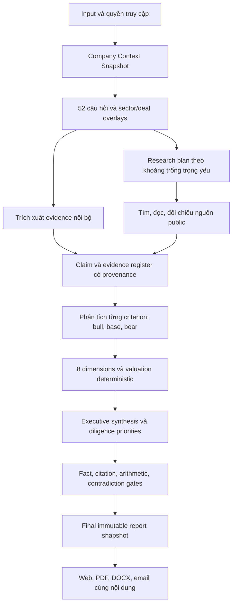

# BlockID.au — SOURCE OF TRUTH: G30 Investor Report Quality & Sale Readiness

**Revision:** G30 / 1.0 — 22/09/2026. **Owner quyết định:** Do Van Long.

**Trạng thái:** `PROPOSED — AWAITING FOUNDER REVIEW`. **Implementation:** `NOT STARTED`.

**Phạm vi đã được giao:** nghiên cứu, đối chiếu source/plan, hợp nhất yêu cầu và viết kế hoạch; **chưa code, chưa migration, chưa deploy, chưa chạy AI tính phí, chưa gửi khách hàng**.

Đây là **kế hoạch chuẩn duy nhất cho đợt nâng cấp tiếp theo của BlockID.au**. Các tài liệu G1–G29 là lịch sử, bằng chứng hoặc đặc tả thành phần; không tạo hàng đợi triển khai độc lập nếu mâu thuẫn với bản này. Các quyết định mới trong G30 là đề xuất chờ duyệt, không phải mô tả tính năng đã có. Việc viết tài liệu không thay đổi cron/runtime hoặc tự cho phép một session khác bắt đầu triển khai. Chỉ chuyển sang `APPROVED` khi founder đồng ý rõ ràng; im lặng không phải phê duyệt.

**Bản lịch sử nguyên vẹn:** [SOT trước G30](../archive/source-of-truth-pre-g30-2026-09-22.md).

**Review đầu vào:** [source/output/design review ngày 22/09](../reviews/2026-09-22-source-output-design-review.md).

**Baseline local:** HEAD `bb0fb53af`, package `3.27.2`, ReportV2 schema `2.0`, pipeline `pipeline-v2.1-s-r3`. Source local, release metadata và live là các snapshot riêng; chưa xác nhận chúng cùng deployed SHA. Baseline phải đóng băng lại khi bắt đầu triển khai.

## 1. Quyết định sản phẩm và goal

### 1.1 Goal duy nhất

Biến Trusted Business Report thành **báo cáo nghiên cứu và thẩm định sơ bộ có giá trị cho investor**, phân tích đúng startup đang xét, trả lời bộ câu hỏi theo tiêu chí, kiểm chứng các nhận định trọng yếu, trình bày nhiều góc nhìn và định giá có cơ sở; kết quả nhất quán trên web, PDF, DOCX và email, được giao đáng tin cậy qua luồng bán hàng hiện có.

Investor cần trả lời được trong khoảng 3 phút:

1. Startup bán gì, cho ai, vấn đề có thật và khách hàng có lý do trả tiền không?
2. Vì sao đáng xem tiếp, vì sao có thể không đầu tư, điều gì có thể làm thay đổi nhận định?
3. Chúng ta biết chắc điều gì; đâu là founder-stated, giả định, thiếu hoặc mâu thuẫn?
4. Giá trị doanh nghiệp được ước lượng theo cách nào, phạm vi hợp lý đến đâu, nhạy nhất với biến nào?
5. Hỏi gì, kiểm tra gì và yêu cầu bằng chứng gì trước bước tiếp theo?

**Đầy đủ** nghĩa là mọi câu hỏi trọng yếu có câu trả lời hoặc trạng thái thiếu/chưa thể xác minh với hành động tiếp theo. Không bắt buộc bịa ra con số hoặc nhận định chỉ để lấp đủ chương.

### 1.2 Khách hàng và phạm vi bán đầu tiên

- **Investor là khách hàng chính**, theo yêu cầu mới nhất; thay ưu tiên programs-first/angels-secondary trong G21. Giữ khả năng cohort cho accelerator, không xóa tính năng đã bán.
- ICP đề xuất để founder review: angel groups/syndicates và quỹ pre-seed–seed tại Australia. Trọng tâm kỹ thuật ban đầu: B2B SaaS/phần mềm; sector khác phải có lens, nguồn và bộ kiểm chứng trước khi quảng cáo cùng độ sâu.
- Founder là chủ sở hữu/người cung cấp dữ liệu, được nhận giải thích và checklist cải thiện. Advisor/accelerator là khách hàng thứ cấp.
- Sản phẩm bán là chất lượng hồ sơ đánh giá và quy trình làm việc; không bán lời hứa AI dự đoán thắng/thua hoặc một con số “đúng tuyệt đối”.
- Tên công khai giữ **Trusted Business Report — by BlockID**; SVI là phương pháp/chỉ số bên trong; Investor Dossier là hồ sơ/workspace chứa báo cáo, không phải một bộ kết luận khác.
- Không mở lại paid pilot/coupon đã bỏ ở G25. Customer validation dùng demo hoặc khách hàng đầu tiên trên SKU hiện hành, không tạo gói pilot mới.

### 1.3 Thứ tự ưu tiên bất biến

1. **P0 sản phẩm:** factual correctness, nguồn, xử lý thiếu/mâu thuẫn, kết luận nhất quán, không biến giả định thành dữ kiện.
2. **P1 sản phẩm:** độ sâu riêng cho startup, research, 13 criteria/52 câu hỏi + các câu hỏi diligence còn thiếu, định giá và investor implications.
3. **P1 vận hành:** khả năng hoàn thành/giao báo cáo, snapshot/cache/version, chi phí có kiểm soát.
4. **P2:** UI theo lớp thông tin, so sánh, xuất báo cáo và trải nghiệm investor.
5. **P2 thương mại:** chứng minh giá trị với buyer thật, packaging/pricing phù hợp chi phí, sale gates.
6. Sau đó mới tới mở rộng Index/API, thêm sector, automation phụ hoặc thay đổi marketing diện rộng.

P0/P1 ở đây là ưu tiên của chương trình, không thay đổi severity của các phát hiện trong review.

## 2. Hiện trạng: giữ gì, sửa gì, chưa được chứng minh gì

| Hạng mục | Bằng chứng trong source/tài liệu | Đánh giá và quyết định G30 |
|---|---|---|
| Quy mô | 382 page routes, 682 API routes, 5.297 file `web/src` ở lượt review | Đủ rộng; không cần xây thêm hệ thống song song để bán báo cáo |
| Báo cáo | `lib/report-v2/schema.ts`, `components/tbr/v2/report.tsx` | Giữ ReportV2 làm nền; UI v3 và schema v2 là hai version khác nhau, không đổi tên chỉ để marketing |
| Free path mới | `lib/analyses/first-analysis/report-v2-job.ts` | G28 đã dùng cùng orchestrator cho hai full reports miễn phí; **giữ**, không hiểu nhầm đây vẫn là PDF cũ |
| Guest paid cũ | `lib/guest-analysis/runner.ts`, Stripe webhook/reconcile | Vẫn có đường chạy legacy và lỗi extraction/delivery; inventory traffic trước khi hợp nhất, giữ tương thích đơn cũ |
| Criteria | `lib/evaluation-criteria.ts`: 13 criteria × 4 guiding questions | Có 52 câu hỏi nhưng chưa có answer/evidence/research status bắt buộc cho từng question ID |
| Dimension | `report-pipeline/dimension-owners.ts`: 8 dimension, 12 growth phases | Giữ taxonomy; tách dimension trình bày khỏi criterion/question dữ liệu, tránh trùng tính điểm |
| Research | `adk/agents/market-research.ts`, `gather.ts:520` | Nhánh market hiện là hai lời gọi model theo general knowledge, không có search/fetch trong nhánh đó; vẫn có connector/website audit khác. Cần research có tài liệu nguồn thực sự |
| Citations | `auto-cite.ts`, `claim-gate.ts`, `report-v2/grounding.ts` | Đã tái hiện trùng số sai metric và model quote tự chứng minh; thay cơ chế kiểm chứng, không chỉ sửa prompt |
| Executive | `investment-view.ts`, structured executive + thesis | G27 cố ý giữ analyst verdict khác rubric; G30 thay bằng một kết luận chính, các giả thuyết phụ có nhãn điều kiện |
| Valuation | `agents/cfo-valuation.ts`, `valuation-chapter.ts` | Có nhiều methods và assumptions table; vẫn có CAC floor 500, GM default 72 và derived metric hiện như fact. Cần provenance ở cấp từng input/output |
| Score/context | `run-report-pipeline.ts` | Deck mới có thể dùng scoring cũ; stream/cache giữ projection trước gates; phải sửa trước khi dùng làm cơ sở investor memo |
| UI | G26 light template, report v3, hai Button implementations | Giữ light/navy; hợp nhất component, copy, trạng thái dữ liệu và disclosure; không redesign palette từ đầu |
| Reliability | G28 timeout/strikes/background budget; G29 open | Giữ mới nhất; capacity + diagnostics + live completion là phụ thuộc thực tế của quality, không chỉ ops phụ |
| Test | Typecheck đạt; 81 file/2.491 test trọng tâm đạt ở review | Bảo vệ contract nhưng chưa chứng minh độ đúng của nhận định; cần golden cases và đánh giá độc lập |
| Buyer validation | `docs/research/evaluator-interviews-2026-09.md` có rollup 0/10 | Có instrument, chưa có bằng chứng phỏng vấn hoàn tất trong file này; không coi task “shipped” là customer validation đã xong |
| Sale readiness | `docs/ops/ready-to-sale.md` thừa nhận real free run chưa kiểm chứng, KPI 0.85 chưa đạt live mới, provider outage | Chưa đủ bằng chứng để gọi mọi advertised path sale-ready; xác nhận lại bằng gates §13 |
| Generated status | `project-state.json`, `implementing-plan.md`, `architecture.md` có version/task cũ | Chỉ là telemetry/history; không được ghi đè kế hoạch này hoặc tự đóng task bằng commit subject |

### 2.1 Đầu ra thật cần dùng làm regression case

Showcase snapshot `136a49f5`, đọc 22/09 khoảng 01:37 UTC, hiển thị generated 21/09:

- SVI index 135 / composite 87, nhiều dimension 100 nhưng evidence confidence 0 và verdict D.
- Có cả “Insufficient evidence” và “Analyst synthesis · Back with conditions”.
- Summary nói margin gần 100%; bảng ghi 72%, CAC A$500, Rule of 40 44; risk nói CAC chưa xác minh.

G28 release notes nói đã sửa band-D summary; quan sát live cho thấy **phải kiểm tra toàn bộ structured summary/reasons/verdict và snapshot cụ thể**, không đóng lại bằng tên commit. Cần phân biệt source đã sửa, report lưu trước sửa và renderer vẫn phát lại nội dung cũ. Không khẳng định mọi report đều lỗi hoặc mọi số trong snapshot đều là default khi chưa đọc input được phép.

### 2.2 Các lỗi review được đưa vào backlog, không mất dấu

| Review | Work item G30 |
|---|---|
| 0a fallback unit economics | V01–V03 |
| 0b recommendation/structured summary conflict | A03, Q02, U01 |
| 1 citation/quote/grounded false positive | E03, A02, Q01 |
| 2 stream vs final report mismatch | F02–F03 |
| 3 deck mới dùng context cũ | F01 |
| 4 cache thiếu context/quality | F03 |
| 5 guest extraction/PDF/delivery | F04, O03 |
| 6 heuristic gắn nhãn Lighthouse | E02, A01 |
| 7 hai Button | U03 |
| 8 design docs xung đột | P01, U03 |

## 3. Hợp nhất plan: luật ưu tiên và quyết định thay thế

Thứ tự: **yêu cầu founder hiện tại → G30 được duyệt → source/runtime có bằng chứng → đặc tả thành phần tương thích → tài liệu lịch sử**. Source cho biết đã có gì, không tự chứng minh đã đúng. Quyết định mới hơn chỉ thay phần thực sự mâu thuẫn; các entitlement, consent và hành vi tốt đã có phải được giữ.

| Plan/contract | Giữ | Thay thế/điều chỉnh trong G30 |
|---|---|---|
| G13/ReportV2 | Một document, 8 dimensions, ownership, gather/score/report | Thêm question/claim/source graph và immutable finalized artifact; các entry path cùng contract |
| G19 | Ledger, pending ≠ zero, valuation methods, synthesis | Không dùng mục tiêu ≤1.300 từ cho toàn bộ report; chỉ cap executive. “Ít pending” không là KPI vì dễ thưởng cho bịa dữ liệu |
| G20 | Feature inventory, entitlement/purchase E2E, hide unfinished | HTTP 200/green UI không đủ sale-ready; thêm content/value/reliability gates |
| G21 | Evidence governance, corrections, benchmark-N, org isolation, cohort | Investor là primary buyer; programs-first bị thay. Bỏ lại paid pilot là trái G25 |
| G22 | Retention/export, validation ledger, regression | Manual counter cần bằng chứng nguồn; generated status không là authority |
| G23–G24 | Audit logs, readable citations, demo exclusion | `groundedShare ≥0.85` chỉ là chỉ số tương thích, không phải release gate chất lượng; unknown citation phải lộ lỗi, không im lặng biến mất |
| G25 | Hai full reports miễn phí/email, review trước Pay, bỏ pilot/coupon | Không đổi quota/giá trong đợt lập plan. Capacity cho production đánh giá theo chất lượng/chi phí, không mặc định free chain luôn đủ |
| G26 | Light surfaces, navy action, cyan-muted `#0e7490`, accessible primitives | Hợp nhất Button; supersede MASTER dark/teal. G27 ghi cyan `#0891B2` không thắng token contrast mới hơn |
| G27 | Dashboard, investment view, valuation, 8 chapters, risk/plan, EN/VI, PDF/DOCX | Báo cáo nhiều lớp; một final recommendation; không gán xác suất risk từ thiếu evidence; không xếp ưu tiên chỉ bằng SVI lift |
| G28 | Same full report free path, stage timeout/strikes, background budget, print/band demo | Audit nội dung cuối và thêm golden tests; không giảm điều kiện fact-check để đạt KPI |
| G29 A/B | Dead-rung pruning, capacity alerts, degraded diagnostics | Hấp thụ vào O01–O02, cần sớm để chạy quality eval thật |
| G29 C | Real free run, persona copy, mobile fixed controls | Hấp thụ O03/U03/S01. CSP phải chẩn đoán script/tác động; không allowlist chỉ để test xanh |
| G29 D | Index movers đúng dấu, new không phải -99%, sample label | O04, sau report blockers; không kéo dài critical path nếu ẩn bề mặt chưa đạt |
| G1–G18/roadmaps cũ | Những capability đã dùng và history | Không mở lại blockchain, marketplace, reseller expansions, ES/JA, extra agents trong critical path này |

G19–G28 vẫn giữ trạng thái **historically shipped**. G29 residuals đã được chuyển thành work items trong plan; không giả vờ chúng đã xong. Việc bắt đầu thực hiện G30 còn chờ duyệt.

## 4. Nghiên cứu bên ngoài và cách áp dụng

Nguồn được mở/kiểm tra ngày 22/09/2026. Đây là nền tham khảo cho thiết kế, không phải tuyên bố BlockID được chứng nhận hoặc thay thế analyst/valuer.

| Nguồn gốc | Điều áp dụng cho sản phẩm | Giới hạn |
|---|---|---|
| [CFA Institute — Equity Valuation: Applications and Processes, 2026](https://www.cfainstitute.org/insights/professional-learning/refresher-readings/2026/equity-valuation-applications-and-processes) | Phân biệt facts/opinions, assumptions rõ; analysis/forecast/valuation/recommendation nhất quán; đủ thông tin để người đọc phản biện | Học cấu trúc research, không sao chép stock price target cho startup thiếu dữ liệu |
| [IPEV Guidelines — December 2025](https://www.privateequityvaluation.com/Portals/0/Documents/Guidelines/2025%20IPEV%20Valuation%20Guidelines.pdf) | Chọn kỹ thuật phù hợp, calibration theo giao dịch có liên quan, so sánh đúng đặc tính, ngày định giá và judgement; AI không thay professional judgement | Bản 2025 thay bản 2022, áp dụng kỳ báo cáo bắt đầu từ 01/04/2026. Là fair-value guidance, không biến report screening thành formal valuation |
| [Bessemer — Shopify investment memo](https://www.bvp.com/memos/shopify) | Deal context, thesis, kinh tế mô hình, cơ hội tăng trưởng và rủi ro cụ thể cùng một lập luận | Memo lịch sử để học cách phân tích; không lấy số lịch sử làm benchmark 2026 |
| [Angel Capital Association — Due Diligence Playbook](https://www.angelcapitalassociation.org/data/Documents/Members%20Only/BestPractices/E3e%20-%20Due%20Diligence%20Checklists%20and%20Reports/Due_Diligence_Playbook_Generic_with_Appendices.pdf) | Research/review và deal memo cần customer/reference checks, contracts, financials, cap table và IP | Playbook lịch sử, checklist phải thích nghi AU và stage |
| [Cut Through Venture — State of Australian Startup Funding 2025](https://www.cutthrough.com/insights/state-of-australian-startup-funding-2025) | Cập nhật bối cảnh nguồn vốn AU; mỗi statistic phải đọc đúng bảng, mẫu và thời kỳ | Không suy valuation từ funding amount; không giả định report có median cho mọi sector/stage |
| [ASIC — RG 244](https://www.asic.gov.au/regulatory-resources/find-a-document/regulatory-guides/rg-244-giving-information-general-advice-and-scaled-advice) | Tách factual information, general advice, personal advice khi chọn lời kết luận và scope bán | Label/disclaimer không tự giải quyết phân loại dịch vụ; wording/scope cụ thể cần reviewer phù hợp trước public sale |

**Suy luận thiết kế của G30:** lợi thế bán hàng là analyst workflow có evidence và reviewability, không phải số lượng agent/chapter. External research phải chứng minh liên quan đến startup và tác động lên investment case, không trở thành phần “industry overview” chung chung.

## 5. Hợp đồng đầu vào: biết startup nào trước khi phân tích

Mỗi run đóng băng một **Company Context Snapshot**:

- Tên pháp lý/brand/domain, country/jurisdiction, ABN nếu có; không ghép công ty trùng tên chỉ vì search result.
- Mô hình kinh doanh, sector/subsector, buyer/user, geography, product maturity, revenue model, vòng gọi vốn; company stage không suy chỉ từ lịch sử funding hoặc độ dài deck.
- Input gốc, danh sách tài liệu/phiên bản, file hash, extracted pages/cells/sections, extraction warnings, ngày ghi nhận và thời kỳ số liệu.
- Founder answers theo question ID; tài liệu nào là mới, thay thế bản nào, quyền truy cập thuộc founder/evaluator/org nào.
- Investor lens tùy chọn: sector/stage/geography/check-size/mandate. Fit với mandate là lớp riêng, không sửa facts hoặc SVI toàn cục của startup.
- Ask/raise/currency/basis, current cash/debt/convertibles khi có; không suy dữ kiện không được nêu.

**Extraction gates:** OCR khi cần, đo trang đọc được/không được, giữ bảng và đơn vị; không cắt âm thầm 8.000 ký tự. Dùng chunk theo cấu trúc + retrieval trong toàn bộ tài liệu. Nếu extraction không đủ, trả `needs_input` có trang/vấn đề cần sửa. Website unreachable không được coi URL là business description đủ dùng.

**Privacy của research:** query public không chứa nội dung bí mật của deck, email khách hàng, token hoặc tên chưa công bố; lấy thuật ngữ sản phẩm/sector được phép. Private evidence chỉ đi tới provider được phê duyệt trong processing contract. Không tự liên hệ founder, reference hoặc customer; report sinh request/checklist để người có quyền thực hiện.

## 6. Criteria và câu hỏi: 13 tiêu chí, 52 câu hỏi, 8 chiều tổng hợp

### 6.1 Một bảng hỏi có version, không thêm bộ câu hỏi cạnh tranh

Giữ 13 keys trong `evaluation-criteria.ts`; gán stable ID `criterion_key.q1..q4` cho 52 guiding questions theo thứ tự hiện tại. Câu hỏi thay nội dung phải có rubric version/mapping lịch sử. Các câu hỏi bổ sung dùng `criterion_key.x...`; không xóa dữ liệu cũ và không bắt founder nhập lại câu đã được đọc từ deck.

Mỗi question phải có: question ID/text/version, applicability + lý do, founder answer, extracted answer, research answer, claim IDs, sources, status, conflict, analyst implication, follow-up request và reviewer state. Trạng thái: `answered`, `partially_answered`, `missing`, `conflicting`, `not_applicable`. “Đã trả lời” khác “đã xác minh”.

### 6.2 Coverage matrix bắt buộc

Q1–Q4 dưới đây là bản diễn giải tiếng Việt của câu hỏi source, không phải đổi schema trong turn này.

| Criterion → primary dimension | Q1–Q4 hiện có | Research/đối chiếu cần làm | Kết luận investor cần nhận |
|---|---|---|---|
| `idea` → MPC | Vấn đề gì? Khác giải pháp hiện có? Insight/lợi thế? Đã validate với khách hàng? | Đối chiếu pain, workflow, alternatives/status quo, demand; customer proof phải từ evidence được phép | Vấn đề đáng giải quyết không, cấp thiết đến đâu, insight có được kiểm chứng? |
| `market` → MPC | TAM? SAM? Vì sao lúc này? Đối thủ chính? | Bottom-up ICP × spend; địa lý/timeframe; direct/indirect competitors, pricing, substitutes, tailwind/headwind | Thị trường tiếp cận thực tế, competition và điều kiện để chiếm thị phần |
| `founder_profile` → FTV | Kinh nghiệm liên quan? Đã làm chung? Domain expertise? Startup/exit trước? | Public profile đúng người, hồ sơ/nguồn cho claim; reference là pending nếu chưa làm | Founder-market fit, khả năng thực thi, key-person risk; không suy năng lực từ danh tiếng hay yếu tố nhạy cảm |
| `code_git` → PTD | Repo? Tech stack? Automated tests? Contributors? | Repo được cấp quyền, kiến trúc, vận hành, phụ thuộc vendor/model, IP/license; test presence ≠ coverage/quality | Maturity, khả năng mở rộng, technology risk, moat thực; non-software có lens thay thế |
| `website` → PTD | URL? Mobile app? Traffic? Conversion? | Website/product thực, pricing/app store; traffic từ nguồn đo; conversion đúng numerator/denominator/window | Product reality, distribution signal; website đẹp không chứng minh traction |
| `team` → FTV | Bao nhiêu người? Vai trò đã có? Vai trò thiếu? Hiring 12 tháng? | Full-time/contractor, capacity, cost/runway, key gaps; xác minh từ roster/evidence | Team có thể thực hiện milestone với nguồn lực hiện tại không? |
| `customer_size` → TRE | Active users/customers? Growth? Engagement? Retention? | Tách signup/session/active/paying/logo; cohort retention/churn, concentration, customer references khi được phép | Chất lượng traction, repeatability, risk do phụ thuộc khách hàng, dấu hiệu PMF có giới hạn |
| `gtm_strategy` → MPC | Channels? Pricing? CAC? Scale acquisition? | Competitor pricing, sales cycle, pipeline stages, channel experiments; CAC và payback có đủ cost/cohort | Khả năng bán lặp lại, cost of growth, sales bottleneck và economics |
| `documents` → IRI | Deck? Financial model? One-pager/business plan? Legal docs? | Consistency giữa deck/model/contracts; ngày/version/signature; phân biệt existence với adequacy | Material discrepancies, information quality và danh sách diligence trước IC |
| `dataroom` → IRI | Có data room? Tài liệu nào? Phân loại? Cập nhật khi nào? | Coverage theo stage, quyền truy cập, freshness, missing signed records | Investor cần thêm gì trước quyết định; nhiều file không tự làm điểm tốt |
| `team_structure` → FTV | Org chart? Advisory board? Trách nhiệm? Board cadence? | Quyền quyết định, shareholder/option/vesting, cap table fully diluted, conflicts/related party | Governance, control, alignment, dilution; đưa phân tích sang CGH mà không tính trùng |
| `roadmap` → SVM | Milestones 3–6 tháng? Vision 12 tháng? Prioritisation? Dependencies? | Competitor pace, technical/regulatory dependencies, milestone cost, lịch sử deliver | Feasibility, use-of-funds, catalyst/de-risking và moat theo thời gian |
| `revenue` → TRE | MRR/ARR? Growth? LTV/CAC/margins? Profitability? | Transaction/accounting evidence, refunds/tax/currency, recurring vs one-off, cost/burn/runway | Revenue quality, unit economics, financing need và input định giá có kiểm chứng |

### 6.3 Các câu hỏi bổ sung bắt buộc theo applicability

Không có criterion primary CGH/LCO trong 13 keys hiện tại; câu hỏi bổ sung phải lấp khoảng trống diligence, không thêm hai chương tự chấm từ generic prose.

| Nhóm/namespace | Câu hỏi bổ sung | Dimension dùng |
|---|---|---|
| `team_structure.x_equity` | Ai sở hữu bao nhiêu trên fully diluted basis? Options/SAFE/notes? Vesting? Quyền kiểm soát và approvals? | CGH |
| `documents.x_legal` | Entity/IP thuộc ai? IP assignment đã ký? Hợp đồng trọng yếu/license/regulatory requirements? Tranh chấp/material liabilities được disclose? | LCO, CGH |
| `revenue.x_cash` | Cash, debt, burn, runway và thời kỳ? Revenue recognition? Customer concentration? Financial source reconciliation? | TRE, IRI |
| `roadmap.x_raise` | Raise bao nhiêu, instrument/terms nào, dùng vào milestones nào, vốn đủ tới đâu? Kịch bản down-round/dilution? | IRI, SVM |
| `idea.x_moat` | Vì sao khách hàng chọn và tiếp tục dùng? Switching cost/data rights/network effects có evidence gì? Đối thủ phản ứng ra sao? | SVM, MPC |
| `market.x_sector` | Quy định, seasonality, reimbursement/procurement, hardware lead times, capex hoặc sector-specific drivers có áp dụng không? | MPC, LCO, PTD |

Hiển thị đầu tiên **5–10 follow-up quan trọng nhất**, theo khả năng thay đổi kết luận và thiếu evidence; toàn bộ checklist vẫn mở được. Không bắt người dùng điền 52 ô trước khi nhận giá trị ban đầu.

### 6.4 Một phân tích criterion có giá trị phải chứa gì

Mỗi criterion mở rộng có cùng anatomy:

1. **Assessment:** nhận định riêng cho startup, mức độ chắc chắn và giới hạn.
2. **Câu hỏi/đáp án:** Q1–Q4 + extras áp dụng, có status và source cho từng câu.
3. **Điều đã biết:** facts và founder-stated tách rõ, time window/currency/entity.
4. **Research bên ngoài:** nguồn đã đọc, liên hệ với startup, đồng thuận và phản chứng.
5. **Strengths và bear case:** vì sao tốt, điều gì có thể làm nhận định sai, điều kiện cần kiểm tra.
6. **Investor implication:** ảnh hưởng đến go/no-go-next-step, valuation assumption, deal structure hoặc diligence.
7. **Evidence gaps & next request:** tài liệu/câu trả lời chính xác, người cung cấp, mức materiality, deadline nếu biết.
8. **Score explanation:** signals/weights và confidence khi applicable; generic benchmark không được giả thành evidence startup.

Nhiều dimension có thể tham chiếu một criterion; question/evidence lưu một lần, có cross-link, không lặp cả đoạn hoặc cộng trọng số hai lần. Criterion weights hiện tổng 100 và dimension weights là lớp khác: giữ formula hiện hành tới khi A01 hiệu chỉnh/migration được duyệt, không cộng hai lớp tùy tiện.

### 6.5 Ví dụ chất lượng đầu ra mong muốn — dữ liệu giả để minh họa

**Case giả:** một B2B SaaS cho phòng khám AU. Founder khai “MRR A$12.000”; bảng billing cùng kỳ cho A$9.000 recurring subscriptions và A$3.000 setup fees. Chưa có acquisition spend, gross-margin costs hoặc cap table. Đây không phải dữ liệu một khách hàng thật.

**Criterion `revenue`:**

- **Assessment:** đã có dòng recurring revenue trong kỳ được cung cấp, nhưng claim MRR cần chỉnh định nghĩa. A$3.000 setup không được annualise như subscription. Chưa đủ dữ liệu kết luận customer economics bền vững.
- **Q1 MRR/ARR:** nếu billing scope được reconcile đầy đủ, MRR A$9.000; annualised run-rate A$108.000, ghi rõ đây không phải trailing-12-month recognised revenue. Source là billing table/cell và kỳ, không phải lời model.
- **Q2 Growth:** missing nếu chưa có kỳ trước tương đương; không suy từ số khách tổng.
- **Q3 Economics:** CAC/GM/LTV chưa tính được vì thiếu spend/COGS/cohort retention. Không điền CAC 500, GM72 hoặc LTV24 tháng mặc định.
- **Q4 Profitability:** cần cash, burn, recurring/nonrecurring cost và kế hoạch; không đồng nhất gross margin với EBITDA margin.
- **Bull case:** subscription base tạo nền cho doanh thu lặp lại; chỉ mạnh hơn khi retention/collections được chứng minh.
- **Bear case:** setup fees đang làm headline recurring revenue cao hơn thực tế; thiếu cohort và cost data khiến giá trị mỗi khách chưa xác định.
- **Investor implication:** revenue-multiple model phải dùng đúng recurring base sau reconciliation; chưa nên trả premium dựa trên unit economics. Muốn đưa khoảng định giá phải có comparable phù hợp, không tự gán multiple từ ví dụ này.
- **Follow-up:** billing export 6–12 tháng, refunds/cancellations, cohort retention, acquisition spend theo kênh và costs cùng kỳ.

**Research `market` của cùng case:** xác định đúng practice type/buyer và geography; đọc nguồn số lượng cơ sở phù hợp, competitor pricing và khả năng tích hợp workflow. Kết luận phải nối tới sales cycle, switching friction và attainable market của startup này. Không dùng tổng healthcare spend làm TAM phần mềm, không lấy doanh thu/khách hàng của đối thủ thành dữ kiện startup.

Ví dụ này là chuẩn về cách lập luận và xử lý thiếu thông tin; không phải một template để chép số sang report khác.

## 7. Research theo startup: từ câu hỏi tới nguồn và nhận định

### 7.1 Pipeline đề xuất

Đây là thiết kế kiến trúc đề xuất; không phải sơ đồ mô tả toàn bộ source đã triển khai.

### 7.2 Research task contract

Mỗi task chứa: criterion/question IDs, hypothesis cần kiểm tra, company context, query plan, allowed sources, ngày cutoff, budget, result/counter-evidence, status (`found`, `not_found`, `blocked`, `stale`, `conflicting`), source IDs và implication. Log “đã tìm nhưng chưa thấy” phải có query/time/source scope, không suy “không tồn tại”.

Các workstream:

- **Market/customer:** ICP, buyer budget/workflow, bottom-up sizing, adoption barriers, macro/sector drivers.
- **Competition:** direct, indirect, status quo; pricing/features/distribution; đối chiếu company claims với chính sản phẩm/tài liệu đối thủ. Target 3–5 alternatives khi đủ nguồn, không chế tên để đủ số.
- **Team/entity:** đúng người/pháp nhân, career claims, filings có liên quan; dữ liệu public chỉ chứng minh điều nguồn thật sự nói.
- **Product/technology:** live product, repo được cấp quyền, independent references và constraints. Không cần repo để đánh giá startup không phải phần mềm.
- **Financial/valuation:** comparable transactions có amount/type/date/instrument rõ, metrics tương đồng, FX/date, stage; filing/company release/nguồn nghiên cứu có methodology.
- **Legal/sector:** official regulator/register; xác định câu hỏi cần specialist, không tự kết luận tuân thủ từ có trang privacy.

### 7.3 Source policy

- Ưu tiên hồ sơ gốc, connector nội bộ được phép, regulator/statistics, company filing/product/pricing; secondary reporting dùng corroboration. Company website đáng tin về giá niêm yết của chính họ, không độc lập chứng minh họ “market leader”.
- Không coi search snippet, AI summary hoặc đoạn model sinh là evidence gốc. Phải fetch/read nguồn; không truy cập được thì ghi rõ.
- Chỉ lưu excerpt cần thiết + URL/file locator/hash, không sao chép toàn bộ tài liệu bị hạn chế. Có retrieval timestamp, publication/observation date, original publisher, source family, permission và redaction.
- Độc lập nguồn dựa trên nguồn gốc: hai bài dẫn lại một press release không tính thành hai confirmations.
- Claim trọng yếu có thể dùng một authoritative source; otherwise tìm corroboration độc lập khi khả thi. Không hạ chuẩn hoặc bịa nguồn để đạt quota.
- Freshness theo metric: revenue/cash tới kỳ tài chính liên quan; pricing/competitor trạng thái gần ngày chạy; legal reference bản có hiệu lực tại cutoff; comps theo window có giải thích. Dùng cấu hình theo loại claim, không một TTL duy nhất.
- Mốc **30 ngày cho competitor pricing, 90 ngày cho commercial facts, 12 tháng cho market benchmark** là default đề xuất để thử nghiệm, không là sự bảo đảm phù hợp mọi ngành. Item quá hạn có nhãn và ảnh hưởng eligibility/confidence.
- Reference không được kéo số ở các ngày/entity/currency khác vào một claim. “Nguồn mới hơn” không tự thắng nguồn đúng kỳ đo cũ hơn.

### 7.4 Budget và phân tầng độ sâu

Một research plan có call/time/spend ceiling; ưu tiên câu hỏi có khả năng thay đổi assessment/valuation. Tái dùng public research cùng sector/time scope, nhưng không cache chéo private evidence. Retry có giới hạn; hết budget trả partial scope và missing requests, không silently đổi thành general knowledge mà vẫn gọi “researched”.

**Không buộc làm xong research sâu trong 60 giây.** Intake cho preview đã gắn provisional; full report chạy background, có progress và thông báo khi finalized. SLA chỉ công bố sau khi đo P50/P95 trên corpus; đề xuất vận hành ban đầu ở §13.

## 8. Truth contract: claim, evidence, confidence và quality

### 8.1 Provenance ở cấp nhận định

Khái niệm cần có trong schema kế tiếp (tên bảng/type chốt lúc thiết kế kỹ thuật, chưa tạo trong turn này):

| Đối tượng | Field tối thiểu |
|---|---|
| `SourceRecord` | source ID, project/org visibility, URL/file/page/cell/span, publisher, hash/version, publication/observed/retrieved times, source class, permission |
| `ClaimRecord` | claim ID, entity, metric/value/unit/currency, period, scope, qualifiers, criterion/question IDs, source refs, status, contradiction group |
| `ResearchFinding` | question/hypothesis, supporting/refuting claims, method, limitations, implication, research completeness |
| `CriterionAssessment` | answers, judgment, pros/cons, alternatives, next checks, input claim IDs, reviewer state |
| `ValuationInput` | metric/value/unit/date, actual/derived/assumed/missing, source IDs/formula, applicability và sensitivity |
| `ReportSnapshot` | report ID, input/evidence fingerprint, as-of, methodology/schema/prompt/model/research versions, quality gate results, immutable final payload |

### 8.2 Các trục dữ liệu phải tách nhau

- **Claim support:** `founder_stated`, `source_supported`, `reviewer_verified`, `derived`, `assumption`, `unsupported`, `conflicting`.
- **Availability/freshness:** present/missing/stale/blocked/not-applicable.
- **Source type:** self declaration/public document/upload/connector/transaction/reviewer.
- **Business assessment:** strengths/risks/maturity/value; không bị đánh đồng với số file tải lên.
- **Research completion:** câu hỏi đã investigate được bao nhiêu, khác evidence confidence.

Không gọi confidence là xác suất đúng hoặc xác suất startup thành công. Nếu tiếp tục hiển thị phần trăm từ evidence ladder hiện có, phải ghi đó là chỉ số nội bộ có formula/version và giải thích denominator; coverage theo question, source support và business verification hiển thị riêng. Không tự tạo phần trăm từ cảm nhận của model.

Giữ mapping từ claim states/evidence ladder cũ theo `score-governance.md`, migrate có version. `reviewer_verified` chỉ có khi người có trách nhiệm thật sự kiểm tra với audit trail; model không tự nâng lên mức này. Connector chỉ hỗ trợ những metric nó thật sự có, không tăng độ tin cậy mọi câu khác trong report.

### 8.3 Citation verification

Chuỗi bắt buộc: **ID tồn tại → excerpt có thật → claim nói đúng nội dung → entity/metric/unit/period khớp → quyền truy cập hợp lệ → hiển thị qualifier**. Matching con số hoặc citation count không đủ. Quote model viết không vào nguồn kiểm chứng trước khi đối chiếu source.

Verifier độc lập với writer; rule engine kiểm số/đơn vị/phép tính, verifier kiểm entailment và phản chứng. Bất đồng hoặc mức không chắc cao chuyển reviewer/needs-evidence, không “vote đa số agent”. Claim quan trọng trong dashboard/executive/valuation phải qua cùng gates như appendix. Assumptions không được tính là verified chỉ vì có nhãn “ước tính”.

### 8.4 Kết luận đa chiều nhưng không mâu thuẫn

- Một final **assessment status**: `insufficient_evidence`, `material_concerns`, `conditional_next_step`, `supports_further_diligence` — wording đề xuất cho bước screening, không trực tiếp “buy/invest now”. Có thể giữ A–D alias trong compatibility layer nhưng nhãn mới cần legal/product review.
- Mỗi criterion có bull case, bear case, các điều kiện làm thay đổi nhận định; tổng hợp ưu tiên 3–5 yếu tố quyết định. Không làm mọi risk đều “high”.
- Investor mandate-fit, business quality, evidence sufficiency và valuation confidence là bốn góc khác nhau. Fit xấu với quỹ A không chứng minh startup kém.
- Risk có **impact**, **likelihood** (chỉ khi có cơ sở, nếu không `unknown`), **evidence confidence**, **mitigation**, **residual risk**, **trigger**. Thiếu evidence không tự thành xác suất thất bại cao.
- Điểm SVI 135 không hiển thị cạnh “/100”; composite 0–100 chỉ trình bày khi có assessed coverage và explanation. Không để average cao che thiếu CGH/LCO quan trọng.
- Prioritise follow-up theo materiality × decision sensitivity × evidence gap × effort; expected SVI lift chỉ là thông tin phụ, không là mục tiêu tối ưu của investor report và không được cộng thành “sẽ tăng định giá”.

## 9. Valuation: phạm vi đúng, phương pháp phù hợp, có thể phản biện

### 9.1 Output valuation bắt buộc

1. **Basis/date/currency:** operating enterprise value hay equity value; pre-money hay post-money; loại instrument/share rights; measurement date.
2. **Input table:** actual/founder-stated/derived/assumed/missing; đơn vị/kỳ đo/source. Không dùng zero thay missing.
3. **Method eligibility:** methods chạy/không chạy và lý do; không buộc mọi startup có 7 methods.
4. **Method outputs:** low/base/high, assumptions, sensitivity, relevance; có thể chỉ có scenario range khi evidence yếu.
5. **Reconciliation:** phương pháp chính và cross-check, weights có lý do khi dùng; không lấy trung bình các method cùng dựa một stage anchor rồi gọi đồng thuận độc lập.
6. **Ask/terms cross-check:** ask founder không đi vào base valuation để tự chứng minh “aligned”. Hiển thị chênh lệch và các điều kiện/terms cần biết.
7. **What changes the range:** 3–5 biến quan trọng, điểm dữ liệu nào thu hẹp uncertainty, risk nào làm giảm giá trị.
8. **Investor economics:** ownership/dilution/use-of-funds/runway khi có đủ terms; scenario, không guaranteed return hoặc success probability.

### 9.2 Chọn phương pháp theo dữ liệu

| Trường hợp | Phương pháp chính/cross-check đề xuất | Không làm |
|---|---|---|
| Idea/pre-revenue | Milestones/Berkus hoặc scorecard có regional reference đủ nguồn, recent financing nếu phù hợp; scenario ngưỡng vốn/milestone | DCF từ revenue tưởng tượng, stage baseline thành fair value chắc chắn |
| Revenue sớm | Revenue-quality analysis + comparable revenue multiples khi metrics tương thích; milestone/transaction cross-check | ARR = one-off sales ×12; lấy GMV làm net revenue; SaaS multiple cho mọi ngành |
| Revenue trưởng thành | Revenue/earnings comparables, DCF khi forecast/cashflow/cost-of-capital có cơ sở; sensitivity | DCF chỉ là revenue × multiple nhưng mang tên DCF |
| Recent round | Calibration theo instrument/rights/date/company change | Funding amount = valuation, round price cũ = giá hiện tại |
| SAFE/note/preferred | Scenario conversion và dilution có terms rõ; flag specialist nếu terms phức tạp | SAFE cap = equity value, post-money = pre-money + raise trong mọi capital structure |
| Không đủ input | `not_estimable` hoặc illustrative scenarios tách riêng, requests để mở phương pháp | Bịa mid valuation để card không trống |

### 9.3 Rules tính toán và benchmark

- Bỏ default CAC/GM giả thành actual; CAC xác minh A$100 giữ A$100. Gross margin, contribution margin, EBITDA/cash margin là khác nhau.
- LTV cần định nghĩa contribution/gross margin, retention/churn cohort/window; runway cần cash + burn đúng kỳ. Nếu denominator không hợp lệ/thiếu, không tạo ratio giả.
- Enterprise-to-equity bridge hiển thị cash/debt và claim adjustments; raise mới không cộng vào pre-money. FX có source/date.
- Bull/base/bear dựa trên driver scenarios; không chỉ nhân arbitrary ±% quanh mid. Probability chỉ có khi có cơ sở và được review.
- Comparable log chứa accepted/rejected + lý do, stage/sector/geography/date, transaction type, metric basis, n, range, outliers. Headline fundraise không đủ làm comparable valuation.
- Giữ benchmark publication rules hiện có: n<10 không percentile; 10–29 indicative; 30–99 basic; ≥100 segmented **chỉ khi từng comparison group đủ điều kiện**, không lấy tổng dataset thay subgroup n. Đây là quy tắc sản phẩm hiện hành, không chứng minh đại diện thống kê.
- Static stage anchor là reference đã ghi nguồn/version, không gọi observed peer cohort. Rank calibration N=49 không chứng minh valuation accuracy hoặc khả năng dự đoán thành công.
- Chưa tự thay weights/formula SVI trong đợt này. Nếu A01 chứng minh saturation/keyword bias, tạo version methodology với backtest, migration và side-by-side history; ưu tiên sửa nội dung/coverage ngay mà không âm thầm đổi điểm cũ.

## 10. Báo cáo investor: sâu khi cần, nhanh khi đọc lần đầu

### 10.1 Ba lớp thông tin của cùng một document

| Lớp | Nội dung mặc định | Cách đọc |
|---|---|---|
| **L1 — Decision brief** | Identity/as-of/scope; business & customer; assessment + conviction basis; 3 reasons/3 material risks; valuation range hoặc not-estimable; top diligence requests | 1–2 trang PDF hoặc một màn hình dài có cấu trúc; khoảng 600–900 từ là editorial target, không cắt qualifiers |
| **L2 — Investment analysis** | Business model, market/competition, traction/revenue, team/product/governance, valuation/terms, bull/base/bear, 90-day de-risking | 8 dimension chapters, mỗi chapter 150–300 từ tổng hợp mặc định; không bắt số từ khi insufficient |
| **L3 — Criterion & evidence detail** | 13 criteria, 52 answer records + overlays; sources/research; score ledger; assumptions/formulas; conflict & audit log | Expand theo criterion hoặc click nguồn; deep links và search; không buộc đọc toàn bộ trước L1 |

PDF/DOCX cung cấp **Brief** và **Full with appendix** từ cùng snapshot; email ngắn có key decision, scope/limits và secure link. Không tự sinh lại narrative cho export. Chi tiết bị collapse trên web vẫn nằm trong full export khi được entitled.

Độ sâu và correctness không được paywall khác nhau: bản preview có thể giới hạn số chương, nhưng mọi con số/claim nó hiển thị phải đạt cùng truth rules. Hai full report grants giữ nội dung standard hiện có; scope research được nêu rõ, không bí mật giảm quality.

### 10.2 Anatomy màn hình

- Header: company/legal identity, stage, jurisdiction, data cutoff, report version, review state và investor lens nếu có.
- Hàng tóm tắt: **assessment status**, **evidence coverage/confidence**, **valuation basis/range**, **next diligence step**. SVI ở vai trò supporting metric có explanation.
- Bên dưới: thesis + bear case; “what would change our view”; contradictions chưa giải quyết đặt gần kết luận, không chỉ appendix.
- TOC tới 8 dimensions/13 criteria; hiển thị câu hỏi đã answered/missing/conflicting. Expanded state có thể share bằng anchor, không share private evidence quá quyền.
- Click citation mở nguồn/excerpt/page/time và claim supported; nguồn không được phép xem hiển thị hạn chế đúng, không leak tài liệu.
- So sánh report versions: thay đổi facts, sources, assumptions, score, judgment; phân biệt business progressed với methodology changed.
- Call-to-action investor: request evidence, add diligence note, compare, export brief, share theo quyền. Founder: supply evidence/correct fact; không ép investor đi qua 12-phase founder journey.

### 10.3 Design system duy nhất

Giữ G26: white/soft-grey, navy action, cyan-muted `#0e7490`, semantic status + icon/text; Inter body, mono cho số liệu. Display font hiện có chỉ dùng trong scope đã định, không thêm font.

Một Button/Field/Card/Table/Badge/Modal; size và focus/loading/error nhất quán. Wrapper cũ chuyển tiếp có deprecation, không thêm third implementation. Container có variant rõ marketing/workspace/report; typography 16px body, 14px secondary, tối thiểu 12px caption; numeric columns căn phải, units rõ.

Verify 375/768/1440px, keyboard, reduced motion, contrast, table overflow có kiểm soát, print page breaks/heading-with-content; fixed cookie/feedback UI chung một vùng để không đè primary action. Chiều sâu report giải quyết bằng progressive disclosure, không bằng font nhỏ hơn.

## 11. Kiến trúc triển khai và bảo toàn dữ liệu

### 11.1 Chuyển dần, không rewrite toàn ứng dụng

Mở rộng ReportV2 có version/compatibility envelope, validator và adapter rõ. Nếu schema change phá compatibility, dùng successor schema có migration thay vì giữ literal `2.0` cho payload không tương thích. Schema version, methodology version, prompt version, provider/model version và UI presentation version tách nhau.

Pipeline đề xuất: normalize input → extraction quality → question plan → research/evidence → criterion assessment → score/valuation deterministic → executive → **audit tất cả field sẽ render** → final snapshot → persist → derive surfaces → delivery.

- SSE chỉ là provisional progress. Final event phải mang report ID/version hoặc final payload sau gates; client thay projection preview.
- Mọi legacy dim_results/cache/email derivation lấy từ final snapshot, không từ event trước gates.
- Key cache gồm full input hash, evidence/source snapshot, user/org/project scope, research cutoff/TTL, locale, tier/scope, schema/methodology/prompt versions. Không dùng 8K prefix làm danh tính input.
- Deck mới rebuild context/signals theo run; không ghép raw text mới với analysis cũ mà không provenance.
- Report snapshot immutable; correction tạo revision mới, giữ report cũ với timestamp và correction notice. Không silently rewrite valuation đã gửi để che lỗi.
- Stored historical report không thể tự trở thành verified khi đổi renderer. Dùng `legacy_unverified`/compatibility badge nếu thiếu traceability; regeneration có quyền/chi phí riêng.

### 11.2 Job và delivery contract

`queued → extracting → researching → analysing → validating → finalized | needs_input | failed`; delivery riêng `pdf_pending/ready/failed`, `email_pending/accepted/bounced/failed`, page access riêng. `partial` là scope/quality của nội dung, không đồng nghĩa infrastructure failed.

Idempotent job claim + lease, bounded retry, cancel/resume, không charge lại vì provider retry. `delivered` phải có định nghĩa theo artifact/channel; email provider accepted không được công bố là recipient đã đọc/nhận inbox. Nếu PDF hỏng nhưng web dùng được, hiển thị rõ và retry PDF thay vì gọi generation lại.

Paid order fail không consume quota/charge final report ngoài policy đã công bố; nếu payment thu trước, phải có retry/refund/credit path audit được. Review/Pay step G25 giữ nguyên. Legacy guest order tiếp tục resolve/download được trong migration.

### 11.3 Provider và chi phí

G29 dead-model pruning, provider-level unfunded, circuit breaker, strike ledger, deadline stage, degraded diagnostics được giữ. Mỗi run log success/failure và cost; failed runs không biến mất khỏi mẫu completion/quality.

Chọn writer/verifier theo kết quả corpus, có fallback đã vượt cùng gates. Không hạ verification khi chuyển sang provider rẻ. Ít nhất hai đường capacity độc lập đã smoke-test trước sale tự phục vụ; một đường funded phù hợp tải kỳ vọng. Không quyết định nhà cung cấp/model chỉ vì free hay tên mới.

Trước triển khai research live: founder duyệt ngân sách research/eval và capacity, nguồn dữ liệu/search service, scope privacy. Plan không chi tiền hay cài provider. Existing CLI fallback giữ được nếu phù hợp quyền sử dụng và reliability, nhưng không dùng làm cơ sở duy nhất cho SLA bán hàng.

## 12. Backlog hợp nhất và thứ tự thực hiện

**Tất cả work items dưới đây là `PROPOSED / NOT STARTED`.** Owner là vai trò trách nhiệm, không phải lệnh spawn agent. Chỉ có một delivery queue trong bảng này; generated plans hoặc G29 không tạo queue cạnh tranh. Dependencies là điều kiện hoàn thành, không chỉ thứ tự merge.

| ID | Ưu tiên/owner | Công việc cụ thể | Depends | Điều kiện nghiệm thu |
|---|---|---|---|---|
| P01 | P0 · Product/Tech lead | Chốt scope, baseline SHA/live/report fixtures, decision log, source inventory và docs hierarchy | Founder approval | Mọi requirement có ID/owner; không task trùng hoặc “shipped” thiếu evidence |
| Q01 | P0 · QA/Analyst | Golden/adversarial corpus + source-backed expected claims | P01 | Dataset versioned, train/holdout tách, lỗi review tái hiện được |
| F01 | P0 · Backend | Full-document extraction, deck/context parity, input quality states | Q01 | Deck A→B đổi đúng signals; không URL-only/OCR loss được chấm như dữ liệu đủ |
| E01 | P0 · Data | Versioned question/claim/source model + permission/freshness/migration design | P01 | 52 IDs và overlays, nguồn truy nguyên, old records đọc được |
| E02 | P0 · Data/Backend | Normalize metric/entity/period/currency, actual vs heuristic vs missing | E01,F01 | Unknown ≠ zero; website estimate không mang nhãn measurement; conflict giữ cả nguồn |
| E03 | P0 · AI/Data | Citation/excerpt/entailment verification; loại quote tự chứng minh | E02,Q01 | Các repro sai metric/quote/ID/unit/time đều bị chặn |
| F02 | P0 · Backend | Finalization boundary + audit trước publish + SSE final event | E03 | Một final report cho mọi projection, audit toàn bộ displayed material claims |
| F03 | P0 · Backend | Versioned scoped cache/immutable report, migration legacy projections | F02 | Cache hit giữ quality; locale/evidence/project đổi tạo miss; parity tests đạt |
| F04 | P0 · Backend | Hợp nhất legacy guest order sang final contract và delivery state | F02 | Old links/order vẫn resolve; không false-delivered, không charge/quota double |
| O01 | P0 · Ops | G29 pruning/capacity/circuit-breaker + funded fallback plan | P01 | Dead rungs không retry storm; capacity report, approved spend ceiling |
| O02 | P0 · Ops | Degraded dump/cost/provider/wave diagnostics và actionable alert | O01 | Mỗi failed run có nguyên nhân; failure vẫn trong denominator |
| R01 | P1 · Research/Data | Question-led research planner + retrieval/source store | E01,O01 | Query từ gap; fetch/read source thật, private info không leak search |
| R02 | P1 · Research | Market/competition/financial/entity/sector adapters và freshness | R01 | Related-startup research, provenance, counter-evidence, blocked/not-found rõ |
| R03 | P1 · Product/AI | Applicability, targeted follow-up, research budget/checkpoint | R02 | Tối đa 5–10 requests đầu có materiality; không bịa để đủ coverage |
| A01 | P1 · Analyst/Scoring | Audit criterion→dimension/coverage/confidence, saturation và stage fit | E02,Q01 | Không double count; pending riêng; nếu đổi formula có version/backtest |
| A02 | P1 · AI/Analyst | Criterion analysis và bull/bear/implication đúng startup | E03,R03,A01 | 52 questions có state; nhận định dẫn chứng, không generic substitutions |
| A03 | P0 · Analyst/AI | Reconcile structured executive, risk, final recommendation | A02,F02 | Không verdict D + khuyến nghị đầu tư khác; reviewer override có reason/history |
| V01 | P0 · Valuation | Input provenance + bỏ fabricated defaults/floors | E02,Q01 | CAC thực không bị clamp; missing GM/CAC không ra actual metrics |
| V02 | P1 · Valuation | Method eligibility, comps, EV/equity, scenarios/sensitivity | V01,R02 | Method/formula tái tính được; unsupported → not-estimable |
| V03 | P1 · Valuation/Analyst | Valuation reconciliation/terms/ask không circular, specialist review | V02,A03 | Narrative/bảng/sources nhất quán; critical assumptions nổi bật |
| U01 | P1 · Design/Frontend | Brief + 8 dimensions + 13 expandable criteria/evidence | A03,V03,F03 | Đọc brief tìm thesis/risk/value/requests; drill-down không mất context |
| U02 | P1 · Export | Web/PDF/DOCX/email same snapshot; brief/full exports | U01 | Key facts/verdict/numbers/qualifiers/permissions parity; visual review đạt |
| U03 | P2 · Design/Frontend | Hợp nhất primitives/docs, persona copy, fixed controls, EN/VI | U01 | 375/768/1440, keyboard/contrast, investor không nhận founder-only flow |
| O03 | P1 · QA/Ops | Free1/free2/paid3, subscription/quota, delivery/failure real-path verification | F04,U02,O02 | E2E receipt/artifact, retry/refund correctness, no false success |
| O04 | P2 · Frontend/Data | G29 Index movers/sample + CSP diagnosis | P01 | Đúng dấu/new label hoặc hide path; CSP exception có cause/effect evidence |
| Q02 | P0 · QA/Independent analyst | Holdout semantic audit, contradiction/red-team, export parity | A03,V03,U02 | Quality gates §13 đạt, không đổi gate để hợp thức lỗi |
| S01 | P1 · Product/Sales | 5 investor workflow reviews, ≥10 reports, timed usability | U01,Q02 | Evidence/consent, objections, buyer usefulness và time saving đo được |
| S02 | P1 · Product/Finance | Unit economics + SKU/inclusions/terms parity, legal scope review | O03,S01 | Giá/allowance chịu được cost và quality; chỉ đổi giá sau quyết định |
| S03 | P0 · Release owner | Ready-for-controlled-sale decision packet | Q02,O03,S01,S02 | Không blocker mở; reviewer + founder sign-off, rollback và support rõ |

### 12.1 Milestones

| Milestone | Kết quả hữu hình | Điều kiện chuyển bước |
|---|---|---|
| **M0 — Approve & baseline** | G30 được duyệt, source/live snapshot, corpus spec, budget envelope | Không có code trước approval; estimate kỹ thuật sau dependency review |
| **M1 — Truth foundation** | F01–F04, E01–E03, V01, O01–O02: đầu ra không false-verified/default fact, final snapshot đúng | Repro blockers đóng; nguồn/runs không mất traceability |
| **M2 — Research & investor analysis** | R01–R03, A01–A03, V02–V03: 52 questions, research, đa chiều và valuation | Golden sample có nội dung startup-specific và review analyst |
| **M3 — Buyer report experience** | U01–U03: brief, expandable criteria, same exports, investor flow | Visual + parity + usability internal đạt |
| **M4 — Release evidence** | Q02/O03/S01/S02: holdout, end-to-end, buyer feedback, economics | Gaps được sửa hoặc scope bán bị thu hẹp rõ ràng |
| **M5 — Controlled sale** | S03 decision packet; giao dịch trên existing SKU và hỗ trợ rõ | Founder cho release/sale theo scope; triển khai production tuân theo quyền đã có lúc đó |
| **M6 — Scale decision** | Số liệu sử dụng/completion/value thật sau controlled sale | Không tự mở rộng sector/volume chỉ vì M5 đã đạt |

Không cam kết lịch triển khai trước khi chọn capacity/search source và đóng baseline. Mỗi milestone phải có demo artifact và measured evidence, không đóng chỉ vì commit/deploy/test xanh. Maintained source/deploy checks của repo được dùng khi triển khai, full suite ở merge/release; không chạy lại toàn bộ vô cớ sau thay đổi docs.

## 13. Quality gates và định nghĩa ready for sale

Các ngưỡng dưới đây là **đề xuất acceptance để founder review**, chưa phải kết quả đo hiện tại hoặc SLA công bố. Automated evaluator không được là bằng chứng duy nhất cho factual accuracy.

### 13.1 Corpus và phương pháp đánh giá

- Ít nhất **40 case phát triển + 20 case holdout** trước release; ưu tiên sector được bán. Bao gồm AU pre-revenue/early revenue/seed, data-rich/data-poor, contradictory, dead URL, scanned/table-heavy deck, phần quan trọng ở cuối file, EN/VI, repeated run và multi-project/cache boundaries.
- Các case ngoài launch sector dùng để kiểm chứng abstention/applicability, không lấy test chung làm chứng minh đã support ngành đó.
- Mỗi case có source snapshot được phép dùng, expected facts/units/period, known unknowns, forbidden conclusions, calculation oracle và reviewer labels. Sample/demo không vào customer KPI, benchmark hoặc outcome calibration.
- 20 holdout không dùng để tinh chỉnh prompt trước khi chấm; nếu sửa sau thất bại, tạo/luân phiên holdout mới. Lưu kết quả theo model/prompt/research/methodology version.
- Hai reviewer đối với valuation/kết luận material ở case tranh chấp; ghi mức bất đồng và cách xử lý. LLM judge là trợ giúp triage, không tự chấm chính nó là đúng.

### 13.2 Release gates

| Gate | Mức chấp nhận đề xuất | Cách đo/chứng cứ |
|---|---|---|
| Critical factual errors | **0** ở corpus release và reports dùng demo/bán mẫu | Human review mọi claim ảnh hưởng recommendation, revenue, ownership, legal state, valuation |
| Critical citation correctness | **100%** claim critical source-supported có source thật và khớp nội dung | ID/excerpt/entity/metric/period checks + analyst inspection |
| Noncritical citation precision | ≥98% trên claim-level annotated holdout | Số citation đúng / citation được review; luôn ghi n, không tuyên bố accuracy toàn thị trường |
| Question coverage | **100%** applicable questions có answer/partial/missing/conflict state | Không yêu cầu 100% answered hay verified; not-applicable cần reason |
| Startup specificity | ≥90% material analytical statements được reviewer xác nhận gắn vào startup/context cụ thể | Swap-name test + sources + cause→implication; generic framework text tách riêng |
| Contradictions | **0 unresolved critical contradictions** trong final conclusion hoặc giữa các surface | Narrative/structured executive/table/valuation/score facts graph checks |
| Arithmetic/provenance | **100%** displayed derived material metrics tái tính được và có input lineage | Currency/period, formula, rounding, ownership/valuation test cases |
| Unknown handling | **0** missing→0 hoặc assumption→actual sai nhãn | Adversarial cases và rendered exports |
| Surface parity | **100%** material fields/verdict/qualifiers từ cùng snapshot | Web/PDF/DOCX/email compare + extraction/visual review |
| Pipeline regression | Typecheck + relevant/full release checks đạt, 0 open report P0/P1 | Ghi SHA, commands, test result; historical green không thay kết quả release |
| Production path | Hai free runs + paid/entitled path, failure/retry/delivery được exercise với account được phép | Không claim real run khi chỉ mocked; spending/email chỉ thực hiện khi được phép |
| Completion controlled sale | ≥95% eligible jobs finalized trong cửa sổ **10 phút** ở tối thiểu 50 end-to-end runs, ít nhất 2 ngày | Không tính user-cancel/input-rejected vào denominator nhưng công bố riêng; mọi provider/infrastructure failure vẫn tính |
| Reliability scale | Mục tiêu ≥99% trong SLA đã chốt, ≥100 eligible runs trải ≥7 ngày | Mẫu nhỏ hơn thì ghi chưa đủ evidence, không tự nâng thành SLA 99% |
| Buyer utility | ≥5 investor reviewers, ≥10 report reviews; ≥80% đánh giá hữu ích ≥4/5 | Cùng rubric: specificity, trust, valuation explainability, actionability, IC usefulness |
| Workflow value | Mục tiêu median tiết kiệm ≥30% thời gian first-pass mà không tăng critical misses | So với workflow của cùng reviewer trên cases tương đương, thứ tự counterbalanced; báo n/variance |
| Commercial viability | Positive contribution margin với cost thực gồm search/model/retry/export/support và allocated free grants | Finance sign-off; mô hình sensitivity không coi doanh thu giả định là actual |

10 phút là **internal trial ceiling**, không lời hứa public trước đo. Nếu depth cần lâu hơn, chỉnh scope/SLA công khai và review acceptance, không cắt verification âm thầm. Nếu quality đạt nhưng capacity chưa đạt, chỉ đánh dấu ready cho assisted delivery có scope/time rõ, không self-serve ready.

### 13.3 Hai cấp sale readiness

**Ready for controlled sale:** quality gates đạt, buyer workflow có bằng chứng, core delivery/payment/permissions dùng được, capacity trong scope và pricing chịu chi phí. Founder ký decision packet. Dùng existing sold plans; customer evaluation không được gọi là paid pilot SKU mới.

**Ready to scale:** thêm reliability window, real retention/repeat use, support/refund rates và unit economics sau traffic thật. Không lấy 1 showcase đẹp, số test hay một đơn trả tiền làm bằng chứng product-market fit.

## 14. Commercial packaging và sale motions

- Giữ two full free grants và existing A$3/plan entitlement trong lúc hardening; kiểm kê mọi entry path để không còn “mua cùng tên nhận report khác nhau”.
- Đề xuất value story: **“Understand the startup, challenge the claims, and know what to verify next.”** Copy cần validation với investor, không tự publish trong turn này.
- Primary demo: một report thật được phép công khai với strengths/gaps thật + một case thiếu evidence + một case conflict; không chỉ demo tốt nhất. Fictional cohort tiếp tục có label và zero-cost workflow demo.
- Buyer workflow: add startup → ingest/permission → research report → review criteria/evidence → request missing info → compare/export memo → log human decision → refresh with change summary.
- Pricing decision sau đo: nếu A$3 không đủ full research depth, giữ legacy entitlement hoặc thiết kế research add-on/plan quota rõ cho **khách mới sau approval**. Không giảm chất lượng bản đã bán; không tự tạo giá mới hoặc thay Stripe.
- Unit cost cần gồm failed attempts và free-report acquisition cost, không chỉ successful model tokens. Gross margin assumption của BlockID phải tách khỏi unit economics của startup được đánh giá.
- Validation tracker ghi interview/demos/proposals/paid/renewal với evidence, date và consent; số mục tiêu không biến thành shipped customer results.
- Buyer docs phải mô tả scope, sources, thời gian, limitations, correction channel, privacy, exports và hành vi khi thiếu dữ liệu. Không bán hết mọi connector/sector nếu prerequisites chưa sẵn sàng.

## 15. Những việc chưa nằm trong critical path

Không xây marketplace/exchange mới, blockchain layer mới, reseller expansion, thêm C-level personas, automated cold outreach, ES/JA full localization, hàng loạt charts hoặc scoring dimensions mới. Giữ đang hoạt động và sửa khi ảnh hưởng core journey; phần không cần cho investor report vào backlog sau sale.

Startupvalueindex.com là repo riêng: chỉ sync public metric definitions/design khi core report contract đã ổn, không biến thành dependency cho M1–M4. Git remote issue của repo đó không tự chặn BlockID report sale.

Existing human items được phân loại lại: funded capacity, payment/entitlement parity, buyer scope/legal wording và quyền evidence có thể chặn scope bán tương ứng; Telegram token hay cosmetic index không tự chặn report nếu fallback đúng. Không giữ câu “nothing blocks sales” khi các acceptance gate chưa kiểm chứng.

## 16. Quản trị một source of truth

### 16.1 Authority và tài liệu phụ

- **File này:** goal, decisions, priority, dependencies, acceptance và approval cho G30.
- **Source/schema:** implementation truth khi có test/runtime evidence; bug không trở thành product requirement.
- **Runbooks/specs:** giữ chi tiết kỹ thuật tương thích; các phần mâu thuẫn được supersede bởi conflict matrix §3 sau approval.
- **ROADMAP/GOALS:** index trỏ về đây, không tự nhận là plan thắng khi conflict.
- **Archive G1–G29:** history, không lệnh “continuous / defaults ship if silent” cho G30.
- **Generated project-state/implementing-plan/architecture:** telemetry; future P01 phải sửa generator/consumer mapping sau approval, không sửa tay generated JSON để tạo bằng chứng giả.

Các link lịch sử tương đối trong archive giữ nguyên nội dung nguyên bản; khi tra cứu, resolve theo vị trí cũ `docs/plans/` nếu link tương đối không còn đúng do chuyển sang `docs/archive/`.

### 16.2 Definition of done cho mọi work item

Có requirement ID → source/schema change → test/eval case → artifact/report → reviewer verdict → release SHA nếu deploy → observed outcome. Một commit subject có task ID hoặc một file spec không đủ đóng task. Trạng thái cho phép: proposed, approved, in_progress, blocked, implemented_unverified, verified, released; “closed” chỉ sau exit gate milestone.

Mỗi thay đổi yêu cầu mới phải sửa chính plan và acceptance liên quan, ghi quyết định bỏ/giữ/thay; không thêm goal cạnh tranh ngoài bảng §12. Reprioritize latest upgrade theo giá trị report và dependency, không theo số version hoặc số task.

### 16.3 Decision packet để founder duyệt

| Quyết định | Đề xuất hiện tại | Trạng thái |
|---|---|---|
| D01 Buyer priority | Investor trước, accelerator thứ cấp | Yêu cầu founder đã rõ |
| D02 Launch ICP | AU angel/syndicate + pre-seed–seed; software/SaaS trước | Giả định đề xuất, chờ phản hồi |
| D03 Report depth | 1–2 page brief + 8 dimensions + 13 criteria/52 questions mở khi cần | Chờ duyệt |
| D04 Research | Retrieval có nguồn, claim verification và counter-evidence; bỏ general knowledge làm source | Chờ duyệt |
| D05 Valuation | Evidence-led, scenario/method eligibility; cho phép not-estimable; bỏ defaults giả actual | Chờ duyệt |
| D06 Verdict | Một assessment status cho bước tiếp theo; investor tự quyết; đa chiều trong điều kiện/risks | Chờ duyệt |
| D07 Sequence | M0→M1 truth→M2 depth→M3 UX→M4 proof→M5 sale | Chờ duyệt |
| D08 Money/packaging | Giữ giá/quota hiện tại; chốt search/provider/eval budget và pricing trước paid rollout mới | Chưa cấp ngân sách hay thay SKU |
| D09 Quality gates | Corpus/claim-level/independent reviewer + live delivery, không dùng groundedShare làm gate duy nhất | Chờ duyệt |

Founder có thể duyệt toàn bộ hoặc sửa từng D-ID. Khi duyệt, ghi timestamp và phạm vi được bắt đầu; không coi duyệt plan đồng nghĩa tự động duyệt mọi chi phí, external send hay thay giá chưa được định lượng. Các hạng mục kỹ thuật đã được cho bắt đầu sẽ tiến hành liên tục trong phạm vi đó, không xin lại từng bước thông thường.

## 17. Change log

- **22/09/2026 — G30 rev1.0, PROPOSED:** hợp nhất G19–G29 với source review và yêu cầu investor-first mới nhất; bổ sung question-led research, provenance, criterion analysis, valuation eligibility, progressive disclosure, sale gates; bảo toàn SOT cũ trong archive. Chỉ thay tài liệu/điều hướng plan, chưa code hoặc deploy.
